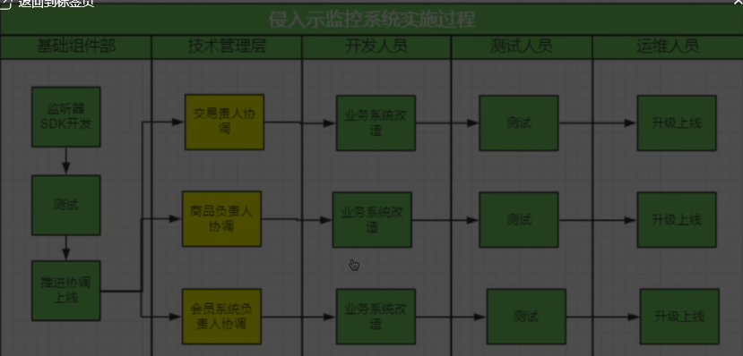
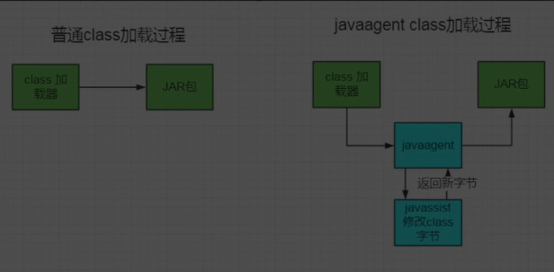
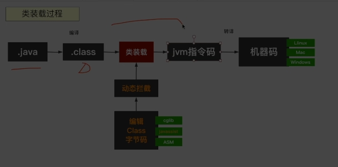

#### JVM字节码插桩

* 应用场景

  * 获取某个方法执行时间
    * 1.方法前后，硬编码
    * AOP（多个系统一起监控解决不掉）
    * 字节码插桩（零侵入）

* 侵入性

  

* 怎么做到之和运维打交道，不修改代码

* javaagent原理

  

  

* 修改字节码
  * cglib
  * asm(需要懂字节码指令，学习成本高)
  * javasist（可以直接用java代码开发）
* 