####Docker常用命令

#####3.1 帮助启动类命令

* 启动/停止/重启docker  `systemctl start/stop/restart docker`

* 查看docker状态  `systemctl status docker`

* 设置开机启动  `systemctl enable docker`

* 查看docker概要信息  `docker info`

* 查看docker版本   `docker version`

* 查看docker总体帮助文档  `docker --help`

* 查看docker命令帮助文档  `docker 具体命令  --help`

####3.2镜像命令

* docker images

  ```sh
  [root@192 ~]# docker images --help
  
  Usage:  docker images [OPTIONS] [REPOSITORY[:TAG]]
  
  List images
  
  Options:
    -a, --all             Show all images (default hides intermediate images)
        --digests         Show digests
    -f, --filter filter   Filter output based on conditions provided
        --format string   Pretty-print images using a Go template
        --no-trunc        Don't truncate output
    -q, --quiet           Only show image IDs
  ```

* 列出本地主机上的镜像

  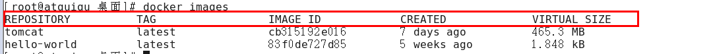

* 各列说明:
  * REPOSITORY：表示镜像的仓库源
  * TAG：镜像的标签版本号
  * IMAGE ID：镜像ID
  * CREATED：镜像创建时间
  * SIZE：镜像大小

*  同一仓库源可以有多个 TAG版本，代表这个仓库源的不同个版本，我们使用 REPOSITORY:TAG 来定义不同的镜像。
  * 如果你不指定一个镜像的版本标签，例如你只使用 ubuntu，docker 将默认使用 ubuntu:latest 镜像

* OPTIONS说明：
  * -a :列出本地所有的镜像（含历史映像层）
  * -q :只显示镜像ID。

* docker serach "xxx"

  ```java
  [root@192 ~]# docker search --help
  
  Usage:  docker search [OPTIONS] TERM
  
  Search the Docker Hub for images
  
  Options:
    -f, --filter filter   Filter output based on conditions provided
        --format string   Pretty-print search using a Go template
        --limit int       Max number of search results (default 25)
        --no-trunc        Don't truncate output
  ```

* 从DockerHub搜索镜像 https://hub.docker.com

  ```sh
  docker search [OPTIONS] 镜像名字
  ```

  * 例如

  

  


* OPTIONS说明：
  * --limit : 只列出N个镜像，默认25个
  * 例如 `docker search --limit 5 redis`

* docker pull "xxx"

  ```sh
  [root@192 ~]# docker pull --help
  
  Usage:  docker pull [OPTIONS] NAME[:TAG|@DIGEST]
  
  Pull an image or a repository from a registry
  
  Options:
    -a, --all-tags                Download all tagged images in the repository
        --disable-content-trust   Skip image verification (default true)
        --platform string         Set platform if server is multi-platform capable
    -q, --quiet                   Suppress verbose output
  ```

  * 下载镜像

    ```sh
    docker pull 镜像名字[:TAG]
    ```

  * 没有指定TAG时TAG默认为latest,即等价于 `docker pull 镜像名字:latest`

  * 例如:

    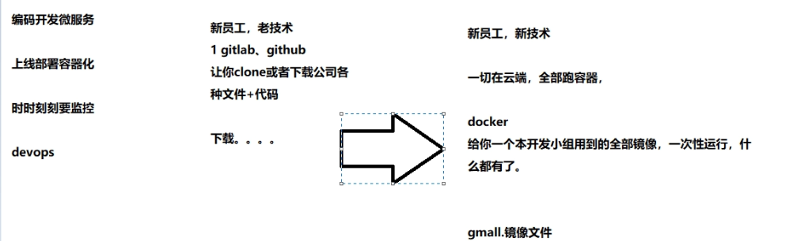

* docker system df  查看镜像/容器/数据卷所占的空间

  ```sh
  [root@192 ~]# docker system df --help
  
  Usage:  docker system df [OPTIONS]
  
  Show docker disk usage
  
  Options:
        --format string   Pretty-print images using a Go template
    -v, --verbose         Show detailed information on space usage
  ```

  

* docker rmi 删除镜像

  ```sh
  [root@192 ~]# docker rmi --help
  
  Usage:  docker rmi [OPTIONS] IMAGE [IMAGE...]
  
  Remove one or more images
  
  Options:
    -f, --force      Force removal of the image
        --no-prune   Do not delete untagged parents
  ```

  * 删除单个   `docker rmi  -f 镜像ID`
  * 删除多个	  `docker rmi -f 镜像名1:TAG 镜像名2:TAG `
  * 删除全部  `docker rmi -f $(docker images -qa)`

#####面试题：谈谈docker虚悬镜像是什么

* 仓库名、标签都是<none>的镜像，俗称虚悬镜像dangling image
  * 例如

    

* 后续Dockerfile章节再介绍

  

  

####3.3容器命令

* 有镜像才能创建容器，这是根本前提(这里下载一个CentOS或者ubuntu镜像演示)

  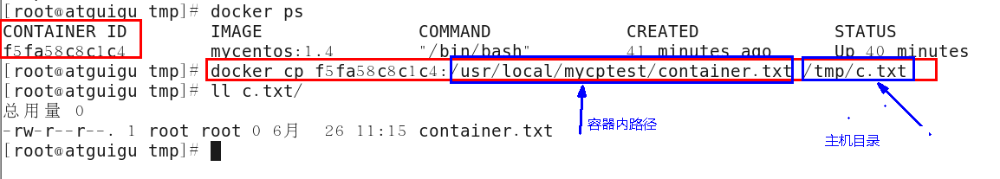

* 本次演示用ubuntu演示  `docker pull ubuntu`

  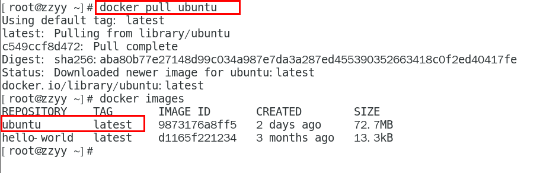

* docker run xxx 新建并启动容器

  ```sh
  docker run [OPTIONS] IMAGE [COMMAND] [ARG...]
  ```

*  OPTIONS说明
  * OPTIONS说明（常用）：有些是一个减号，有些是两个减号

  * --name="容器新名字"       为容器指定一个名称；

  * -d: 后台运行容器并返回容器ID，也即启动守护式容器(后台运行)；

  * -i：以交互模式运行容器，通常与 -t 同时使用；

  * -t：为容器重新分配一个伪输入终端，通常与 -i 同时使用也即启动交互式容器(前台有伪终端，等待交互)； 

  * -P: 随机端口映射，大写P

  * -p: 指定端口映射，小写p

    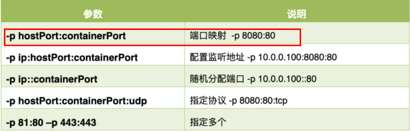

* (重要)启动交互式容器(前台命令行)

  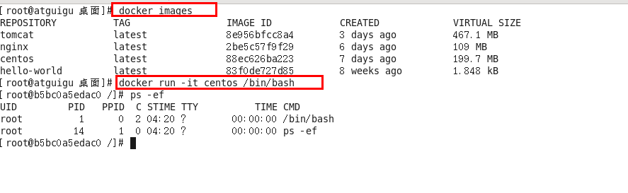

* 使用镜像centos:latest以交互模式启动一个容器,在容器内执行/bin/bash命令

  docker run -it centos /bin/bash 

  * 参数说明：
    * -i: 交互式操作。
    * -t: 终端。
    * centos : centos 镜像。
    * /bin/bash：放在镜像名后的是命令，这里我们希望有个交互式 Shell，因此用的是 /bin/bash。要退出终端，
    * 直接输入 exit:

* docker ps [OPTIONS]

  ```sh
  [root@192 ~]# docker ps --help
  
  Usage:  docker ps [OPTIONS]
  
  List containers
  
  Options:
    -a, --all             Show all containers (default shows just running)
    -f, --filter filter   Filter output based on conditions provided
        --format string   Pretty-print containers using a Go template
    -n, --last int        Show n last created containers (includes all states) (default -1)
    -l, --latest          Show the latest created container (includes all states)
        --no-trunc        Don't truncate output
    -q, --quiet           Only display container IDs
    -s, --size            Display total file sizes
  ```

  * 列出当前所有正在运行的容器

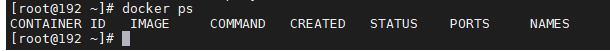

* OPTIONS说明（常用）：
  * -a :列出当前所有正在运行的容器+历史上运行过的

* -l :显示最近创建的容器。

* -n：显示最近n个创建的容器。

* -q :静默模式，只显示容器编号。

* 退出容器
  * 两种退出方式
    * `exit`  run进去容器，exit退出，容器停止
    * `ctrl+p+q` run进去容器，ctrl+p+q退出，容器不停止

* docker start/restart xx 启动已停止运行的容器

  ```sh
  [root@192 ~]# docker start --help
  
  Usage:  docker start [OPTIONS] CONTAINER [CONTAINER...]
  
  Start one or more stopped containers
  
  Options:
    -a, --attach               Attach STDOUT/STDERR and forward signals
        --detach-keys string   Override the key sequence for detaching a container
    -i, --interactive          Attach container's STDIN
  
  
  [root@192 ~]# docker restart --help
  
  Usage:  docker restart [OPTIONS] CONTAINER [CONTAINER...]
  
  Restart one or more containers
  
  Options:
    -t, --time int   Seconds to wait for stop before killing the container (default 10)
  ```

  * docker start 容器ID或者容器名
  * 重启容器 docker restart 容器ID或者容器名

* docker stop/kill xxx 停止/强制停止 容器

  ```sh
  docker stop 容器ID或者容器名
  docker kill 容器ID或容器名
  ```

* docker rm xxx   删除已停止的容器  `docker rm 容器ID`

  * 一次性删除多个容器实例  `docker rm -f $(docker ps -a -q)`  或者  `docker ps -a -q | xargs docker rm`

* 启动守护式容器(后台服务器)
  * 在大部分的场景下，我们希望 docker 的服务是在后台运行的，我们可以过 -d 指定容器的后台运行模式。
  * docker run -d 容器名
    * 使用镜像centos:latest以后台模式启动一个容器
    * docker run -d centos
    * 问题：然后docker ps -a 进行查看, 会发现容器已经退出
    * 很重要的要说明的一点: Docker容器后台运行,就必须有一个前台进程.
    * 容器运行的命令如果不是那些一直挂起的命令（比如运行top，tail），就是会自动退出的。
  * 这个是docker的机制问题,比如你的web容器,我们以nginx为例，正常情况下,我们配置启动服务只需要启动响应的service即可。例如service nginx start
    * 但是,这样做,nginx为后台进程模式运行,就导致docker前台没有运行的应用,
    * 这样的容器后台启动后,会立即自杀因为他觉得他没事可做了.
    * 所以，最佳的解决方案是,将你要运行的程序以前台进程的形式运行，
    * 常见就是命令行模式，表示我还有交互操作，别中断。

* redis 前后台启动演示case
  * 前台交互式启动  ` docker run -it redis:6.0.8`
  * 后台守护式启动 `docker run -d redis:6.0.8`

* docker logs 容器ID  查看容器日志
* docker top 容器ID  查看容器内运行的进程

* docker inspect 容器ID  查看容器内部细节

* docker exec -it 容器ID bashShell   进入正在运行的容器并以命令行交互

  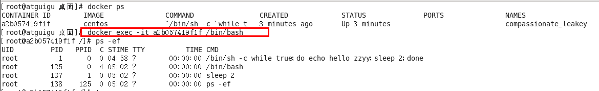

  

* docker attach 容器ID

### 两种方法区别

* exec 是在容器中打开新的终端，并且可以启动新的进程,

* 用exit退出，不会导致容器的停止。  (推荐使用)

  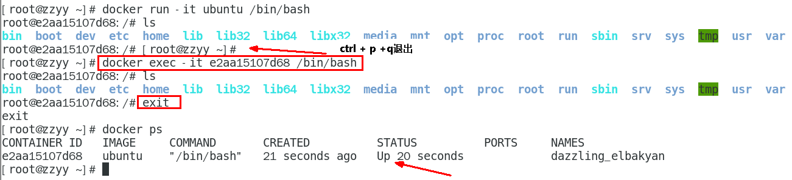

* attach 直接进入容器启动命令的终端，不会启动新的进程

* 用exit退出，会导致容器的停止。

  

* 用之前的redis容器实例进入试试
  * docker exec -it 容器ID /bin/bash

  * docker exec -it 容器ID redis-cli

  * 一般用-d后台启动的程序，再用exec进入对应容器实例

    

* docker cp  容器ID:容器内路径 目的主机路径       从容器内拷贝文件到主机上

  

* 导入和导出容器
  * export 导出容器的内容留作为一个tar归档文件[对应import命令]
  * import 从tar包中的内容创建一个新的文件系统再导入为镜像[对应export]

* 案例

  ```sh
  docker export 容器ID > 文件名.tar.gz
  ```

  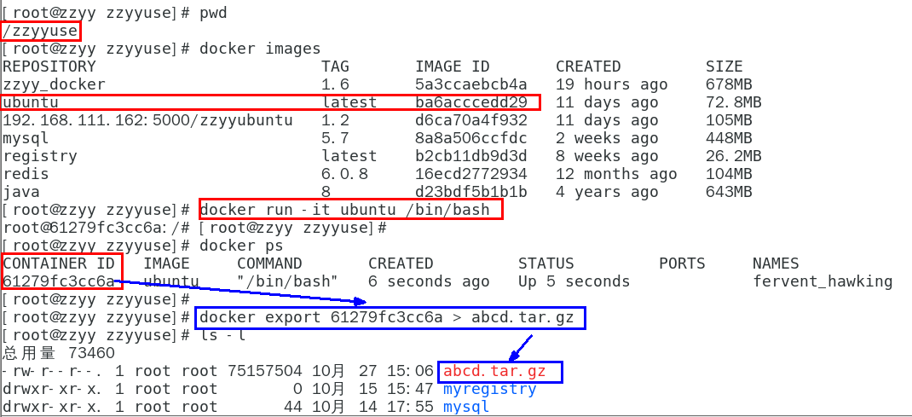

  ```sh
  cat 文件名.tar.gz | docker import - 镜像用户/镜像名:镜像版本号
  ```

  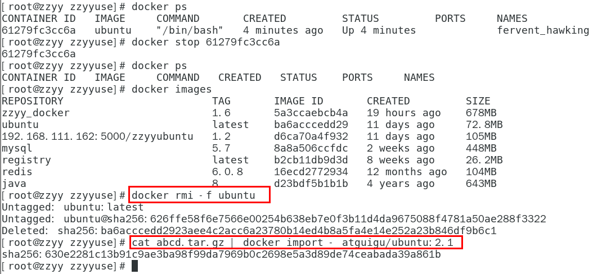

#####小总结

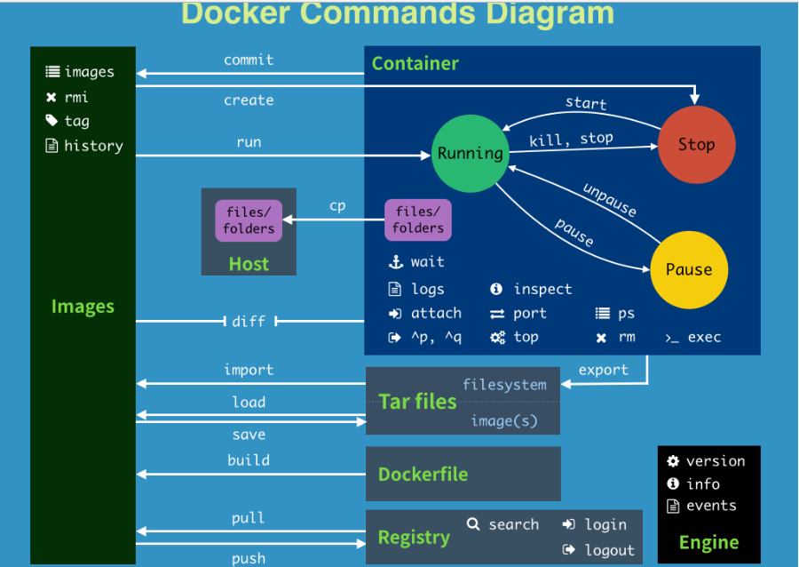


* attach    Attach to a running container                 # 当前 shell 下 attach 连接指定运行镜像

* build     Build an image from a Dockerfile              # 通过 Dockerfile 定制镜像

* commit    Create a new image from a container changes   # 提交当前容器为新的镜像

* cp        Copy files/folders from the containers filesystem to the host path   #从容器中拷贝指定文件或者目录到宿主机中

* create    Create a new container                        # 创建一个新的容器，同 run，但不启动容器

* diff      Inspect changes on a container's filesystem   # 查看 docker 容器变化

* events    Get real time events from the server          # 从 docker 服务获取容器实时事件

* exec      Run a command in an existing container        # 在已存在的容器上运行命令

* export    Stream the contents of a container as a tar archive   # 导出容器的内容流作为一个 tar 归档文件[对应 import ]

* history   Show the history of an image                  # 展示一个镜像形成历史

* images    List images                                   # 列出系统当前镜像

* import    Create a new filesystem image from the contents of a tarball # 从tar包中的内容创建一个新的文件系统映像[对应export]

* info      Display system-wide information               # 显示系统相关信息

* inspect   Return low-level information on a container   # 查看容器详细信息

* kill      Kill a running container                      # kill 指定 docker 容器

* load      Load an image from a tar archive              # 从一个 tar 包中加载一个镜像[对应 save]

* login     Register or Login to the docker registry server    # 注册或者登陆一个 docker 源服务器

* logout    Log out from a Docker registry server          # 从当前 Docker registry 退出

* logs      Fetch the logs of a container                 # 输出当前容器日志信息

* port      Lookup the public-facing port which is NAT-ed to PRIVATE_PORT    # 查看映射端口对应的容器内部源端口

* pause     Pause all processes within a container        # 暂停容器

* ps        List containers                               # 列出容器列表

* pull      Pull an image or a repository from the docker registry server   # 从docker镜像源服务器拉取指定镜像或者库镜像

* push      Push an image or a repository to the docker registry server    # 推送指定镜像或者库镜像至docker源服务器

* restart   Restart a running container                   # 重启运行的容器

* rm        Remove one or more containers                 # 移除一个或者多个容器

* rmi       Remove one or more images       # 移除一个或多个镜像[无容器使用该镜像才可删除，否则需删除相关容器才可继续或 -f 强制删除]

* run       Run a command in a new container              # 创建一个新的容器并运行一个命令

* save      Save an image to a tar archive                # 保存一个镜像为一个 tar 包[对应 load]

* search    Search for an image on the Docker Hub         # 在 docker hub 中搜索镜像

* start     Start a stopped containers                    # 启动容器

* stop      Stop a running containers                     # 停止容器

* tag       Tag an image into a repository                # 给源中镜像打标签

* top       Lookup the running processes of a container   # 查看容器中运行的进程信息

* unpause   Unpause a paused container                    # 取消暂停容器

* version   Show the docker version information           # 查看 docker 版本号

* wait      Block until a container stops, then print its exit code   # 截取容器停止时的退出状态值

 