## Java API 操作 

也可以通过 Java API 的方式对 Elasticsearch服务进行访问 

### 2.2.5.1 创建 Maven 项目 

我们在 IDEA 开发工具中创建 Maven 项目(模块也可)ES

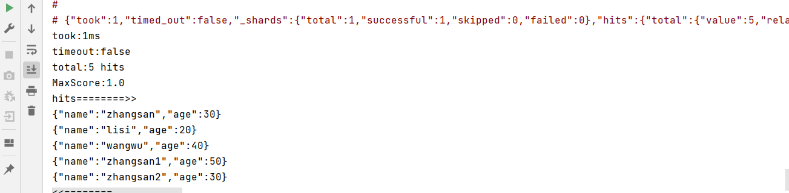

修改 pom 文件，增加 Maven 依赖关系

```xml
<dependencies>
  <dependency>
    <groupId>org.elasticsearch</groupId>
    <artifactId>elasticsearch</artifactId>
    <version>7.8.0</version>
  </dependency>
  <!-- elasticsearch 的客户端 -->
  <dependency>
    <groupId>org.elasticsearch.client</groupId>
    <artifactId>elasticsearch-rest-high-level-client</artifactId>
    <version>7.8.0</version>
  </dependency>
  <!-- elasticsearch 依赖 2.x 的 log4j -->
  <dependency>
    <groupId>org.apache.logging.log4j</groupId>
    <artifactId>log4j-api</artifactId>
    <version>2.8.2</version>
  </dependency>
  <dependency>
    <groupId>org.apache.logging.log4j</groupId>
    <artifactId>log4j-core</artifactId>
    <version>2.8.2</version>
  </dependency>
  <dependency>
    <groupId>com.fasterxml.jackson.core</groupId>
    <artifactId>jackson-databind</artifactId>
    <version>2.9.9</version>
  </dependency>
  <!-- junit 单元测试 -->
  <dependency>
    <groupId>junit</groupId>
    <artifactId>junit</artifactId>
    <version>4.12</version>
  </dependency>
</dependencies>
```


### 2.2.5.2 客户端对象 

创建 com.atguigu.es.test.Elasticsearch01_Client 类，代码中创建 Elasticsearch 客户端对象 

因为早期版本的客户端对象已经不再推荐使用，且在未来版本中会被删除，所以这里我们采 

用高级 REST 客户端对象

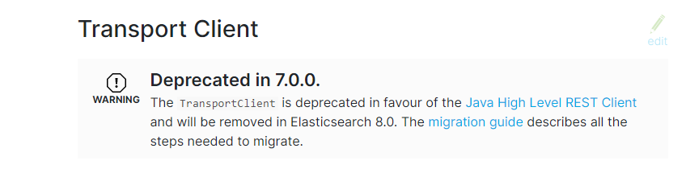

```java
// 创建客户端对象
RestHighLevelClient client = new RestHighLevelClient(
	RestClient.builder(new HttpHost("localhost", 9200, "http"))
);
...
// 关闭客户端连接
client.close();
```

**注意：****9200** 端口为 Elasticsearch 的 Web 通信端口**，****localhost** 为启动 ES 服务的主机名 

执行代码，查看控制台信息：

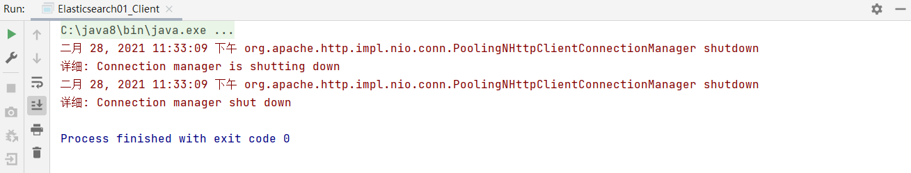


### 2.2.5.3 索引操作 

ES 服务器正常启动后，可以通过 Java API 客户端对象对 ES 索引进行操作 

#### 1) 创建索引

```java
// 创建索引 - 请求对象
CreateIndexRequest request = new CreateIndexRequest("user");
// 发送请求，获取响应
CreateIndexResponse response = client.indices().create(request, RequestOptions.DEFAULT);
boolean acknowledged = response.isAcknowledged();
// 响应状态
System.out.println("操作状态 = " + acknowledged);
```

操作结果:

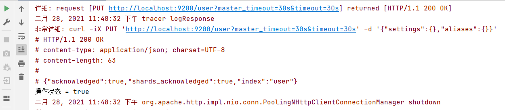

#### 2) 查看索引 

```java
// 查询索引 - 请求对象 
GetIndexRequest request = new GetIndexRequest("user"); 
// 发送请求，获取响应 
GetIndexResponse response = client.indices().get(request, RequestOptions.DEFAULT); 
System.out.println("aliases:"+response.getAliases()); 
System.out.println("mappings:"+response.getMappings()); 
System.out.println("settings:"+response.getSettings()); 
```

操作结果:

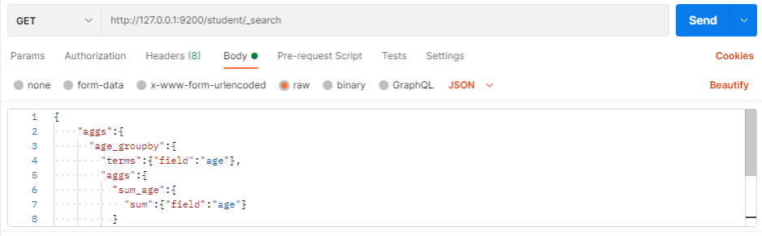


#### 3) 删除索引

```java
// 删除索引 - 请求对象
DeleteIndexRequest request = new DeleteIndexRequest("user");
// 发送请求，获取响应
AcknowledgedResponse response = client.indices().delete(request, RequestOptions.DEFAULT);
// 操作结果
System.out.println("操作结果 ： " + response.isAcknowledged());
```

操作结果:

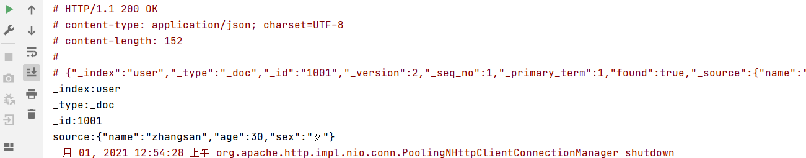


### 2.2.5.4 文档操作 

#### 1) 新增文档 

创建数据模型

```java
class User { 
	private String name; 
	private Integer age; 
	private String sex; 

	public String getName() { 
		return name; 
	} 
	public void setName(String name) {
		this.name = name; 
	} 
	public Integer getAge() {
		return age; 
	} 
	public void setAge(Integer age) {
		this.age = age; 
	} 
	public String getSex() { 
		return sex; 
	} 
	public void setSex(String sex) { 
		this.sex = sex; 
	} 
}
```

创建数据，添加到文档中

```java
// 新增文档 - 请求对象
IndexRequest request = new IndexRequest();
// 设置索引及唯一性标识
request.index("user").id("1001");

// 创建数据对象
User user = new User();
user.setName("zhangsan");
user.setAge(30);
user.setSex("男");
ObjectMapper objectMapper = new ObjectMapper();
String productJson = objectMapper.writeValueAsString(user);

// 添加文档数据，数据格式为 JSON 格式
request.source(productJson,XContentType.JSON);

// 客户端发送请求，获取响应对象
IndexResponse response = client.index(request, RequestOptions.DEFAULT);
////3.打印结果信息
System.out.println("_index:" + response.getIndex());
System.out.println("_id:" + response.getId());
System.out.println("_result:" + response.getResult()); 
```

操作结果:

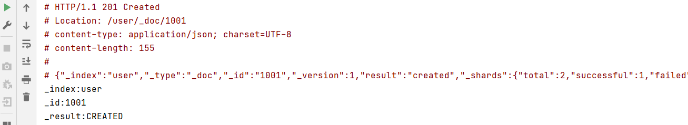

#### 2) 修改文档

```java
// 修改文档 - 请求对象
UpdateRequest request = new UpdateRequest();
// 配置修改参数
request.index("user").id("1001");
// 设置请求体，对数据进行修改
request.doc(XContentType.JSON, "sex", "女");

// 客户端发送请求，获取响应对象
UpdateResponse response = client.update(request, RequestOptions.DEFAULT);
System.out.println("_index:" + response.getIndex());
System.out.println("_id:" + response.getId());
System.out.println("_result:" + response.getResult());
```

执行结果：

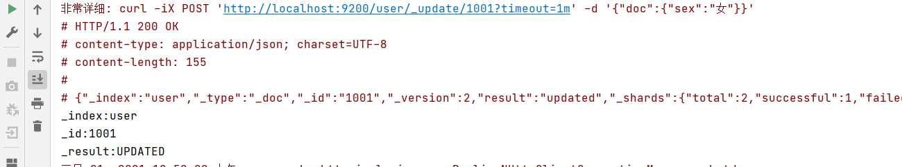


#### 3) 查询文档

```java
//1.创建请求对象
GetRequest request = new GetRequest().index("user").id("1001");
//2.客户端发送请求，获取响应对象
GetResponse response = client.get(request, RequestOptions.DEFAULT);
////3.打印结果信息
System.out.println("_index:" + response.getIndex());
System.out.println("_type:" + response.getType());
System.out.println("_id:" + response.getId());
System.out.println("source:" + response.getSourceAsString());
```

执行结果为： 


#### 4) 删除文档

```java
//创建请求对象
DeleteRequest request = new DeleteRequest().index("user").id("1");
//客户端发送请求，获取响应对象
DeleteResponse response = client.delete(request, RequestOptions.DEFAULT);
//打印信息
System.out.println(response.toString());
```

执行结果为：


#### 5) 批量操作 

#####  批量新增：

```java
//创建批量新增请求对象
BulkRequest request = new BulkRequest();
request.add(new IndexRequest().index("user").id("1001").source(XContentType.JSON, "name", "zhangsan"));
request.add(new IndexRequest().index("user").id("1002").source(XContentType.JSON, "name", "lisi"));
request.add(new IndexRequest().index("user").id("1003").source(XContentType.JSON, "name", "wangwu"));

//客户端发送请求，获取响应对象
BulkResponse responses = client.bulk(request, RequestOptions.DEFAULT);
//打印结果信息
System.out.println("took:" + responses.getTook());
System.out.println("items:" + responses.getItems());
```

执行结果为：

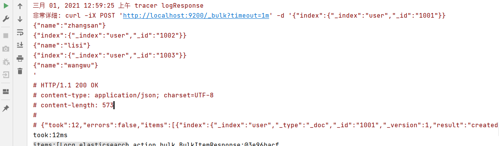


#####  批量删除：

```java
//创建批量删除请求对象
BulkRequest request = new BulkRequest();
request.add(new DeleteRequest().index("user").id("1001"));
request.add(new DeleteRequest().index("user").id("1002"));
request.add(new DeleteRequest().index("user").id("1003"));

//客户端发送请求，获取响应对象
BulkResponse responses = client.bulk(request, RequestOptions.DEFAULT);
//打印结果信息
System.out.println("took:" + responses.getTook());
System.out.println("items:" + responses.getItems());
```

执行结果为：

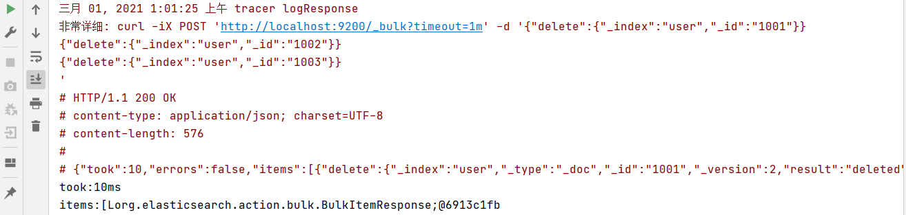


### 2.2.5.5 高级查询 

#### 1) 请求体查询 

#####  全量查询

```java
// 创建搜索请求对象
SearchRequest request = new SearchRequest();
request.indices("student");

// 构建查询的请求体
SearchSourceBuilder sourceBuilder = new SearchSourceBuilder();
// 查询所有数据
sourceBuilder.query(QueryBuilders.matchAllQuery());
request.source(sourceBuilder);

SearchResponse response = client.search(request, RequestOptions.DEFAULT);
// 查询匹配
SearchHits hits = response.getHits();
System.out.println("took:" + response.getTook());
System.out.println("timeout:" + response.isTimedOut());
System.out.println("total:" + hits.getTotalHits());
System.out.println("MaxScore:" + hits.getMaxScore());
System.out.println("hits========>>");
for (SearchHit hit : hits) {
	//输出每条查询的结果信息
	System.out.println(hit.getSourceAsString());
}
System.out.println("<<========");
```

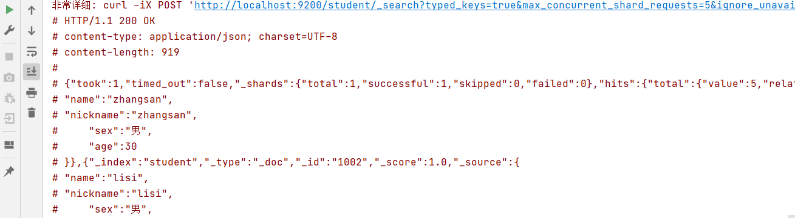


#####  term 查询

查询条件为关键字

```java
// 创建搜索请求对象
SearchRequest request = new SearchRequest();
request.indices("student");

// 构建查询的请求体
SearchSourceBuilder sourceBuilder = new SearchSourceBuilder();
sourceBuilder.query(QueryBuilders.termQuery("age", "30"));

request.source(sourceBuilder);

SearchResponse response = client.search(request, RequestOptions.DEFAULT);
// 查询匹配
SearchHits hits = response.getHits();
System.out.println("took:" + response.getTook());
System.out.println("timeout:" + response.isTimedOut());
System.out.println("total:" + hits.getTotalHits());
System.out.println("MaxScore:" + hits.getMaxScore());
System.out.println("hits========>>");
for (SearchHit hit : hits) {
	//输出每条查询的结果信息
	System.out.println(hit.getSourceAsString());
}
System.out.println("<<========");
```

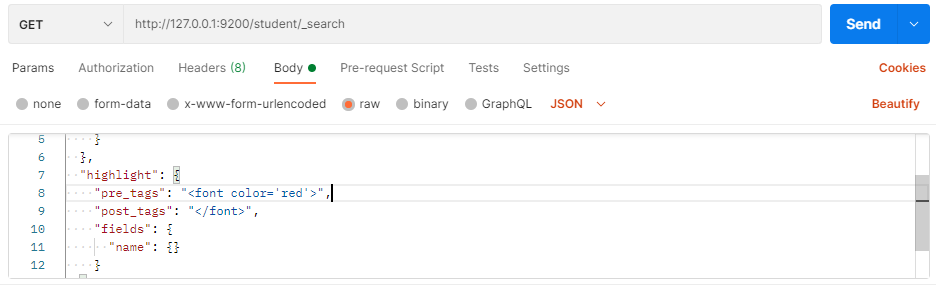


#####  分页查询

```java
// 创建搜索请求对象
SearchRequest request = new SearchRequest();
request.indices("student");

// 构建查询的请求体
SearchSourceBuilder sourceBuilder = new SearchSourceBuilder();
sourceBuilder.query(QueryBuilders.matchAllQuery());
// 分页查询
// 当前页其实索引(第一条数据的顺序号)，from
sourceBuilder.from(0);
// 每页显示多少条 size
sourceBuilder.size(2);

request.source(sourceBuilder);

SearchResponse response = client.search(request, RequestOptions.DEFAULT);
// 查询匹配
SearchHits hits = response.getHits();
System.out.println("took:" + response.getTook());
System.out.println("timeout:" + response.isTimedOut());
System.out.println("total:" + hits.getTotalHits());
System.out.println("MaxScore:" + hits.getMaxScore());
System.out.println("hits========>>");
for (SearchHit hit : hits) {
	//输出每条查询的结果信息
	System.out.println(hit.getSourceAsString());
}
System.out.println("<<========");
```

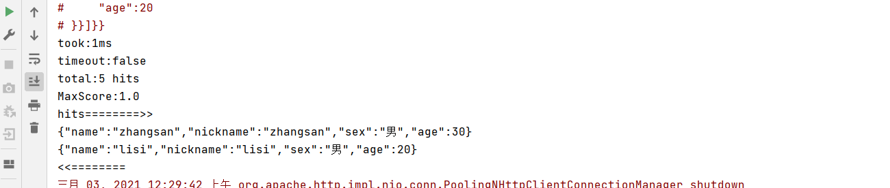


#####  数据排序

```java
// 构建查询的请求体
SearchSourceBuilder sourceBuilder = new SearchSourceBuilder();
sourceBuilder.query(QueryBuilders.matchAllQuery());

// 排序
sourceBuilder.sort("age", SortOrder.ASC);
request.source(sourceBuilder);

SearchResponse response = client.search(request, RequestOptions.DEFAULT);
// 查询匹配
SearchHits hits = response.getHits();
System.out.println("took:" + response.getTook());
System.out.println("timeout:" + response.isTimedOut());
System.out.println("total:" + hits.getTotalHits());
System.out.println("MaxScore:" + hits.getMaxScore());
System.out.println("hits========>>");
for (SearchHit hit : hits) {
	//输出每条查询的结果信息
	System.out.println(hit.getSourceAsString());
}
System.out.println("<<========");
```

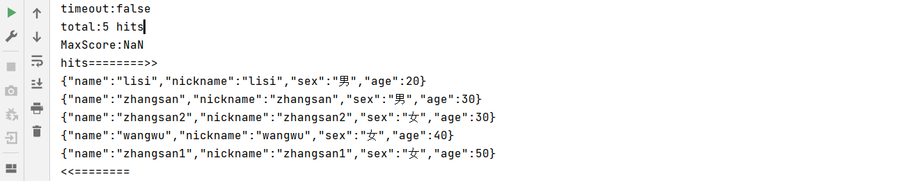


#####  过滤字段

```java
// 创建搜索请求对象
SearchRequest request = new SearchRequest();
request.indices("student");

// 构建查询的请求体
SearchSourceBuilder sourceBuilder = new SearchSourceBuilder();
sourceBuilder.query(QueryBuilders.matchAllQuery());

//查询字段过滤
String[] excludes = {};
String[] includes = {"name", "age"};
sourceBuilder.fetchSource(includes, excludes);

request.source(sourceBuilder);
SearchResponse response = client.search(request, RequestOptions.DEFAULT);
// 查询匹配
SearchHits hits = response.getHits();
System.out.println("took:" + response.getTook());
System.out.println("timeout:" + response.isTimedOut());
System.out.println("total:" + hits.getTotalHits());
System.out.println("MaxScore:" + hits.getMaxScore());
System.out.println("hits========>>");
for (SearchHit hit : hits) {
	//输出每条查询的结果信息
	System.out.println(hit.getSourceAsString());
}
System.out.println("<<========");
```


#####  Bool 组合查询

```java
// 创建搜索请求对象
SearchRequest request = new SearchRequest();
request.indices("student");

// 构建查询的请求体
SearchSourceBuilder sourceBuilder = new SearchSourceBuilder();

BoolQueryBuilder boolQueryBuilder = QueryBuilders.boolQuery();
// 必须包含
boolQueryBuilder.must(QueryBuilders.matchQuery("age", "30"));
// 一定不含
boolQueryBuilder.mustNot(QueryBuilders.matchQuery("name", "zhangsan"));
// 可能包含
boolQueryBuilder.should(QueryBuilders.matchQuery("sex", "男"));

sourceBuilder.query(boolQueryBuilder);

request.source(sourceBuilder);
SearchResponse response = client.search(request, RequestOptions.DEFAULT);
// 查询匹配
SearchHits hits = response.getHits();
System.out.println("took:" + response.getTook());
System.out.println("timeout:" + response.isTimedOut());
System.out.println("total:" + hits.getTotalHits());
System.out.println("MaxScore:" + hits.getMaxScore());
System.out.println("hits========>>");
for (SearchHit hit : hits) {
	//输出每条查询的结果信息
	System.out.println(hit.getSourceAsString());
}
System.out.println("<<========");
```


#####  范围查询

```java
// 创建搜索请求对象
SearchRequest request = new SearchRequest();
request.indices("student");

// 构建查询的请求体
SearchSourceBuilder sourceBuilder = new SearchSourceBuilder();
RangeQueryBuilder rangeQuery = QueryBuilders.rangeQuery("age");
// 大于等于
rangeQuery.gte("30");
// 小于等于
rangeQuery.lte("40");
sourceBuilder.query(rangeQuery);

request.source(sourceBuilder);
SearchResponse response = client.search(request, RequestOptions.DEFAULT);
// 查询匹配
SearchHits hits = response.getHits();
System.out.println("took:" + response.getTook());
System.out.println("timeout:" + response.isTimedOut());
System.out.println("total:" + hits.getTotalHits());
System.out.println("MaxScore:" + hits.getMaxScore());
System.out.println("hits========>>");
for (SearchHit hit : hits) {
	//输出每条查询的结果信息
	System.out.println(hit.getSourceAsString());
}
System.out.println("<<========");
```

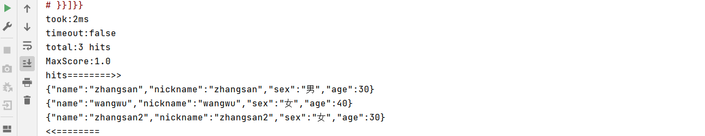


#####  模糊查询

```java
// 创建搜索请求对象
SearchRequest request = new SearchRequest();
request.indices("student");

// 构建查询的请求体
SearchSourceBuilder sourceBuilder = new SearchSourceBuilder();
sourceBuilder.query(QueryBuilders.fuzzyQuery("name","zhangsan").fuzziness(Fuzziness.ONE));

request.source(sourceBuilder);
SearchResponse response = client.search(request, RequestOptions.DEFAULT);
// 查询匹配
SearchHits hits = response.getHits();
System.out.println("took:" + response.getTook());
System.out.println("timeout:" + response.isTimedOut());
System.out.println("total:" + hits.getTotalHits());
System.out.println("MaxScore:" + hits.getMaxScore());
System.out.println("hits========>>");
for (SearchHit hit : hits) {
	//输出每条查询的结果信息
	System.out.println(hit.getSourceAsString());
}
System.out.println("<<========");
```

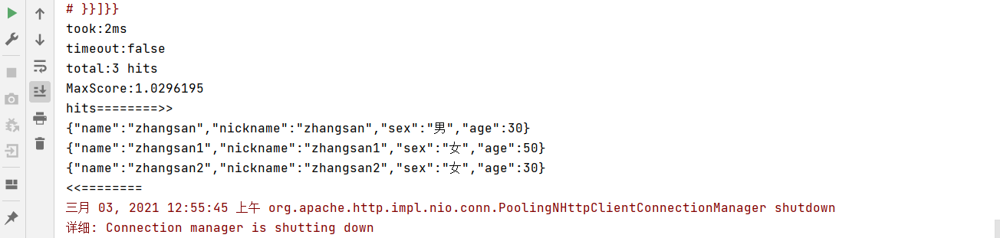


#### 2) 高亮查询

```java
// 高亮查询
SearchRequest request = new SearchRequest().indices("student");

//2.创建查询请求体构建器
SearchSourceBuilder sourceBuilder = new SearchSourceBuilder();
//构建查询方式：高亮查询
TermsQueryBuilder termsQueryBuilder = QueryBuilders.termsQuery("name","zhangsan");
//设置查询方式
sourceBuilder.query(termsQueryBuilder);

//构建高亮字段
HighlightBuilder highlightBuilder = new HighlightBuilder();
highlightBuilder.preTags("<font color='red'>");//设置标签前缀
highlightBuilder.postTags("</font>");//设置标签后缀
highlightBuilder.field("name");//设置高亮字段
//设置高亮构建对象
sourceBuilder.highlighter(highlightBuilder);

//设置请求体
request.source(sourceBuilder);
//3.客户端发送请求，获取响应对象
SearchResponse response = client.search(request, RequestOptions.DEFAULT);
//4.打印响应结果
SearchHits hits = response.getHits();
System.out.println("took::"+response.getTook());
System.out.println("time_out::"+response.isTimedOut());
System.out.println("total::"+hits.getTotalHits());
System.out.println("max_score::"+hits.getMaxScore());
System.out.println("hits::::>>");
for (SearchHit hit : hits) {
	String sourceAsString = hit.getSourceAsString();
	System.out.println(sourceAsString);
	//打印高亮结果
	Map<String, HighlightField> highlightFields = hit.getHighlightFields();
	System.out.println(highlightFields);
}
System.out.println("<<::::");
```

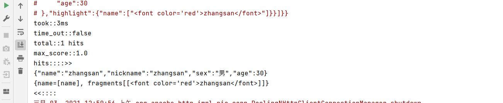


#### 3) 聚合查询 


#####  最大年龄

```java
// 高亮查询
SearchRequest request = new SearchRequest().indices("student");

SearchSourceBuilder sourceBuilder = new SearchSourceBuilder();
sourceBuilder.aggregation(AggregationBuilders.max("maxAge").field("age"));

//设置请求体
request.source(sourceBuilder);
//3.客户端发送请求，获取响应对象
SearchResponse response = client.search(request, RequestOptions.DEFAULT);
//4.打印响应结果
SearchHits hits = response.getHits();
System.out.println(response);
```

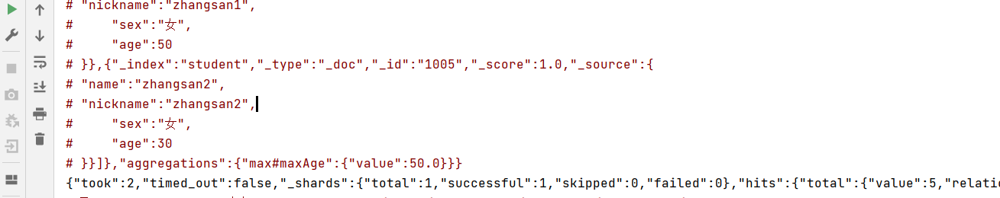


#####  分组统计

```java
// 高亮查询
SearchRequest request = new SearchRequest().indices("student");
SearchSourceBuilder sourceBuilder = new SearchSourceBuilder();

sourceBuilder.aggregation(AggregationBuilders.terms("age_groupby").field("age"));

//设置请求体
request.source(sourceBuilder);
//3.客户端发送请求，获取响应对象
SearchResponse response = client.search(request, RequestOptions.DEFAULT);
//4.打印响应结果
SearchHits hits = response.getHits();
System.out.println(response);
```

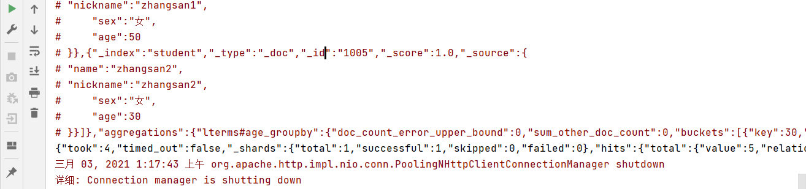