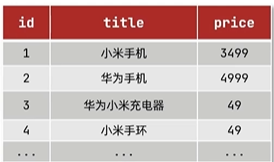
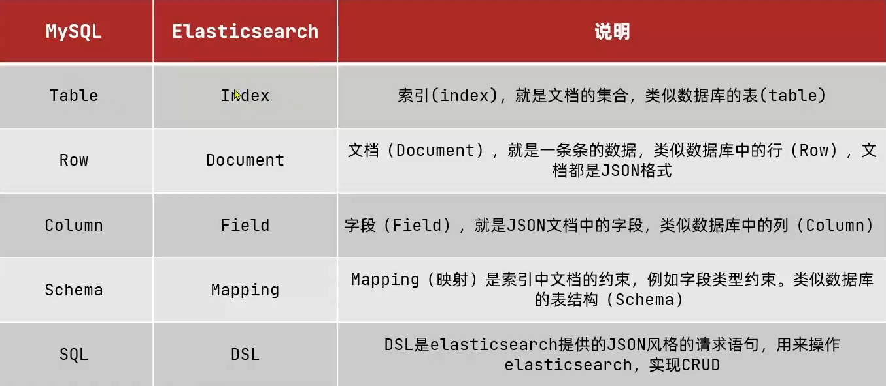
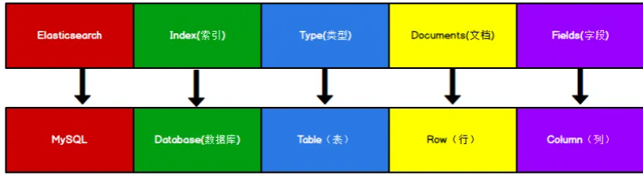
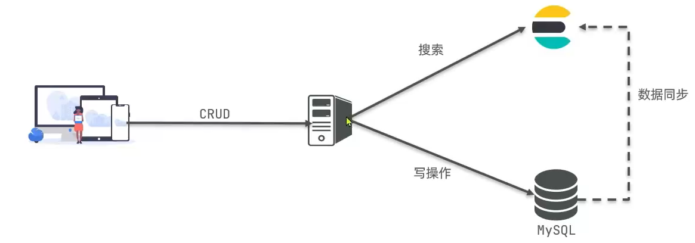

##### 第一天

* elasticsearch结合kibana、Logstash、Beats，也就是elastic stack (ELK)。被广泛应用在日志数据分析、实时监控

* 倒排索引和正排索引

  * 传统数据库（如MySQL）采用正向索引，例如给下表(tb_goods）中的id创建索引:

    

  * elasticsearch采用倒排索引:

    * 文档（(document):每条数据就是一个文档。
      * elasticsearch是面向文档存储的，可以是数据库中的一条商品数据，一个订单信息。文档数据会被序列化为json格式后存储在elasticsearch中。
    * 词条( term) :文档按照语义分成的词语
    * 索引
      * 索引 ( index) :相同类型的文档的集合
      * 映射（(mapping)︰索引中文档的字段约束信息，类似表的结构约束

    

    

  * 这里 Types 的概念已经被逐渐弱化，Elasticsearch 6.X 中，一个 index 下已经只能包含一个 
  
    type，Elasticsearch 7.X 中, Type 的概念已经被删除了。
    
  * Mysql:擅长事务类型操作，可以确保数据的安全和一致性。Elasticsearch:擅长海量数据的搜索、分析、计算（搜索用es，写入用sql）
  
    
    
    
  
*  http://127.0.0.1:9200/_analyze 

  ```json
  {
      "analyzer":"ik_max_word",
      "text":"我爱中国共产党"
  }
  ```

  * 响应

    ```json
    {
        "tokens": [
            {
                "token": "我",
                "start_offset": 0,
                "end_offset": 1,
                "type": "CN_CHAR",
                "position": 0
            },
            {
                "token": "爱",
                "start_offset": 1,
                "end_offset": 2,
                "type": "CN_CHAR",
                "position": 1
            },
            {
                "token": "中国共产党",
                "start_offset": 2,
                "end_offset": 7,
                "type": "CN_WORD",
                "position": 2
            },
            {
                "token": "中国",
                "start_offset": 2,
                "end_offset": 4,
                "type": "CN_WORD",
                "position": 3
            },
            {
                "token": "国共",
                "start_offset": 3,
                "end_offset": 5,
                "type": "CN_WORD",
                "position": 4
            },
            {
                "token": "共产党",
                "start_offset": 4,
                "end_offset": 7,
                "type": "CN_WORD",
                "position": 5
            },
            {
                "token": "共产",
                "start_offset": 4,
                "end_offset": 6,
                "type": "CN_WORD",
                "position": 6
            },
            {
                "token": "党",
                "start_offset": 6,
                "end_offset": 7,
                "type": "CN_CHAR",
                "position": 7
            }
        ]
    }
    ```

* 创建索引

  *  http://127.0.0.1:9200/woshisuoyin 

    ```json
    {
        "mappings":{
            "properties":{
                "info":{
                    "type":"text",
                    "analyzer":"ik_smart"
                },
                "email":{
                    "type":"keyword",
                    "index":"false"
                },
                "name":{
                    "type":"object",
                    "properties":{
                        "firstName":{
                            "type":"keyword"
                        },
                        "lastName":{
                            "type":"keyword"
                        }
                    }
                }
            }
        }
    }
    ```

    ```json
    {
        "acknowledged": true,
        "shards_acknowledged": true,
        "index": "woshisuoyin"
    }
    ```

  * 查询索引库GET /索引库名

  * 删除DEL /索引库名

  * 禁止修改索引库，但是可以添加新字段

    * PUT /索引名/\_mapping

  * 插入文档

    * post请求  http://127.0.0.1:9200/woshisuoyin/_doc/1 

      ```json
      {
          "info":"测试信息",
          "email":"4877794504@qq.com",
          "name":{
              "firstName":"王",
              "lastName":"子杰"
          }
      }
      ```

      ```json
      {
          "_index": "woshisuoyin",
          "_id": "1",
          "_version": 1,
          "result": "created",
          "_shards": {
              "total": 2,
              "successful": 1,
              "failed": 0
          },
          "_seq_no": 0,
          "_primary_term": 1
      }
      ```

      