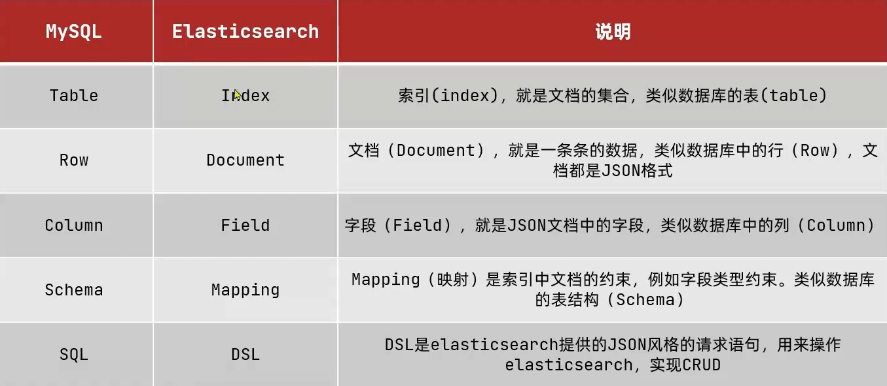

##### 第一天

* elasticsearch结合kibana、Logstash、Beats，也就是elastic stack (ELK)。被广泛应用在日志数据分析、实时监控

* 倒排索引和正排索引

  * 传统数据库（如MySQL）采用正向索引，例如给下表(tb_goods）中的id创建索引:

    

  * elasticsearch采用倒排索引:

    * 文档（(document):每条数据就是一个文档。
      * elasticsearch是面向文档存储的，可以是数据库中的一条商品数据，一个订单信息。文档数据会被序列化为json格式后存储在elasticsearch中。
    * 词条( term) :文档按照语义分成的词语
    * 索引
      * 索引 ( index) :相同类型的文档的集合
      * 映射（(mapping)︰索引中文档的字段约束信息，类似表的结构约束

    

    

  * Mysql:擅长事务类型操作，可以确保数据的安全和一致性。Elasticsearch:擅长海量数据的搜索、分析、计算（搜索用es，写入用sql）
  
    