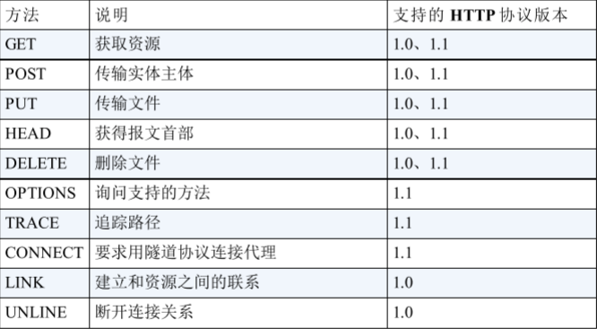
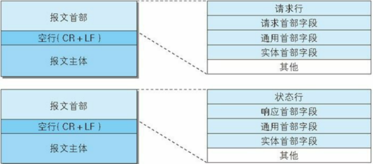
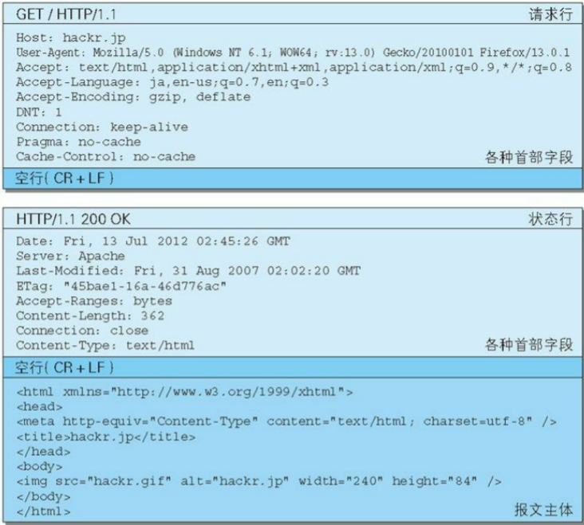

#### HTTP

* HTTP 是一种不保存状态，即无状态（stateless）协议。HTTP 协议自身不对请求和响应之间的通信状态进行保存。也就是说在 HTTP 这个级别，协议对于发送过的请求或响应都不做持久化处理。
  * 这是为了更快地处理大量事务，确保协议的可伸缩性，而特意把 HTTP 协议设计成如此简单的。
  * HTTP/1.1 虽然是无状态协议，但为了实现期望的保持状态功能，于是引入了 Cookie 技术。有了 Cookie 再用 HTTP 协议通信，就可以管理状态了。
* 请求报文是由请求方法、请求 URI、协议版本、可选的请求首部字段和内容实体构成的。

#####方法

* GET ：获取资源
  * GET 方法用来请求访问已被 URI 识别的资源。指定的资源经服务器端解析后返回响应内容。也就是说，如果请求的资源是文本，那就保持原样返回；如果是像 CGI（Common Gateway Interface，通用网关接口）那样的程序，则返回经过执行后的输出结果。
* POST：传输实体主体
  * 虽然用 GET 方法也可以传输实体的主体，但一般不用 GET 方法进行传输，而是用 POST 方法。虽说 POST 的功能与 GET 很相似，但POST 的主要目的并不是获取响应的主体内容。
* PUT: 传输文件
  * PUT 方法用来传输文件。就像 FTP 协议的文件上传一样，要求在请求报文的主体中包含文件内容，然后保存到请求 URI 指定的位置。但是，鉴于 HTTP/1.1 的 PUT 方法自身不带验证机制，任何人都可以上传文件 , 存在安全性问题，因此一般的 Web 网站不使用该方法。
* HEAD：获得报文首部
  * HEAD 方法和 GET 方法一样，只是不返回报文主体部分。用于确认URI 的有效性及资源更新的日期时间等。

* DELETE：删除文件

  * DELETE 方法用来删除文件，是与 PUT 相反的方法。DELETE 方法按请求 URI 删除指定的资源。
    但是，HTTP/1.1 的 DELETE 方法本身和 PUT 方法一样不带验证机制，所以一般的 Web 网站也不使用 DELETE 方法。

* OPTIONS：询问支持的方法

  * OPTIONS 方法用来查询针对请求 URI 指定的资源支持的方法。

* TRACE：追踪路径

  * TRACE 方法是让 Web 服务器端将之前的请求通信环回给客户端的方法。
  * 发送请求时，在 Max-Forwards 首部字段中填入数值，每经过一个服务器端就将该数字减 1，当数值刚好减到 0 时，就停止继续传输，最后接收到请求的服务器端则返回状态码 200 OK 的响应。
  * 客户端通过 TRACE 方法可以查询发送出去的请求是怎样被加工修改篡改的。这是因为，请求想要连接到源目标服务器可能会通过代理中转，TRACE 方法就是用来确认连接过程中发生的一系列操作。
  * 但是，TRACE 方法本来就不怎么常用，再加上它容易引发XST（Cross-Site Tracing，跨站追踪）攻击，通常就更不会用到了。

* CONNECT：要求用隧道协议连接代理

  * CONNECT 方法要求在与代理服务器通信时建立隧道，实现用隧道协议进行 TCP 通信。主要使用 SSL（Secure Sockets Layer，安全套接层）和 TLS（Transport Layer Security，传输层安全）协议把通信内容加 密后经网络隧道传输。

  

##### 持久连接

* HTTP/1.1 和一部分的 HTTP/1.0 想出了持久连接（HTTP Persistent Connections，也称为 HTTP keep-alive 或
  HTTP connection reuse）的方法。持久连接的特点是，只要任意一端没有明确提出断开连接，则保持 TCP 连接状态。
  * 持久连接的好处在于减少了 TCP 连接的重复建立和断开所造成的额外开销，减轻了服务器端的负载。另外，减少开销的那部分时间，使HTTP 请求和响应能够更早地结束，这样 Web 页面的显示速度也就相应提高了。
  * 在 HTTP/1.1 中，所有的连接默认都是持久连接，但在 HTTP/1.0 内并未标准化。虽然有一部分服务器通过非标准的手段实现了持久连接，但服务器端不一定能够支持持久连接。毫无疑问，除了服务器端，客户端也需要支持持久连接。
* 管线化
  * 持久连接使得多数请求以管线化（pipelining）方式发送成为可能。从前发送请求后需等待并收到响应，才能发送下一个请求。管线化技术出现后，不用等待响应亦可直接发送下一个请求。

#### 使用 Cookie 的状态管理

* 保留无状态协议这个特征的同时又要解决类似的矛盾问题，于是引入了 Cookie 技术。Cookie 技术通过在请求和响应报文中写入 Cookie 信息来控制客户端的状态。
* Cookie 会根据从服务器端发送的响应报文内的一个叫做 Set-Cookie 的首部字段信息，通知客户端保存 Cookie。当下次客户端再往该服务器发送请求时，客户端会自动在请求报文中加入 Cookie 值后发送出
  去。
* 服务器端发现客户端发送过来的 Cookie 后，会去检查究竟是从哪一个客户端发来的连接请求，然后对比服务器上的记录，最后得到之前的状态信息。

##### HTTP 报文

* 用于 HTTP 协议交互的信息被称为 HTTP 报文。请求端（客户端）的HTTP 报文叫做请求报文，响应端（服务器端）的叫做响应报文。HTTP 报文本身是由多行（用 CR+LF 作换行符）数据构成的字符串文本。

  * 【CR+LF】CR( Carriage Return，回车符:16进制Ox0d）  和 LF（Line Feed，换行符:16进制OxOa )

* 报文结构

  

* 示例：

  

* 请求行：包含用于请求的方法，请求 URI 和 HTTP 版本。（请求报文的开头）
* 状态行：包含表明响应结果的状态码，原因短语和 HTTP 版本。（响应报文的开头）
* 首部字段：包含表示请求和响应的各种条件和属性的各类首部。
  * 一般有 4 种首部，分别是：通用首部、请求首部、响应首部和实体首
    部。
  * 其他：可能包含 HTTP 的 RFC 里未定义的首部（Cookie 等）。