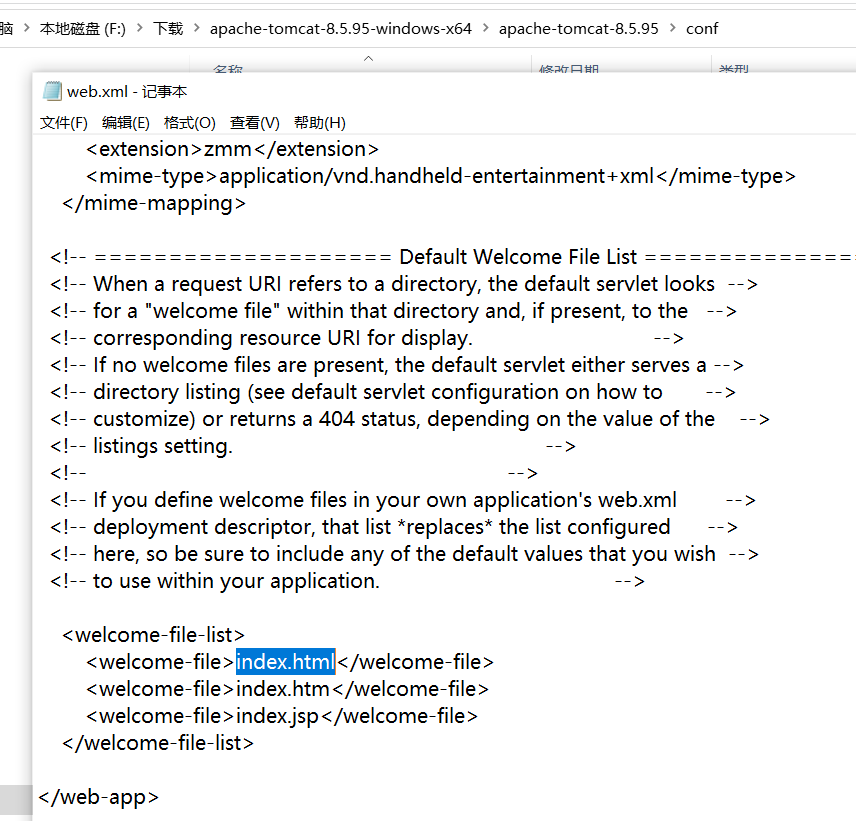

#### HttpServlet

- 目前已经学习的

  - jakarta.servlet.Servlet核心接口(接口)
  - jakarta.servlet.ServletConfig Servlet配置信息接口(接口)
  - jakarta.servlet.ServletContext Servlet上下文接口(接口)
  - jakarta.servlet.ServletRequest Servlet请求接口(接口)
  - jakarta.servlet.ServletResponse Servlet响应接口(接口)
  - jakarta.servlet.ServletException Servlet异常(类)
  - jakarta.servlet.GenericServlet标准通用的Servlet类(抽象类)

- HTTP包下的

  - jakarta.servlet.http.HttpServlet (HTTP协议专用的Servlet类,抽象类)
  - jakarta.servlet.http.HttpServletRequest (HTTP协议专用的请求对象)
  - jakarta.servlet.http.HttpServletResponse (HTTP协议专用的响应对象)
  - Tomcat服务器将HTTP的组成部分解析出来，提取出信息。

- HttpServlet源码分析

  ```java
  package wang.zi.jie;
  import javax.servlet.http.HttpServlet;
  /**
   * ClassName:HttpServletTest
   * Package:
   * Description:
   *
   * @Aurhor 王子杰
   * @Create 2023/10/21 11:26
   * @Version 1.0
   */
  public class HttpServletTest extends HttpServlet {
      /*
      用户第一次请求，通过无参数构造方法创造对象，接下来调用init方法，
      没有init方法，必然执行父类HttpServlet的init
      HttpServlet没有init方法，会继续执行GenericServlet的init，
      GenericServlet有两个init，一个有参，一个无参，有参的调用无参的了：
      @Override
      public void init(ServletConfig config) throws ServletException {
          this.config = config;
          this.init();
      }
      然后调用service方法，没有service方法，必然执行父类HttpServlet的service，
      父类有两个service方法，调用形参不含http的service方法
      @Override
      public void service(ServletRequest req, ServletResponse res) throws ServletException, IOException {
  
          HttpServletRequest request;
          HttpServletResponse response;
  
          try {
              request = (HttpServletRequest) req;
              response = (HttpServletResponse) res;
          } catch (ClassCastException e) {
              throw new ServletException(lStrings.getString("http.non_http"));
          }
          service(request, response);
      }
      分析代码：request = (HttpServletRequest) req;这些强制转换，再调用另外一个service(request, response);
      另外一个代码如下：
       protected void service(HttpServletRequest req, HttpServletResponse resp) throws ServletException, IOException {
  
          String method = req.getMethod();//获取的是请求方式,post,get等七种之一
  
          if (method.equals(METHOD_GET)) {
              long lastModified = getLastModified(req);
              if (lastModified == -1) {
                  // servlet doesn't support if-modified-since, no reason
                  // to go through further expensive logic
                  doGet(req, resp);//如果是get就使用doget方法
              } else {
                  long ifModifiedSince;
                  try {
                      ifModifiedSince = req.getDateHeader(HEADER_IFMODSINCE);
                  } catch (IllegalArgumentException iae) {
                      // Invalid date header - proceed as if none was set
                      ifModifiedSince = -1;
                  }
                  if (ifModifiedSince < (lastModified / 1000 * 1000)) {
                      // If the servlet mod time is later, call doGet()
                      // Round down to the nearest second for a proper compare
                      // A ifModifiedSince of -1 will always be less
                      maybeSetLastModified(resp, lastModified);
                      doGet(req, resp);
                  } else {
                      resp.setStatus(HttpServletResponse.SC_NOT_MODIFIED);
                  }
              }
  
          } else if (method.equals(METHOD_HEAD)) {//如果是post就使用dopost方法
              long lastModified = getLastModified(req);
              maybeSetLastModified(resp, lastModified);
              doHead(req, resp);
  
          } else if (method.equals(METHOD_POST)) {
              doPost(req, resp);
  
          } else if (method.equals(METHOD_PUT)) {
              doPut(req, resp);
  
          } else if (method.equals(METHOD_DELETE)) {
              doDelete(req, resp);
  
          } else if (method.equals(METHOD_OPTIONS)) {
              doOptions(req, resp);
  
          } else if (method.equals(METHOD_TRACE)) {
              doTrace(req, resp);
  
          } else {
              //
              // Note that this means NO servlet supports whatever
              // method was requested, anywhere on this server.
              //
  
              String errMsg = lStrings.getString("http.method_not_implemented");
              Object[] errArgs = new Object[1];
              errArgs[0] = method;
              errMsg = MessageFormat.format(errMsg, errArgs);
  
              resp.sendError(HttpServletResponse.SC_NOT_IMPLEMENTED, errMsg);
          }
      }
      所以这个service方法就是一个模板算法，在该方法中定义了核心算法骨架
      如果重写这个service方法，就丢失了405错误,父类HttpServlet的两个方法都报错，所以自己一定要自己实现
          protected void doGet(HttpServletRequest req, HttpServletResponse resp) throws ServletException, IOException {
          String msg = lStrings.getString("http.method_get_not_supported");
          sendMethodNotAllowed(req, resp, msg);
    }
          protected void doPost(HttpServletRequest req, HttpServletResponse resp) throws ServletException, IOException {
  
          String msg = lStrings.getString("http.method_post_not_supported");
          sendMethodNotAllowed(req, resp, msg);
      }
      有的人，你会看到为了避免405错误，在servlet类当中，将doGet和doPost方法都进行了重写。这样，确实可以避免405的发生，但是不建议，
      405错误还是有用的。该报错的时候就应该让他报错。如果你要是同时重写了doGet和doPost，
      那还不如你直接重写service方法好了。这样代码还能少写一点。
       */
  }
  
  ```
  
  * 综上，我们需要继承HttpServlet
  * 重写doPost或doGet方法
  * 注册web.xml


##### 欢迎界面

* 在web.xml加一个标签

  ```java
  <?xml version="1.0" encoding="UTF-8"?>
  <web-app xmlns="http://xmlns.jcp.org/xml/ns/javaee"
           xmlns:xsi="http://www.w3.org/2001/XMLSchema-instance"
           xsi:schemaLocation="http://xmlns.jcp.org/xml/ns/javaee http://xmlns.jcp.org/xml/ns/javaee/web-app_4_0.xsd"
           version="4.0">
      <welcome-file-list>
          <welcome-file>aa.html</welcome-file>
      </welcome-file-list>
      <servlet>
          <servlet-name>httpservletTest</servlet-name>
          <servlet-class>wang.zi.jie.HttpServletTest</servlet-class>
      </servlet>
      <servlet-mapping>
          <servlet-name>httpservletTest</servlet-name>
          <url-pattern>/test</url-pattern>
      </servlet-mapping>
  </web-app>
  ```

  * 不需要用斜杠开头，默认webapp为根目录，防止两个斜杠

  * 一个webapp可以有多个欢迎页的，越靠上的优先级越高

  * 默认为index.html。可以不用在web.xml中声明，tomcat已经配置好了，实际上有两个文件可以配置：

    * 一个是在webapp内部的web.xml文件中。(在这个地方配置的属于局部配置)

    * 一个是在CATALINA_HOME/conf/web.xml文件中进行配置。(在这个地方配置的属于全局配置)

    * 局部优先，即就近原则

      

  * 欢迎页可以是任何类型，jsp,html,servlet等都可以，动静态资源都行