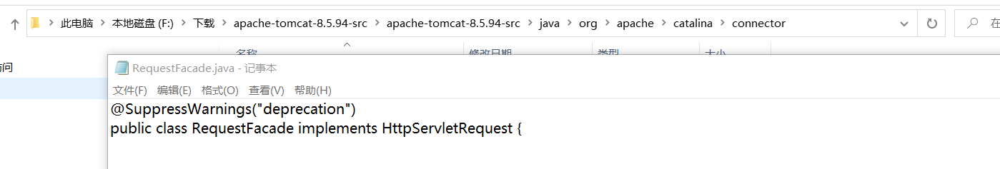
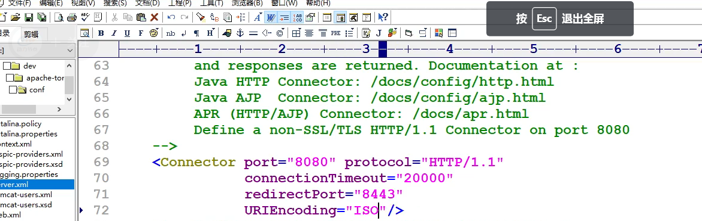

#### HttpServletRequest

* Web-info是受保护的，不能通过路径访问，所以资源不能在这里建

* HttpServletRequest是Servlet规范

* HttpServletRequest父类是ServletRequest

* **public interface** HttpServletRequest **extends** ServletRequest是一个接口，所以的找实现类

  ```java
  public class HttpServletTest extends HttpServlet {
      @Override
      protected void doGet(HttpServletRequest req, HttpServletResponse resp) throws ServletException, IOException {
          resp.setContentType("text/html");
          PrintWriter out=resp.getWriter();
          out.println(req);
      }
  }
  org.apache.catalina.connector.RequestFacade@726206de
  ```

  

* HttpServletRequest谁实现的，对象是谁创建的？封装了什么信息

  
  * web服务器实现了这个规范

  * 封装了Http协议，所以各种协议上的操作都在request对象里面

  * 一次请求只对应一个request

    ```java
    public class HttpServletTest extends HttpServlet {
        @Override
        protected void doGet(HttpServletRequest req, HttpServletResponse resp) throws ServletException, IOException {
            resp.setContentType("text/html");
            req.setAttribute("key", "value");
    
            PrintWriter out=resp.getWriter();
            out.println(req.getAttribute("key"));//但是其它的servlet访问不到
            //可以通过转发机制
        }
    }
    ```

    ```java
    public class HttpServletTest extends HttpServlet {
        @Override
        protected void doGet(HttpServletRequest req, HttpServletResponse resp) throws ServletException, IOException {
            resp.setContentType("text/html");
            req.setAttribute("key", "value");
    
            PrintWriter out=resp.getWriter();
            //问题一：在A的Servlet中new一个B的Servlet对象，然后调用B的Servlet对象的dpGet方法，把request拿过来
            //不对，这种创建方法不受tomcat管理
            //无法被回收
            //有一个方法RequestDispatcher	getRequestDispatcher​(java.lang.String path)
            //RequestDispatcher getRequestDispatcher​(java.lang.String path)
            //路径不加项目名，转发也是访问这个路径
            RequestDispatcher dispatcher=req.getRequestDispatcher("/test2");
            dispatcher.forward(req, resp);
        }
    }
    ```

    ```java
    public class HttpServletTest2 extends HttpServlet {
        @Override
        protected void doGet(HttpServletRequest req, HttpServletResponse resp) throws ServletException, IOException {
            resp.setContentType("text/html");
    
            PrintWriter out=resp.getWriter();
            out.println(req.getAttribute("key"));
        }
    }
    ```

    * 也可以转发到html，不用加斜杠，webapp为根目录


* 常用的方法

  * 首先看 父类ServletRequest的方法

    ```java
    java.lang.String	getParameter​(java.lang.String name) 获取value数组中第一个元素
    java.util.Map<java.lang.String,​java.lang.String[]>	getParameterMap()获取map，包含name和value
    java.lang.String[]	getParameterValues​(java.lang.String name) 针对于有多个value
    java.util.Enumeration<java.lang.String>	getParameterNames()
    ```

    ```java
    public class HttpServletTest extends HttpServlet {
        @Override
        protected void doGet(HttpServletRequest req, HttpServletResponse resp) throws ServletException, IOException {
            resp.setContentType("text/html");
            Map<String,String[]> map=req.getParameterMap();
            for (String a:map.keySet()){
                System.out.println(a);
                for (String b:req.getParameterValues(a)){
                    System.out.println(b);
                }
    
            }
    
            PrintWriter out=resp.getWriter();
            out.println(req);
        }
    }
    
    ```

    

* request作用域为请求域
  * 应用域对象是什么?
    * ServletContext (Servlet上下文对象。)
    * 什么情况下会考虑向ServletContext这个应用域当中绑定数据呢?
      * 第一:所有用户共享的数据。
      * 第二:这个共享的数据量很小。
      * 第三:这个共享的数据很少的修改操作。
    * 实际上向应用域当中绑定数据，就相当于把数据放到了缓存(Cache)当中，然后用户访问的时候直接从缓存中取，减少IO的操作，大大提升系统的性能，所以缓存技术是提高系统性能的重要手段。
  * 一次请求对应一个请求域，完成后销毁
* 常见的缓存技术
  * 字符串常量池
  * 整数型常量池[-128~127]，但凡是在这个范围当中的Integer对象不再创建新对象，直接从这个整数型常量池中获取。大大提升系统性能。
  * 数据库连接池（提前创建好N个连接对象，将连接对象放到集合当中，使用连接对象的时候，直接从缓存中拿。省去了连接对象的创建过程。效率提升。)
  * 线程池（Tomcat服务器就是支持多线程的。所谓的线程池就是提前先创建好N个线程对象，将线程对象存储到集合中，然后用户请求过来之后，直接从线程池中获取线程对象，直接拿来用。提升系统性能。


* 方法对比

  * req.getAttribute()和req.getParameter()

    * 前者是请求域中绑定的数据

    * 后者是浏览器提交的数据

    * 请求乱码问题：get是在请求行上传递数据，post是在请求体中传递数据

    * void	setCharacterEncoding()只能作用在请求体，所以只对post请求有用

    * req.setCharacterEncoding(**"utf8"**);//tomcat10之后默认使用字符集为**utf8**，就不需要设置这个了

      ```java
              //第二种仅仅是发送的浏览器的内容是UTF-8编码的，至于浏览器是用哪种编码方式显示不管。 
              //所以当浏览器的显示编码方式不是UTF-8的时候，就会看到乱码，需要手动再进行一次设置。
              //第二种仅仅是发送的浏览器的内容是UTF-8编码的，至于浏览器是用哪种编码方式显示不管。
              //所以当浏览器的显示编码方式不是UTF-8的时候，就会看到乱码，需要手动再进行一次设置。
              resp.setContentType("text/html;charset=utf8");
              resp.setCharacterEncoding("utf8");
      ```

      

    * GET请求乱码解决

      * URIEncoding默认就是utf8，在tomcat的conf下的server.xml，tomcat7及之前默认ISO-8859-1的编码

        


* 重定向

  * 重定向需要带项目名，因为它是浏览器发送的请求

    ```java
    resp.sendRedirect("/servlet3/test1");
    ```

  * 浏览器发请求需要带项目名，java内不需要带项目名

  * 和转发区别

    * 转发是一次请求，重定向是两次请求。

    * 转发动作是web服务器操作的，是服务器内部完成的，重定向是浏览器完成的，具体跳转到哪个资源，是浏览器说了算。

    * 转发地址栏地址不变，重定向会变

    *  原请求在进行转发时，会选择相同请求方式，即请求方式不变 

    * **重定向请求通常会使用GET方法，不管原请求使用的是何种方法**

      ```java
      public class HttpServletTest extends HttpServlet {
          @Override
          protected void doGet(HttpServletRequest req, HttpServletResponse resp) throws ServletException, IOException {
              //第二种仅仅是发送的浏览器的内容是UTF-8编码的，至于浏览器是用哪种编码方式显示不管。
              // 所以当浏览器的显示编码方式不是UTF-8的时候，就会看到乱码，需要手动再进行一次设置。
              //第二种仅仅是发送的浏览器的内容是UTF-8编码的，至于浏览器是用哪种编码方式显示不管。
              // 所以当浏览器的显示编码方式不是UTF-8的时候，就会看到乱码，需要手动再进行一次设置。
              resp.setContentType("text/html;charset=utf8");
              resp.setCharacterEncoding("utf8");
              req.setAttribute("key", "value");
              
              PrintWriter out=resp.getWriter();
              System.out.println(req.getParameter("name"));
              RequestDispatcher dispatcher=req.getRequestDispatcher("/test2");
              dispatcher.forward(req, resp);
              resp.sendRedirect("/servlet3/test2");
          }
      }
      ```

      * 转发和重定向不能同时使用，同时使用了请求转发和重定向，这是不允许的。当调用dispatcher.forward(req, resp)方法时，请求已经被转发到另一个资源，后面的resp.sendRedirect("/servlet3/test2")将不会生效。

        如果希望在跳转到"/test2"时发生请求转发，可以删除resp.sendRedirect("/servlet3/test2");这一行代码。

        如果希望使用重定向进行跳转到"/servlet3/test2"，则应删除dispatcher.forward(req, resp);这一行代码。

  * 重定向和转发应用场景

    * 如果在上一个Servlet当中向request域当中绑定了数据，希望从下一个Servlet当中把request域里面的数据取出来，使用转发机制。不要用于存，如果浏览器刷新数据库会出事
    * 剩下所有的请求均使用重定向。

  * **如果最初请求为Post请求，那么转发之后也为Post请求**，==但如果第二个servlet没有实现post请求，就会报405错误，此时建议使用重定向，因为浏览器在地址栏上发的请求为GET请求==