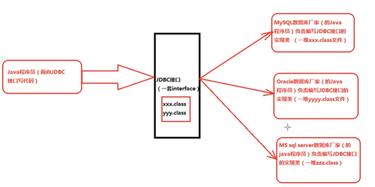
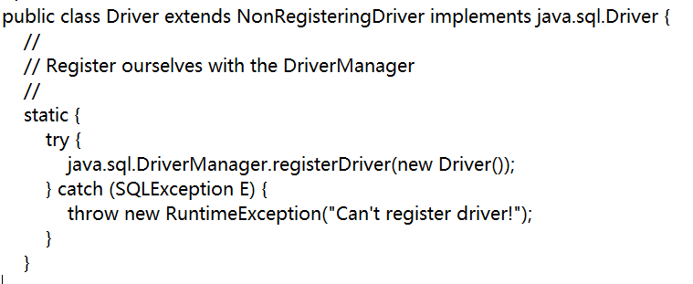
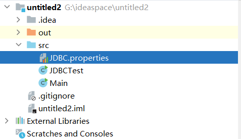

##### letJDBC

* Java DtataBase Connectivity

* 本质：SUN公司指定的一套接口，接口都有调用者和实现者，面向接口调用、面向接口写实现类所以面向接口编程。java.sql包。每一个数据库产品都有自己独特的原理，所以要提供一套统一的，剩下的让数据库厂家实现。

* 为什么要面向接口编程

  * 解耦合，降低耦合度，面向抽象编程，不面向接口编程

  * 如多态Animal a=new Cat()，不建议Cat a=new Cat()。public void feed(Animal a)

    

* 所有的数据库驱动都是以jar包的形式存在的，jar中的call都是对JDBC的实现

* JDBC开发前的准备工作，先从官网下载对应的驱动jar包，然后将其配置到环境变量classpath当中。
  classpath= .;D: \course\06-DBC\resourcesMysq Connector Java 5.1.23\mysq1-connector-java-5.1.23-bin.jar:

###### 通信六步

* 第一步:注册驱动（作用:告诉Java程序，即将要连接的是哪个品牌的数据库)

* 第二步:获取连接（表示JvM的进程和数据库进程之间的通道打开了)

* 第三步:获取数据库操作对象(专门执行sql语句的对象)

* 第四步:执行SQL语句

* 第五步:处理查询结果集

* 第六步:释放资源

  ```java
  import com.mysql.cj.jdbc.Driver;
  
  import java.sql.*;
  
  /**
   * ClassName:${NAME}
   * Package:${Package_NAME}
   * Description:
   *
   * @Aurhor 王子杰
   * @Create 2023/10/13 0:22
   * @Version 1.0
   */
  public class Main {
      public static void main(String[] args) {
          String url="jdbc:mysql://127.0.0.1:3307/atguigudb?serverTimezone=UTC";
          /*
          jdbc:mysql:协议
          127.0.0.1 IP地址
          3307数据库端口号
          atguigudb具体数据库
           */
          String user="root";
          String password="123456";
          Connection connection=null;
          Statement statement =null;
          try {
              //注册
              DriverManager.registerDriver(new Driver());
              //连接
              connection=DriverManager.getConnection(url, user, password);
              System.out.println("数据库连接对象"+connection);
              //获取对象
              statement = connection.createStatement();
              //执行语句，不要写分号，要不然会报错
  //            statement.execute("SELECT * FROM departments");
              ResultSet resultSet = statement.executeQuery("SELECT * FROM departments");
              System.out.println(resultSet);
  
          } catch (SQLException e) {
              throw new RuntimeException(e);
          }finally {
              try {
                  /*
                  JDK1.5规范说明：
                  1.垃圾回收机制可以自动关闭它们；
                  2.Statement关闭会导致ResultSet关闭；
                  3.Connection关闭不一定会导致Statement关闭
                   */
                  statement.close();
              } catch (SQLException e) {
                  throw new RuntimeException(e);
              }
              try {
                  connection.close();
              } catch (SQLException e) {
                  throw new RuntimeException(e);
              }
          }
          System.out.println("Hello world!");
      }
  }
  ```

  



```java
import com.mysql.cj.jdbc.Driver;

import java.sql.Connection;
import java.sql.DriverManager;
import java.sql.SQLException;
import java.sql.Statement;
import java.util.ResourceBundle;

/**
 * ClassName:JDBCTest
 * Package:
 * Description:
 *
 * @Aurhor 王子杰
 * @Create 2023/10/13 13:24
 * @Version 1.0
 */
public class JDBCTest {
    //第二种方法，在mysql-connector-java-8.0.11\src\main\ user-impl\java\com\mysql\cj\jdbc实现了静态代码块
    /*
     static {
        try {
            java.sql.DriverManager.registerDriver(new Driver());
        } catch (SQLException E) {
            throw new RuntimeException("Can't register driver!");
        }
    }
     */
    public static void main(String[] args) {
        //这种方式最常用，因为可以写到配置文件
        ResourceBundle resourceBundle=ResourceBundle.getBundle("JDBC");
        String url=resourceBundle.getString("URL");
        String diver=resourceBundle.getString("Driver");
        String user=resourceBundle.getString("User");
        String password=resourceBundle.getString("Password");
        Connection connection=null;
        Statement statement =null;

        try {
            Class.forName(diver);
            connection= DriverManager.getConnection(url, user, password);
            System.out.println(connection);

        } catch (ClassNotFoundException e) {
            throw new RuntimeException(e);
        } catch (SQLException e) {
            throw new RuntimeException(e);
        }finally {
            try {
                connection.close();
            } catch (SQLException e) {
                throw new RuntimeException(e);
            }
        }
    }
}

```



* JDBC中所有下标从1开始

```java
import java.awt.font.ImageGraphicAttribute;
import java.sql.*;
import java.util.HashMap;
import java.util.Map;
import java.util.Scanner;

/**
 * ClassName:JDBCTest2
 * Package:
 * Description:
 *
 * @Aurhor 王子杰
 * @Create 2023/10/14 0:01
 * @Version 1.0
 */
public class JDBCTest2 {
    public static void main(String[] args) {
        //初始化一个界面
        Map map = initUI();
        //验证用户密码
        boolean loginSuccess=login(map);
        System.out.println(loginSuccess);
    }
    private static Map initUI(){
        Scanner s=new Scanner(System.in);
        System.out.println("用户名：");
        String loginName=s.nextLine();
        System.out.println("密码：");
        String loginPwd=s.nextLine();
        Map map=new HashMap();
        map.put("loginName", loginName);
        map.put("loginPwd", loginPwd);
        return map;
    }
    private static boolean login(Map map){
        boolean isSuccess=true;
        JDBC(map);
        return isSuccess;
    }
    private static boolean JDBC(Map<String,String> map){
        Connection connection=null;
        PreparedStatement preparedStatement=null;
        ResultSet resultSet =null;
        try {
            Class.forName("com.mysql.cj.jdbc.Driver");
            connection= DriverManager.getConnection("jdbc:mysql://127.0.0.1:3307/atguigudb?serverTimezone=UTC",
                    "root","123456");
            /*
            以前的
            "SELECT * FROM job_grades WHERE lowest_sal='" + map.get("loginName") +
            "' AND highest_sal='" + map.get("loginPwd") + "'"
             */
            //现在的，防止SQL注入
            String sql="SELECT * FROM job_grades WHERE lowest_sal=? AND highest_sal=?";
            //?表示一个占位符
            preparedStatement = connection.prepareStatement(sql);
            //JDBC中所有下标从1开始
            preparedStatement.setString(1, map.get("loginName"));
            preparedStatement.setString(2, map.get("loginPwd"));
            resultSet = preparedStatement.executeQuery();
            return resultSet.next()==true? true:false;
        } catch (ClassNotFoundException e) {
            throw new RuntimeException(e);
        } catch (SQLException e) {
            throw new RuntimeException(e);
        }finally {
            if (resultSet!=null){
                try {
                    resultSet.close();
                } catch (SQLException e) {
                    throw new RuntimeException(e);
                }
            }
            if (preparedStatement!=null){
                try {
                    preparedStatement.close();
                } catch (SQLException e) {
                    throw new RuntimeException(e);
                }
            }
            if (connection!=null){
                try {
                    connection.close();
                } catch (SQLException e) {
                    throw new RuntimeException(e);
                }
            }
        }
    }
}

```


* Statement会出现SQL注入，但是也有应用场景，比如升降序，就可以通过改变字符串进行升降序，因为PreparedStatement会给你加单引号了


* JDBC事务是自动提交的，只要执行一条DML语句，就自动提交一次，这是JDBC默认事务。但是有时候是好几条SQL语句作用于一条逻辑，当执行了一部分sql，但是下面的SQL报错，可能意味着一套流程不合法，数据库不应该改变，但是现在已经改变了一部分，所以需要想一种方法把这个代码的所有sql都读完再统一提交。

  * 解决方法：手动提交

  * 具体流程：开启事务connection.setAutoCommit(**false**);，提交事务connection.commit();，回滚事务connection.rollback();回滚就是出现错误回到原样

    ```java
    import java.awt.font.ImageGraphicAttribute;
    import java.sql.*;
    import java.util.HashMap;
    import java.util.Map;
    import java.util.Scanner;
    
    /**
     * ClassName:JDBCTest2
     * Package:
     * Description:
     *
     * @Aurhor 王子杰
     * @Create 2023/10/14 0:01
     * @Version 1.0
     */
    public class JDBCTest2 {
        public static void main(String[] args) {
            //初始化一个界面
            Map map = initUI();
            //验证用户密码
            boolean loginSuccess=login(map);
            System.out.println(loginSuccess);
        }
        private static Map initUI(){
            Scanner s=new Scanner(System.in);
            System.out.println("用户名：");
            String loginName=s.nextLine();
            System.out.println("密码：");
            String loginPwd=s.nextLine();
            Map map=new HashMap();
            map.put("loginName", loginName);
            map.put("loginPwd", loginPwd);
            return map;
        }
        private static boolean login(Map map){
            boolean isSuccess=true;
            JDBC(map);
            return isSuccess;
        }
        private static boolean JDBC(Map<String,String> map){
            Connection connection=null;
            PreparedStatement preparedStatement=null;
    //        ResultSet resultSet =null;
            try {
                Class.forName("com.mysql.cj.jdbc.Driver");
                connection= DriverManager.getConnection("jdbc:mysql://127.0.0.1:3307/atguigudb?serverTimezone=UTC",
                        "root","123456");
                connection.setAutoCommit(false);
                /*
                以前的
                "SELECT * FROM job_grades WHERE lowest_sal='" + map.get("loginName") +
                "' AND highest_sal='" + map.get("loginPwd") + "'"
                 */
                //现在的，防止SQL注入
                String sql="UPDATE job_grades set lowest_sal=? WHERE highest_sal=?";
                //?表示一个占位符
                preparedStatement = connection.prepareStatement(sql);
                //JDBC中所有下标从1开始
                preparedStatement.setString(1, map.get("loginName"));
                preparedStatement.setString(2, map.get("loginPwd"));
                int result = preparedStatement.executeUpdate();
                //执行到这里数据库内容就已经改变了，但是如果下面的SQL报错，可能意味着一套流程不合法，
                // 数据库不应该改变，但是现在已经改变，所以需要想一种方法把这个代码的所有sql都读完再统一提交
    
                //第二次重新赋值
                preparedStatement.setString(1, map.get("loginName"));
                preparedStatement.setString(2, map.get("loginPwd"));
                result = preparedStatement.executeUpdate();
                //提交事务
                connection.commit();
                return result>0? true:false;
            } catch (ClassNotFoundException e) {
                throw new RuntimeException(e);
            } catch (SQLException e) {
                throw new RuntimeException(e);
            }finally {
                if (preparedStatement!=null){
                    try {
    
                        preparedStatement.close();
                    } catch (SQLException e) {
                        throw new RuntimeException(e);
                    }
                }
                if (connection!=null){
                    try {
                        //事务回滚
                        connection.rollback();
                        connection.close();
                    } catch (SQLException e) {
                        throw new RuntimeException(e);
                    }
                }
            }
        }
    }
    
    ```

    

* JDBC封装,JDBCUtils

  ```JAVA
  import java.sql.*;
  
  /**
   * ClassName:JDBCUtil
   * Package:
   * Description:
   *
   * @Aurhor 王子杰
   * @Create 2023/10/14 11:52
   * @Version 1.0
   */
  public class JDBCUtil {
      private JDBCUtil(){
  
      }
      static {
          try {
              Class.forName("com.mysql.jdbc.Driver");
          } catch (ClassNotFoundException e) {
              throw new RuntimeException(e);
          }
      }
      public static Connection getConnection() throws SQLException {
          Connection cn= DriverManager.getConnection("jdbc:mysql://127.0.0.1:3307/atguigudb?serverTimezone=UTC",
                      "root","123456");
          return cn;
      }
      public static void close(Connection cn, Statement st, ResultSet rs){
          if (rs!=null){
              try {
                  rs.close();
              } catch (SQLException e) {
                  throw new RuntimeException(e);
              }
          }
          if (st!=null){
              try {
                  st.close();
              } catch (SQLException e) {
                  throw new RuntimeException(e);
              }
          }
          if (cn!=null){
              try {
                  cn.close();
              } catch (SQLException e) {
                  throw new RuntimeException(e);
              }
          }
      }
  }
  
  ```

  * like查询和自定义封装的使用

    ```java
    import java.sql.Connection;
    import java.sql.PreparedStatement;
    import java.sql.ResultSet;
    import java.sql.SQLException;
    
    /**
     * ClassName:LIkeSearch
     * Package:
     * Description:
     *
     * @Aurhor 王子杰
     * @Create 2023/10/14 12:00
     * @Version 1.0
     */
    public class LIkeSearch {
        //测试自己封装的效果
        public static void main(String[] args) {
            Connection cn=null;
            PreparedStatement pst=null;
            ResultSet rs=null;
            try {
                cn=JDBCUtil.getConnection();
                String sql="SELECT lowest_sal FROM job_grades WHERE highest_sal LIKE ? ";
                pst=cn.prepareStatement(sql);
                pst.setString(1, "2%");
                rs=pst.executeQuery();
                while (rs.next()){
                    System.out.println(rs.getString(1));
                }
                JDBCUtil.close(cn, pst, rs);
            } catch (SQLException e) {
                throw new RuntimeException(e);
            }
        }
    }
    
    ```

    

* 悲观锁∶事务必须排队执行。数据锁住了，不允许并发。又称为行级锁（用法，在select语句后面加for update）
  乐观锁:支持并发，事务也不需要排队，只不过震要一个版本号。其中事务1先修改了，修改之后看了版本号是1.1，于是提交修改的政据，将版本号修改为1.2
  其中事务2后修改的，修改之后准备提交的时候，发现版本号是12，和它最初读的版本号不一致。回滚。

  ```java
  public static void main(String[] args) {
          Connection cn=null;
          PreparedStatement pst=null;
          ResultSet rs=null;
          try {
              cn=JDBCUtil.getConnection();
              cn.setAutoCommit(false);
              String sql="SELECT lowest_sal FROM job_grades WHERE highest_sal = ? FOR UPDATE ";
              pst=cn.prepareStatement(sql);
              pst.setString(1, "2999");
              rs=pst.executeQuery();
              cn.commit();
              while (rs.next()){
                  System.out.println(rs.getString(1));
              }
  
              cn.rollback();
              JDBCUtil.close(cn, pst, rs);
          } catch (SQLException e) {
              throw new RuntimeException(e);
          }
      }
  
   //修改被锁定的记录
      public static void main(String[] args) {
          Connection cn=null;
          PreparedStatement pst=null;
          try {
              cn=JDBCUtil.getConnection();
              cn.setAutoCommit(false);
              String sql="UPDATE  job_grades SET lowest_sal= ? WHERE highest_sal='2999' ";
              pst=cn.prepareStatement(sql);
              pst.setString(1, "200");
              int i = pst.executeUpdate();
              System.out.println(i);
              cn.commit();
              cn.rollback();
              JDBCUtil.close(cn, pst, null);
          } catch (SQLException e) {
              throw new RuntimeException(e);
          }
      }
  ```

  