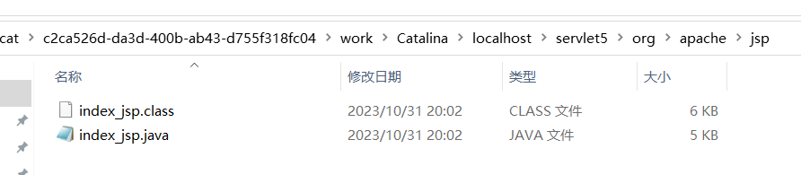
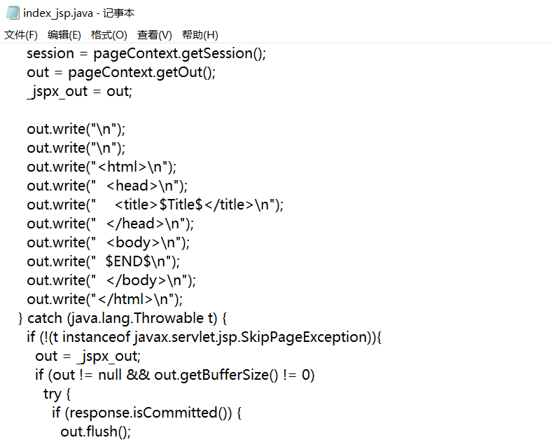
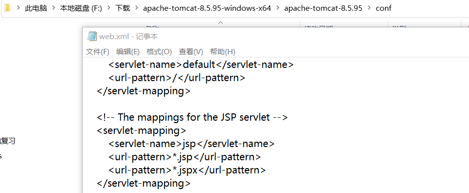

#### JSP

* 之前的问题：上面的那个Servlet (Java程序）能不能不写了，让机器自动生成。我们程序员只需要写这个Servlet程序中的"前端的那段代码"，然后让机器将我们写的"前端代码"自动翻译生成"Servlet这种java程序"。然后机器再自动将“"java"程序编译生成"class"文件。然后再使用JVM调用这个class中的方法。

* 举例，新建一个web项目，有一个index.jsp，运行tomcat

  ```java
  <%--
    Created by IntelliJ IDEA.
    User: lenovo
    Date: 2023/10/31
    Time: 20:02
    To change this template use File | Settings | File Templates.
  --%>
  <%@ page contentType="text/html;charset=UTF-8" language="java" %>
  <html>
    <head>
      <title>$Title$</title>
    </head>
    <body>
    $END$
    </body>
  </html>
  
  ```

  * 输出在C:\Users\lenovo\AppData\Local\JetBrains\IntelliJIdea2023.1\tomcat\c2ca526d-da3d-400b-ab43-d755f318fc04\work\Catalina\localhost\servlet5\org\apache\jsp，可以找到

    

  * 查看生成的java代码发现，还是通过out.print输出的字符串，只不过是tomcat帮你生成的

    

    ```java
    index_jsp.java的部分代码
    public final class index_jsp extends org.apache.jasper.runtime.HttpJspBase
        implements org.apache.jasper.runtime.JspSourceDependent,
                     org.apache.jasper.runtime.JspSourceImports
                         
    继续追，打开F:\下载\apache-tomcat-8.5.94-src\apache-tomcat-8.5.94-src\java\org\apache\jasper\runtime
    public abstract class HttpJspBase extends HttpServlet implements HttpJspPage
        
    发现继承的是HttpServlet，所以本质是一个Servlet。jsp的声明周期和servlet完全相同
        
     jsp和servlet都是假单例
    ```

    * JSP第一次访问都是比较慢，因为需要把jsp文件生成java文件
      * 要把jsp文件翻译生成java源文件
      * java原文件要编译生成class字节码文件
      * 然后通过class去创建servlet对象
      * 然后调用servlet对象的init方法
      * 最后调用servlet对象的service方法。
    * 第二次直接调用servlet对象的service方法。

* JSP是什么

  * JSP是java程序，本质是一个Servlet
  * **Servlet是javaEE的13个规范之一,那么JSP也是**
  * JSP是一个翻译引擎


* JSP的基础语法

  * 在jsp文件中直接编写文字，都会自动被翻译到哪里?

    * **翻译到servlet类的service方法的out.write这里，表示为java中的字符串**

  * 防止乱码的指令：<%@ **page** **contentType**="**text/html;charset=UTF-8**" **language**="**java**" %>

  * 在<% %>这个符号里面写java的代码，会被放到方法体里，也就是service方法里。注意，这是在方法体里，要注意哪些可以写，哪些不可以写。比如权限修饰符

  * jsp注释<%– –    – –%>  ，这个注释信息不会被翻译到java代码中，而html注释会

  * jsp相同标签下的代码执行顺序从上往下，不同标签的执行顺序不一样

  * <%!  %>这里面的代码不是放在service里，而是放在类里，所以可以写静态代码块，方法等。一般不用这个标签，存在线程安全问题，因为jsp是单例，在多线程当中实例变量存在修改必然存在线程安全问题

  * 输出变量，可以用out.write()，在生成的java代码里是javax.servlet.jsp.JspWriter out = null;因为标签都是在service方法里，out在service被初始化了，所以out直接就是变量

    ```java
      public void _jspService(final javax.servlet.http.HttpServletRequest request, final javax.servlet.http.HttpServletResponse response)
          throws java.io.IOException, javax.servlet.ServletException {
    
        final java.lang.String _jspx_method = request.getMethod();
        if (!"GET".equals(_jspx_method) && !"POST".equals(_jspx_method) && !"HEAD".equals(_jspx_method) && !javax.servlet.DispatcherType.ERROR.equals(request.getDispatcherType())) {
          response.sendError(HttpServletResponse.SC_METHOD_NOT_ALLOWED, "JSP 只允许 GET、POST 或 HEAD。Jasper 还允许 OPTIONS");
          return;
        }
    
        final javax.servlet.jsp.PageContext pageContext;
        javax.servlet.http.HttpSession session = null;
        final javax.servlet.ServletContext application;
        final javax.servlet.ServletConfig config;
        javax.servlet.jsp.JspWriter out = null;
        final java.lang.Object page = this;
        javax.servlet.jsp.JspWriter _jspx_out = null;
        javax.servlet.jsp.PageContext _jspx_page_context = null;
    
    
        try {
          response.setContentType("text/html;charset=UTF-8");
          pageContext = _jspxFactory.getPageContext(this, request, response,
          			null, true, 8192, true);
          _jspx_page_context = pageContext;
          application = pageContext.getServletContext();
          config = pageContext.getServletConfig();
          session = pageContext.getSession();
          out = pageContext.getOut();
          _jspx_out = out;
    
          out.write("\n");
          out.write("\n");
          out.write("<html>\n");
          out.write("  <head>\n");
          out.write("    <title>欢迎</title>\n");
          out.write("  </head>\n");
          out.write("  <body>\n");
          out.write("\n");
          out.write("  <a href=\"");
          out.print(request.getContextPath());
          out.write("/list.jsp\">查看部门列表</a>\n");
          out.write("  </body>\n");
          out.write("</html>\n");
        } catch (java.lang.Throwable t) {
          if (!(t instanceof javax.servlet.jsp.SkipPageException)){
            out = _jspx_out;
            if (out != null && out.getBufferSize() != 0)
              try {
                if (response.isCommitted()) {
                  out.flush();
                } else {
                  out.clearBuffer();
                }
              } catch (java.io.IOException e) {}
            if (_jspx_page_context != null) _jspx_page_context.handlePageException(t);
            else throw new ServletException(t);
          }
        } finally {
          _jspxFactory.releasePageContext(_jspx_page_context);
        }
      }
    ```

    * 因此在service方法外面就没办法使用，所以只能在<% %>用九大内置对象

  * **<%=  %>会打印java代码。不能加分号，因为它会被放到out.print();里面，输出的内容是一个动态的内容**

    ```java
      <%=  100+200
      %>
      在生成的servlet中就是 ，在service方法里    
          out.print(  100+200);
    ```

    

* JSP和Servlet的区别（职责不同）

  * Servlet是收集数据，逻辑处理，连接数据库
  * JSP是数据展示
  
* 前端发送请求时，如果使用绝对路径，/+项目名+/请求路径


* JSP的后缀必须是.jsp吗？可以修改

  
  
  * xxx.jsp文件对于小猫咪来说，只是一个普通的文本文件，web容器会将xxx.jsp文件最终生成java程序，最终调用的是java对象相关的方法，真正执行的时候，和jsp文件就没有关系了。


* JSP报错或看不懂一定看翻译成的java文件
* javabean是java的实体类，负责数据的封装，符合javabean规范，具有更强的通用性

* JSP的指令

  * 指令的作用：指导JSP的翻译引擎工作

  * 指令包括哪些

    * include指令
    * page指令
    * taglib指令

  * 指令的语法是什么

    * <%@指令名 属性名=属性值 属性名=属性值…..  %>

  * page常用的属性

    ```java
    <%--用于设置相应内容，也可以设置字符集--%>
    <%@ page contentType="text/html;charset=UTF-8" language="java" %>
    <%--设置是否启用session--%>
    <%@ page session="false" %>
    <%--用于设置相应的类型--%>
    <%@ page contentType="text/html; ISO-8859-1" %>
    <%--表示设置响应时采用的字符集--%>
    <%@page pageEncoding="utf-8" %>
    <%--contentType优先级更高--%>
    <%@page contentType="text/html; ISO-8859-1" pageEncoding="UTF-8" %>
    <%--导包--%>
    <%@page import="java.io" %>
    <%--当前页面出现异常后的跳转路径--%>
    <%@page errorPage="/error.jsp" %>
    <%--如果是异常页，可以启用exception对象，不是异常页无法用这个对象。就是建立一个异常对象--%>
    <%@page isErrorPage="true" %>
    <%= exception.printStackTrace()%>
    
    ```

* jsp九大内置对象

  * ```java
    final javax.servlet.http.HttpServletRequest request请求作用域
    final javax.servlet.ServletContext application;应用作用域
    final javax.servlet.jsp.PageContext pageContext;页面作用域
    javax.servlet.http.HttpSession session = null;会话作用域
       pageContext<request<session<application
    java.lang.Throwable exception = org.apache.jasper.runtime.JspRuntimeLibrary. getThrowable(request) 异常
    final javax.servlet.http.HttpServletResponse response响应
    
    final javax.servlet.ServletConfig config;配置
    javax.servlet.jsp.JspWriter out = null; 输出
    final java.lang.Object page = this;就是this
    ```


#### EL表达式

* EL表达式作用：代替jsp的java代码，看起来更加整洁美观

  * EL表达式可以是JSP语法的一部分

  * 主要作用：

    * 从某个作用域取出数据（4个域）
    * 将取出的数据转成字符串
    * 将字符串输出到浏览器

  * 基本语法符号$(表达式)

  * 

    ```java
    <% request.setAttribute("username", "wang");
      User user=new User();
      Sdept sdept=new Sdept();
      sdept.setAddreess("aaaa");
      sdept.setJob("bbb");
      user.setPassword("123");
      user.setUsername("aa");
      user.setSdept(sdept);
      request.setAttribute("userobj", user);
    %>
    <%--之前的写法--%>
    <%= request.getAttribute("username")%>
    <%--EL表达式--%>
    ${username}
    <%--底层调用的是tostring方法，不实现这个方法就会调用object的tostring--%>
    ${userobj}
    <%--底层调用的是get方法,不实现这个方法会报异常错误--%>
    ${userobj.username}
    <%--这两种等价--%>
    ${userobj["username"]}
    ${userobj.sdept.addreess}
    <%--它就是在找getxxx方法--%>
    ${userobj.sdept2.addreess}
    ```

    * 数据必须存储到四大范围之一
    * EL中加双引号就是普通字符串。$$(abc)和  $(“abc”)的区别，前者代表从某个域中取出数据，这个数据的name=“abc”，后者是打印“abc”这个字符串

    ```java
    package wang.zi.jie.bean;
    
    /**
     * ClassName:Sdept
     * Package:
     * Description:
     *
     * @Aurhor 王子杰
     * @Create 2023/11/9 15:32
     * @Version 1.0
     */
    public class Sdept {
        private String  job;
        private String  addreess;
    
        public String getJob() {
            return job;
        }
    
        public void setJob(String job) {
            this.job = job;
        }
    
        public String getAddreess() {
            return addreess;
        }
    
        public void setAddreess(String addreess) {
            this.addreess = addreess;
        }
    
        @Override
        public String toString() {
            return "Sdept{" +
                    "job='" + job + '\'' +
                    ", addreess='" + addreess + '\'' +
                    '}';
        }
    }
    
    ```

    ```java
    package wang.zi.jie.bean;
    
    /**
     * ClassName:User
     * Package:
     * Description:
     *
     * @Aurhor 王子杰
     * @Create 2023/11/9 13:54
     * @Version 1.0
     */
    public class User {
        private String username;
        private String password;
        private Sdept sdept;
        public String getUsername() {
            return username;
        }
    
        public void setUsername(String username) {
            this.username = username;
        }
    
        public String getPassword() {
            return password;
        }
    
        public void setPassword(String password) {
            this.password = password;
        }
    
        public Sdept getSdept() {
            return sdept;
        }
        //增加一个
        public Sdept getSdept2() {
            return sdept;
        }
    
        public void setSdept(Sdept sdept) {
            this.sdept = sdept;
        }
    
        @Override
        public String toString() {
            return "User{" +
                    "username='" + username + '\'' +
                    ", password='" + password + '\'' +
                    ", sdept=" + sdept +
                    '}';
        }
    }
    
    ```

    

* 作用域优先级测试

  ```java
  <% request.setAttribute("username", "request");
    pageContext.setAttribute("username","pageContext");
    session.setAttribute("username", "session");
    application.setAttribute("username", "application");
  %>
  ${username}
  <%--想使用大作用域的--%>
  ${sessionScope.username}
  ```

  输出： pageContext ，注释掉这个。request，session,application

  * 所以它的优先级是小的作用域优先级高

  * 四个隐含的范围requestScope，sessionScope，pageScope，applicationScope

* EL表达式做过空处理，如果这个key通过page，request，session,application都找不到value，就进行空处理，空白输出到浏览器

* 另外一种取值的形式，[]

  ```java
  <% request.setAttribute("username", "wang");
    request.setAttribute("wang.zi", "jie");
  %>
  <%--这两种等价,[]用于处理含有特殊字符的--%>
  ${userobj["username"]}
  ${wang.zi}<br/>
  ${requestScope["wang.zi"]}
  <%--想使用大作用域的--%>
  <%--${sessionScope.username}--%>
  ```

  * 这种一般用来取特殊字符，如含有.的

* 掌握EL表达式从map集合中取数据

  * $(map.key)

    ```java
    <%  Map<String,String> map=new HashMap();
        map.put("username", "wang");
        map.put("password", "jie");
        Map<String,User> map1=new HashMap();
        User user=new User();
        user.setUsername("wang2");
        map1.put("user1", user);
        request.setAttribute("usermap",map);
        request.setAttribute("usermap2",map1);
    %>
    <%--这两种等价,[]用于处理含有特殊字符的--%>
    ${usermap.username}
    ${usermap.password}
    ${usermap["password"]}
    ${usermap2.user1.username}
    ```

* 掌握EL表达式从数组中取数据

  ```java
  <%  String[] username={"aa","bb","cc"};
      request.setAttribute("username1",username);
      User user=new User();
      user.setUsername("wang");
      User user2=new User();
      user.setUsername("jie");
      User[] users={user,user2};
      request.setAttribute("userskey", users);
  %>
  <%--数组越界在浏览器显示的是空白，进行了空处理--%>
  ${username1[0]}</br>
  ${userskey[0].username}
  ```

  

* 掌握EL表达式从List和Set中取数据

  ```java
  <%
      List list= new ArrayList();
      list.add("aa");
      list.add("bb");
      list.add("cc");
      request.setAttribute("userlist",list);
      Set set=new HashSet();
      set.add("a");
      set.add("b");
      set.add("c");
      request.setAttribute("usersset", set);
  %>
  <%--list集合也是通过下标取数据--%>
  ${userlist[0]}</br>
  ${usersset}
  <%--无法获取，报错--%>
  ${usersset[0]}
  ```

  

* 设置忽略EL表达式

  ```java
  <%--设置是否忽略EL表达式，默认是false，这是全局忽略--%>
  <%@page isELIgnored="true" %>
  <%--设置忽略一个El表达式，即局部忽略--%>
  \${usersset}
  ```

* EL表达式获取应用的根

  ```java
  <%--九大内置对象有request，为什么还要有pageContext.getRequest呢--%>
  <%= pageContext.getRequest()%>
  <%= request%>
  <%--输出结果发现是同一对象--%>
  <%--原因是在EL当中没有这个隐式对象，requestScope只代表请求范围，不等同于request对象--%>
  <%--但是EL有个pageContext内置对象，并且和JSP的pageContext是同一个对象--%>
  <%--pageContext.getRequest等价于pageContext.request--%>
  ${pageContext.request}
  <%--获取应用的根--%>
  <%--pageContext.getRequest()获取的是ServletRequest，没有getContextPath，所以要下转型--%>
  <%= ((HttpServletRequest)pageContext.getRequest()).getContextPath() %>
  ${pageContext.request.contextPath}
  ```


* EL的常用隐式对象

  * pageContext

  * param

  * paramValues

    ```java
    http://localhost:8080/servlet6/index.jsp?aihao=smoke&aihao=drink&sex=man
    <%--http://localhost:8080/servlet6/index.jsp?aihao=smoke&aihao=drink&sex=man--%>
    <%=request.getParameter("sex") %></br>
    ${param.sex}</br>
    <%--paramValues.aihao拿到的是一维数组，获取元素--%>
    ${paramValues.aihao}</br>
    ${paramValues.aihao[0]}
    ```

    

  * initParam

    ```xml
    web.xml    
    <context-param>
            <param-name>wang</param-name>
            <param-value>zi</param-value>
    </context-param>
    ```

    ```jsp
    <%
      String name=application.getInitParameter("wang");
    %>
    <%= name %>
    ${initParam.wang}
    ```

    

* EL表达式的运算符

  * 算术运算符
  
  * 关系运算符
  
  * 逻辑运算符
  
  * 条件运算符
  
  * 取值运算符
  
  * empty运算符
  
    ```java
    ${10+20}</br><%-- 30--%>
    <%--在EL表达式没有字符串拼接，只能做求和运算--%>
    ${10+'20'}</br><%-- 30--%>
    <%--${10+'abc'}</br>&lt;%&ndash; 报数字转换异常，+两边不是数字时一定会转成数字&ndash;%&gt;--%>
    ${"abc"=="abc"}<%-- true--%>
    
    <%
      Object obj=new Object();
      request.setAttribute("obj1", obj);
      request.setAttribute("obj2", obj);
    %>
    ${obj1==obj2}<%-- true--%>
    
    <%
      String s1=new String("hh");
      String s2=new String("hh");
      request.setAttribute("string1", s1);
      request.setAttribute("string2", s2);
    %>
    ${string1==string2}<%-- true，因为调用的是equals方法--%>
    ${string1 eq string2}<%-- true，调用的也是equals方法--%>
    ${string1 != string2}<%-- false，调用的也是equals方法，再取反--%>
    ${not string1  eq string2}<%-- false，调用的也是equals方法，再取反--%>
    ${empty string1}
    ${initParam.password==null}
    <%--三目运算符--%>
    ${empty string1 ? "对不起，为空":"啊啊啊"}
    ```
  
    

##### JSTL

* 什么是ISTI标签库?
  *  Java Standard Tag Lib (Java标准的标签库)，模仿HTML标签，用标签代替java代码
  * JSTL标签库通常结合EL表达式—起使用。目的是让JSP中的java代码消失。使用JSTL标签库的步骤:
    * 第一步:引入JSTL标签库对应的jar包。
    * 第二步：新建lib，放进去
    * 在jsp中引入<%@**taglib** **prefix**="" **uri**="**http://java.sun.com/jsp/jstl/core**" %>
  
  * 原理：uri的路径指向了一个xxx.tld文件，tld文件实际上是一个xml配置文件，在tld文件中描述了标签和java类之间的对应关系
  
    ```xml
      <tag>
        <description>标签的描述
            Catches any Throwable that occurs in its body and optionally
            exposes it.
        </description>
        <name>catch</name>标签的名字
        <tag-class>org.apache.taglibs.standard.tag.common.core.CatchTag</tag-class>
        <body-content>JSP</body-content>标签体内可以出现的内容
        <attribute>属性
            <description>对属性的描述
    Name of the exported scoped variable for the
    exception thrown from a nested action. The type of the
    scoped variable is the type of the exception thrown.
            </description>
            <name>var</name>属性名
            <required>false</required>false表示该属性是否必须要有
            <rtexprvalue>false</rtexprvalue>说明该属性是否支持EL表达式
        </attribute>
      </tag>
    ```
  
    

```java
<%@ page import="java.util.List" %>
<%@ page import="wang.zi.jie.bean.User" %>
<%@ page import="java.util.ArrayList" %><%--
  Created by IntelliJ IDEA.
  User: lenovo
  Date: 2023/11/20
  Time: 23:53
  To change this template use File | Settings | File Templates.
--%>
<%@ page contentType="text/html;charset=UTF-8" language="java" %>
<%--核心标签库--%>
<%@taglib prefix="c" uri="http://java.sun.com/jsp/jstl/core" %>
<%--sql标签库--%>
<%@taglib prefix="wang" uri="http://java.sun.com/jsp/jstl/sql" %>

<%
    List<User> list=new ArrayList();
    User user=new User();
    user.setUsername("aa");
    User user2=new User();
    user2.setUsername("bb");
    User user3=new User();
    user3.setUsername("cc");
    list.add(user);
    list.add(user2);
    list.add(user3);
    request.setAttribute("users", list);
%>
<c:catch></c:catch>
<%--begin开始,step步长，end结束 varStatus代表了var的状态对象，它是一个java对象，反应了状态，它有count属性--%>
<c:forEach items="${users} " var="s" begin="1" step="1" end="2" varStatus="wang">
    name:${s}<br>
    cout:${wang.count}
</c:forEach>
<%--if标签还有scope和var属性，但不是必须的，scope属性，用来设置var的存储域--%>
<%--scope有四个域可以选，page,request,session,application--%>
<c:if test="${empty param.username}" var="v" scope="request">
<h1>用户名不能为空</h1>
</c:if>
<%--v存储的是test属性的值--%>
${v}
<%--就是if 语句if else语句 else语句--%>
<c:choose>
    <c:when test="${param.age<18}">青年</c:when>
    <c:when test="${param.age<35}">中年</c:when>
    <c:otherwise>老年</c:otherwise>
</c:choose>
<html>
<head>
    <title>Title</title>
</head>
<body>

</body>
</html>

```

