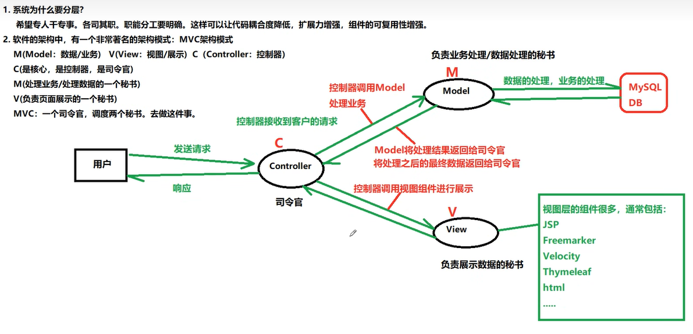
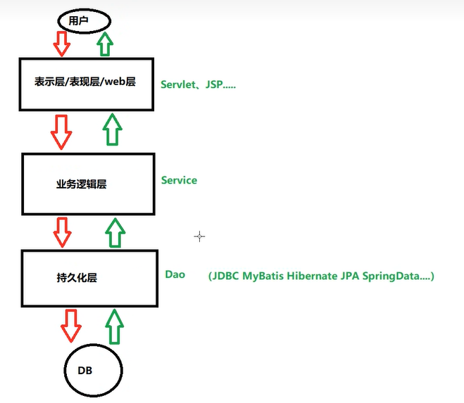
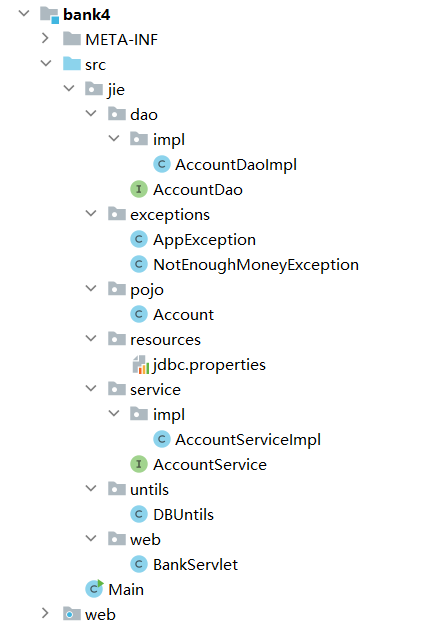

##### MVC

* 数据库CRUD   ,C (Create增加)   R(Retrieve 检索) U(Updata 更新) D(Delete 删除)

* 不使用MVC缺点

  * 代码的复用性太差，不应该在servlet，应该抽离出来
  * 业务逻辑和数据库代码混合在一起，不能专注工作

* 软件有一个设计模式MVC，不区分语言

  * M(Model 数据，业务) V（View 视图）C(Controller 控制器)

  * C是核心，司令官，用于控制代码逻辑

  * M是秘书，用于操控数据

  * V是另一个秘书，用于展示数据

    

  * **这个Model是包含bean，service（业务层），dao（持久化层）**

  * 三层架构是：表示层，业务层，持久化层

    * 三层架构和MVC的关系:M包括持久层dao，bean，service，V是视图，jsp，C是控制层

      

    * SSM框架：Mybatis是持久层，Spring不属于任何一层，它是管家，负责各种对象的创建和对象之间关系的维护，Spring MVC是搭建完的MVC架构，只要用它就保证了MVC架构模式
    
    * 事务是在service层控制，因为一个service方法代表了一个完整的事务

* 实现一个银行转账，对比有无MVC区别

  ```java
  @WebServlet("/transfer")
  public class BankServlet extends HttpServlet {
      @Override
      protected void doPost(HttpServletRequest request, HttpServletResponse response) throws ServletException, IOException {
          response.setContentType("text/html;utf-8");
          String fromActno=request.getParameter("fromActno");
          String toActno=request.getParameter("toActno");
          double money=Double.parseDouble(request.getParameter("money"));
          //进行转账操作
          Driver driver;
          Connection connection=null;
          PreparedStatement statement=null;
          PreparedStatement statement2=null;
          PreparedStatement statement3=null;
          ResultSet resultSet=null;
          try {
              //注册驱动
              Class.forName("com.mysql.cj.jdbc.Driver");
              String url="jdbc:mysql://127.0.0.1:3306/mvc?serverTimezone=UTC&allowPublicKeyRetrieval=true&useSSL=false";
              String user="root";
              String password="123456";
              String sql="select balance from t_act where actno=?";
              connection=DriverManager.getConnection(url,user,password);
              //事务自动提交关闭，设置手动提交
              connection.setAutoCommit(false);
              statement=connection.prepareStatement(sql);
              statement.setString(1, fromActno);
              resultSet = statement.executeQuery();
              if (resultSet.next()){
                  double balance = resultSet.getDouble("balance");
                  if (balance<money){
                      throw new MoneyException("余额不足");
                  }
                  //开始转账
                  String sql2="update balance=balance+? where fromActno=?";
                  statement2=connection.prepareStatement(sql2);
                  statement2.setDouble(1,money);
                  statement2.setString(2, fromActno);
                  int count=statement2.executeUpdate(sql2);
                  //如果在这里出现异常就会有问题，因为jdbc默认事务是自动提交，要给他设置成false
  
                  String sql3="update balance=balance-? where toActno=?";
                  statement3=connection.prepareStatement(sql3);
                  statement3.setDouble(1,money);
                  statement3.setString(2, toActno);
                  count+=statement3.executeUpdate();
                  if (count!=2){
                      throw new AppException("APP异常");
                  }
                  //这里才能保证转账会成功，所以事务在这里开启
                  connection.commit();
              }
          } catch (Exception e) {
              if (connection!=null){
                  try {
                      connection.rollback();
                  } catch (SQLException ex) {
                      throw new RuntimeException(ex);
                  }
              }
              throw new RuntimeException(e);
          } finally {
  
  
              if (resultSet!=null){
                  try {
                      resultSet.close();
                  } catch (SQLException e) {
                      throw new RuntimeException(e);
                  }
              }
              if (statement!=null){
                  try {
                      statement.close();
                  } catch (SQLException e) {
                  }
              }
              if (connection!=null){
                  try {
                      connection.close();
                  } catch (SQLException e) {
                      throw new RuntimeException(e);
                  }
              }
          }
      }
  }
  
  ```

  

* 使用MVC实现

  * Dao层代码

    ```java
    package wang.zi.jie.servltes;
    import wang.zi.jie.untils.DBUntils;
    import java.sql.Connection;
    import java.sql.PreparedStatement;
    import java.sql.ResultSet;
    import java.sql.SQLException;
    import java.util.ArrayList;
    import java.util.List;
    public class BankDao {
        //DAO Data Access Object 属于java ee的设计模式，不是二十三种设计模式之一
        //只负责CRUD，不负责任何业务逻辑的对象称为DAO
        int insert(Account account){
            Connection connection=null;
            PreparedStatement preparedStatement=null;
            int count=0;
            try {
                connection= DBUntils.getConnection();
                String sql="insert into t_act(actno,balance) values(?,?)";
                preparedStatement = connection.prepareStatement(sql);
                preparedStatement.setString(1, account.getAcco());
                preparedStatement.setDouble(2, account.getBalance());
                count=preparedStatement.executeUpdate();
            } catch (SQLException e) {
                throw new RuntimeException(e);
            }finally {
                DBUntils.close(connection, preparedStatement, null);
            }
            return count;
        }
        //删
        int delete(Long id){
            Connection connection=null;
            PreparedStatement preparedStatement=null;
            int count=0;
            try {
                connection= DBUntils.getConnection();
                String sql="delete from t_act where id=?";
                preparedStatement = connection.prepareStatement(sql);
                preparedStatement.setLong(1, id);
                count=preparedStatement.executeUpdate();
            } catch (SQLException e) {
                throw new RuntimeException(e);
            }finally {
                DBUntils.close(connection, preparedStatement, null);
            }
            return count;
        }
        //改
        int update(Account account){
            Connection connection=null;
            PreparedStatement preparedStatement=null;
            int count=0;
            try {
                connection= DBUntils.getConnection();
                String sql="update t_act set actno=?,balance=? where id=?";
                preparedStatement = connection.prepareStatement(sql);
                preparedStatement.setString(1, account.getAcco());
                preparedStatement.setDouble(2, account.getBalance());
                preparedStatement.setLong(3, account.getId());
                count=preparedStatement.executeUpdate();
            } catch (SQLException e) {
                System.out.println(e);
                throw new RuntimeException(e);
            }finally {
                DBUntils.close(connection, preparedStatement, null);
            }
            return count;
        }
        //查
        Account queryByAccount(String account){
            Connection connection=null;
            PreparedStatement preparedStatement=null;
            ResultSet resultSet=null;
            Account acc=null;
            try {
                System.out.println("aa");
                connection= DBUntils.getConnection();
                System.out.println("bb");
                String sql="select id,actno,balance from t_act where actno=?";
                preparedStatement = connection.prepareStatement(sql);
                preparedStatement.setString(1, account);
                resultSet = preparedStatement.executeQuery();
                while (resultSet.next()){
                    acc=new Account();
                    acc.setId(resultSet.getLong("id"));
                    acc.setAcco(resultSet.getNString("actno"));
                    acc.setBalance(resultSet.getDouble("balance"));
                }
            } catch (SQLException e) {
                System.out.println("query  "+e);
                throw new RuntimeException(e);
            }finally {
                DBUntils.close(connection, preparedStatement, resultSet);
            }
            return acc;
        }
        //查全部
        List<Account> queryAll(){
            Connection connection=null;
            PreparedStatement preparedStatement=null;
            ResultSet resultSet=null;
            List<Account> accountList=null;
            try {
                connection= DBUntils.getConnection();
                String sql="select id,actno,balance from t_act";
                preparedStatement = connection.prepareStatement(sql);
                resultSet = preparedStatement.executeQuery();
                accountList=new ArrayList<>();
                if (resultSet.next()){
                    Account acc=new Account();
                    acc.setId(resultSet.getLong("id"));
                    acc.setAcco(resultSet.getNString("actno"));
                    acc.setBalance(resultSet.getDouble("balance"));
                    accountList.add(acc);
                }
            } catch (SQLException e) {
                throw new RuntimeException(e);
            }finally {
                DBUntils.close(connection, preparedStatement, resultSet);
            }
            return accountList;
        }
    
    }
    
    ```

  * service层代码

    ```java
    package wang.zi.jie.servltes;
    import wang.zi.jie.exceptions.NotEnoughMoneyException;
    public class AccountService {
        private BankDao bankDao=new BankDao();
        /**
         * 负责业务逻辑，只编写业务
         * 一个业务对应一个方法
         * @author
         */
        public void transfor(String fromAccount,String toAccount,double money) throws NotEnoughMoneyException {
            //查询余额是否充足
            Account account = bankDao.queryByAccount(fromAccount);
            if (account.getBalance()<money){
                throw new NotEnoughMoneyException("余额不足");
            }
            //到这里说明余额充足
            Account account2 = bankDao.queryByAccount(toAccount);
            account.setBalance(account.getBalance()-money);
            account2.setBalance(account2.getBalance()+money);
            System.out.println("余额"+account.getBalance());
            //提交修改
            bankDao.update(account);
            bankDao.update(account2);
    
        }
    }
    ```

  * bean层代码

    ```java
    package wang.zi.jie.servltes;
    public class Account {
        //封装表信息,注意：一般属性不建议使用基本数据类型，建议使用引用数据类型，防止表中为null，赋值异常
        //这种对象称为pojo对象，也被叫做java bean（咖啡豆） ，有时候也叫作domain（领域模型对象）
        private Long id;
        private String acco;
        private Double balance;
        public Account() {
        }
        public Account(Long id, String acco, Double balance) {
            this.id = id;
            this.acco = acco;
            this.balance = balance;
        }
        public Long getId() {
            return id;
        }
        public String getAcco() {
            return acco;
        }
        public Double getBalance() {
            return balance;
        }
        public void setId(Long id) {
            this.id = id;
        }
        public void setAcco(String acco) {
            this.acco = acco;
        }
        public void setBalance(Double balance) {
            this.balance = balance;
        }
    }
    
    ```

  * Control

    ```java
    package wang.zi.jie.servltes;
    import wang.zi.jie.exceptions.NotEnoughMoneyException;
    import javax.servlet.ServletException;
    import javax.servlet.annotation.WebServlet;
    import javax.servlet.http.HttpServlet;
    import javax.servlet.http.HttpServletRequest;
    import javax.servlet.http.HttpServletResponse;
    import java.io.IOException;
    @WebServlet("/transfer")
    public class BankServlet extends HttpServlet {
        @Override
        protected void doPost(HttpServletRequest request, HttpServletResponse response) throws ServletException, IOException {
           response.setContentType("text/html;utf-8");
           String fromActno=request.getParameter("fromActno");
           String toActno=request.getParameter("toActno");
           double money=Double.parseDouble(request.getParameter("money"));
           //调用业务方法处理业务
            AccountService accountService=new AccountService();
            try{
                accountService.transfor(fromActno, toActno, money);
                //转账成功，用视图组件展示
                response.sendRedirect(request.getContextPath()+"/success.jsp");
            }catch (NotEnoughMoneyException e){
                response.sendRedirect(request.getContextPath()+"/notEnoughMoney.jsp");
            }
            catch (Exception e){
                //转账失败，也要用视图展示
                System.out.println(e);
                response.sendRedirect(request.getContextPath()+"/error.jsp");
            }
        }
    }
    
    ```

  * 数据库连接封装

    ```java
    package wang.zi.jie.untils;
    import com.mysql.cj.jdbc.Driver;
    import org.junit.Test;
    import java.sql.*;
    import java.util.Arrays;
    import java.util.ResourceBundle;
    public class DBUntils {
        private static ResourceBundle resourceBundle=ResourceBundle.getBundle("wang.zi.jie.resources.jdbc");
        private static String driver=resourceBundle.getString("driver");
        private static String url=resourceBundle.getString("url");
        private static String username=resourceBundle.getString("username");
        private static String password=resourceBundle.getString("password");
        //创建一个驱动
        static {
            try {
                System.out.println("driver="+driver);
                Class.forName("com.mysql.cj.jdbc.Driver");
                //DriverManager.registerDriver(new Driver());
            } catch (ClassNotFoundException e) {
                System.out.println("Aa");
                System.out.println(e);;
            }
        }
        //建立连接
        Connection connection;
        //提交事务
        PreparedStatement statement;
        //获取结果
        ResultSet resultSet=null;
        //提供一个私有的构造方法，防止创建对象
        private DBUntils(){
    
        }
        //没有用数据库连接池
        public static Connection getConnection() throws SQLException {
            System.out.println(resourceBundle);
            return DriverManager.getConnection(url, username, password);
        }
        public static void close(Connection connection,PreparedStatement preparedStatement,ResultSet resultSet){
            if (resultSet!=null){
                try {
                    resultSet.close();
                } catch (SQLException e) {
                    System.out.println(e);;
                }
            }
            if (preparedStatement!=null){
                try {
                    preparedStatement.close();
                } catch (SQLException e) {
                    System.out.println(e);;
                }
            }
            if (connection!=null){
                try {
                    connection.close();
                } catch (SQLException e) {
                    System.out.println(e);;
                }
            }
        }
    }
    ```

    

* 上面代码的问题：事务会出现问题，当转账操作发生，如果在两个转账语句中间出现异常，则第一个转账已经成功。所以需要设置手动提交，这样会引起另外一个不足，Service层需要控制sql的Connetion，相当于越级了。即使这样可以，又会出现新的问题，service获取的connection和dao层的对象并不一样，这样则需要把servic的connection对象作为方法的一个参数传入到dao层，因此dao层每个方法都要实现这个参数，这样过于繁琐，能不能使用线程传递connection，因为dao层是service层调用，所以必须是同一线程


#### 手撕LocalThread源码

* 案例，main调用service，service调用dao，并且传个connection类

  ```java
  UserDao
  public class UserDao {
      public void save(){
          Connection connection=DBUtils.getConnection();
          System.out.println("Dao的save方法");
      }
  }
  ```

  ```java
  UserService
  public class UserService {
      private UserDao userDao=new UserDao();
      public void save(){
          Connection connection=DBUtils.getConnection();
          userDao.save(connection);
      }
  }
  ```

  ```java
  Connection
  public class Connection {
  }
  ```

  ```java
  Test
  public class Test {
      public static void main(String[] args) {
          UserService userService=new UserService();
          userService.save(connection);
      }
  }
  ```

  ```java
  DBUtils
  public class DBUtils {
      /**
       * 类加载时执行，并且只执行一次
       */
      private static MyThreadMap<Connection> myThreadMap=new MyThreadMap<>();
      public static Connection getConnection(){
          Connection connection=myThreadMap.get();
          if (connection==null){
              //第一次调用一定是空的
              connection=new Connection();
              myThreadMap.set(connection);
          }
          return connection;
      }
  }
  ```

  ```java
  MyThreadMap
  public class MyThreadMap<T> {
      /**
       * 所有需要和线程绑定的都放在这里，需要提供三个方法，存，取，删除
       */
      private Map<Thread, T> threadObjectMap=new HashMap<>();
      public T get(){
          return threadObjectMap.get(Thread.currentThread());
      }
      public void set(T o){
          threadObjectMap.put(Thread.currentThread(), o);
      }
      public void delete(){
          threadObjectMap.remove(Thread.currentThread());
      }
  }
  ```

  * 利用同一个线程携带对象，不同线程存放在不同的map集合中
  * 这个代码java已经给实现完成了，在java.lang的ThreadLocal


##### 三改银行转账

* 引入ThreadLocal

  ```java
  package wang.zi.jie.untils;
  import com.mysql.cj.jdbc.Driver;
  import java.sql.*;
  import java.util.Arrays;
  import java.util.ResourceBundle;
  public class DBUntils {
      private static ResourceBundle resourceBundle=ResourceBundle.getBundle("wang.zi.jie.resources.jdbc");
      private static String driver=resourceBundle.getString("driver");
      private static String url=resourceBundle.getString("url");
      private static String username=resourceBundle.getString("username");
      private static String password=resourceBundle.getString("password");
      private static ThreadLocal<Connection> threadLocal=new ThreadLocal<>();
      //创建一个驱动
      static {
          try {
              System.out.println("driver="+driver);
              Class.forName("com.mysql.cj.jdbc.Driver");
              //DriverManager.registerDriver(new Driver());
          } catch (ClassNotFoundException e) {
              System.out.println("Aa");
              System.out.println(e);;
          }
      }
      //建立连接
      Connection connection;
      //提交事务
      PreparedStatement statement;
      //获取结果
      ResultSet resultSet=null;
      //提供一个私有的构造方法，防止创建对象
      private DBUntils(){
  
      }
      //没有用数据库连接池
      public static Connection getConnection() throws SQLException {
          System.out.println(resourceBundle);
          Connection connection1=threadLocal.get();
          if (connection1==null){
              connection1=DriverManager.getConnection(url, username, password);
              threadLocal.set(connection1);
          }
          return connection1;
  
      }
      public static void close(Connection connection,PreparedStatement preparedStatement,ResultSet resultSet){
          if (resultSet!=null){
              try {
                  resultSet.close();
              } catch (SQLException e) {
                  System.out.println(e);;
              }
          }
          if (preparedStatement!=null){
              try {
                  preparedStatement.close();
              } catch (SQLException e) {
                  System.out.println(e);;
              }
          }
          if (connection!=null){
              try {
                  connection.close();
                  //Tomcat服务器内置了一个线程池。
                  //线程池中很多线程对象:
                  //这些线程对象t1 t2 t3都是提前创建好的。也就是说
                  //t1 t2 t3存在重复使用的现象。
                  threadLocal.remove();
              } catch (SQLException e) {
                  System.out.println(e);;
              }
          }
      }
  }
  ```

  

* 可以继续优化，层与层之间使用接口，降低耦合度，提高扩展力，并且进行分包

  

