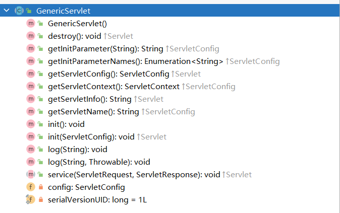

##### Servlet

* 在idea中创建servlet
  * 集成开发工具很多，其中目前使用比较多的是:
    * Intellil IDEA (这个居多，IDEA在提示功能方面要强于Eclipse，也就是说IDEA使用起来比Eclipse更加智能，更好用。JetBrain公司开发的。收费的。)
    * Eclipse (这个少一些)，Eclipse目前还是有团队使用，只不过处于减少的趋势，自己从事工作之后，可能会遇到。Eclipse是IBM团队开发的。Eclipse寓意是日食"。"日食"表示将太阳吃掉。太阳是SUN。IBM团队开发Eclipse的寓意是吞并SUN公司，但是2009年的时候SUN公司被Oracle公司并购了。IBM并没有成功并购SUN公司。
  * 使用IDEA集成开发工具开发Servlet
    * 第一步:New Project(我比较习惯先创建一个Empty Project【空工程】，然后在空工程下新建Module【模块】，这不是必须的，只是一种习惯，你可以直接新建非空的Project)，这个Empty Project起名为: javaweb(不是必须的，只是一个名字而已。一般情况下新建的Project的名字最好和目录的名字—致。)
    * 第二步:新建模块(File --> new --> Module....)这里新建的是一个普通的JavaSE模块(这里先不要新建Java Enterprise模块)这个Module自动会被放在javaweb的project下面。这个Module起名: servlet01
    * 第三步:让Module变成JavaEE的模块。(让Module变成webapp的模块。符合webapp规范。符合Servlet规范的Module)在Module上点击右键:Add Framework Support...(添加框架支持)在弹出的窗口中，选择Web Application(选择的是webapp的支持)选择了这个webapp的支持之后，IDEA会自动给你生成一个符合Servlet规范的webpp目录结构。
      **重点，需要注意的:在IDEA工具中根据Web Application模板生成的目录中有一个web目录，这个目录就代表webapp的根**


* servlet对象的生命周期

  * servlet是由web服务器，又称为web容器（如Tomcat）创建与管理，与java开发无关

  * **自己创建的servlet与web服务器无关。WEB容器创建的Servlet对象。这些Servlet对象都会被放到一个集合当中(HashMap)，只有放到这个HashMap集合中的Servlet才能够被WEB容器管理，自己new的Servlet对象不会被WEB容器管理。(自己new的Servet对象不在容器当中)，key是请求路径,value是servlet对象。**

  * 研究：服务器在启动时servlet对象有没有被创建出来

    * 默认情况没有，可以写一个无参数构造方法，看看启动tomcat时构造方法有没有被调用

    * 此时web服务器在扫描web.xml，把路径名与类路径封装成map

    * 如果想在启动时被加载，在web.xml中加load-on-start标签，数字代表创建优先级。当为正整数是，表示加载，且数字越小代表优先级越高；若为负数，则容器启动时不加载，只有该servlet被选中才加载

      ```java
          <servlet>
              <servlet-name>studentServlet</servlet-name>
              <servlet-class>wang.zi.servlet.StudentServlet</servlet-class>
              <load-on-startup>0</load-on-startup>
          </servlet>
      ```

  * 用户第一次发出请求时，控制台输出了一下内容

    ```java
    构造方法
    init方法
    service方法
    ```

    * 说明按照顺序调用了无参构造，init构造（说明在调用Init时init已经被创建出来了），service方法

  * 再发一次请求，输出了

    ```java
    service方法
    ```

    * 说明了是单例模式，并且init方法只执行一次，只调用了service。但是servlet并不符合单例模式，称为假单例模式，**真单例模式是构造参数私有化。每发送一次请求，都会调用一次service方法****

  * 关闭服务器是，输出了

    ```java
    destory方法
    ```

    * 说明在tomcat关闭时，把对象销毁，destory执行后对象被销毁，它是用来做销毁前的准备

  * 如果没有无参的构造方法，会报500错误（服务器内部错误）

  * 思考: Servlet的无参数构造方法是在对象第一次创建的时候执行，并且只执行一次。init方法也是在对象第一次创建的时候执行，并且只执行—次。那么这个无参数构造方法可以代替掉init方法吗?

    * **不能。Servlet规范中有要求，作为javaweb程序员，编写Servlet类的时候，不建议手动编写构造方法，因为编写构造方法，很容易让无参数构造方法消失，这个操作可能会导致Servlet对象无法实例化。所以init方法是有存在的必要的。**

  * 我们编写一个Servlet类直接实现Servlet接口有什么缺点?我们只需要service方法，其他方法大部分情况下是不需要使用的。代码很丑陋。

    * 解决：采用适配器设计模式，通过一个适配器（抽象类）实现接口所有方法，然后其它类继承这个适配器，重写自己想要的方法即可要实现某个方法，如果强制就把这个方法在适配器里写成抽象方法。

    * 编写一个GenericSerlet类，这个类是一个抽象类，其中有一个抽象方法service。-GenericServlet实现Servlet接口。-GenericEervlet是一个适配器。以后编写的所有Servlet类继承GenericServlet，重写service方法即可。

      ```java
      public interface Servlet {
          void init(ServletConfig config) throws ServletException;
          ServletConfig getServletConfig();
          void service(ServletRequest req, ServletResponse res) throws ServletException, IOException;
          String getServletInfo();
          void destroy();
      }
      ```
      
      
      
      ```java
      public abstract class TestServlet implements Servlet {
         
          public TestServlet() {
              System.out.println("构造方法");
          }
      
          @Override
          public void init(ServletConfig servletConfig) throws ServletException {
              //org.apache.catalina.core.StandardWrapperFacade@81e2c68
              System.out.println(servletConfig);
              System.out.println("init方法");
          }
      
          @Override
          public ServletConfig getServletConfig() {
              return null;
          }
      
          @Override
          public abstract void service(ServletRequest servletRequest, ServletResponse servletResponse);

          @Override
          public String getServletInfo() {
              return null;
          }
      
          @Override
          public void destroy() {
              System.out.println("destory方法");
          }
      }
      ```
      
      

  * 思考GenericServlet再优化

    * 思考第一个问题:我提供了一个GenericServlet之后，init方法还会执行吗?
      
      * 还会执行。会执行GenericServlet类中的init方法。
    * 思考第二个问题:init方法是谁调用的?
      
      * Tomcat服务器调用的。
    * 思考第三个问题: init方法中的ServletConfig对象是谁创建的?是谁传过来的?
      
      * 都是Tomcat干的。 Tomcat服务器先创建了ServletConfig对象，然后调用init方法，将ServletConfig对象传给了init方法。
      
    * 打开tomcat的org.apache.catalina.core.StandardWrapperFacade

      ```java
       public void init(ServletConfig servletConfig) throws ServletException {
              //org.apache.catalina.core.StandardWrapperFacade@81e2c68
              System.out.println(servletConfig);
              System.out.println("init方法");
          }
      ```

      

    * 它实现了ServletConfig接口，所以是父类型的引用ServletConfig servletConfig指向了子类的实现。 [ServletConfig](ServletConfig.html) 接口是servlet规范，说明了tomcst实现了servlet规范

    * servletConfig的实现目前只在init方法里定义，不能在其它方法使用，所以应该定义一个成员变量，使其在全局都可以使用。

      ```java
      package wang.zi.servlet;
      
      import javax.servlet.*;
      import java.io.IOException;
      
      /**
       * ClassName:TestServlet
       * Package:
       * Description:
       *
       * @Aurhor 王子杰
       * @Create 2023/10/15 8:37
       * @Version 1.0
       */
      public abstract class TestServlet implements Servlet {
          private ServletConfig servletConfig;
          public TestServlet() {
              System.out.println("构造方法");
          }
      
          @Override
          public void init(ServletConfig servletConfig) throws ServletException {
              //org.apache.catalina.core.StandardWrapperFacade@81e2c68
              this.servletConfig=servletConfig;
              System.out.println(servletConfig);
              System.out.println("init方法");
          }
      
          @Override
          public ServletConfig getServletConfig() {
              return servletConfig;
          }
      
          @Override
          public abstract void service(ServletRequest servletRequest, ServletResponse servletResponse);
      
          @Override
          public String getServletInfo() {
              return null;
          }
      
          @Override
          public void destroy() {
              System.out.println("destory方法");
          }
      }
      
      ```

      

  * 新问题，**目前的全局是因为在init方法里初始化，但是如果子类重写了怎么办。通过重载实现两个init方法，让其中一个不能修改，另外一个留给子类重写。这种设计模式叫模板方法。****

    ```java
    package wang.zi.servlet;
    import javax.servlet.*;
    import java.io.IOException;
    /**
     * ClassName:TestServlet
     * Package:
     * Description:
     *
     * @Aurhor 王子杰
     * @Create 2023/10/15 8:37
     * @Version 1.0
     */
    public abstract class TestServlet implements Servlet {
        private ServletConfig servletConfig;
        public TestServlet() {
            System.out.println("构造方法");
        }
        @Override
        public final void init(ServletConfig servletConfig) throws ServletException {
            //org.apache.catalina.core.StandardWrapperFacade@81e2c68
            this.init();
            this.servletConfig=servletConfig;
            System.out.println(servletConfig);
            this.init();
            System.out.println("init方法");
        }
        public  void init(){
            System.out.println("test_init");
        }
    
        @Override
        public ServletConfig getServletConfig() {
            return servletConfig;
        }
    
        @Override
        public abstract void service(ServletRequest servletRequest, ServletResponse servletResponse);
    
        @Override
        public String getServletInfo() {
            return null;
        }
    
        @Override
        public void destroy() {
            System.out.println("destory方法");
        }
    }
    
    ```

  

* ServletConfig对象是什么，谁实现了这个接口

  * jakarta.servlet.ServletConfig，它是ServletConfig的一员。

  *  org.apache.catalina.core.StandardWrapperFacade 实现了这个接口，即tomcat实现了这个接口

    ```java
    public class GenricServletTest extends GenericServlet {
        @Override
        public void service(ServletRequest req, ServletResponse res) throws ServletException, IOException {
            res.setContentType("text/html");
            PrintWriter writer = res.getWriter();
            ServletConfig servletConfig=this.getServletConfig();
            //org.apache.catalina.core.StandardWrapperFacade@6afd19c6
            writer.println("aa"+servletConfig);
        }
    }
    ```

    

* ServletConfig对象只能是一个吗，在GenricServletTest基础上再建一个

  * ** 两个输出不一样 org.apache.catalina.core.StandardWrapperFacade@6afd19c6 

     org.apache.catalina.core.StandardWrapperFacade@678684fd ，**显然地址不同。**

  * ==所以Servlet和ServletConfig对象是一对一的，ServletConfig对象是由tomcat，即web服务器创建的，在servlet对象创建的时候同时创建了servletconfig对象==

    ```java
    public class GenricServletTest2 extends GenericServlet {
        @Override
        public void service(ServletRequest req, ServletResponse res) throws ServletException, IOException {
            res.setContentType("text/html");
            PrintWriter writer = res.getWriter();
            ServletConfig servletConfig=this.getServletConfig();
            //org.apache.catalina.core.StandardWrapperFacade@6afd19c6
            writer.println("aa"+servletConfig);
        }
    }
    ```

    

* ServletConfig对象到底是干啥的

  * **ServletConfig对象是Servlet配置信息对象****

* ServletConfig对象包含的信息是什么

  * **web.xml中<servlet>标签的内容**

    ```java
    <?xml version="1.0" encoding="UTF-8"?>
    <web-app xmlns="http://xmlns.jcp.org/xml/ns/javaee"
             xmlns:xsi="http://www.w3.org/2001/XMLSchema-instance"
             xsi:schemaLocation="http://xmlns.jcp.org/xml/ns/javaee http://xmlns.jcp.org/xml/ns/javaee/web-app_4_0.xsd"
             version="4.0">
        <servlet>
            <servlet-name>genertictest</servlet-name>
            <servlet-class>wang.zi.jie.GenricServletTest</servlet-class>
            <init-param>
                <param-name>aa</param-name>
                <param-value>bb</param-value>
            </init-param>
            <init-param>
                <param-name>wamg</param-name>
                <param-value>zijie</param-value>
            </init-param>
        </servlet>
        <servlet-mapping>
            <servlet-name>genertictest</servlet-name>
            <url-pattern>/getest</url-pattern>
        </servlet-mapping>
        <servlet>
            <servlet-name>genertictest2</servlet-name>
            <servlet-class>wang.zi.jie.GenricServletTest2</servlet-class>
        </servlet>
        <servlet-mapping>
            <servlet-name>genertictest2</servlet-name>
            <url-pattern>/getest2</url-pattern>
        </servlet-mapping>
    </web-app>
    ```

* ServletConfig对象总共有4个这方法。

  * String getServletName();ServletContext getServletContext();String getInitParameter(String name);Enumeration<String> getInitParameterNames();

    ```java
    public class GenricServletTest extends GenericServlet {
        @Override
        public void service(ServletRequest req, ServletResponse res) throws ServletException, IOException {
            res.setContentType("text/html");
            PrintWriter writer = res.getWriter();
            ServletConfig servletConfig=this.getServletConfig();
            //org.apache.catalina.core.StandardWrapperFacade@6afd19c6
            writer.println("aa"+servletConfig);
            writer.println("<br>");
            writer.println(servletConfig.getServletName());
            writer.println("<br>");
            writer.println(servletConfig.getInitParameter("aa"));
            writer.println("<br>");
            writer.println(servletConfig.getInitParameterNames());
            //获取param-name
            Enumeration<String> stringEnumeration=servletConfig.getInitParameterNames();
            while (stringEnumeration.hasMoreElements()){
                String p=stringEnumeration.nextElement();
                writer.println(p);
                writer.println("<br>");
            }
        }
    }
    ```

    ```xml
    <?xml version="1.0" encoding="UTF-8"?>
    <web-app xmlns="http://xmlns.jcp.org/xml/ns/javaee"
             xmlns:xsi="http://www.w3.org/2001/XMLSchema-instance"
             xsi:schemaLocation="http://xmlns.jcp.org/xml/ns/javaee http://xmlns.jcp.org/xml/ns/javaee/web-app_4_0.xsd"
             version="4.0">
        <servlet>
            <servlet-name>genertictest</servlet-name>
            <servlet-class>wang.zi.jie.GenricServletTest</servlet-class>
            <init-param>
                <param-name>aa</param-name>
                <param-value>bb</param-value>
            </init-param>
            <init-param>
                <param-name>wamg</param-name>
                <param-value>zijie</param-value>
            </init-param>
        </servlet>
        <servlet-mapping>
            <servlet-name>genertictest</servlet-name>
            <url-pattern>/getest</url-pattern>
        </servlet-mapping>
        <servlet>
            <servlet-name>genertictest2</servlet-name>
            <servlet-class>wang.zi.jie.GenricServletTest2</servlet-class>
        </servlet>
        <servlet-mapping>
            <servlet-name>genertictest2</servlet-name>
            <url-pattern>/getest2</url-pattern>
        </servlet-mapping>
    </web-app>
    ```

    ```java
    结果
        aaorg.apache.catalina.core.StandardWrapperFacade@16877a87
    genertictest
    bb
    java.util.Collections$3@60074d11 aa
    wamg
    ```

    ```java
    package javax.servlet;
    import java.util.Enumeration;
    public interface ServletConfig {
        String getServletName();
        ServletContext getServletContext();
        String getInitParameter(String name);
        Enumeration<String> getInitParameterNames();
    }
    
    ```
    
    

* **public abstract class** GenericServlet **implements** Servlet, ServletConfig， java.io.Serializable。所以GenericServlet继承了ServletConfig，并且实现了方法。所以我们用不到实现，已经有人帮我们实现了

  

  ```java
  public class GenricServletTest extends GenericServlet {
      @Override
      public void service(ServletRequest req, ServletResponse res) throws ServletException, IOException {
          res.setContentType("text/html");
          PrintWriter writer = res.getWriter();
          Enumeration<String> stringEnumeration=this.getInitParameterNames();
          while (stringEnumeration.hasMoreElements()){
              String p=stringEnumeration.nextElement();
              writer.println(p);
              writer.println("<br>");
          }
      }
  }
  ```


##### ServletContext

* 获取方式，通过GenericServlet对象的this，也可以通过ServletConfig对象的getServletContext()

  ```java
  public class GenricServletTest2 extends GenericServlet {
      @Override
      public void service(ServletRequest req, ServletResponse res) throws ServletException, IOException {
          res.setContentType("text/html");
          PrintWriter writer = res.getWriter();
          ServletConfig servletConfig=this.getServletConfig();
          ServletContext servletContext=servletConfig.getServletContext();
          writer.println(servletContext);
      }
  }
  org.apache.catalina.core.ApplicationContextFacade@a0b2ea0
  ```

  ```java
  public class GenricServletTest extends GenericServlet {
      @Override
      public void service(ServletRequest req, ServletResponse res) throws ServletException, IOException {
          res.setContentType("text/html");
          PrintWriter writer = res.getWriter();
          ServletContext servletContext=this.getServletContext();
          writer.println(servletContext);
      }
  }
  org.apache.catalina.core.ApplicationContextFacade@a0b2ea0
  ```

  * 获取到的是同一个对象

* **ServletContext是一个接口，由tomcat web服务器实现的，由ApplicationContextFacade实现的。对于webapp来说只有一个ServletContext对象，服务启动的时候造出来，服务器关闭时销毁。他可以读取整个web.xml文件**

  * tomcat是一个容器，可以有好几个webapp，一个webapp对应一个ServletContext对象。所以ServletContext为应用级对象

* ServletContext常见的方法

  ```java
  java.util.Enumeration<java.lang.String>	getInitParameterNames()
  java.lang.String getInitParameter​(java.lang.String name)
  java.lang.String	getContextPath()//获取根目录
  java.lang.String	getRealPath​(java.lang.String path)//回去文件真实路径
  void	log​(java.lang.String msg)//记日志,存储到CATALINA/log目录下
  void	log​(java.lang.String message, java.lang.Throwable throwable)
  void	setAttribute​(java.lang.String name, java.lang.Object object)//存数据
  void	removeAttribute​(java.lang.String name)//移除数据
  java.lang.Object	getAttribute​(java.lang.String name)//取数据
  ```

  ```java
  public class GenricServletTest2 extends GenericServlet {
      @Override
      public void service(ServletRequest req, ServletResponse res) throws ServletException, IOException {
          res.setContentType("text/html");
          PrintWriter writer = res.getWriter();
          ServletConfig servletConfig=this.getServletConfig();
          ServletContext servletContext=servletConfig.getServletContext();
          Enumeration<String> initParameterNames = servletContext.getInitParameterNames();
          while (initParameterNames.hasMoreElements()){
              String name=initParameterNames.nextElement();
              String value=servletContext.getInitParameter(name);
              writer.println(name+": "+value);
              writer.println("<br>");
          }
      }
  }
  ```
  
```xml-dtd
  <?xml version="1.0" encoding="UTF-8"?>
  <web-app xmlns="http://xmlns.jcp.org/xml/ns/javaee"
           xmlns:xsi="http://www.w3.org/2001/XMLSchema-instance"
           xsi:schemaLocation="http://xmlns.jcp.org/xml/ns/javaee http://xmlns.jcp.org/xml/ns/javaee/web-app_4_0.xsd"
           version="4.0">
      <servlet>
          <servlet-name>genertictest</servlet-name>
          <servlet-class>wang.zi.jie.GenricServletTest</servlet-class>
          <init-param>
              <param-name>aa</param-name>
              <param-value>bb</param-value>
          </init-param>
          <init-param>
              <param-name>wamg</param-name>
              <param-value>zijie</param-value>
          </init-param>
      </servlet>
      <servlet-mapping>
          <servlet-name>genertictest</servlet-name>
          <url-pattern>/getest</url-pattern>
      </servlet-mapping>
      <servlet>
          <servlet-name>genertictest2</servlet-name>
          <servlet-class>wang.zi.jie.GenricServletTest2</servlet-class>
      </servlet>
      <servlet-mapping>
          <servlet-name>genertictest2</servlet-name>
          <url-pattern>/getest2</url-pattern>
      </servlet-mapping>
      <context-param>
          <param-name>aaa</param-name>
          <param-value>ssss</param-value>
      </context-param>
      <context-param>
          <param-name>context</param-name>
          <param-value>contextvalue</param-value>
      </context-param>
  </web-app>
  ```
  
* 能够获取<context-param>这种全局配置文件信息
  
* 默认记录日志文件的是在tomcat的log文件中，但是现在是在idea中创建的，因为idea可以有好多个tomcat，因此idea会安排创建自己的log文件目录，在运行时的CATALINA_BASE输出就是那个目录
  
  ```java
    public class GenricServletTest extends GenericServlet {
        @Override
        public void service(ServletRequest req, ServletResponse res) throws ServletException, IOException {
            res.setContentType("text/html");
            PrintWriter writer = res.getWriter();
            ServletContext servletContext=this.getServletContext();
            //获取文件的绝对路径，加不加/都行，默认起点从web目录开始，斜杠代表从跟开始
    //        writer.println(servletContext.getRealPath("index.html"));
            writer.println(servletContext.getRealPath("/index.html"));
            writer.println("<br>");
            //获取根目录路径
            writer.println(servletContext.getContextPath());
            //日志，存储到CATALINA/log目录下
            //自定义输出日志localhost.2023-10-20.log
            //localhost_access_log.2023-10-15.txt控制台日志
            servletContext.log("日志");
            int age=17;
            while (age<18){
                servletContext.log("未成年",new RuntimeException("小屁孩"));
            }
        }
    }
    ```
  
  
  
  
  
* servletcontext对象还有另一个名字:应用域《后面还有其他域,例如:请求域、会话域)

  * 如果所有的用户共享一份数据，并且这个数据很少的被修改，并且这个数据量很少，可以将这些数据放到ServletContext

  * 这个应用域中为什么是所有用户共享的数据?为什么数据量要小?为什么这些共享数据很少的修改,或者说几乎不修改?

  * 答：不是共享的没有意义，数据量比较大的太占用堆内存，影响服务器的性能

    ```java
    public class GenricServletTest extends GenericServlet {
        @Override
        public void service(ServletRequest req, ServletResponse res) throws ServletException, IOException {
            res.setContentType("text/html");
            PrintWriter writer = res.getWriter();
            ServletContext servletContext=this.getServletContext();
            User user=new User("wang",22);
            servletContext.setAttribute("key","value");
            servletContext.setAttribute("user",user);
    
            Object key = servletContext.getAttribute("key");
            writer.println(key);//value
        }
    }
    ```

    ```java
    public class GenricServletTest2 extends GenericServlet {
        @Override
        public void service(ServletRequest req, ServletResponse res) throws ServletException, IOException {
            res.setContentType("text/html");
            PrintWriter writer = res.getWriter();
            ServletConfig servletConfig=this.getServletConfig();
            ServletContext servletContext=servletConfig.getServletContext();
            Object user = servletContext.getAttribute("user");
            writer.println(user);//User{name='wang', age=22}
    
        }
    }
    ```

    


* 以后我们用于开发的也不是直接继承GenericServlet，而是有一个专门用于Http开发的HttpServlet，这是Servlet规范中专门指定的，处理http协议更方便，但是HttpServlet继承了GenericServlet

  ```java
  jakarta.servlet.Servlet(接口)【管爷】
  jakarta.servlet.GenericServlet implements Servlet《抽象类)【儿子】
  jakarta.servlet.http.HttpServlet extends GenericServlet《抽象类》【孙子】
  
  ```

  

* HttpServlet也采用了模板设计方法，两个service方法，一个GenericServlet的，一个自己的

  ```JAVA
  protected void service(HttpServletRequest req, HttpServletResponse resp) throws ServletException, IOException {
          String method = req.getMethod();
          if (method.equals(METHOD_GET)) {
              long lastModified = getLastModified(req);
              if (lastModified == -1) {
                  // servlet doesn't support if-modified-since, no reason
                  // to go through further expensive logic
                  doGet(req, resp);
              } else {
                  long ifModifiedSince;
                  try {
                      ifModifiedSince = req.getDateHeader(HEADER_IFMODSINCE);
                  } catch (IllegalArgumentException iae) {
                      // Invalid date header - proceed as if none was set
                      ifModifiedSince = -1;
                  }
                  if (ifModifiedSince < (lastModified / 1000 * 1000)) {
                      // If the servlet mod time is later, call doGet()
                      // Round down to the nearest second for a proper compare
                      // A ifModifiedSince of -1 will always be less
                      maybeSetLastModified(resp, lastModified);
                      doGet(req, resp);
                  } else {
                      resp.setStatus(HttpServletResponse.SC_NOT_MODIFIED);
                  }
              }
  
          } else if (method.equals(METHOD_HEAD)) {
              long lastModified = getLastModified(req);
              maybeSetLastModified(resp, lastModified);
              doHead(req, resp);
  
          } else if (method.equals(METHOD_POST)) {
              doPost(req, resp);
  
          } else if (method.equals(METHOD_PUT)) {
              doPut(req, resp);
  
          } else if (method.equals(METHOD_DELETE)) {
              doDelete(req, resp);
  
          } else if (method.equals(METHOD_OPTIONS)) {
              doOptions(req, resp);
  
          } else if (method.equals(METHOD_TRACE)) {
              doTrace(req, resp);
  
          } else {
              //
              // Note that this means NO servlet supports whatever
              // method was requested, anywhere on this server.
              //
  
              String errMsg = lStrings.getString("http.method_not_implemented");
              Object[] errArgs = new Object[1];
              errArgs[0] = method;
              errMsg = MessageFormat.format(errMsg, errArgs);
  
              resp.sendError(HttpServletResponse.SC_NOT_IMPLEMENTED, errMsg);
          }
      }
  ```
  
  ```JAVA
    @Override
      public void service(ServletRequest req, ServletResponse res) throws ServletException, IOException {
  
          HttpServletRequest request;
          HttpServletResponse response;
  
          try {
              request = (HttpServletRequest) req;
              response = (HttpServletResponse) res;
          } catch (ClassCastException e) {
              throw new ServletException(lStrings.getString("http.non_http"));
          }
          service(request, response);
      }
  ```
  
  * 重写的这个service调用了自己的另一个service方法

