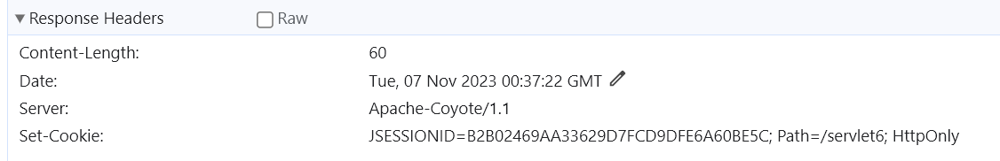
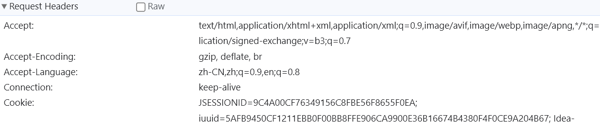
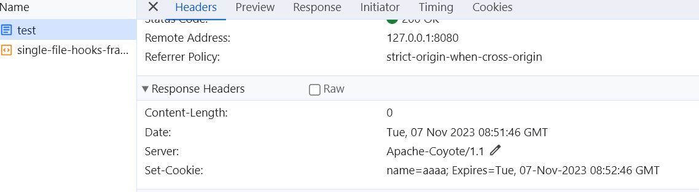

#### Session

* 什么是会话：用户打开浏览器进行操作，最终关闭浏览器，叫一次会话

* 在java的servlet规范当中，session对应的类名：HttpSession(jarkata.Servlet.Http.HttpSession)

* session机制属于B/S架构的一部分，不同语言都会实现该功能

* session对象的主要机制：保存会话状态。（用户登录成功了，这是一种成功的状态，你怎么把登陆成功的状态一直保持），使用session保存，因为http是一种一次连接的状态

* request请求域.(HittpServletRequest) . session会话域(HttpSession) . application域(ServletContext)request < session<appplication

* session是由服务器创建，并且存储在服务器端的，一个session对应一次会话，一个会话中包含多个请求。那session怎么销毁呢？session有一个超时机制，就是多长时间没有请求访问就自动销毁

* session主要是针对http的无状态协议制作的，所以使用session机制

* 在服务器中有个session列表，也就是map集合,key是session的id ，value是session对象,如果没有找到，**服务器就谁创建这个对象，并把这个id发给浏览器，浏览器会保存id到缓存中，以后浏览器请求就把这个id发送到服务器，这样每次都能在服务器中找到自己的session对象**

* ==如果关闭浏览器，再打开一个新的浏览器，就会把缓存删掉，就找不到这个id，找不到对应的session，等同于session没了，所以会新建一个session。但是有可能之前的session还活着。==

* 有的网页有安全退出，比如银行网银，如果用这个按钮就会手动销毁session。

* 可以在web.xml中配置session超时时间，<**session-config**>
      <**session-timeout**>30</**session-timeout**>
  </**session-config**>。30代表30分钟

* **这个id在浏览器是以cookie的形式保存，第一次请求时会响应一个cookie,以后就会把sessio的id放到请求里，JSSEIONID，浏览器只要一关闭就没有了。**

  

  


* session的创建方式
  * Httpsession session = request.getSession(;从服务器中获取对应的session对象。
    如果没有获取到任何session对象，则新建。
    HttpSession session = request.getSession(false);从服务器中获取当前session对象，如果获取不到session，则返回一个null

* cookie禁用了，还能找的到吗
  * **cookie禁用是什么意思?服务器正常发送cookie给浏览器，但是浏览器不要了。拒收了。并不是服务器不发了。找不到了。每一次请求都会获取到新的session对象。**
* cookie禁用，session机制还能实现吗
  * 能，通过URL重写http://localhost:8080/servlet6/test;JSESSIONID=FA509B542A9897487B6C57FBF32EC7F2
  * URL重写机制会提高开发者的成本。开发人员在编写任何请求路径的时候，后面都要添加一个sessionid，给开发带来了很大的难度，很大的成本。所以大部分的网站都是这样设计的:你要是禁用cookie，你就别用了。
* 总结一下到目前位置我们所了解的域对象:
  *  request(对应的类名:HttpServletRequest)
    * 请求域
  *  session (对应的类名:HttpSession)
    * 会话域
  * application (对应的类名: ServletContext)
    * 应用域
  *  这三个域对象的大小关系
    * request < session < application
  * 他们三个域对象都有以下三个公共的方法:
    * setAttribute()
    * getAttribute()
    * removeAttribute()
  * 使用原则：尽量使用小的
* 如果访问JSP，由于Session是JSP的九大内置对象，会自动创建一个Session，可以在界面中增加一条指令。<%@ **page** **session**="**false**" %>就不会创建session对象
* 安全退出就是销毁session对象，session.invalidate();


##### Cookie

* 对于session关联的cookie来说，这个cookie是被保存在浏览器的运行内存"当中。只要浏览器不关闭，用户再次发送请求的时候。会自动将运行内存中的cookie发送给服务器。

* cookie是怎么生成，作用？保存到什么地方，什么时候发送cookie？

  * **cookie把保存在客户端上，可以是运行内存，也可以是硬盘文件里。**
  * cookie和session都是为了保存会话状态，cookie是保存在客户端上，session是保存在服务器端上
  * 为什么要有？因为htttp是无状态，无连接的协议

* cookie机制和session机制其实都不属于java中的机制，实际上cookie机制和session机制都是HTTP协议的一部分。php开发中也有cookie和session机制，只要是你是做web开发，不管是什么编程语言，cookie和session机制都是需要的。

* HTTP协议中规定:任何一个cookie都是由name和value组成的。name和value都是字符串类型的。在HTTP协议中是这样规定的:当浏览器发送请求的时候，会自动携带该path下的cookie数据给服务器。

* 在java中提供了一个类jakarta.servlet.http.Cookie

  ```java
          //创建cookie对象
          Cookie cookie = new Cookie("name", "aaaa");
          //设置生效时间，以秒为单位
          cookie.setMaxAge(60);
          //发送给浏览器
          response.addCookie(cookie);
          out.println(session);
  ```

  

  * 如果没有设置有效时间，默认保存在浏览器的内存空间，但只要设置了有效时间大于0，就会存到硬盘当中，设置有效时间为0，删除该cookie，主要用于删除同名cookie，小于0表明不存储（即在浏览器缓存中，不在硬盘中，和不设置这个一样的效果）
  * 如果没有设置cookie的路径，默认的携带路径是请求路径的上一级。如果请求是http://localhost:8080/servlet6/test，则servlet6这个路径及路径下的子路径都会被携带cookie。如果自己设置路径，cookie.setPath(**"./test"**);则表示test这个路径及路径下的子路径都会被携带cookie。
  
* 获取浏览器的cookie

  ```java\
  @WebServlet("/test")
  public class SessionServlet extends HttpServlet {
      @Override
      protected void doGet(HttpServletRequest request, HttpServletResponse response) throws ServletException, IOException {
          PrintWriter out = response.getWriter();
          HttpSession session = request.getSession();
          //创建cookie对象
          Cookie cookie = new Cookie("name", "aaaa");
          Cookie cookie2 = new Cookie("name2", "aaaa2");
  
          //设置生效时间，以秒为单位
          cookie.setMaxAge(60);
          cookie.setPath("./test");
          //发送给浏览器
          response.addCookie(cookie);
          response.addCookie(cookie2);
  
      }
  }
  @WebServlet("/test2")
  public class TestServlet extends HttpServlet {
      @Override
      protected void doGet(HttpServletRequest request, HttpServletResponse response) throws ServletException, IOException {
          Cookie[] cookies = request.getCookies();//注意细节，如果浏览器没传cookie，这个方法返回值是null，而不是一个空数组
          if (cookies!=null){
              for (Cookie cookie : cookies) {
                  String name = cookie.getName();
                  String value = cookie.getValue();
                  System.out.println(cookie);
              }
          }
      }
  }
  ```

  /