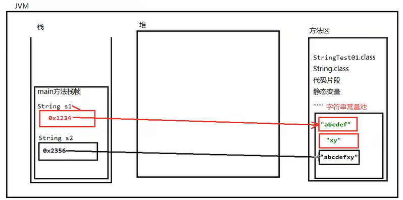
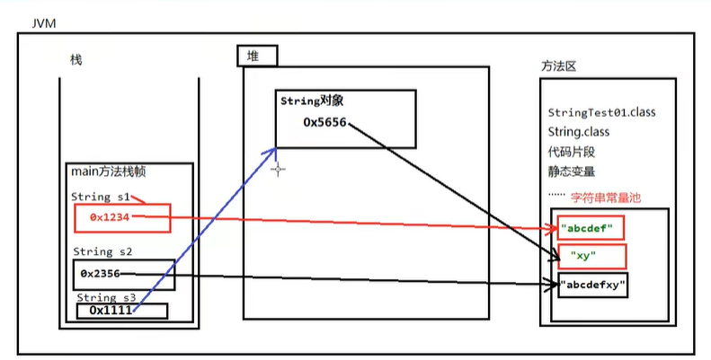
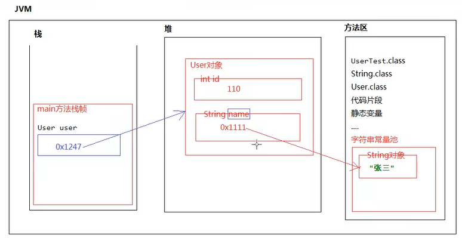
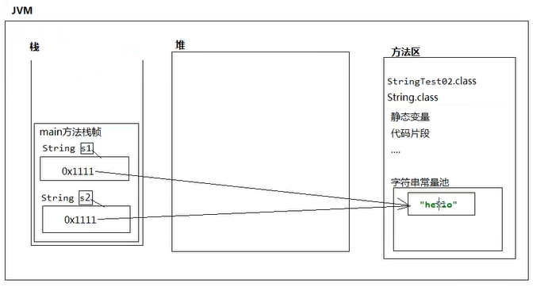

#### String

* String类的声明

  * public final class String

      implements java.io.Serializable, Comparable<String>, CharSequence

  * 所以是不能继承的，因为有final

  * **String是引用数据类型，不能强转为基础数据类型**

  * **垃圾回收期不回收常量池**

  * String重写了toString方法

  * ==字符串只能与基础数据类型做+运算==，返回的是String类型
  
  * **双引号引起来的都是字符串对象，并且都是不可变，即从出生到死亡不能改变，都是直接存储在方法区的字符串的常量池当中**，因为字符串使用太频繁，所以存储在常量池，“abc”不能更改为“ab”。new是在堆里面开辟内存对象。垃圾回收器是不会释放常量的
  
  * 继承了Serializable，可以序列化的接口，凡是实现接口的类的对象就可以通过网络或者本地进行数据的传输
  
  * 继承Comparable：凡是实现这个类的都可以比较大小
  
  * String s1=“abcdef”;String s2=“abcdef”+“xy”;
  
      * String s2=“abcdef”+“xy”;这个创建了三个常量池对象
  
      
  
      * s1保存的不是字符串，保存的是字符串的地址
  
  * **String s3=new String(“xy”);和上一种有区别**
  
    
    
  * User类
  
      
  
  * ​    String s1 = "aa";
  
    ​    String s2 = "aa";
    
    ​    System.out.println(s1 == s2);//true
    
  * ​    String s3=new String("aa");
  
      ​    String s4=new String("aa");
  
      ​    System.out.println(s3==s4);//false，而且创建了三个对象，一个字符串常量池对象，两个new对象。**所以字符串对象的比较不能通过==进行比较，要通过equal方法**
  
      * String s3="aa";
  
           String s4="aa";System.out.println(s3==s4);//true
  
        
  
  * **System.out.println("aa".equals("aa"));这句话之所以可以就是因为aa是一个String对象，只要是对象，都能调用方法****
  
  * 内部声明的属性
  
    * private final char value[]//真正存储数据库的容器，本质。
    
    * final代表是常量，修改相当于改变地址
    
    * jdk9就变成private final byte value[]
    
    * ==可以用来判断地址（这个所谓的地址就是引用地址的内容，即对象保存的地址）是否相同，equal判断内容
    
      ```java
      //Object源码，String给它重写了   
      public boolean equals(Object obj) {
              return (this == obj);
          }
      ```
    
      
    
    * 字符串常量都存放在字符串常量池(StringTable)中
    
  * 字符串常量池不允许存放两个相同的字符串常量
    * 字符串常量池，在不同的jdk版本中，存放位置不同
    *  **jdk7以前，存放在方法区，jdk7之后存放在堆中**
  
  
  

```java
package Common;

import org.junit.Test;
public class test1 {
    @Test
    public void test(){
        String s1 = "hello";// 字面量的定义方式
        String s2 = "hello";
        System.out.println(s1 == s2);
        // ==可以用来判断地址是否相同
        // 字符串常量都存放在字符串常量池(StringTable)中
        // 字符串常量池不允许存放两个相同的字符串常量
        // 字符串常量池，在不同的jdk版本中，存放位置不同
        // jdk7以前，存放在方法区，jdk7之后存放在堆中
    }
    @Test
    public void test2(){
        String s1 = "hello";
        String s2 = "hello";
        s2="h1";
        System.out.println(s1);
    }
    @Test
    public void test3(){
        String s1 = "hello";
        String s2 = "hello";
        s2+="h1";//相加的要放到堆里
        System.out.println(s2);
    }
}

true
hello
helloh1

    //对于test3，源码是调用StringBuild
     public StringBuilder() {
        super(16);
    }
```

* 更改一次相当于重新开辟一个空间，相同的字符共用一个空间

* String的不可变性
  * **当对字符串变量重新赋值时，需要重新指定一个字符串常量的位置进行赋值，不能在原有的位置修改****
  
  * ==当对现有的字符串进行拼接操作时，需要重新开辟空间保存拼接以后的字符串，不能在原有的位置修改==

  * 当调用字符串的replace()替换现有的某个字符时，需要重新开辟空间保存修改后的字符串
  
    ```java
    //源码返回的是new
    public String replace(char oldChar, char newChar) {
            if (oldChar != newChar) {
                int len = value.length;
                int i = -1;
                char[] val = value; /* avoid getfield opcode */
    
                while (++i < len) {
                    if (val[i] == oldChar) {
                        break;
                    }
                }
                if (i < len) {
                    char buf[] = new char[len];
                    for (int j = 0; j < i; j++) {
                        buf[j] = val[j];
                    }
                    while (i < len) {
                        char c = val[i];
                        buf[i] = (c == oldChar) ? newChar : c;
                        i++;
                    }
                    return new String(buf, true);
                }
            }
            return this;
        }
    ```
  
    
  
* String s3=new String("hello");内存解析

  
  * 所以String s3=new String("hello")相当于创建了两个对象，先new一个对象,new的这个地址再在常量池创建一个值，再指向过去。即一个堆空间，另外一个常量池

    ```java
    
    ```

  * 

  * 情况一：常量加常量：结果仍然存储在字符串常量池中

  * **情况二：常量加变量或变量+变量，都会通过new的方式创建一个新的字符串，返回堆空间字符串的地址**

  * 使用intern()返回的是字符串常量池字面量的地址

    ```java
    @Test
        public void tes3t(){
            String s1 = "hello";// 字面量的定义方式
            String s2 = "world";
            String s3="helloworld";
            String s4="hello"+"world";//相当于helloworld
            String s5=s1+"world";//先用stringbuild append "hello"，再append world，最后再tostring,tostring方法的实现就是nwe了一个对象
            String s6="hello"+s2;
            String s7=s1+s2;
            System.out.println(s3==s4);//true
            System.out.println(s3==s5);//false
            System.out.println(s3==s6);//false
            System.out.println(s3==s7);//false
            System.out.println(s5==s6);//false
            System.out.println(s5==s7);//false
           
            String s8=s5.intern();//返回的是字符串常量池字面量的地址
            System.out.println(s3==s5);//true
            
        }
    ```

  * final修饰的字符串都是常量，final修饰的常量+变量/常量 ，结果为常量

    ```java
        @Test
        public void tes3t(){
            final String s1 = "hello";// 字面量的定义方式
            final String s2 = "world";
            String s3="helloworld";
            String s4="hello"+"world";//相当于helloworld
            String s5=s1+"world";//先用stringbuild append "hello"，再append world，最后再tostring,tostring方法的实现就是nwe了一个对象
            String s6="hello"+s2;
            String s7=s1+s2;
            System.out.println(s3==s5);//true
            System.out.println(s3==s6);//true
    
        }
    ```
    

    
  * concat()不管是常量还是变量，调用完以后都返回一个新new的对象

    ```java
        @Test
        public void tes3t(){
            String s1 = "hello";// 字面量的定义方式
            String s2 = "world";
            String s3=s1.concat(s2);
            String s4="hello".concat(s2);//相当于helloworld(这里应该还是new出来的)，返回的是一个对象，而不是变量
            String s5=s1.concat("world");//先用stringbuild append "hello"，再append world，最后再tostring,tostring方法的实现就是nwe了一个对象
    
            System.out.println(s3==s4);//false
            System.out.println(s3==s5);//false
            System.out.println(s4==s5);//false
        }
    
    //分析
       @Test
        public void test(){
            String s1 = "world";
            String s5="hello".concat(s1);
            String s6="hello".concat(s1);
            System.out.println(s6==s5);//false
        }
    //这样是false，就能反推这是new出来的
    ```
    
  * charAt方法和compareTo方法,contain判断是否包含，endsWith判断是否以这个字符串结尾，equals判断是否相等，equalsIgnoreCase忽略大小写，getBytes返回字节数组，indexOf第一次出现出的索引，lastIndexOf最后一次出现后的索引，split()分割，返回字符串数组，startsWith判断以什么开始，substring截取字符串，左闭右开，toCharArray转成char数组，toLowerCase(转成小写，toUpperCase()转大写，trim去除前后空格

    ```java
        public static void main(String[] args) throws ParseException {
     		char c = "ab".charAt(1);
            System.out.println(c);// b取字符
            System.out.println("a".compareTo("b"));// -1,0,1(前大于后)
            System.out.println("aa".contains("a"));// true
            System.out.println("abc".endsWith("c"));// true
            System.out.println("aa".equals("bb"));
            System.out.println("AA".equalsIgnoreCase("aa"));
            System.out.println("aa".getBytes());
            System.out.println("abcabc".indexOf("abc"));
            System.out.println("aa".lastIndexOf("a"));
            System.out.println("Aa".replace(null, null));
            System.out.println("AB-CC-DD".split("-"));
            System.out.println("aa".startsWith("a"));
            System.out.println("abc".substring(1));
            System.out.println("aa".toCharArray());
            System.out.println("AA".toLowerCase());
            System.out.println("aa".toUpperCase());
            System.out.println(" aa ".trim());
        }
    ```

  * empty方法，数组的length是属性，字符串的length是方法

    ```java
    @Test
        public void test(){
            String s1 ="";
            String s2 = new String();
            String s3 = new String("");
            //三个结果都是空，看源码返回的是数组的长度
            System.out.println(s1.isEmpty());//true
            System.out.println(s2.isEmpty());//true
            System.out.println(s3.isEmpty());//true
    
            String s4=null;//底层调用的是字符串的length方法
            //会报空指针异常
            System.out.println(s4.isEmpty());
    
        }
    ```

  * valueof，String唯一一个静态方法，将非字符串转换成字符串

    * **会调用对象的toString方法,对象没有则调用object的**
    
    ```java
    public class test {
    
        public static void main(String[] args) throws ParseException {
            System.out.println(String.valueOf(1));
            System.out.println(String.valueOf(new Custom()));
            /*
             * 源码：
             * public static String valueOf(Object obj) {
             * return (obj == null) ? "null" : obj.toString();
             * }
             */会调用对象的toString方法,对象没有则调用object的
        }
    
    }
    class Custom {
    
    ```

}
    ```
    
    * **print就是调用valueof转成String，先调用valueof，valueof再调用toString方法**
    * System.out.println能够打印在控制台上的都是字符串


* String 构造方法

  * "public String()。初始化新创建的String对象。以使其表示空字符序列。

  * String(String original)'。初始化一个新创建的‘String’对象，使其表示一个与参数相同的字符序列。换句话说，"public string(char[] value)`。通过当前参数中的字符数组来构造新的String.`

  * `'public String(char[] valve,int offset，int count)`。通过字符数组的一部分来构造新的String。

  * 'public String(byte[] bytes)’。通过使用平台的*★默认字符集*★解码当前参数中的字节数组来构造新的String。

  * 'public String(byte[] bytes,String charsetName)’。通过使用指定的字符集解码当前参数中的字节数组来构造新的String

    ```java
    package Common;
    
    import org.junit.Test;
    public class test1 {
        @Test
        public void test(){
            String s1 = new String();
            String s2 = new String("");
            String s3=new String(new char[]{'a','b','c'});
            System.out.println(s3);
    
    
        }
        /*
        *String与常见类型的转换
         */
        @Test
        public void test2(){
            int num=10;
            //方式一
            String s1=num+"";
            //方式2
            String s2=String.valueOf(num);
    
            //String调用包装类
            String s3="123";
            int a=Integer.parseInt(s3);
        }
        //String与char[]转换
        @Test
        public void test3(){
            String str="hello";
            char[] arr=str.toCharArray();
            for (int i = 0; i < arr.length; i++) {
                System.out.println(arr[i]);
            }
            //二
            String str1=new String(arr);
            System.out.println(str1);
        }
        //String与byte[]转换
        //编码：String到01
        public void  test4(){
            String str=new String("hello");
            byte[] bytes=str.getBytes();
            for (int i = 0; i < bytes.length; i++) {
                System.out.println(bytes[i]);
            }
            String str1=new String(bytes);
            System.out.println(str1);
        }
    
    }
    
    
    ```

    

* **参数传递，基本数据型传递数据，引用数据型传递地址**

  ```java
  package Common;
  
  import org.junit.Test;
  public class test1 {
      String str="good";
      char[] ch={'t','e','s','t'};
      public void change(String str,char ch[]){
          str="test ok";
          ch[0]='b';
      }
      public static void main(String[] args) {
      	test1 t=new test1();
      	t.change(t.str, t.ch);
      	System.out.println(t.str);//good
      	System.out.println(t.ch);//best
      }
  }
  ```
  

  

  
* 三个类对比：String、StringBuffer、StringBuilder

  * String:不可变的字符序列（只能重新建一个，不可修改），jdk8之前底层使用char[]，9之后用byte[]

    * 字符串相加会创建一个新的，给方法区负担很大

  * StringBuffer:可变的字符序列（可以在原位置上修改）jdk1.0声明，**线程安全**，效率低（有异步）jdk8之前底层使用char[]，9之后用byte[]
    
    * StringBuffer的byte数组没有final修饰，String的有
    
    * 优化：根据需求设置初始化空间的大小
    
      ```java
      //默认16，他和String的区别是没有final
          public StringBuffer() {
              super(16);
          }
      //看append源码， public final class StringBuffer extends AbstractStringBuilder implements java.io.Serializable, CharSequence
          public synchronized StringBuffer append(String str) {
              toStringCache = null;
              super.append(str);
              return this;
          }
      //追父类的append
          AbstractStringBuilder append(AbstractStringBuilder asb) {
              if (asb == null)
                  return appendNull();
              int len = asb.length();
              ensureCapacityInternal(count + len);
              asb.getChars(0, len, value, count);
              count += len;
              return this;
          }
      //底层用的数组copy
          private void ensureCapacityInternal(int minimumCapacity) {
              // overflow-conscious code
              if (minimumCapacity - value.length > 0) {
                  value = Arrays.copyOf(value,
                          newCapacity(minimumCapacity));
              }
          }
      //Array的copyof
          public static char[] copyOf(char[] original, int newLength) {
              char[] copy = new char[newLength];
              System.arraycopy(original, 0, copy, 0,
                               Math.min(original.length, newLength));
              return copy;
          }
      ```
    
      
    
  * StringBuilder：可变的字符序列（可以在原位置上修改）jdk5.0声明，线程不安全，效率高jdk8之前底层使用char[]，9之后用byte[]

    * **局部变量因为没有线程安全问题，所以建议使用StringBuilder**

* StringBuffer、StringBuilder可变性分析

  * String s1=new String();//char value=new char[0];

  * String s1=new String();//char value=new char[]{‘a’,‘b’,‘c’};

  * StringBuilder内部属性有char[] value;//存储字符序列int count//实际存储字符的个数

    ```java
    //源码的初始化    
    public StringBuilder() {
            super(16);
    }
    public StringBuilder(String str) {
            super(str.length() + 16);
            append(str);
    }
    /*
    所以StringBuilder stringBuilder=new StringBuilder();等价于char[]value=new char[16]
    StringBuilder stringBuilder=new StringBuilder("abc");等价于char[]value=new char[16+"abc".length]
    **/
    //append实现
        private int newCapacity(int minCapacity) {
            // overflow-conscious code
            int newCapacity = (value.length << 1) + 2;
            if (newCapacity - minCapacity < 0) {
                newCapacity = minCapacity;
            }
            return (newCapacity <= 0 || MAX_ARRAY_SIZE - newCapacity < 0)
                ? hugeCapacity(minCapacity)
                : newCapacity;
        }
    
    //扩容为原来二倍加二，并把原有数据元素复制到新的数组中
    //最大长度private static final int MAX_ARRAY_SIZE = Integer.MAX_VALUE - 8;
    ```

    

* 总结：如果需要频繁的针对于字符串进行增删改查，建议StringBuffer、StringBuilder替换String,如果不考虑线程问题，就使用StringBuilder

* **如果开发中大体确定要操作字符串的个数，建议使用带int capacity参数的构造器，可以避免底层的多次扩容操作**

* 面试题

  ```java
  public class test1 {
      public static void main(String[] args) {
          StringBuffer buffer=new StringBuffer("A");
          StringBuffer buffer2=new StringBuffer("B");
          opera(buffer,buffer2);
          System.out.println(buffer+"     "+buffer2);
      }
      public static void opera(StringBuffer buffer,StringBuffer buffer2){
          //引用类型传递地址，所以这两个参数是地址传递
          buffer.append(buffer2);//地址引用的值改了，此时外面的buffer也变为‘AB’
          buffer2=buffer;//buffer2也是AB,并且此时buffer2和buffer指向的地址一样，现在里面的buffer2和外面的buffer2的地址已经不一样了，里面变化不影响外面,外面还是B
          System.out.println(buffer2);
          buffer2.append(buffer);//相当于自己复制自己的值，变成了ABAB
      }
  }
  ABAB     B
  ```

  
  ```java
  package Common;
  
  import org.junit.Test;
  public class test1 {
      public static void main(String[] args) {
          String textString=new String("java");
          StringBuffer buffer2=new StringBuffer("java");
          stringReplace(textString);
          bufferReplace(buffer2);
          System.out.println(textString+"  "+buffer2);
  
      }
      public static void bufferReplace(StringBuffer buffer){
           buffer.append("c");//javac
           buffer=new StringBuffer("hello");//重新又赋了一个地址，和外面地址不同
           buffer.append("World");
      }
      public static void stringReplace(String text){
           text=text.replace("j","i");
      }
  }
  
  java  javac
  ```

  
  ```java
  package Common;
  
  import org.junit.Test;
  public class test1 {
      public static void main(String[] args) {
          String s="bbbb";
          StringBuffer buffer=new StringBuffer("aaaa");
          change(s,buffer);
          System.out.println(s+"  "+buffer);
  
  
      }
      public static void change(String s,StringBuffer buffer){
           s="aaaa";//值传递，与外面无关
           buffer.setLength(0);//引用传递，此时源码的count=0,相当于长度为0
           buffer.append("aaaa");//增加aaaa
      }
  
  }
  
  bbbb  aaaa
  ```

  
  ```java
  package Common;
  
  import org.junit.Test;
  public class test1 {
      public static void main(String[] args) {
          String str=null;
          StringBuffer buffer=new StringBuffer();
          buffer.append(str);
  
          System.out.println(buffer.length());
          System.out.println(buffer);
  
          StringBuffer buffer1=new StringBuffer(str);
          System.out.println(buffer1);
      }
  }
  4
  null
  空指针异常
  
  源码：    private AbstractStringBuilder appendNull() {
          int c = count;
          ensureCapacityInternal(c + 4);
          final char[] value = this.value;
          value[c++] = 'n';
          value[c++] = 'u';
          value[c++] = 'l';
          value[c++] = 'l';
          count = c;
          return this;
      }
  
      public StringBuffer(String str) {
          super(str.length() + 16);//在这里str.length()会报空指针异常
          append(str);
      }
  ```

  

* 所有难得就去看源码