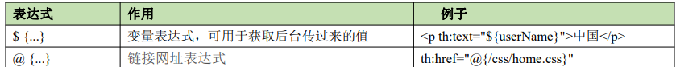
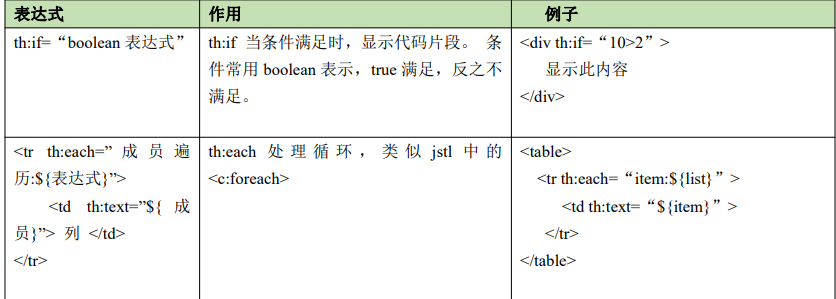

Thymeleaf

*  Thymeleaf 是一个表现层的模板引擎， 一般被使用在 Web 环境中，它可以处理 HTML, XML、 JS 等文 档，简单来说，它可以将 JSP 作为 Java Web 应用的表现层，有能力展示与处理数据。Thyme leaf 可以让表现 层的界面节点与程序逻辑被共享，这样的设计， 可以让界面设计人员、业务人员与技术人员都参与到项目开发 中。 

* 表达式

  * 有五种，常用的有两种：变量和链接表达式

    

    ```html
    <html lang="en" xmlns:th="http://www.thymeleaf.org">
    <body>
    <h1>hello word!!!</h1>
    `<div th:text="${name}">拿到request请求值</div>
    <a th:href="@{link}">链接到link地址，无参数</a>
    <a th:href="@{http://www.baidu.com}">连接到百度</a>
    </body>
    </html>
    ```

    

*  静态资源默认放在 static 目录，Spring Boot 按约定，可直接访问。main.html 就是普通的 HTML 文件。

*  要加上一个前缀声明 <**html** **lang****="en"** **xmlns:****th****="http://www.thymeleaf.org"**>

*   if-for 

  * 用于遍历和判断服务器返回的

    

    ```java
    
    ```

    

  