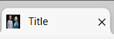
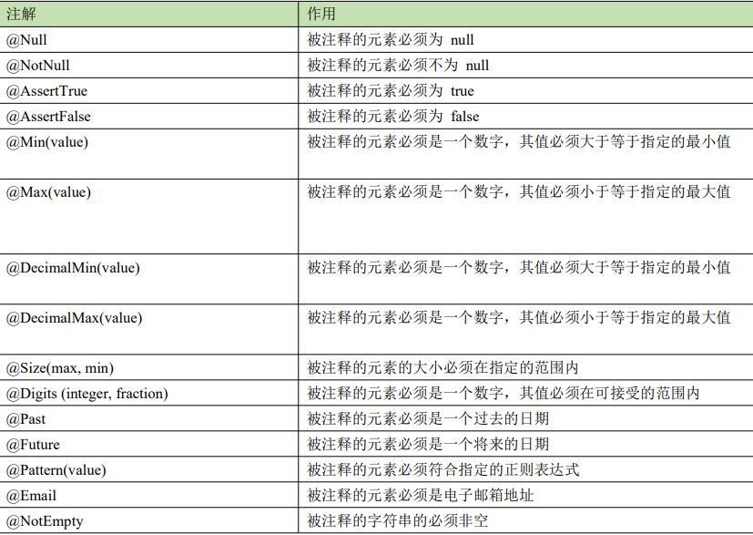
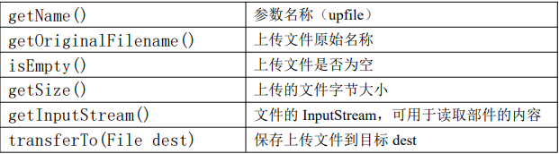
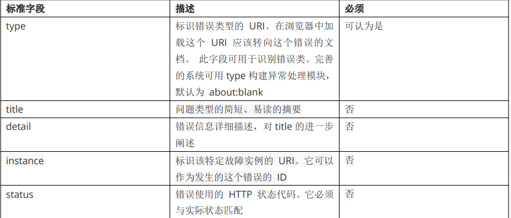

##### SpringMVC

*  基于浏览器的 B/S 结构应用十分流行。Spring Boot 非常适合 Web 应用开发。可以使用嵌入式 Tomcat、Jetty、 Undertow 或 Netty 创建一个自包含的 HTTP 服务器。一个 Spring Boot 的 Web 应用能够自己独立运行，不依赖需要安装的 Tomcat，Jetty 等。 

* Spring Boot 可以创建两种类型的 Web 应用 

  *  基于 Servlet 体系的 Spring Web MVC 应用 
  * 使用 spring-boot-starter-webflux 模块来构建响应式，非阻塞的 Web 应用程 

* 创建web应用

  *  创建 Web 应用。 依赖选择 spring-web 包含了 Spring MVC , Restful, Tomcat  
  * 前后端分离，就不用响应视图

* JSON处理

  * @ResponseBody等价于从response.setContentType到out.close();代码。并且调用了	Jaskson工具库的ObjectMapper对象使其转换成json

    ```java
    public class QuickController {
        @RequestMapping("/exam/quick")
        public String quick(Model model){
    //业务处理结果数据，放入到 Model 模型
            model.addAttribute("title", "Web 开发");
            model.addAttribute("time", LocalDateTime.now());
            return "quick";
        }
        @RequestMapping("/exam/json")
        public void exam1(HttpServletResponse response) throws IOException {
            String data="{\"name\":\"lisi\",\"age\":20}";
            response.setContentType("application/json;charset=utf-8");
            PrintWriter out = response.getWriter();
            out.println(data);
            out.flush();
            out.close();
        }
        //@ResponseBody
        @RequestMapping("/exam/json2")
        @ResponseBody
        public User exam2() {
            User user = new User();
            user.setName("张三");
            user.setAge(22);
            return user;
        }
    }
    ```


* 给项目加 favico

  *  favicon.ico 是网站的缩略标志,可以显示在浏览器标签、地址栏左边和收藏夹,是展示网站个性的 logo 标志。 

  *  我们自己的网站定制 logo。首先找一个在线工具创建 favicon.ico。比如 https://quanxin.org/favicon ， 用文字， 图片生成我们需要的内容。生成的 logo 文件名称是 favicon.ico 

    *  step1：将生成的 favicon.ico 拷贝项目的 resources/ 或 resources/static/ 目录。

    *  step2：在你的视图文件，加入对 favicon.ico 的引用。 

    *  在视图的部分加入(==疑问：虽然放在static文件下，但是访问路径不加static==)          

      ```java
      <head>
          <meta charset="UTF-8">
          <title>Title</title>
          <link rel="icon" href="../favicon.ico" type="image/x-icon">
      </head>
      ```

      

* 控制器Controller

  *  控制器是一个普通的 Bean，使用@Controller 或者@RestController 注释(==responsebody与Controller 的结合。==Controller 被声明为@Component。 所以他就是一个 Bean 对象。 

  

  

  

##### 验证规则

*  服务器端程序，Controller 在方法接受了参数，这些参数是由用户提供的，使用之前必须校验参数是我们需要的吗，值是否在允许的范围内，是否符合业务的要求。比如年龄不能是负数，姓名不能是空字符串，email 必 须有@符号，phone 国内的 11 位才行
*  Spring Boot 使用 Java Bean Validation 验证域模型属性值是否符合预期，如果验证失败，立即返回错误信息。 Java Bean Validation 将验证规则从 controller，service 集中到 Bean 对象。一个地方控制所有的验证。 Bean 的属性上，加入 JSR-303 的注解，实现验证规则的定义。
  
  * JSR-3-3 是规范，hibernate-validator 是实现的一种。 JSR-303: https://beanvalidation.org/ ,最新 3.0 版本，2020 年 10. hibernate-validator：https://hibernate.org/validator/ https://docs.jboss.org/hibernate/validator/4.2/reference/en-US/html/ 
* 常用的注解
  
* 
  
* 举例

  * 第一步需要添加依赖

    ```xml
    <dependency>
    <groupId>org.springframework.boot</groupId>
    <artifactId>spring-boot-starter-validation</artifactId>
    </dependency>
    ```

  * 创建文章数据类，添加约束注解

    ```java
    @Data
    public class ArticleVO {
        //文章主键
        private Integer id;
        @NotNull(message = "必须有作者")
        private Integer userId;
        //同一个属性可以指定多个注解
        @NotBlank(message = "文章必须有标题")
    //@Size 中 null 认为是有效值.所以需要@NotBlank
        @Size(min = 3, max = 30, message = "标题必须 3 个字以上")
        private String title;
        @NotBlank(message = "文章必须副标题")
        @Size(min = 8, max = 60, message = "副标题必须 30 个字以上")
        private String summary;
        @DecimalMin(value = "0", message = "已读最小是 0")
        private Integer readCount;
        @Email(message = "邮箱格式不正确")
        private String email;
    }
    ```

  * 在需要验证的地方使用@Validated注解

    * @Validated：Spring中的注解，支持JSR 303规范，还能对group验证。可以在类，方法，参数上使用，即启动验证
    * BindingResult： 绑定对象，绑定验证结果。这个是spring mvc的常见请求参数

    ```java
    @RestController
    public class ArticleController {
        //@Validated： Spring 中的注解，支持 JSR 303 规范，还能对 group 验证。可以类，方法，参数上使用，即启动验证
        //BindingResult 绑定对象，绑定验证结果
        @PostMapping("/article/add")
        public Map<String,Object> addArticle(@Validated @RequestBody ArticleVO articleVo,BindingResult br){
            Map<String,Object> map = new HashMap<>();
            //为rrue说明有错误·   ···
            if( br.hasErrors() ){
                br.getFieldErrors().forEach( field->{
                    map.put(field.getField(), field.getDefaultMessage());
                });
            }
            return map;
        }
    }
    ```
    

* `新问题出现了？像id这种属性，如果在插入时不需要考虑id是否为空，因为jdbc会随机生成，但是当使用id进行条件查询时，id就不能为null`

  * 解决方法，采用分组解决，在不同组使用不同的约束

  * 即在JSR303注解中有一个group属性，可以限制该注解的作用范围

    ```java
    @Data
    public class ArticleVO {
    	//新增组
    	public static interface AddArticleGroup { };
    	//编辑修改组
    	public static interface EditArticleGroup { };
    	//文章主键
    	@NotNull(message = "文章 ID 不能为空", groups = { EditArticleGroup.class } )
    	@Min(value = 1, message = "文章 ID 从 1 开始",
    groups = { EditArticleGroup.class } )
    	private Integer id;
    }
    
    //在验证时，在注解中传入组即可@Validated(ArticleVO.AddArticleGroup.class
    @PostMapping("/article/add")
    public Map<String,Object> addArticle(@Validated(ArticleVO.AddArticleGroup.class)
    @RequestBody ArticleVO articleVo,
    BindingResult br)
    ```

* 优化：每一次都要用BindingResult br绑定验证结果，可以使用全局异常处理，如果有问题，异常就会处理，没问题就不需要处理

  ```java
      //处理JSR303的异常
      @ExceptionHandler({BindException.class})
      @ResponseBody
      public Map<String,Object> handlerJSRException(org.springframework.validation.BindException e){
          Map<String,Object> map=new HashMap<>();
          BindingResult result=e.getBindingResult();
          if (result.hasErrors()){
              List<FieldError> fieldErrors = result.getFieldErrors();
              for (int i = 0; i < fieldErrors.size(); i++) {
                  FieldError fieldError = fieldErrors.get(i);
                  map.put(i+"-"+fieldError.getField(),fieldError.getDefaultMessage());
              }
          }
          return map;
      }
  ```

  

#### SpringMVC 自动配置

*  WebMvcAutoConfiguration 是 Spring MVC 自动配置类，源代码如下：

  ```java
  @AutoConfiguration(after = { DispatcherServletAutoConfiguration.class, TaskExecutionAutoConfiguration.class,
  		ValidationAutoConfiguration.class })
  @ConditionalOnWebApplication(type = Type.SERVLET)
  @ConditionalOnClass({ Servlet.class, DispatcherServlet.class, WebMvcConfigurer.class })
  @ConditionalOnMissingBean(WebMvcConfigurationSupport.class)
  @AutoConfigureOrder(Ordered.HIGHEST_PRECEDENCE + 10)
  @ImportRuntimeHints(WebResourcesRuntimeHints.class)
  public class WebMvcAutoConfiguration {
  }
  ```

* 点击DispatcherServletAutoConfiguration

  * 以前 web.xml 在 SpringMVC 以 xml 文件配置 DispatcherServlet，现在有自动配置完成 

    ```xml
    <servlet>
    <servlet-name>dispatcher</servlet-name>
    <servlet-class>org.springframework.web.servlet.DispatcherServlet</servlet-class>
    <init-param>
    <param-name>contextConfigLocation</param-name>
    <param-value>/WEB-INF/spring/dispatcher.xml</param-value>
    </init-param>
    <load-on-startup>1</load-on-startup>
    </servlet>
    
    ```

  * 现在自动配置，他和上面等价的

    ```java
    @AutoConfigureOrder(Ordered.HIGHEST_PRECEDENCE)
    @AutoConfiguration(after = ServletWebServerFactoryAutoConfiguration.class)
    @ConditionalOnWebApplication(type = Type.SERVLET)
    @ConditionalOnClass(DispatcherServlet.class)
    public class DispatcherServletAutoConfiguration {
    
    	/**
    	 * The bean name for a DispatcherServlet that will be mapped to the root URL "/".
    	 */
    	public static final String DEFAULT_DISPATCHER_SERVLET_BEAN_NAME = "dispatcherServlet";
    
    	/**
    	 * The bean name for a ServletRegistrationBean for the DispatcherServlet "/".
    	 */
    	public static final String DEFAULT_DISPATCHER_SERVLET_REGISTRATION_BEAN_NAME = "dispatcherServletRegistration";
    
    	@Configuration(proxyBeanMethods = false)
    	@Conditional(DefaultDispatcherServletCondition.class)
    	@ConditionalOnClass(ServletRegistration.class)
    	@EnableConfigurationProperties(WebMvcProperties.class)
    	protected static class DispatcherServletConfiguration {
    
    		@Bean(name = DEFAULT_DISPATCHER_SERVLET_BEAN_NAME)
    		public DispatcherServlet dispatcherServlet(WebMvcProperties webMvcProperties) {
    			DispatcherServlet dispatcherServlet = new DispatcherServlet();
    			dispatcherServlet.setDispatchOptionsRequest(webMvcProperties.isDispatchOptionsRequest());
    			dispatcherServlet.setDispatchTraceRequest(webMvcProperties.isDispatchTraceRequest());
    			dispatcherServlet.setThrowExceptionIfNoHandlerFound(webMvcProperties.isThrowExceptionIfNoHandlerFound());
    			dispatcherServlet.setPublishEvents(webMvcProperties.isPublishRequestHandledEvents());
    			dispatcherServlet.setEnableLoggingRequestDetails(webMvcProperties.isLogRequestDetails());
    			return dispatcherServlet;
    		}
        }
    ```

* 服务器的配置

  * 在DispatcherServletAutoConfiguration中有一个@AutoConfiguration(after = ServletWebServerFactoryAutoConfiguration.class) 

    ```java
    @AutoConfiguration
    @AutoConfigureOrder(Ordered.HIGHEST_PRECEDENCE)
    @ConditionalOnClass(ServletRequest.class)
    @ConditionalOnWebApplication(type = Type.SERVLET)
    @EnableConfigurationProperties(ServerProperties.class)
    @Import({ ServletWebServerFactoryAutoConfiguration.BeanPostProcessorsRegistrar.class,
    		ServletWebServerFactoryConfiguration.EmbeddedTomcat.class,
    		ServletWebServerFactoryConfiguration.EmbeddedJetty.class,
    		ServletWebServerFactoryConfiguration.EmbeddedUndertow.class })
    public class ServletWebServerFactoryAutoConfiguration {}
    ```

    * 它配置了EmbeddedTomcat，EmbeddedJetty，EmbeddedUndertow

    * 配置文件@EnableConfigurationProperties(ServerProperties.**class**)

      ```java
      
      ```

      * 在配置文件中使用

        ```properties
        #服务器端口号
        server.port=8001
        #上下文访问路径
        server.servlet.context-path=/api
        #request，response 字符编码
        server.servlet.encoding.charset=utf-8
        #强制 request，response 设置 charset 字符编码
        server.servlet.encoding.force=true
        #日志路径
        server.tomcat.accesslog.directory=D:/logs
        #启用访问日志
        server.tomcat.accesslog.enabled=true
        #日志文件名前缀
        server.tomcat.accesslog.prefix=access_log
        #日志文件日期时间
        server.tomcat.accesslog.file-date-format=.yyyy-MM-dd
        #日志文件名称后缀
        server.tomcat.accesslog.suffix=.log
        #post 请求内容最大值，默认 2M
        server.tomcat.max-http-form-post-size=2000000
        #服务器最大连接数
        server.tomcat.max-connections=819
        ```

        

    * 点击ServletWebServerFactoryAutoConfiguration，再点击ServletWebServerFactoryConfiguration

      ```java
      @Configuration(proxyBeanMethods = false)
      class ServletWebServerFactoryConfiguration {
      
      	@Configuration(proxyBeanMethods = false)
      	@ConditionalOnClass({ Servlet.class, Tomcat.class, UpgradeProtocol.class })
      	@ConditionalOnMissingBean(value = ServletWebServerFactory.class, search = SearchStrategy.CURRENT)
      	static class EmbeddedTomcat {
      
      		@Bean
      		TomcatServletWebServerFactory tomcatServletWebServerFactory(
      				ObjectProvider<TomcatConnectorCustomizer> connectorCustomizers,
      				ObjectProvider<TomcatContextCustomizer> contextCustomizers,
      				ObjectProvider<TomcatProtocolHandlerCustomizer<?>> protocolHandlerCustomizers) {
      			TomcatServletWebServerFactory factory = new TomcatServletWebServerFactory();
      			factory.getTomcatConnectorCustomizers().addAll(connectorCustomizers.orderedStream().toList());
      			factory.getTomcatContextCustomizers().addAll(contextCustomizers.orderedStream().toList());
      			factory.getTomcatProtocolHandlerCustomizers().addAll(protocolHandlerCustomizers.orderedStream().toList());
      			return factory;
      		}
      
      	}
      }
      ```

*  WebMvcConfigurationSupport 

  *  Spring MVC 组件的配置类，Java Config 方式创建 HandlerMappings 接口的多个对象，HandlerAdapters 接口 多个对象， HandlerExceptionResolver 相关多个对象 ，PathMatchConfigurer， ContentNegotiationManager， OptionalValidatorFactoryBean， HttpMessageConverters 等这些实 
  * HandlerMapping:根据请求的URI地址，找到处理此请求的Controller对象
  * HandlerAdapter：使用适配器模式，带哦用执行具体的控制器方法
  * ViewResolver：处理视图，创建视图对象View
  * HandlerExceptionResolver：异常处理器，处理请求中的异常

* 注解

  * 控制器@Controller,@RestController
  * 接收请求@RequestMapping，@GetMapping，@PostMapping，@PutMapping，@DeleteMapping
  * 接收参数 @RequestParam ，@RequestHeader， @RequestBody
  * 校验参数 @Validated, JSR 303注解
  * 返回值表示数据的@ResponseBody
  * 支持RESTful的路径变量 @PathVariable


*  Servlets, Filters, and Liste 

  * servlet，创建类注解和javaweb一样，不过需要配置一个注解扫描

    ```java
    @WebServlet(urlPatterns = "/helloServlet",name = "HelloServlet")
    public class HelloServlet extends HttpServlet {}
    ```

    ```java
    @SpringBootApplication
    @ServletComponentScan
    public class WebTestApplication {
        
        public static void main(String[] args) {
            SpringApplication.run(WebTestApplication.class, args);
        }
    }
    ```

    * 上面这个通过注解创建，也可以通过工厂创建ServletRegistrationBean

      ```java
      @Configuration
      public class WebAppConfig {
      @Bean
      public ServletRegistrationBean addServlet(){
      	ServletRegistrationBean registrationBean = new ServletRegistrationBean();
      	registrationBean.setServlet(new LoginServlet());
      	registrationBean.addUrlMappings("/user/login");
      	registrationBean.setLoadOnStartup(1);
      	return registrationBean
      }
      }
      ```

*  创建 Filter

  *  Filter 对象使用频率比较高，比如记录日志，权限验证，敏感字符过滤等等。Web 框架中包含内置的 Filter， SpringMVC 中也包含较多的内置 Filter，比如 CommonsRequestLoggingFilter，CorsFilter，FormContentFilter.

    *  @WebFilter 创建 Filter 对象，使用方式同@WebServlet 

      ```java
      @WebFilter(urlPatterns = "/*")
      public class LogFilter implements Filter {
      @Override
      public void doFilter(ServletRequest request, ServletResponse response,
      FilterChain chain)
      throws IOException, ServletException {
      String requestURI = ((HttpServletRequest) request).getRequestURI();
      System.out.println("filter 代码执行了,uri=" +requestURI );
      www.bjpowernode.com 127 / 200 Copyright©动力节点
      chain.doFilter(request,response);
      }
      }
      ```

    *  FilterRegistrationBean 与 ServletRegistrationBean 使用方式类似，无需注解。 

      ```java
      @Bean
      public FilterRegistrationBean addFilter(){
      	FilterRegistrationBean filterRegistration = new FilterRegistrationBean()；
      	filterRegistration.setFilter(new LogFilter());
      	filterRegistration.addUrlPatterns("/*");
      	return filterRegistration;
      }
      ```

    *  多个 Filter 对象如果要排序，有两种途径：

      * 过滤器类名称，按字典顺序排列， AuthFilter - > LogFilter 
      *  FilterRegistrationBean 登记 Filter，设置 order 顺序，数值越小，先执 

* 使用框架里的filter
  
  *  CommonsRequestLoggingFilter 就能完成简单的请求记录。 
*  WebMvcConfigurer 
  
  *  WebMvcConfigurer 作为配置类是，采用 JavaBean 的形式来代替传统的 xml 配置文件形式进行针对框架个性 化定制，就是 Spring MVC XML 配置文件的 JavaConfig（编码）实现方式。自定义 Interceptor，ViewResolver， MessageConverter。WebMvcConfigurer 就是 JavaConfig 形式的 Spring MVC 的配置 


*  页面跳转控制器 

  *  Spring Boot 中使用页面视图，比如 Thymeleaf。要跳转显示某个页面，必须通过 Controller 对象。也就是我们需要创建一个 Controller，转发到一个视图才行。 如果我们现在需要显示页面，可以无需这个 Controller。 addViewControllers() 完成从请求到视图跳转 

    ```java
    @Configuration
    public class MvcSettings implements WebMvcConfigurer {
    	// 跳转视图页面控制器addViewController("请求url"，指定视图)
    	@Override
    	public void addViewControllers(ViewControllerRegistry registry) {
    		registry.addViewController("/welcome").setViewName("index");
    	}
    }
    ```

    * 使用javaConfig代替原来的xml文件

* 数据格式化

  *  Formatter是数据转换接口，将一种数据类型转换为另一种数据类型。与 Formatter功能类型的还有 Converter。本节研究 Formatter接口。Formatter只能将 String 类型转为其他数据数据类型。这点在 Web 应用适用更广。因为 Web 请求的所有参数都是 String，我们需要把 String 转为 Integer ，Long，Date 等等。 

  *  Spring 中内置了一下 Formatter：  DateFormatter ： String 和 Date 之间的解析与格式化 

    *  InetAddressFormatter ：String 和 InetAddress 之间的解析与格式化 
    *  PercentStyleFormatter ：String 和 Number 之间的解析与格式化，带货币符合 
    * NumberFormat ：String 和 Number 之间的解析与格式化 
    * 在使用@ DateTimeFormat , @NumberFormat 注解时，就是通过 Formatter解析 String 类型到我们期望的 Date 或 Number 类 

  * 举例

    * 首先定义五个属性

      ```java
      @Data
      public class DeviceInfo {
      	private String item1;
      	private String item2;
      	private String item3;
      	private String item4;
      	private String item5;
      }
      ```

    * 自定义Formatter

      ```java
      public class DeviceFormatter implements Formatter<DeviceInfo> {
      	//将 String 数据，转为 DeviceInfo
      	@Override
      	public DeviceInfo parse(String text, Locale locale) throws 	ParseException {
      		DeviceInfo info = null;
      		if (StringUtils.hasLength(text)) {
      			String[] items = text.split(";");
      			info = new DeviceInfo();
                  info.setItem1(items[0]);
      			info.setItem2(items[1]);
      			info.setItem3(items[2]);
      			info.setItem4(items[3]);
      			info.setItem5(items[4]);
      		}
      		return info;
      	}
          //将 DeviceInfo 转为 String
      	@Override
      	public String print(DeviceInfo object, Locale locale) {
      		StringJoiner joiner = new StringJoiner("#");
      		joiner.add(object.getItem1()).add(object.getItem2());
      		return joiner.toString();
      	}
      }
      ```

    *  登记自定义的 DeviceFormatter addFormatters() 方法登记 Formatter

      ```java
      @Configuration
      public class MvcSettings implements WebMvcConfigurer {
      	@Override
      	public void addViewControllers(ViewControllerRegistry registry) 	{
      		registry.addViewController("/welcome").setViewName("index");
      	}
      	@Override
      	public void addFormatters(FormatterRegistry registry) {
      		registry.addFormatter(new DeviceFormatter());
      	}
      }
      ```

    * 新建controller

      ```java
      @RestController
      public class DeviceController {
      	@PostMapping("/device/add")
      	public String AddDevice(@RequestParam("device") DeviceInfo deviceInfo){
      		return "接收到的设备数据："+deviceInfo.toString();
      	}
      }
      ```

      * 他看到要解析成DeviceInfo，他就去找解析器，发现你实现了formatter接口，就去调用你的parse方法

* 拦截器

  *  `HandlerInterceptor 接口和它的实现类称为拦截器，是 SpringMVC 的一种对象。拦截器是 Spring MVC 框架的 对象与 Servlet 无关。`拦截器能够预先处理发给 Controller 的请求。可以决定请求是否被 Controller 处理。用户请 求是先由 DispatcherServlet 接收后，在 Controller 之前执行的拦截器对象。 一个项目中有众多的拦截器：框架中预定义的拦截器， 自定义拦截器。下面我说说自定义拦截器的应用。 根据拦截器的特点，类似权限验证，记录日志，过滤字符，登录 token 处理都可以使拦截器

  * 定义拦截器

    ```java
    public class AuthInterceptor implements HandlerInterceptor {
    	private final String COMMON_USER="zhangsan";
    	@Override
    	public boolean preHandle(HttpServletRequest request, HttpServletResponse
    response, Object handler)throws Exception {
    		System.out.println("=====AuthInterceptor 权限拦截器=====");
    		//获取登录的用户
    		String loginUser = request.getParameter("loginUser");
    		//获取操作的 url
    		String requestURI = request.getRequestURI();
    		if( COMMON_USER.equals(loginUser) &&
    		(requestURI.startsWith("/article/add")
    		|| requestURI.startsWith("/article/edit")
    		|| requestURI.startsWith("/article/remove"))) {
    			return false;
    		}
    		return true;
    	}
    }
    ```

  * 注册拦截器

    ```java
    @Configuration
    public class MvcSettings implements WebMvcConfigurer {
    	//...
    	@Override
    	public void addInterceptors(InterceptorRegistry registry) {
    		AuthInterceptor authInterceptor= new AuthInterceptor();
    		registry.addInterceptor(authInterceptor)
    	.addPathPatterns("/article/**") //拦截 article 开始的所有请求
    	.excludePathPatterns("/article/query"); //排除/article/query 请求
    	}
    }
    ```

    

* 多个拦截器

  *  增加一个验证登录用户的拦截器，只有 zhangsan，lisi，admin 能够登录系统。其他用户不可以。 两个拦截器登录的拦截器先执行，权限拦截器后执行，order()方法设置顺序，整数值越小，先执行。 

  * 登记多个拦截器

    ```java
    public void addInterceptors(InterceptorRegistry registry) {
    	AuthInterceptor authInterceptor= new AuthInterceptor();
    	registry.addInterceptor(authInterceptor).order(2)
    .addPathPatterns("/article/**") //拦截 article 开始的所有请求
    .excludePathPatterns("/article/query"); //排除/article/query 请求
    	LoginInterceptor loginInterceptor = new LoginInterceptor();
    	registry.addInterceptor(loginInterceptor).order(1)
    .addPathPatterns("/**") //拦截所有请求
    .excludePathPatterns("/article/query"); //排除/article/query 请求
    }
    ```

  

  

* 文件上传

  *  上传文件大家首先想到的就是 Apache Commons FileUpload，这个库使用非常广泛。Spring Boot3 版本中已经 不能使用了。代替他的是 Spring Boot 中自己的文件上传实现。 

  * Spring Boot 上传文件现在变得非常简单。提供了封装好的处理上传文件的接口 MultipartResolver，用于解析 上传文件的请求，他的内部实现类 StandardServletMultipartResolver。之前常用的 CommonsMultipartResolver 不可 用了。

  * CommonsMultipartResolver 是使用 Apache Commons FileUpload 库时的处理类。 StandardServletMultipartResolver 内部封装了读取 POST 其中体的请求数据，也就是文件内容。

  * 我们现在只需 要在 Controller 的方法加入形参@RequestParam MultipartFile。 MultipartFile 表示上传的文件，提供了方便的方法 保存文件到磁盘 

    

   

##### ProblemDetail

*  一直依赖 Spring Boot 默认的异常反馈内容比较单一，包含 Http Status Code， 时间，异常信息。但具体异 常原因没有体现。这次 Spring Boot3 对错误信息增强了 

* 之前的异常处理没有规范，基本都是自定义异常，现在使用RFC7807规范

*  RESTFul 服务中通常需要在响应体中包含错误详情，Spring 框架支持”Problem Details“。定义了 Http 应答错 误的处理细节，增强了响应错误的内容。包含标准和非标准的字段。同时支持 json 和 xml 两种格式。 

*  基于 Http 协议的请求，可通过 Http Status Code 分析响应结果，200 为成功， 4XX 为客户端错误，500 是服 务器程序代码异常。status code 过于简单，不能进一步说明具体的错误原因和解决途径。比如 http status code 403, 但并不能说明 ”是什么导致了 403“，以及如何解决问题。Http 状态代码可帮助我们区分错误和成功状态，但没法 区分得太细致。RFC 7807 中对这些做了规范的定义。

* 基本格式

  ```json
  {
  "type": "https://example.com/probs/out-of-credit",
  "title": "You do not have enough credit.",
  "detail": "Your current balance is 30, but that costs 50.",
  "instance": "/account/12345/transactions/abc"
  }
  ```

  
  * 除了以上字段，用户可以扩展字段。采用key:value格式。增强对问题的描述

* 媒体类型
  *  RFC 7807 规范增加了两种媒体类型: `application/problem+json`或`application/problem+xml`。返回错误的 HTTP 响应应在其`Content-Type`响应标头中包含适当的内容类型，并且客户端可以检查该标头以确认格式 
*  Spring 支持 Problem Detail
  * ProblemDetail 类: 封装标准字段和扩展字段的简单对象 
  * ErrorResponse ：错误应答类，完整的 RFC 7807 错误响应的表示，包括 status、headers 和 RFC 7807 格式的 ProblemDetail 正文 
  * ErrorResponseException ：ErrorResponse 接口一个实现，可以作为一个方便的基类。扩展自定义的错误处理 类。 
  * ResponseEntityExceptionHandler：它处理所有 Spring MVC 异常，与@ControllerAdvice 一起使用。 以上类型作为异常处理器方法的返回值，框架将返回值格式化 RFC 7807 的字段。 


