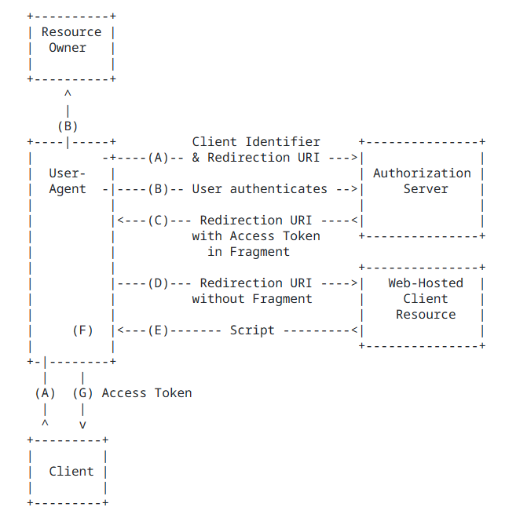

####1、OAuth2简介

#####1.1、OAuth2是什么

* “Auth” 表示 “授权” Authorization

*  “O” 是 Open 的简称，表示 “开放”

* 连在一起就表示 **“开放授权”**，OAuth2是一种开放授权协议。

* OAuth2最简向导：**[The Simplest Guide To OAuth 2.0](https://darutk.medium.com/the-simplest-guide-to-oauth-2-0-8c71bd9a15bb)

#####1.2、OAuth2的角色

* OAuth 2协议包含以下角色：
  * 资源所有者（Resource Owner）：即用户，资源的拥有人，想要通过客户应用访问资源服务器上的资源。
  * 客户应用（Client）：通常是一个Web或者无线应用，它需要访问用户的受保护资源。
  * 资源服务器（Resource Server）：存储受保护资源的服务器或定义了可以访问到资源的API，接收并验证客户端的访问令牌，以决定是否授权访问资源。
  * 授权服务器（Authorization Server）：负责验证资源所有者的身份并向客户端颁发访问令牌。

  

#####1.3、OAuth2的使用场景

######开放系统间授权

* 社交登录
  * 在传统的身份验证中，用户需要提供用户名和密码，还有很多网站登录时，允许使用第三方网站的身份，这称为"第三方登录"。所谓第三方登录，实质就是 OAuth 授权。用户想要登录 A 网站，A 网站让用户提供第三方网站的数据，证明自己的身份。获取第三方网站的身份数据，就需要 OAuth 授权。

    

* 开放API
  * 例如云冲印服务的实现

    

  

* 单块应用安全


* 微服务安全


#####企业内部应用认证授权

- SSO：Single Sign On 单点登录
- IAM：Identity and Access Management 身份识别与访问管理


#####1.4、OAuth2的四种授权模式

* RFC6749：[RFC 6749 - The OAuth 2.0 Authorization Framework (ietf.org)](https://datatracker.ietf.org/doc/html/rfc6749)

* 阮一峰：

[OAuth 2.0 的四种方式 - 阮一峰的网络日志 (ruanyifeng.com)](https://www.ruanyifeng.com/blog/2019/04/oauth-grant-types.html)


* 四种模式：
  * 授权码（authorization-code）
  * 隐藏式（implicit）
  * 密码式（password）
  * 客户端凭证（client credentials）

* 第一种方式：授权码
  * 授权码（authorization code），指的是第三方应用先申请一个授权码，然后再用该码获取令牌。**

  * 这种方式是最常用，最复杂，也是最安全的，它适用于那些有后端的 Web 应用。授权码通过前端传送，令牌则是储存在后端，而且所有与资源服务器的通信都在后端完成。这样的前后端分离，可以避免令牌泄漏。

    

  * 注册客户应用：客户应用如果想要访问资源服务器需要有凭证，需要在授权服务器上注册客户应用。注册后会**获取到一个ClientID和ClientSecrets**

    

* 第二种方式：隐藏式
  * 隐藏式（implicit），也叫简化模式，有些 Web 应用是纯前端应用，没有后端。这时就不能用上面的方式了，必须将令牌储存在前端。**
  * RFC 6749 规定了这种方式，允许直接向前端颁发令牌。这种方式没有授权码这个中间步骤，所以称为隐藏式。这种方式把令牌直接传给前端，是很不安全的。因此，只能用于一些安全要求不高的场景，并且令牌的有效期必须非常短，通常就是会话期间（session）有效，浏览器关掉，令牌就失效了。

​								




```
https://a.com/callback#token=ACCESS_TOKEN
将访问令牌包含在URL锚点中的好处：锚点在HTTP请求中不会发送到服务器，减少了泄漏令牌的风险。
```


* 第三种方式：密码式
  * 密码式（Resource Owner Password Credentials）：如果你高度信任某个应用，RFC 6749 也允许用户把用户名和密码，直接告诉该应用。该应用就使用你的密码，申请令牌。**

  * 这种方式需要用户给出自己的用户名/密码，显然风险很大，因此只适用于其他授权方式都无法采用的情况，而且必须是用户高度信任的应用。

    

    

* 第四种方式：凭证式
  * 凭证式（client credentials）：也叫客户端模式，适用于没有前端的命令行应用，即在命令行下请求令牌。**

  * 这种方式给出的令牌，是针对第三方应用的，而不是针对用户的，即有可能多个用户共享同一个令牌。

    

    

* 1.5、授权类型的选择


####2、Spring中的OAuth2

#####2.1、相关角色

* 回顾：**OAuth 2中的角色
  * 资源所有者（Resource Owner）
  * 客户应用（Client）
  * 资源服务器（Resource Server）
  * 授权服务器（Authorization Server）

#####2.2、Spring中的实现

* [OAuth2 :: Spring Security](https://docs.spring.io/spring-security/reference/servlet/oauth2/index.html)

* Spring Security**
  * 客户应用（OAuth2 Client）：OAuth2客户端功能中包含OAuth2 Login
  * 资源服务器（OAuth2 Resource Server）

* Spring**
  * 授权服务器（Spring Authorization Server）：它是在Spring Security之上的一个单独的项目。

#####2.3、相关依赖

```xml
<!-- 资源服务器 -->
<dependency>
	<groupId>org.springframework.boot</groupId>
	<artifactId>spring-boot-starter-oauth2-resource-server</artifactId>
</dependency>

<!-- 客户应用 -->
<dependency>
	<groupId>org.springframework.boot</groupId>
	<artifactId>spring-boot-starter-oauth2-client</artifactId>
</dependency>

<!-- 授权服务器 -->
<dependency>
    <groupId>org.springframework.boot</groupId>
    <artifactId>spring-boot-starter-oauth2-authorization-server</artifactId>
</dependency>
```

#####2.4、授权登录的实现思路

* 使用OAuth2 Login


