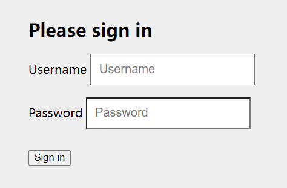
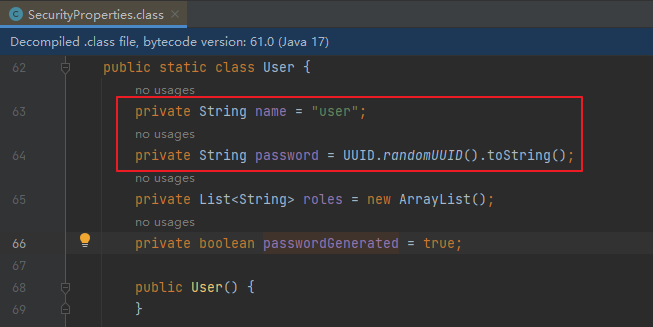

####第一章 Spring Security快速入门

* 官方文档：https://docs.spring.io/spring-security/reference/index.html

* 功能：
  * 身份认证（authentication）
  * 授权（authorization）
  * 防御常见攻击（protection against common attacks）

* **身份认证：**
  * 身份认证是验证`谁正在访问系统资源`，判断用户是否为合法用户。认证用户的常见方式是要求用户输入用户名和密码。

* 授权：**
  * 用户进行身份认证后，系统会控制`谁能访问哪些资源`，这个过程叫做授权。用户无法访问没有权限的资源。

* 防御常见攻击：**
  * CSRF
  * HTTP Headers
  * HTTP Requests

#####1、身份认证（authentication）

* * *官方代码示例：**[GitHub - spring-projects/spring-security-samples](https://github.com/spring-projects/spring-security-samples/tree/main)

######1.1、创建Spring Boot项目

* 项目名：security-demo

* JDK：17

* SpringBoot：3.2.0（依赖了Spring Security 6.2.0）

* Dependencies：Spring Web、Spring Security、Thymeleaf

######1.2、创建IndexController

```java
package com.atguigu.securitydemo.controller;

@Controller
public class IndexController {

    @GetMapping("/")
    public String index() {
        return "index";
    }
}
```

######1.3、创建index.html

* 在路径resources/templates中创建index.html

  ```html
  <html xmlns:th="https://www.thymeleaf.org">
  <head>
    <title>Hello Security!</title>
  </head>
  <body>
  <h1>Hello Security</h1>
  <!--通过使用@{/logout}，Thymeleaf将自动处理生成正确的URL，以适应当前的上下文路径。
  这样，无论应用程序部署在哪个上下文路径下，生成的URL都能正确地指向注销功能。-->
  <a th:href="@{/logout}">Log Out</a>
  </body>
  </html>
  ```

######1.4、启动项目测试Controller

* 浏览器中访问：http://localhost:8080/

* SpringSecurity会让浏览器自动跳转到登录页面：**http://localhost:8080/login


* 输入用户名：user

* 输入密码：在控制台的启动日志中查找初始的默认密码

* 点击"Sign in"进行登录，浏览器就跳转到了index页面

#####1.5、注意事项

######1.5.1、@{/logout}的作用

* 通过使用@{/logout}，Thymeleaf将自动处理生成正确的URL，以适应当前的上下文路径。这样，无论应用程序部署在哪个上下文路径下，生成的URL都能正确地指向注销功能。
  * 是当前的Sesion失效；
  * 清除与当前用户关联的RememberMe记录；
  * 清空当前的SecurityContext；
  * 重定向到登录页。

* 例如：如果我们在配置文件中添加如下内容

  ```properties
  server.servlet.context-path=/demo
  ```

  * 那么@{/logout}可以自动处理url为正确的相对路径
  * 但是如果是普通的/logout，路径就会不正确

######1.5.2、页面样式无法加载的问题

* 页面样式bootstrap.min.css是一个CDN地址，需要通过科学上网的方式访问


* 否则你的登录页会加载很久，并且看到的页面是这样的（登录按钮没有样式文件渲染，但是不影响登录功能的执行）



#####1.6、Spring Security默认做了什么

- 保护应用程序URL，要求对应用程序的任何交互进行身份验证。
- 程序启动时生成一个默认用户“user”。
- 生成一个默认的随机密码，并将此密码记录在控制台上。
- 生成默认的登录表单和注销页面。
- 提供基于表单的登录和注销流程。
- 对于Web请求，重定向到登录页面；
- 对于服务请求，返回401未经授权。
- 处理跨站请求伪造（CSRF）攻击。
- 处理会话劫持攻击。
- 写入Strict-Transport-Security以确保HTTPS。
- 写入X-Content-Type-Options以处理嗅探攻击。
- 写入Cache Control头来保护经过身份验证的资源。
- 写入X-Frame-Options以处理点击劫持攻击。


####2、Spring Security 的底层原理

* **官方文档：**[Spring Security的底层原理](https://docs.spring.io/spring-security/reference/servlet/architecture.html)
  * Spring Security之所以默认帮助我们做了那么多事情，它的底层原理是传统的`Servlet过滤器`

#####2.1、Filter

* 下图展示了处理一个Http请求时，过滤器和Servlet的工作流程：


* 因此我们可以在过滤器中对请求进行修改或增强。`Spring Security本质是一个过滤器链`

* 监听器-过滤器-dispatcherServlet(前置拦截器-maooerhandler-后置拦截器-最终拦截器)

#####2.2、DelegatingFilterProxy

* DelegatingFilterProxy 是 Spring Security 提供的一个 Filter 实现，==可以在 Servlet 容器和 Spring 容器之间建立桥梁。==通过使用 DelegatingFilterProxy，这样就可以将Servlet容器中的 Filter 实例放在 Spring 容器中管理。


#####2.3、FilterChainProxy

* 复杂的业务中不可能只有一个过滤器。因此FilterChainProxy是Spring Security提供的一个特殊的Filter，它允许通过SecurityFilterChain将过滤器的工作委托给多个Bean Filter实例。


#####2.4、SecurityFilterChain

* SecurityFilterChain 被 FilterChainProxy 使用，负责查找当前的请求需要执行的Security Filter列表。


* 默认是有16个过滤器

* ```java
  DefaultSecurityFilterChain     : Will secure any request with [org.springframework.security.web.session.DisableEncodeUrlFilter@53a84ff4, org.springframework.security.web.context.request.async.WebAsyncManagerIntegrationFilter@7ce85af2, org.springframework.security.web.context.SecurityContextHolderFilter@3003e580, org.springframework.security.web.header.HeaderWriterFilter@1d50a7ca, org.springframework.security.web.csrf.CsrfFilter@673c4f6e, org.springframework.security.web.authentication.logout.LogoutFilter@608b1fd2, org.springframework.security.web.authentication.UsernamePasswordAuthenticationFilter@411a5965, org.springframework.security.web.authentication.ui.DefaultLoginPageGeneratingFilter@ceddaf8, org.springframework.security.web.authentication.ui.DefaultLogoutPageGeneratingFilter@316acbb5, org.springframework.security.web.authentication.www.BasicAuthenticationFilter@542f6803, org.springframework.security.web.savedrequest.RequestCacheAwareFilter@21a02556, org.springframework.security.web.servletapi.SecurityContextHolderAwareRequestFilter@30839e44, org.springframework.security.web.authentication.AnonymousAuthenticationFilter@56f730b2, org.springframework.security.web.access.ExceptionTranslationFilter@67531e3a, org.springframework.security.web.access.intercept.AuthorizationFilter@57c00115]
  ```

  
  

#####2.5、Multiple SecurityFilterChain

* 可以有多个SecurityFilterChain的配置，FilterChainProxy决定使用哪个SecurityFilterChain。如果请求的URL是/api/messages/，它首先匹配SecurityFilterChain0的模式/api/\*\*，因此只调用SecurityFilterChain 0。假设没有其他SecurityFilterChain实例匹配，那么将调用SecurityFilterChain n。


####3、程序的启动和运行

#####3.1、DefaultSecurityFilterChain

* SecurityFilterChain接口的实现，加载了默认的16个Filter


#####3.2、SecurityProperties

* 默认情况下Spring Security将初始的用户名和密码存在了SecurityProperties类中。这个类中有一个静态内部类User，配置了默认的用户名（name = "user"）和密码（password = uuid）




* 我们也可以将用户名、密码配置在SpringBoot的配置文件中：在application.properties中配置自定义用户名和密码

  ```properties
  spring.security.user.name=user
  spring.security.user.password=123
  ```

  

####自定义登录页面

* 创建登录Controller

  ```java
  package com.atguigu.securitydemo.controller;
  
  @Controller
  public class LoginController {
  
      @GetMapping("/login")
      public String login() {
          return "login";
      }
  }
  ```

  

* 创建登录页面   resources/templates/login.html

  ```java
  <!DOCTYPE html>
  <html xmlns:th="https://www.thymeleaf.org">
  <head>
      <title>登录</title>
  </head>
  <body>
  <h1>登录</h1>
  <div th:if="${param.error}">
      错误的用户名和密码.</div>
  
  <!--method必须为"post"-->
  <!--th:action="@{/login}" ，
  使用动态参数，表单中会自动生成_csrf隐藏字段，用于防止csrf攻击
  login: 和登录页面保持一致即可，SpringSecurity自动进行登录认证-->
  <form th:action="@{/login}" method="post">
      <div>
          <!--name必须为"username"-->
          <input type="text" name="username" placeholder="用户名"/>
      </div>
      <div>
          <!--name必须为"password"-->
          <input type="password" name="password" placeholder="密码"/>
      </div>
      <input type="submit" value="登录" />
  </form>
  </body>
  </html>
  ```

  * **注意：必须是username和password，因为在**UsernamePasswordAuthenticationFilter过滤器获取参数指定从这两个字段获取值，找不到就是空，可以在配置类中更改

    ```java
     http.formLogin().loginPage("/index.htm").loginProcessingUrl("/login").usernameParameter("自己定义的");
    ```

    


### 7.3、配置SecurityFilterChain

SecurityConfiguration：

```java
.formLogin( form -> {
    form
        .loginPage("/login").permitAll() //登录页面无需授权即可访问
        .usernameParameter("username") //自定义表单用户名参数，默认是username
        .passwordParameter("password") //自定义表单密码参数，默认是password
        .failureUrl("/login?error") //登录失败的返回地址
        ;
}); //使用表单授权方式
```


# 第三章 前后端分离

## 1、用户认证流程

- 登录成功后调用：AuthenticationSuccessHandler
- 登录失败后调用：AuthenticationFailureHandler


## 2、引入fastjson

```xml
<dependency>
    <groupId>com.alibaba.fastjson2</groupId>
    <artifactId>fastjson2</artifactId>
    <version>2.0.37</version>
</dependency>
```


## 3、认证成功的响应

### 3.1、成功结果处理

```java
package com.atguigu.securitydemo.config;

public class MyAuthenticationSuccessHandler implements AuthenticationSuccessHandler {
    @Override
    public void onAuthenticationSuccess(HttpServletRequest request, HttpServletResponse response, Authentication authentication) throws IOException, ServletException {

        //获取用户身份信息
        Object principal = authentication.getPrincipal();

        //创建结果对象
        HashMap result = new HashMap();
        result.put("code", 0);
        result.put("message", "登录成功");
        result.put("data", principal);

        //转换成json字符串
        String json = JSON.toJSONString(result);

        //返回响应
        response.setContentType("application/json;charset=UTF-8");
        response.getWriter().println(json);
    }
}
```

### 3.2、SecurityFilterChain配置

```java
form.successHandler(new MyAuthenticationSuccessHandler()) //认证成功时的处理
```


## 4、认证失败响应

### 4.1、失败结果处理

```java
package com.atguigu.securitydemo.config;

public class MyAuthenticationFailureHandler implements AuthenticationFailureHandler {

    @Override
    public void onAuthenticationFailure(HttpServletRequest request, HttpServletResponse response, AuthenticationException exception) throws IOException, ServletException {

        //获取错误信息
        String localizedMessage = exception.getLocalizedMessage();

        //创建结果对象
        HashMap result = new HashMap();
        result.put("code", -1);
        result.put("message", localizedMessage);

        //转换成json字符串
        String json = JSON.toJSONString(result);

        //返回响应
        response.setContentType("application/json;charset=UTF-8");
        response.getWriter().println(json);
    }
}
```

### 4.2SecurityFilterChain配置

```java
form.failureHandler(new MyAuthenticationFailureHandler()) //认证失败时的处理
```


## 5、注销响应

### 5.1、注销结果处理

```java
package com.atguigu.securitydemo.config;

public class MyLogoutSuccessHandler implements LogoutSuccessHandler {

    @Override
    public void onLogoutSuccess(HttpServletRequest request, HttpServletResponse response, Authentication authentication) throws IOException, ServletException {

        //创建结果对象
        HashMap result = new HashMap();
        result.put("code", 0);
        result.put("message", "注销成功");

        //转换成json字符串
        String json = JSON.toJSONString(result);

        //返回响应
        response.setContentType("application/json;charset=UTF-8");
        response.getWriter().println(json);
    }
}
```


### 5.2、SecurityFilterChain配置

```java
http.logout(logout -> {
    logout.logoutSuccessHandler(new MyLogoutSuccessHandler()); //注销成功时的处理
});
```


## 6、请求未认证的接口

### 6.1、实现AuthenticationEntryPoint接口

[Servlet Authentication Architecture :: Spring Security](https://docs.spring.io/spring-security/reference/servlet/authentication/architecture.html)

当访问一个需要认证之后才能访问的接口的时候，Spring Security会使用`AuthenticationEntryPoint`将用户请求跳转到登录页面，要求用户提供登录凭证。

这里我们也希望系统`返回json结果`，因此我们定义类`实现AuthenticationEntryPoint接口`

```java
package com.atguigu.securitydemo.config;

public class MyAuthenticationEntryPoint implements AuthenticationEntryPoint {
    @Override
    public void commence(HttpServletRequest request, HttpServletResponse response, AuthenticationException authException) throws IOException, ServletException {

        //获取错误信息
        //String localizedMessage = authException.getLocalizedMessage();

        //创建结果对象
        HashMap result = new HashMap();
        result.put("code", -1);
        result.put("message", "需要登录");

        //转换成json字符串
        String json = JSON.toJSONString(result);

        //返回响应
        response.setContentType("application/json;charset=UTF-8");
        response.getWriter().println(json);
    }
}
```


### 6.2、SecurityFilterChain配置

```java
//错误处理
http.exceptionHandling(exception  -> {
    exception.authenticationEntryPoint(new MyAuthenticationEntryPoint());//请求未认证的接口
});
```


## 7、跨域

跨域全称是跨域资源共享(Cross-Origin Resources Sharing,CORS)，它是浏览器的保护机制，只允许网页请求统一域名下的服务，同一域名指=>协议、域名、端口号都要保持一致，如果有一项不同，那么就是跨域请求。在前后端分离的项目中，需要解决跨域的问题。


在SpringSecurity中解决跨域很简单，在配置文件中添加如下配置即可

```java
//跨域
http.cors(withDefaults());
```


# 第四章 身份认证

## 1、用户认证信息

### 1.1、基本概念


在Spring Security框架中，SecurityContextHolder、SecurityContext、Authentication、Principal和Credential是一些与身份验证和授权相关的重要概念。它们之间的关系如下：


1. SecurityContextHolder：SecurityContextHolder 是 Spring Security 存储已认证用户详细信息的地方。
2. SecurityContext：SecurityContext 是从 SecurityContextHolder 获取的内容，包含当前已认证用户的 Authentication 信息。
3. Authentication：Authentication 表示用户的身份认证信息。它包含了用户的Principal、Credential和Authority信息。
4. Principal：表示用户的身份标识。它通常是一个表示用户的实体对象，例如用户名。Principal可以通过Authentication对象的getPrincipal()方法获取。
5. Credentials：表示用户的凭证信息，例如密码、证书或其他认证凭据。Credential可以通过Authentication对象的getCredentials()方法获取。
6. GrantedAuthority：表示用户被授予的权限

总结起来，SecurityContextHolder用于管理当前线程的安全上下文，存储已认证用户的详细信息，其中包含了SecurityContext对象，该对象包含了Authentication对象，后者表示用户的身份验证信息，包括Principal（用户的身份标识）和Credential（用户的凭证信息）。


### 1.2、在Controller中获取用户信息

IndexController：

```java
package com.atguigu.securitydemo.controller;

@RestController
public class IndexController {

    @GetMapping("/")
    public Map index(){

        System.out.println("index controller");

        SecurityContext context = SecurityContextHolder.getContext();//存储认证对象的上下文
        Authentication authentication = context.getAuthentication();//认证对象
        String username = authentication.getName();//用户名
        Object principal =authentication.getPrincipal();//身份
        Object credentials = authentication.getCredentials();//凭证(脱敏)
        Collection<? extends GrantedAuthority> authorities = authentication.getAuthorities();//权限

        System.out.println(username);
        System.out.println(principal);
        System.out.println(credentials);
        System.out.println(authorities);

        //创建结果对象
        HashMap result = new HashMap();
        result.put("code", 0);
        result.put("data", username);

        return result;
    }
}
```


## 2、会话并发处理

后登录的账号会使先登录的账号失效

### 2.1、实现处理器接口

实现接口SessionInformationExpiredStrategy

```java
package com.atguigu.securitydemo.config;

public class MySessionInformationExpiredStrategy implements SessionInformationExpiredStrategy {
    @Override
    public void onExpiredSessionDetected(SessionInformationExpiredEvent event) throws IOException, ServletException {

        //创建结果对象
        HashMap result = new HashMap();
        result.put("code", -1);
        result.put("message", "该账号已从其他设备登录");

        //转换成json字符串
        String json = JSON.toJSONString(result);

        HttpServletResponse response = event.getResponse();
        //返回响应
        response.setContentType("application/json;charset=UTF-8");
        response.getWriter().println(json);
    }
}
```


### 2.2、SecurityFilterChain配置

```java
//会话管理
http.sessionManagement(session -> {
    session
        .maximumSessions(1)
        .expiredSessionStrategy(new MySessionInformationExpiredStrategy());
});
```


# 第五章 授权

授权管理的实现在SpringSecurity中非常灵活，可以帮助应用程序实现以下两种常见的授权需求：

- 用户-权限-资源：例如张三的权限是添加用户、查看用户列表，李四的权限是查看用户列表

- 用户-角色-权限-资源：例如 张三是角色是管理员、李四的角色是普通用户，管理员能做所有操作，普通用户只能查看信息

  

## 1、基于request的授权

### 1.1、用户-权限-资源

**需求：**

- 具有USER_LIST权限的用户可以访问/user/list接口
- 具有USER_ADD权限的用户可以访问/user/add接口

#### 配置权限

SecurityFilterChain

```java
//开启授权保护
http.authorizeRequests(
        authorize -> authorize
    			//具有USER_LIST权限的用户可以访问/user/list
                .requestMatchers("/user/list").hasAuthority("USER_LIST")
    			//具有USER_ADD权限的用户可以访问/user/add
    			.requestMatchers("/user/add").hasAuthority("USER_ADD")
                //对所有请求开启授权保护
                .anyRequest()
                //已认证的请求会被自动授权
                .authenticated()
        );
```

#### 授予权限

DBUserDetailsManager中的loadUserByUsername方法：

```java
Collection<GrantedAuthority> authorities = new ArrayList<>();
authorities.add(()->"USER_LIST");
authorities.add(()->"USER_ADD");

/*authorities.add(new GrantedAuthority() {
    @Override
    public String getAuthority() {
        return "USER_LIST";
    }
});
authorities.add(new GrantedAuthority() {
    @Override
    public String getAuthority() {
        return "USER_ADD";
    }
});*/
```

#### 请求未授权的接口

SecurityFilterChain

```java
//错误处理
http.exceptionHandling(exception  -> {
    exception.authenticationEntryPoint(new MyAuthenticationEntryPoint());//请求未认证的接口
    exception.accessDeniedHandler((request, response, e)->{ //请求未授权的接口

        //创建结果对象
        HashMap result = new HashMap();
        result.put("code", -1);
        result.put("message", "没有权限");

        //转换成json字符串
        String json = JSON.toJSONString(result);

        //返回响应
        response.setContentType("application/json;charset=UTF-8");
        response.getWriter().println(json);
    });
});
```


**更多的例子：**[Authorize HttpServletRequests :: Spring Security](https://docs.spring.io/spring-security/reference/servlet/authorization/authorize-http-requests.html)


### 1.2、用户-角色-资源

**需求：**角色为ADMIN的用户才可以访问/user/**路径下的资源

#### 配置角色

SecurityFilterChain

```java
//开启授权保护
http.authorizeRequests(
        authorize -> authorize
                //具有管理员角色的用户可以访问/user/**
                .requestMatchers("/user/**").hasRole("ADMIN")
                //对所有请求开启授权保护
                .anyRequest()
                //已认证的请求会被自动授权
                .authenticated()
);
```

#### 授予角色

DBUserDetailsManager中的loadUserByUsername方法：

```java
return org.springframework.security.core.userdetails.User
        .withUsername(user.getUsername())
        .password(user.getPassword())
        .roles("ADMIN")
        .build();
```


### 1.3、用户-角色-权限-资源

RBAC（Role-Based Access Control，基于角色的访问控制）是一种常用的数据库设计方案，它将用户的权限分配和管理与角色相关联。以下是一个基本的RBAC数据库设计方案的示例：

1. 用户表（User table）：包含用户的基本信息，例如用户名、密码和其他身份验证信息。

| 列名     | 数据类型 | 描述         |
| -------- | -------- | ------------ |
| user_id  | int      | 用户ID       |
| username | varchar  | 用户名       |
| password | varchar  | 密码         |
| email    | varchar  | 电子邮件地址 |
| ...      | ...      | ...          |

2. 角色表（Role table）：存储所有可能的角色及其描述。

| 列名        | 数据类型 | 描述     |
| ----------- | -------- | -------- |
| role_id     | int      | 角色ID   |
| role_name   | varchar  | 角色名称 |
| description | varchar  | 角色描述 |
| ...         | ...      | ...      |

3. 权限表（Permission table）：定义系统中所有可能的权限。

| 列名            | 数据类型 | 描述     |
| --------------- | -------- | -------- |
| permission_id   | int      | 权限ID   |
| permission_name | varchar  | 权限名称 |
| description     | varchar  | 权限描述 |
| ...             | ...      | ...      |

4. 用户角色关联表（User-Role table）：将用户与角色关联起来。

| 列名         | 数据类型 | 描述           |
| ------------ | -------- | -------------- |
| user_role_id | int      | 用户角色关联ID |
| user_id      | int      | 用户ID         |
| role_id      | int      | 角色ID         |
| ...          | ...      | ...            |

5. 角色权限关联表（Role-Permission table）：将角色与权限关联起来。

| 列名               | 数据类型 | 描述           |
| ------------------ | -------- | -------------- |
| role_permission_id | int      | 角色权限关联ID |
| role_id            | int      | 角色ID         |
| permission_id      | int      | 权限ID         |
| ...                | ...      | ...            |

在这个设计方案中，用户可以被分配一个或多个角色，而每个角色又可以具有一个或多个权限。通过对用户角色关联和角色权限关联表进行操作，可以实现灵活的权限管理和访问控制。

当用户尝试访问系统资源时，系统可以根据用户的角色和权限决定是否允许访问。这样的设计方案使得权限管理更加简单和可维护，因为只需调整角色和权限的分配即可，而不需要针对每个用户进行单独的设置。


