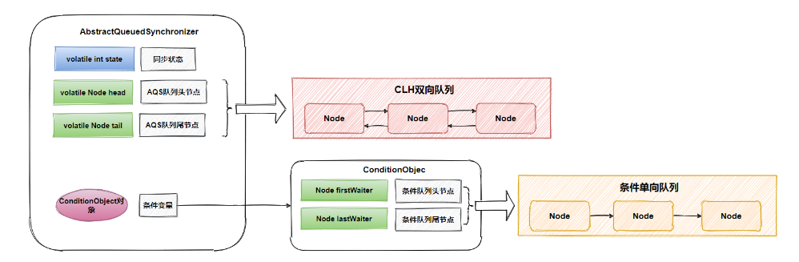
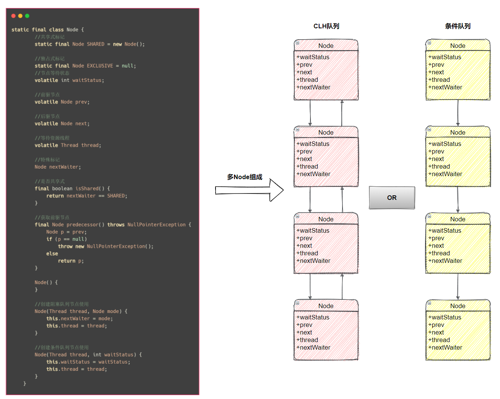
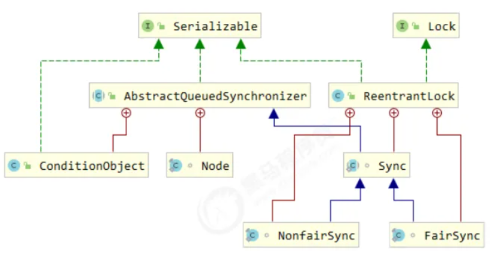

#### AQS

* AbstractQueuedSynchronizer，是阻塞式锁和相关的同步器工具的框架 

  * AbstractQueuedSynchronizer有一个静态内部类Node,属性有

    * volatile Thread thread;

    * volatile Node prev;

    * volatile Node next;

    * volatile int waitStatus;

    * Node nextWaiter;

  * AbstractQueuedSynchronizer的重要属性有
    * private volatile int state;
    * private transient volatile Node head;
    * private transient volatile Node tail;

*  三部分组成，`state`同步状态、`Node`组成的`CLH`队列、`ConditionObject`条件变量（**包含`Node`组成的条件单向队列**），下面会分别对这三部分做介绍。 

  

* State

  * 用 state 属性来表示资源的状态（分独占模式和共享模式），子类需要定义如何维护这个状态，控制如何获取锁和释放锁 

  - - getState - 获取 state 状态 
    - setState - 设置 state 状态 
    - compareAndSetState - cas 机制设置 state 状态 
    - 独占模式是只有一个线程能够访问资源，而共享模式可以允许多个线程访问资源 

  * 在A Q S中维护了一个同步状态变量state，getState函数获取同步状态，setState、compareAndSetState函数修改同步状态，对于AQS来说，线程同步的关键是对state的操作，可以说获取、释放资源是否成功都是由state决定的，比如state>0代表可获取资源，否则无法获取，所以state的具体语义由实现者去定义，现有的ReentrantLock、ReentrantReadWriteLock、Semaphore、CountDownLatch定义的state语义都不一样。

    * ReentrantLock的state用来表示是否有锁资源
    * ReentrantReadWriteLock的state高16位代表读锁状态，低16位代表写锁状态
    * Semaphore的state用来表示可用信号的个数
    * CountDownLatch的state用来表示计数器的值

* 等待队列

  * 提供了基于 FIFO 的等待队列，类似于 Monitor 的 EntryList 
  * CLH是AQS内部维护的FIFO（先进先出）双端双向队列（方便尾部节点插入），基于链表数据结构，当一个线程竞争资源失败，就会将等待资源的线程封装成一个Node节点，通过CAS原子操作插入队列尾部，最终不同的Node节点连接组成了一个CLH队列，所以说AQS通过CLH队列管理竞争资源的线程，个人总结CLH队列具有如下几个优点：

    * 先进先出保证了公平性
    * 非阻塞的队列，通过自旋锁和C A S保证节点插入和移除的原子性，实现无锁快速插入
    * 采用了自旋锁思想，所以CLH也是一种基于链表的可扩展、高性能、公平的自旋锁

* 条件变量

  * 条件变量来实现等待、唤醒机制，支持多个条件变量，类似于 Monitor 的 WaitSet 

* Node内部类

  * `Node`是`A Q S`的内部类，每个等待资源的线程都会封装成`Node`节点组成`C L H`队列、等待队列，所以说`Node`是非常重要的部分，理解它是理解`A Q S`的第一步。

      

* 子类需要实现的方法

  * 子类主要实现这样一些方法（默认抛出 UnsupportedOperationException） 
    - tryAcquire 
    - tryRelease 
    - tryAcquireShared 
    - tryReleaseShared 
    - isHeldExclusively

  

  

  

#### ReentrantLock 原理

* 先从构造器开始看，默认为非公平锁实现

  ```java
  public ReentrantLock() {
     sync = new NonfairSync();
  }
  ```

* NonfairSync 继承自 AQS 

  

