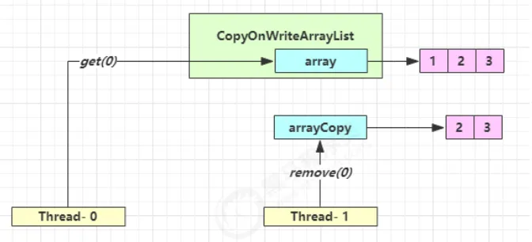

#### CopyOnSet

* `CopyOnWriteArraySet` 是它的马甲 底层实现采用了 `写入时拷贝` 的思想，增删改操作会将底层数组拷贝一份，更改操作在新数组上执行，这时不影响其它线程的**并发读**，**读写分离**。 以新增为例：

  ```java
  public boolean add(E e) {
      synchronized (lock) {
          // 获取旧的数组
          Object[] es = getArray();
          int len = es.length;
          // 拷贝新的数组（这里是比较耗时的操作，但不影响其它读线程）
          es = Arrays.copyOf(es, len + 1);
          // 添加新元素
          es[len] = e;
          // 替换旧的数组
          setArray(es);
          return true;
      }
  }
  ```

  * 这里的源码版本是 Java 11，在 Java 1.8 中使用的是可重入锁而不是 synchronized

  ```java
  public void forEach(Consumer<? super E> action) {
      Objects.requireNonNull(action);
      for (Object x : getArray()) {
          @SuppressWarnings("unchecked") E e = (E) x;
          action.accept(e);
      }
  }
  ```

* get弱一致性

    

* 不要觉得弱一致性就不好 
  - 数据库的 MVCC 都是弱一致性的表现 
  - 并发高和一致性是矛盾的，需要权衡

#### CopyOnWriteArrayList

* 对于大部分业务场景来说，读取操作往往是远大于写入操作的。由于读取操作不会对原有数据进行修改，因此，对于每次读取都进行加锁其实是一种资源浪费。相比之下，我们应该允许多个线程同时访问 List 的内部数据，毕竟对于读取操作来说是安全的。

* 了将读操作性能发挥到极致，`CopyOnWriteArrayList` 中的读取操作是完全无需加锁的。更加厉害的是，写入操作也不会阻塞读取操作，只有写写才会互斥。这样一来，读操作的性能就可以大幅度提升。

* `CopyOnWriteArrayList` 线程安全的核心在于其采用了 **写时复制（Copy-On-Write）** 的策略

* 三个构造方法

  ```java
  // 创建一个空的 CopyOnWriteArrayList
  public CopyOnWriteArrayList() {
      setArray(new Object[0]);
  }
  
  // 按照集合的迭代器返回的顺序创建一个包含指定集合元素的 CopyOnWriteArrayList
  public CopyOnWriteArrayList(Collection<? extends E> c) {
      Object[] elements;
      if (c.getClass() == CopyOnWriteArrayList.class)
          elements = ((CopyOnWriteArrayList<?>)c).getArray();
      else {
          elements = c.toArray();
          // c.toArray might (incorrectly) not return Object[] (see 6260652)
          if (elements.getClass() != Object[].class)
              elements = Arrays.copyOf(elements, elements.length, Object[].class);
      }
      setArray(elements);
  }
  
  // 创建一个包含指定数组的副本的列表
  public CopyOnWriteArrayList(E[] toCopyIn) {
      setArray(Arrays.copyOf(toCopyIn, toCopyIn.length, Object[].class));
  }
  ```

* 插入元素

  * `add(E e)`：在 `CopyOnWriteArrayList` 的尾部插入元素。

  * `add(int index, E element)`：在 `CopyOnWriteArrayList` 的指定位置插入元素。

  * `addIfAbsent(E e)`：如果指定元素不存在，那么添加该元素。如果成功添加元素则返回 true。

    ```java
    // 插入元素到 CopyOnWriteArrayList 的尾部
    public boolean add(E e) {
        final ReentrantLock lock = this.lock;
        // 加锁
        lock.lock();
        try {
            // 获取原来的数组
            Object[] elements = getArray();
            // 原来数组的长度
            int len = elements.length;
            // 创建一个长度+1的新数组，并将原来数组的元素复制给新数组
            Object[] newElements = Arrays.copyOf(elements, len + 1);
            // 元素放在新数组末尾
            newElements[len] = e;
            // array指向新数组
            setArray(newElements);
            return true;
        } finally {
            // 解锁
            lock.unlock();
        }
    } 
    ```

  

  

* 删除元素

  * `remove(int index)`：移除此列表中指定位置上的元素。将任何后续元素向左移动（从它们的索引中减去 1）。

  * `boolean remove(Object o)`：删除此列表中首次出现的指定元素，如果不存在该元素则返回 false。

  * `boolean removeAll(Collection<?> c)`：从此列表中删除指定集合中包含的所有元素。

  * `void clear()`：移除此列表中的所有元素。

    ```java
    public E remove(int index) {
        // 获取可重入锁
        final ReentrantLock lock = this.lock;
        // 加锁
        lock.lock();
        try {
             //获取当前array数组
            Object[] elements = getArray();
            // 获取当前array长度
            int len = elements.length;
            //获取指定索引的元素(旧值)
            E oldValue = get(elements, index);
            int numMoved = len - index - 1;
            // 判断删除的是否是最后一个元素
            if (numMoved == 0)
                 // 如果删除的是最后一个元素，直接复制该元素前的所有元素到新的数组
                setArray(Arrays.copyOf(elements, len - 1));
            else {
                // 分段复制，将index前的元素和index+1后的元素复制到新数组
                // 新数组长度为旧数组长度-1
                Object[] newElements = new Object[len - 1];
                System.arraycopy(elements, 0, newElements, 0, index);
                System.arraycopy(elements, index + 1, newElements, index,
                                 numMoved);
                //将新数组赋值给array引用
                setArray(newElements);
            }
            return oldValue;
        } finally {
             // 解锁
            lock.unlock();
        }
    }
    ```

    

  