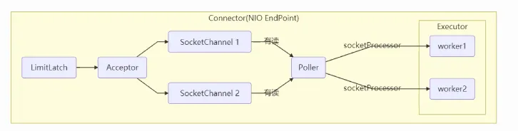

##### BlockingQueue

* 基本的出队入队

  ```java
  public class LinkedBlockingQueue<E> extends AbstractQueue<E> implements BlockingQueue<E>, java.io.Serializable {
      static class Node<E> {
          E item;
          /**
          * 下列三种情况之一
          * - 真正的后继节点
          * - 自己, 发生在出队时
          * - null, 表示是没有后继节点, 是最后了
          */
          Node<E> next;
          Node(E x) { item = x; }
      }
  }
  ```

* 初始化链表 `last = head = new Node(null);` Dummy 节点用来占位，item 为 null

  * Dummy是哨兵

    

* 当一个节点入队` last = last.next = node;`

    

* 再来一个节点入队` last = last.next = node;`

    

* 出队

  ```java
  Node<E> h = head;
  Node<E> first = h.next; 
  h.next = h; // help GC
  head = first; 
  E x = first.item;
  first.item = null;
  return x;
  ```

* h = head 

  

  

* first = h.next

  

  

* h.next = h

  

  

* head = first

  

  

* 第一个其实是Dummy，所以把出队这个变成NULL，让他当Dummy

  ```java
  E x = first.item;
  first.item = null;
  return x;
  ```

  

  

  

* 高明之处在于用了两把锁和 dummy 节点 

  - 用一把锁，同一时刻，最多只允许有一个线程（生产者或消费者，二选一）执行 
  - 用两把锁，同一时刻，可以允许两个线程同时（一个生产者与一个消费者）执行 

  - - 消费者与消费者线程仍然串行 
    - 生产者与生产者线程仍然串行 

* 当节点总数大于 2 时（包括 dummy 节点），putLock 保证的是 last 节点的线程安全，takeLock 保证的是 head 节点的线程安全。两把锁保证了入队和出队没有竞争 

* 当节点总数等于 2 时（即一个 dummy 节点，一个正常节点）这时候，仍然是两把锁锁两个对象，不会竞争 

* 当节点总数等于 1 时（就一个 dummy 节点）这时 take 线程会被 notEmpty 条件阻塞，有竞争，会阻塞

* 主要列举 LinkedBlockingQueue 与 ArrayBlockingQueue 的性能比较 

  - Linked 支持有界，Array 强制有界 
  - Linked 实现是链表，Array 实现是数组 
  - Linked 是懒惰的，而 Array 需要提前初始化 Node 数组 
  - Linked 每次入队会生成新 Node，而 Array 的 Node 是提前创建好的 
  - Linked 两把锁，Array 一把锁

  

  

  

* ConcurrentLinkedQueue 的设计与 LinkedBlockingQueue 非常像，也是 

  - 两把【锁】，同一时刻，可以允许两个线程同时（一个生产者与一个消费者）执行 
  - dummy 节点的引入让两把【锁】将来锁住的是不同对象，避免竞争 
  - ==只是这【锁】使用了 cas 来实现== 

  * 事实上，ConcurrentLinkedQueue 应用还是非常广泛的。例如之前讲的 Tomcat 的 Connector 结构时，Acceptor 作为生产者向 Poller 消费者传递事件信息时，正是采用了ConcurrentLinkedQueue 将 SocketChannel 给 Poller 使用

      

  

   