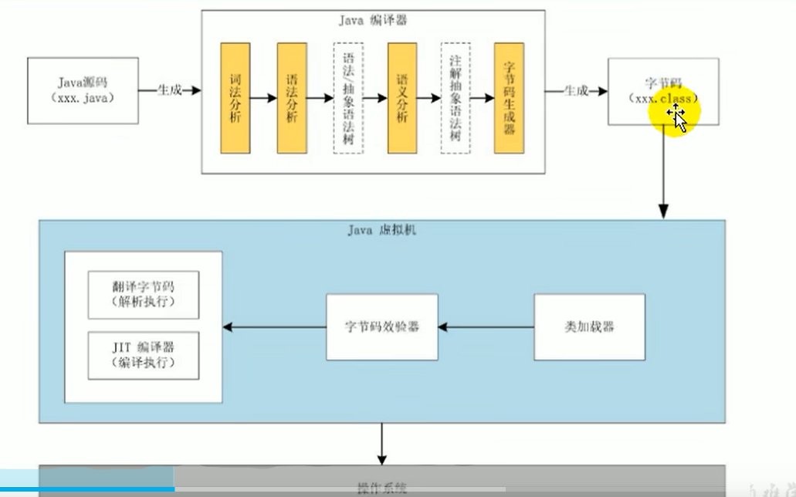

#### 介绍

* Java虚拟机就是二进制字节码的运行环境，负责装载字节码到其内部，解释/编译为对应平台上的机器指令执行。每一条Java指令，Java虚拟机规范中都有详细定义，如怎么取操作数，怎么处理操作数，处理结果放在哪里。

* 特点：一次编译，到处运行，自动内存管理机制，垃圾回收机制

* 执行流程

  

* Java编译器输入的指令流基本上是一种基于栈的指令集架构，另外一种指令集架构则是基于寄存器的指令集架构。

  * 基于栈式架构的特点
    * 设计和实现更简单，适用于资源受限的系统:
    * 避开了寄存器的分配难题:使用零地址指令方式分配。
    * 指令流中的指令大部分是零地址指令，其执行过程依赖于操作栈。指令集更小，编译器容易实现。
    * 不需要硬件支持，可移植性更好，更好实现跨平台
    * 特点：指令集小，指令多，性能比寄存器差
  * 基于寄存器架构的特点
    * 典型的应用是x86的二进制指令集:比如传统的Pc以及Android的Davlik虚拟机。
    * 指令集架构则完全依赖硬件，可移植性差性能优秀和执行更高效;
    * 花费更少的指令去完成一项操作。
    * 在大部分情况下，基于寄存器架构的指令集往往都以一地址指令、二地址指令和三地址指令为主，而基于栈式架构的指令集却是以零址址:指令为主。

* JVM的生命周期

  * Java虚拟机的启动是通过引导类加载器(bootstrap class loader)创建一个初始类(initial class)来完成的，这个类是由虚拟机的具体实现指定的。

* **内存泄漏： leak of memory，一个对象分配内存之后，在使用结束时未及时释放，导致一直占用内存，没有及时清理，使实际可用内存减少，就好像内存泄漏了一样    **

  
  
* 虚拟机的退出

  * 程序正常执行结束
  * 程序在执行过程中遇到了异常或错误而异常终止由于操作系统出现错误而导致Java虚拟机进程终止
  * 某线程调用Runtime类或System类的exit方法，或 Runtime类的halt方法，并且Java安全管理器也允许这次exit或halt操作。
  * 除此之外，JNI ( Java Native Interface)规范描述了用JNI Invocation API来加载或卸载Java虚拟机时，Java虚拟机的退出情况。

####JVM发展历程

* Sun classicVM
  * 早在1996年Java1.0版本的时候，sun公司发布了一款名为Sun classicVM的Java虚拟机，它同时也是世界上第一款商用Java虚拟机，JDK1.4时完全被淘汰。
  * 这款虚拟机内部只提供解释器。（逐行解释，效率过低）
  * 如果使用JIT编译器（如果一些代码反复使用，就会编译成本地机器指令，缓存起来，下次直接使用）,就需要进行外挂。但是一旦使用了JIT编译器，JIT就会接管虚拟机的执行系统。解释器就不再工作。解释器和编译器不能配合工作。
  * 现在hotspot内置了此虚拟机。
* Exact VM
  * 为了解决上一个虚拟机问题，jdk1.2时，sun提供了此虚拟机。
  * Exact Memory Management:准确式内存管理
    * 也可以叫Non-conservative/Accurate Memory Management
    * 虚拟机可以知道内存中某个位置的数据具体是什么类型。
  * 具备现代高性能虚拟机的雏形
    * 热点探测
    * 编译器与解释器混合工作模式
    * 只在solaris平台短暂使用，其他平台上还是classic vm
* SUN公司的Hotspot VM(目前一直在用)
  * JDK1.3时,HotSpot vM成为默认虚拟机
  * 目前Hotspot占有绝对的市场地位，称霸武林。不管是现在仍在广泛使用的JDK6，还是使用比例较多的JDK8中，默认的虚拟机都是HotSpot
  * sun/oracle JDK和openJDK的默认虚拟机
  * 默认介绍的虚拟机都是HotSpot，相关机制也主要是指Hotspot的CC机制。(比如其他两个商用虚拟机都没有方法区的概念)
  * 从服务器、桌面到移动端、嵌入式都有应用。
  * 名称中的Hotspot指的就是它的热点代码探测技术。
    * 通过计数器找到最具编译价值代码，触发即时编译或栈上替换
    * 通过编译器与解释器协同工作，在最优化的程序响应时间与最佳执行性能中取得平衡
* BEA的Jrockit（商用）
  * 专注于服务器端应用
    * 它可以不太关注程序启动速度，**因此JRockit内部不包含解析器实现，全部代码
      都靠即时编译器编译后执行。**
    * 大量的行业基准测试显示，JRockit JVM是世界上最快的JVM。
    * 使用 JRockit 产品，客户已经体验到了显著的性能提高（一些超过了70% )和
      硬件成本的减少(达50%）。
    * 优势:全面的Java运行时解决方案组合
      * JRockit 面向延迟敏感型应用的解决方案 JRockit Real Time提供以毫秒或微秒级的 JVM 响应时间，适合财务、军事指挥、电信网络的需要
      * Missioncontrol服务套件，它是一组以极低的开销来监控、管理和分析生产环境中的应用程序的工具。
      * 2008年，BEA 被oracle收购。
      * oracle表达了整合两大优秀虚拟机的工作，大致在JDK 8中完成。整合的方式是在 HotSpot 的基础上，移植JRockit的优秀特性。
* IBM的J9
  * 全称:IBM Technology for Java virtual Machine，简称IT4J，内部代号:J9
  * 市场定位与HotSpot接近，服务器端、桌面应用、嵌入式等多用途VM广泛用于IBM的各种Java产品。
  * 目前，有影响力的三大商用虚拟机之，也号称是世界上最快的Java虚拟机。2017年左右，IBM发布了开源J9 VM，命名为openJ9，交给Eclipse基金会管理，也称为 Eclipse openJ9
* KVM和lcDc/CLDC Hotspot
  * oracle在Java ME产品线上的两款虚拟机为: CDC/CLDC HotSpotImplementation vM
    KVM（Kilobyte）是CLDC-HI早期产品
  * 目前移动领域地位尴尬，智能手机被Android和ioS二分天下。
  * KVM简单、轻量、高度可移植，面向更低端的设备上还维持自己的一片市场
    智能控制器、传感器
  * 老人手机、经济欠发达地区的功能手机
* Microsoft JVM
  * 微软为了在IE3浏览器中支持Java Applets，开发了Microsoft JVM。只能在windowT怡下运行。但确是当时windows下性能最好的Java VM。1997年，sun以侵犯商标、不正当竞争罪名指控微软成功，赔了sun很多钱。微软在windowsxP SP3中抹掉了其VM。现在windows上安装的jdk都是HotSpot。
* TaobaoJVM
  * 由AliJVM团队发布。阿里，国内使用Java最强大的公司，覆盖云计算、金融、物流、电商等众多领域，需要解决高并发、高可用、分布式的复合问题。有大量的开源产品。基于openJDK开发了自己的定制版木AlibabaJDK，简称AJDK。是整个阿里Java休系的基石。
  * 基于openJDK HotSpot vM发布的国内第一个优化、深度定制且开源的高性能服务器版Java虚拟机。
  * 创新的GCIH (Gc invisible heap )技术实现了off-heap ，即将生命周期较长的Java对象从heap中移到heap之外，并且GC不能管理GCIH内部的Java 对象，以此达到降低GC的回收频率和提升Gc的回收效率的目的。
  * GCIH 中的对象还能够在多个Java虚拟机进程中实现共享使用crc32指令实现JVM intrinsic降低JN工的调用开销PMU hardware的Java profiling tool和诊断协助功能针对大数据场景的zenGC
  * taobao vm应用在阿里产品上性能高，硬件严重依赖intel的cpu，损失了兼容性，但提高了性能
    目前已经在淘宝、天猫上线，把oracle官方JVM 版本全部替换了。

* Dalvik VM
  * 谷歌开发的，应用于Android系统，并在Android2.2中提供了JIT，发展迅猛。Dalvik VM只能称作虚拟机，而不能称作“Java虚拟机”，它没有遵循Java虚拟机规范
  * 不能直接执行Java的class文件基于寄存器架构不是jvm的栈架构。
  * 执行的是编译以后的dex (Dalvik Executable）文件。执行效率比较高。它执行的dex (Dalvik Executable）文件可以通过class文件转化而来，
  * 使用Java语法编写应用程序，可以直接使用大部分的Java API等。
  * Android 5.0使用支持提前编译（Ahead of Time Compilation，AoT)的ART VM替换Dalvik VM。