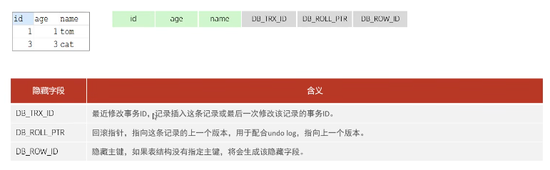
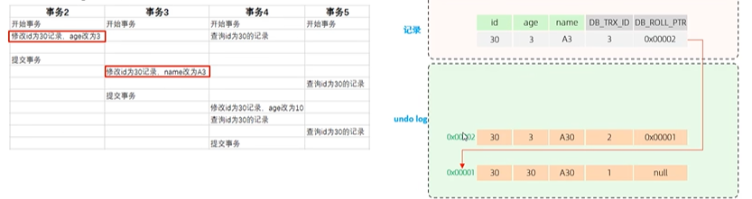
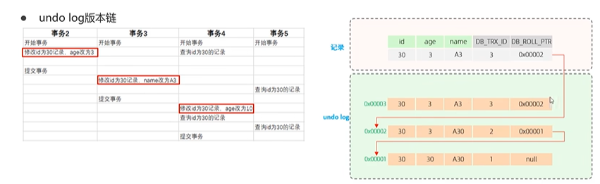
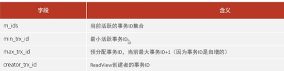
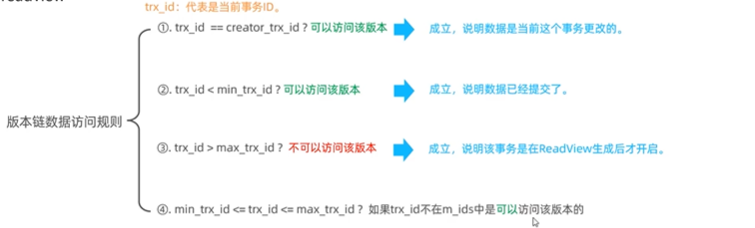
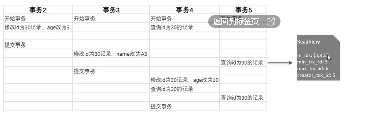
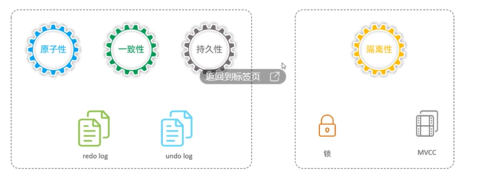
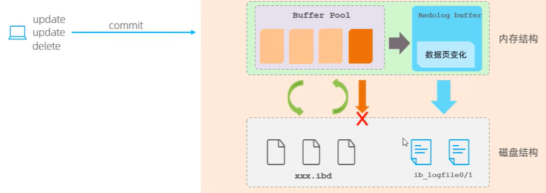
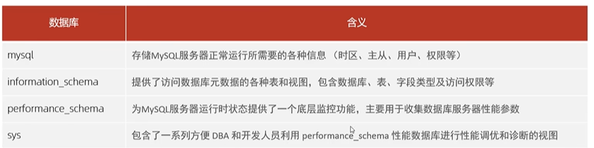

#### MVCC

* 读取的是记录的最新版本，读取时还要保证其他并发事务不能修改当前记录，会对读取的记录进行加锁。对于我们日常的操作，如:select ...lock in share mode(共享锁)，select ... for update、update、insert、 delete(排他锁)都是一种当前读。

* ==简单的select(不加锁）就是快照读，快照读，读取的是记录数据的可见版本，有可能是历史数据，不加锁，是非阻塞读==. 

  * Read Committedr:每次select，都生成一个快照读。
  * Repeatable Read:开启事务后第一个select语句才是快照读的地方。.
  * Serializable:快照读会退化为当前读。

* MVCC全称Multi-Version Concurrency Control，多版本并发控制。指维护一个数据的多个版本，使得读写操作没有冲突，快照读为My5QL实现MVCC提供了一个非阻塞读功能。MVCC的具体实现，还需要依赖于数据库记录中的三个隐式字段、undo log日志、readView。

  * 记录中的隐藏字段

    

    * 如果该表有主键，就不会有隐藏字段DB_ROW_ID
    * 查看隐藏信息 ibd2sdi std文件

    

  * undo log

    * 回滚日志，在insert.、update、delete的时候产生的便于数据回滚的日志。
      当insert的时候，产生的undo log日志只在回滚时需要，在事务提交后，可被立即删除。
      而update, delete的时候，产生的undo log日志不仅在回滚时需要，在快照读时也需要，不会立即被删除。

  * undolog版本链

    * 事务二执行

      

    * 事务3和事务4执行

      

    * readview

      * ReadView(读视图）是快照读SQL执行时MVCC提取数据的依据，记录并维护系统当前活跃的事务（未提交的)id。

      * Readview中包含了四个核心字段:

        

        

      * 不同的隔离级别，生成Readview的时机不同:

        * READ COMMITTED︰在事务中每一次执行快照读时生成Readview.
        * REPEATABLE READ:仅在事务中第一次执行快照读时生成ReadView，后续复用该ReadView.

      * 分析

        

        * 事务5执行到id=30记录的这一行时，事务2已经提交事务，事务3和4还没有，所以活动事务3,4,5。最小活动是3，预分配是最大活动事务+1，是6，当前语句的创建id是5

* 事务原理

  * 事务是一组操作的集合，它是一个不可分割的工作单位，事务会把所有的操作作为一个整体一起向系统提交或撤销操作请求，即这些操作要么同时成功，要么同时效败。

    

  * 重做日志，记录的是事务提交时数据页的物理修改，是用来实现事务的持久性。

    * 该日志文件由两部分组成:重做日志缓冲(redo log buffer)以及重做日志文件（redo log file) ,前者是在内存中，后者在磁盘中。当事务提交之后会把所有修改信息都存到该日志文件中,用于在刷新脏页到磁盘,发生错误时,进行数据恢复使用。

      

  * UndoLog

    * 回滚日志，用于记录数据被修改前的信息，作用包含两个:提供回滚和MVCC(多版本并发控制)。
    * undo log和redo log记录物理日志不一样，它是逻辑日志。可以认为当delete一条记录时,undo log中会记录一条对应的insert记录，反之亦然，当update一条记录时，它记录一条对应相反的update记录。当执行rollback时，就可以从undo log中的逻辑记录读取到相应的内容并进行回滚。
    * ==Undo log销毁: undo log在事务执行时产生，事务提交时，并不会立即删除undo log，因为这些日志可能还用于MVCC。==
    * Undo log存储: undo log采用段的方式进行管理和记录，存放在前面介绍的rollback segment回滚段中，内部包含1024个undo logsegment。

*  mysql自带的数据库

  