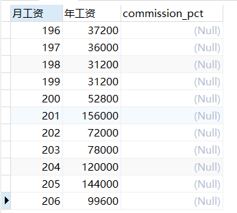
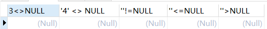

#### SQL

* SQL(Structured Query Language，结构化查询语言）是使用关系模型的数据库应用语言，与数据直接打交道，由IBM上世纪7o年代开发出来。后由美国国家标准局（ANSI)开始着手制定sQL标准，先后有SQL-86 ,SQL-89 , SQL-92 , SQL-99等标准。

* SQL语言的分类：
  * DDL数据定义语言  CREATE  \ALTER \DROP \ RENAME\ TRUNCATE
  
  * DQL（数据查询语言）: 查询语句，凡是select语句都是DQL。
  
  * DML:数据操作语言  INSERT\ DELETE\````````````PDATE
  
  *  DCL:数据控制语言 COMMIT\ ROLLBACK\ SAVEPOINT \REVOKE
    
  * TCL（事务控制语言）：commit提交事务，rollback回滚事务。(TCL中的T是Transaction)
  
    ```
    DQL 数据查询语言Data Query Language
    	select 查询
    	
    DML 数据操作语言Data Manipulation Language
    	insert 插入
    	delete 删除（数据）
    	update 更新
    	
    DDL 数据定义语言Data Definition Language
    	create 创建
    	drop 删除（表、数据库、约束、触发程序等）
    	alter 修改（这个用于改表结构）
    	Truncate语句：清空表里的数据。
    		
    DCL 数据控制语言Data Control Language
    	grant 给与权限
    	revoke 回收权限
    	
    TCL 事务控制语言Transaction Control Language
    	commit 事务提交
    	rollback 事务回滚
    	Savepoint语句：为回退而存在,个数没有限制,与虚拟机中快照类似。savepoint是事务中的一点。用于取消部分事务，当结束事务时，会自动的删除该事务中所定义的所有保存点
    	Set transaction语句：设置事务的各种状态，比如只读、读/写、隔离级别
    ```
  
* **最后一句SQL可以没有分号，不会报错。在cmd命令行，可以用\G或\g代替分号**

* 导入SQL文件

  ```
  xxx.sql这种文件被称为SQL脚本文件。
  脚本文件中编写的是大量的SQL语句。
  #我们执行SQL脚本文件时，其中的所有SQL语句都会被执行。
  批量的执行SQL语句时，可以采用SQL脚本文件。
  MySQL中执行脚本文件的方法：
  在DOS窗口中输入
  source + 脚本路径
  或者是通过工具进行导入
  
  当需要导入大量的SQL数据的时候，可以使用导入SQL脚本的形式进行写入。
  ```

  *   注意：路径中不能带有中文、空格 

* 基本规则
  
  * SQL以写在一行或者多行。为了提高可读性，各子句分行写，必要时使用缩进每条命令以;或\g或\G结束
  * 关键字不能被缩写也不能分行关于标点符号
  * 必须保证所有的（）、单引号、双引号是成对结束的。必须使用英文状态下的半角输入方式
  * 字符串型和日期时间类型的数据可以使用单引号("）表示
  * 列的别名，尽量使用双引号(-)，而且不建议省略as


* SQL大小写规范
  * .MySQL在 Windows 环境下是大小写不敏感的
  *  MysQL在 Linux环境下是大小写敏感的
    * 数据库名、表名、表的别名、变量名是严格区分大小写的
    * 关键字、函数名、列名(或字段名)、列的别名(字段的别名)是忽略大小写的。
  * 推荐采用统一的书写规范:
    * 数据库名、表名、表别名、字段名、字段别名等都小写
    * SQL关键字、函数名、绑定变量等都大写
* SQL注释
  * 单行注释 #
  * 多行注释 /**/  多行注释不能嵌套
  * 单行注释通用 -- ，叫杠杠空格，一定不要忘了最后有空格
* 命名规则
  * 数据库、表名不得超过30个字符，变量名限制为29个。必须只能包含A-Z,a-z,0-9,_共63个字符
  * 数据库名、表名、字段名等对象名中间不要包含空格
  * 同一个MySQL软件中，数据库不能同名;同一个库中，表不能重名;同一个表中，字段不能重名
  * 必须保证你的字段没有和保留字、数据库系统或常用方法冲突。如果坚持使用，请在SQL语句中使用`(着重号)引起来
  * 保持字段名和类型的一致性，在命名字段并为其指定数据类型的时候，定要保证一致性。假如数据类型在一个表里是整数。那在另一个表里可就别变成字符型了
* 导入数据的方式
  * source 文件的全路径名    这种方法必须要用命令行执行
  * 基于具体的图形化界面的工具可以导入数据


##### 基本查询语句

* 格式

  ```sql
  select 字段名 from 表名;
  ```

  * ==字段名和表名都是标识符==

* SELECT 1;结果就出来个1。SELECT 1+1;结果就是2 完整写法是SELECT 1 FROM DUAL；#dual是一个伪表。用不到指定真实的表。  *表示为所有列，即所有字段。查询最后一个字段不用加逗号

* 查询所有字段

  * 第一种方式：把所有的字段写上

    第二种方式：用*号代替所有字段（会把 “ * ”号转为字段名，**效率低，可读性差，且无法按照自己想要的顺序进行排序**。==在实际开发中不建议==）

* 列的别名

  * 方法一：列名+空格+别名（缺陷，别名前面是个表达式，可能把表达式的最后一项字段当成该字段的别名，所以方法三用双引号可以解决）

  * 方法二：列名+AS+别名

    ```sql
    select deptno as '序号',dname as NAME from dept;
    ```

  * 方法三：列名+空格+“别名”（注意，别用单引号，虽然单引号不报错，因为Mysql支持不严谨，Orcle会报错，在所有数据库中，单引号是字符串标准）

    ```sql
    SELECT salary*12 AS 'ANUAL SALARY' FROM employees;
    ```

  * ********注意：只是将表头显示的列名改为对应的名称，原字段名不会发生改变，因为select语句只负责查询 **

  * ==别名里面有空格怎么办?,此时只能采用方法三解决==

  * ==别名是中文在低版本中最好用单引号括起来==

* 去重DISTINCT

  * 注意DISTINCT写在所有字段前，即每个字段都去重，不过没有意义，一般只查询一个字段并去重，不写DISTINCT，默认ALL

  * **** **把查询结果去除重复记录【distinct】 distinct只能出现在所有字段的最前方。 distinct出现在job,deptno两个字段之前，表示两个字段联合起来去重。（即只要有一个属性不同，他们就是不相同的）**

    ```sql
    select distinct deptno,job from emp;
    ```

    

* 空处理（只要有空参加的运算结果都为null）

  * IFNULL(看是不是为null,当作什么值表示)IFNULL(commission_pct,0)
  * 空值参与运算结果也为null，空值null，所以一般用IF语句判断，是null可以按业务处理

  ```mysql
  SELECT employee_id "月工资",salary *(1+IFNULL(commission_pct,0))*12 "年工资",commission_pct FROM employees;
  #commission_pct利率
  ```

  

* ==着重号 ``，如果表名与关键字冲突了，把表名用着重号引起来就可以执行==

* 查询字段 可以使用数学表达式对数据进行计算 

  ```sql
  select ename, sal*12 as '年薪' from emp;
  ```

  

* **查询常数,，写一个常数，又不存在表中，会給每一行添加一个常数行**

  ```mysql
  SELECT '尚硅谷',employee_id,last_name FROM employees;
  ```

  

* DESCRIBE描述表结构，可以简写用DESC

  

* 条件查询

  ```txt
  = 等于
  <> 或者 != 不等于
  < 小于
  <= 小于等于
  > 大于
  >= 大于等于
  between ... and ... 两个值之间，等同于 >= and <=
  is null 判断是否为空 (is not null)判断是否不为空
  and &&并且 
  or ||或者
  in 包含 相当于多个 or （not in 不在这个范围中)
  not 取非，主要用于 is 或者 in 中
  like 模糊查询，使用各种通配符进行模糊匹配
  		% 或者 _ 匹配
  		% 匹配任意多个字符
  		_ 下划线只匹配一个字符
  ```

  

* 过滤元素WHERE

  ```mysq
  SELECT * FROM employees WHERE department_id=90;
  SELECT * FROM employees WHERE last_name='king';
  //等价于
  SELECT * FROM employees WHERE last_name='KING';
  //在oracle就会报错，因为大小写在oracle会区分，mysql设计的不严谨
  ```

  

  

* 字符串用单引号，SQL在windows上不区分大小写，但是字符串区分大小写，但是字符串改变大小写也不会报错，因为MySQL自己的方言，但是Orcle会报错

* 练习一：计算十二个月基本工资和奖金并起个别名

  ```sql
  SELECT salary*(1+IFNULL(commission_pct,0))*12 AS "ANUAL SALARY" FROM employees;
  ```

  

* 练习二：查询工资大于12000

  ```sql
  SELECT salary,last_name FROM employees WHERE salary>12000;
  ```

  

##### 运算符

* **SELECT后面可以接变量或者字面量（数字或者字符串）**

* 算术运算符：算术运算符主要用于数学运算，其可以连接运算符前后的两个数值或表达式，对数值或表达式进行加（+)、减(-)、乘(*)、除（/）和取模（%）运算。

  ```sql
  SELECT 100,100+0,100-0,100+50,100+50-30,100+35.5,100+20*3,100+'1' FROM DUAL;
  ```

  
  * SQL中+没有拼接作用，只有加法作用

    ```SQL
    SELECT 100+'a' FROM DUAL;
    ```

    

  * 字符串里不是数的会看做0处理，不会通过asc转换

  * NULL参加运算结果为NULL

    ```SQL
    SELECT 100+NULL FROM DUAL;
    ```

    

  * 除法

    ```sql
    SELECT 100,100*1,100*1.0,100/1.0,100/2,100/3,100+2*5/2,100 DIV 0 FROM DUAL;
    ```

    

    * 分母为0结果为null

  * 取模运算

    ```SQL
    SELECT 12%3,12%5,12 MOD -5,-12 % 5,-12%-5
    ```

    

    * 符号和模数无关，只和被模数有关
  
* 比较运算符

  * 比较运算符用来对表达式左边的操作数和右边的操作数进行比较，比较的结果为真则返回1，比较的结果为假则返回o，其他情况则返回NULL。

    

  * 等号运算符（=）判断等号两边的值、字符串或表达式是否相等，如果相等则返回1，不相等则返回0。在使用等号运算符时，遵循如下规则:

    * 如果等号两边的值、字符串或表达式都为字符串，则MySQL会按照字符串进行比较，其比较的是每个字符串中字符的ANSI编码是否相等。
    
    * 如果等号两边的值都是整数，则MySQL会按照整数来比较两个值的大小。
    
    * 如果等号两边的值一个是整数，另一个是字符串，则MySQL会将字符串转化为数字进行比较
    
    * 如果等号两边的值、字符串或表达式中有一个为NULL，则比较结果为NULL.
    
    * 两个NULL比较结果也是NULL，只要有NULL参与判断结果都是NULL
    
    * **数值与字符安川字符串存在隐式转换，如果转化不成功，看做0**
    
    * SQL中等于号只有判断相等的含义，没有赋值的含义
    
      ```java
      SELECT 1=2,1!=2,1='1',1='a',0='a','ab'='a','ab'='ab','a'='b',''=NULL;
      ```
    
      
    
  * 安全等与<=>
  
    * 安全等于运算符(<=>)与等于运算符(=)的作用是相似的，==唯一的区别是'<=>'可以用来对NULL进行判断。在两个操作数均为NULL时，其返回值为1，而不为NULL;当一个操作数为NULL时，其返回值为o，而不为NULL。==
  
  * 其它运算符，可以自己验证
  
    ```sql
    SELECT 3<>NULL,'4' <> NULL, ''!=NULL, ''<=NULL,''>NULL;
    ```
  
    
  
  
  * 运算符关键字
  
    
  
    ```SQL
    #查询为NULL
    SELECT last_name,salary,commission_pct FROM employees WHERE commission_pct <=> NULL;
    #或
    SELECT last_name,salary,commission_pct FROM employees WHERE commission_pct IS NULL;
    #或
    SELECT last_name,salary,commission_pct FROM employees WHERE ISNULL(commission_pct);
    #查询不为NULL
    SELECT last_name,salary,commission_pct FROM employees WHERE commission_pct IS NOT NULL;
    #或
    SELECT last_name,salary,commission_pct FROM employees WHERE NOT commission_pct <=> NULL;
    
    #LEAST最小的，GREATEST最大的
    SELECT LEAST('g','b','t'),GREATEST('A','B','C') FROM DUAL;
    SELECT LEAST(first_name,last_name),LEAST(LENGTH(first_name),LENGTH(last_name)) FROM employees;
    
    #查询一个区间BETWEEN AND，左右都是闭区间
    SELECT last_name,salary FROM employees WHERE salary BETWEEN 6000 AND 8000;
    SELECT last_name,salary FROM employees WHERE salary NOT BETWEEN 6000 AND 8000;
    
    #IN(Set) NOT IN (Set) 离散值
    SELECT last_name,salary,department_id FROM employees WHERE department_id=10 OR department_id=20 OR department_id=30;
    SELECT last_name,salary,department_id FROM employees WHERE department_id IN(10,20,30);
    
    #LIKE 模糊查询,%为不确定字符，包括0个，0-多个
    SELECT last_name FROM employees WHERE last_name LIKE '%a%';
    #包含a又包含e
    SELECT last_name FROM employees WHERE last_name LIKE '%a%' AND last_name LIKE '%e%';
    SELECT last_name FROM employees WHERE last_name LIKE '%a%e%' AND last_name LIKE '%e%a%';
    #查询第二个字符为a,一个下划线代表一个不确定的字符
    SELECT last_name FROM employees WHERE last_name LIKE '_a%';
    #查询第二个字符是下划线第三个字符为a的元素，使用转移字符\
    SELECT last_name FROM employees WHERE last_name LIKE '_\_a%';
    
    #正则表达式 REGEXP RLIKE 可以使用正则表达式
    SELECT 'wanwa' REGEXP 'wa.wa' FROM DUAL;
    ```
  
    * between and也可以用来查询字符串
    
      ```sql
      SELECT * FROM emp where ename between 'a' and 'b';
      ```
    
      
    
    * 也可以用来查询日期
    
      ```sql
      select * from emp where HIREDATE BETWEEN '1981-02-20' and '1981-06-09';
      ```
    
      
    
    * between and必须左小右大
    
    * **判断为不为null不能用==，可以用安全等于代替 <=>，但这个不常用**
    
    * **IN (Set) 是离散值，不是区间连续值， 相当于多个 or 。in会忽略null的，即如果你想在in里面查询为null的是不可行的**
    
    * **但是 not in是不会忽略空的，他和in是相反的，他不忽略空就会有问题**
  
* 逻辑运算符

  * 逻辑运算符主要用来判断表达式的真假，在MySQL中，逻辑运算符的返回结果为1、0或者NULL。MysQL中支持4种逻辑运算符如下:

    

  * **说明：OR 和 AND 可以一起用，但是在使用时要注意两者的优先级，由于AND的优先级高于OR，因此先对AND两边的操作数进行操作，再与OR中的操作数结合。所以遇到不确定的，直接使用括号括在一起**

    

    * 处理：用括号处理


* 位运算符

  * 位运算符是在二进制数上进行计算的运算符。位运算符会先将操作数变成二进制数，然后进行位运算，最后将计算结果从二进制变回十进制数。

    

##### 排序与分页

* 排序模板

  ```sql
  select ... from ... where ... order by ...
  ```
  
*  默认排序是升序，也就是默认带有order by [字段名] asc 

* 查询语句排序

  ```sql
  #排序
  #查询结果返回的默认顺序为数据先后添加的顺序
  SELECT * FROM employees;
  #使用ORDER BY 进行排序
  #升序ASC  降序DESC
  SELECT * FROM employees ORDER BY salary DESC;
  #ORDER BY后不写排序方式，默认升序方式
  SELECT * FROM employees ORDER BY salary;
  #列的别名只能在ORDER BY中使用，不能在WHERE使用
  #WHERE只能在FROM之后，ORDER BY之前
  #因为WHERE语句执行顺序比SELECT早，因此执行的时候还没有别名呢，所以用别名会报错
  SELECT employee_id, salary, salary * 12 annual_sal FROM employees ORDER BY annual_sal;
  ```

  

* 多级排序

  ```SQL
  #升序NULL的在最前面
  SELECT employee_id, salary, department_id FROM employees ORDER BY department_id DESC,salary ASC;
  ```

  * 多级排序，谁在前面谁的优先级高

  * ==也可以直接使用列索引，索引从下标1开始==

    ```sql
    select empno,ename,sal from emp order by 3 asc,2 asc;
    ```

    

* 分页limit

  * limit的起始位置跟数组的起始位置是一样的，**不指定起始位置默认从第一行开始取**
  
  ```sql
  #LIMIT分页操作，第一个参数是偏移量，第二个为查询多少个，如果偏移量为0，可以省略
  SELECT employee_id,last_name FROM employees LIMIT 0,20;
  #LIMIT 在 ORDER BY 后面
  SELECT employee_id,last_name,salary 
  FROM employees 
  WHERE salary>6000
  ORDER BY salary DESC
  LIMIT 0,10;
  
  #MYSQL8.0新特性  LIMIT OFFSET 此时参数位置变了，第一个表示查询数量，第二个表示参数
SELECT employee_id,last_name FROM employees LIMIT 20 OFFSET 0;
  ```
  
  * 通用的分页语句
  
    ```txt
    #需求：需要我们每页显示3条数据
    #先确定第二条数据，第二条数据是页面大小，也就是返回的数据条数，所以是3 固定不变
    
    第一页： limit 0,3  [0,1,2]
    第二页： limit 3,3	[3,4,5]
    第三页： limit 6,3	[6,7,8]
    第四页： limit 9,3	[9,10,11]
    指定页面大小为pageSize
    
    指定当前页码为pageNum
    
    那么可以得出
    
    第pageNum页： limit pageSize(pageNum-1),pageSize
    ```
  
    ```java
    //模拟后台管理的分页   
    @Controller
    public static void main(String[] args){
        int pageNo=5;
        int pageSize=10;
        int startIndex = (pageN0 -1 ) * pageSize;
        
        String sql="select ename from emp order by ename desc limit"+startIndex+','+pageSize+";"
        //...然后使用SQL
    }
    ```
  
    

