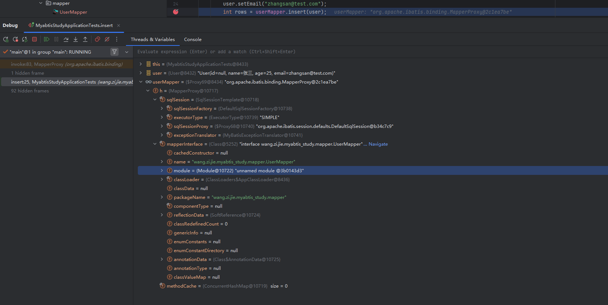
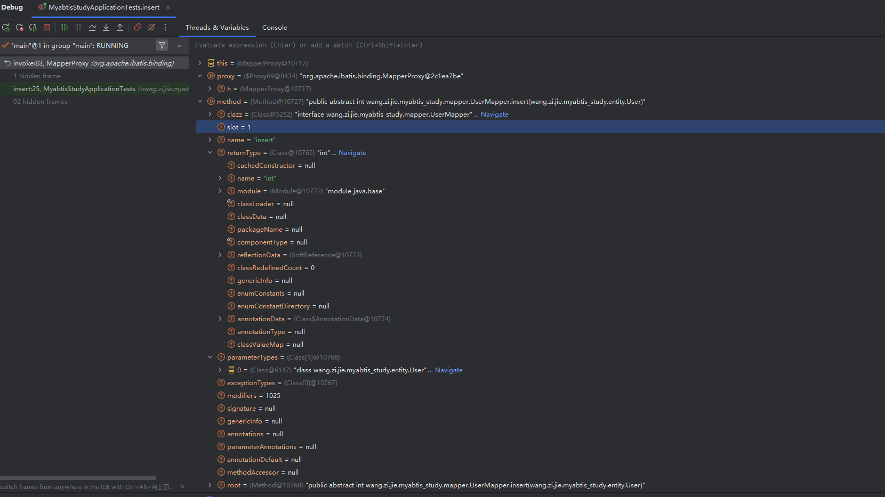
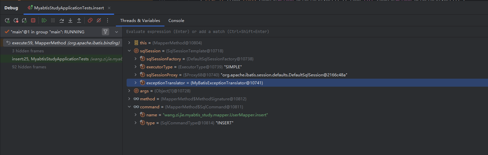

### Mybatis原理概述之SQL执行过程

#### 一、项目初始化

* 我们在之前的基础上写了一个测试用例

  ```java
  @SpringBootTest
  class MyabtisStudyApplicationTests {
  
      @Autowired
      private UserMapper userMapper;
  
      @Test
      void insert() {
          User user = new User();
          user.setName("张三");
          user.setAge(25);
          user.setEmail("zhangsan@test.com");
          int rows = userMapper.insert(user);
  
          assertThat(rows).isEqualTo(1);
          assertThat(user.getId()).isNotNull();
          System.out.println("insert result: " + user);
      }
  
      @Test
      void selectById() {
          // 先插入一条
          User user = new User();
          user.setName("李四");
          user.setAge(30);
          user.setEmail("lisi@test.com");
          userMapper.insert(user);
  
          // 查出来
          User result = userMapper.selectById(user.getId());
          assertThat(result).isNotNull();
          assertThat(result.getName()).isEqualTo("李四");
          System.out.println("selectById result: " + result);
      }
  }
  ```

* 我们在int rows = userMapper.insert(user);打断点

  

  * `this = MyabtisStudyApplicationTests@8433`

    * 当前调试所在对象：你的单元测试类实例，`@数字` 是 JVM 对象内存地址标识。

  * `user = User@8432 "User(id=null, name=张三, age=25, email=zhangsan@test.com)"`

    * 待插入 / 操作的实体对象：主键 `id` 为 null，说明是新增用户，内存地址 `8432`。

  *  `userMapper = $Proxy69@8434 "org.apache.ibatis.binding.MapperProxy@2c1ea7be"`

    * 你注入的 `UserMapper` 代理对象：

    - `$Proxy69`：JDK 动态代理自动生成的代理类名
    - 底层持有 `MapperProxy` 实例（也就是下面的 `h` 对象）
    - 如果这里是`null`：说明 Mapper 没扫描到、注解 / 配置写错；存在这个代理对象，才说明`@MapperScan`、`@Mapper`配置生效，可以正常调用数据库方法。

  * h = MapperProxy@10717（Mapper 代理处理器）

    * `MapperProxy` 是 MyBatis 实现 Mapper 接口代理逻辑的核心类，所有 Mapper 方法调用都会进入这个类的 `invoke()` 方法。

  * sqlSessionFactory = DefaultSqlSessionFactory@10738  MyBatis 会话工厂，全局单例：

    - 负责创建 SqlSession、加载全局配置、管理数据源、映射文件、缓存、类型处理器等
    - `DefaultSqlSessionFactory` 是 MyBatis 标准工厂实现类
    - 加载 mybatis 全局配置、数据源、映射文件、别名、类型转换器；用来创建会话、管理连接池；
    - 调试作用：能确认数据源是否加载成功、MyBatis 配置文件有没有解析失败，工厂不存在直接报数据库初始化错误。

  * executorType = ExecutorType@10739 "SIMPLE"  执行器类型，三种可选：

    - `SIMPLE`：简单执行器，每条 SQL 单独预处理、执行（默认）
    - `REUSE`：复用预处理 Statement
    - `BATCH`：批量操作执行器，适合批量 insert/update

  * sqlSessionProxy = $Proxy68@10740 "org.apache.ibatis.session.defaults.DefaultSqlSession@b34c7c9"   SqlSession 的动态代理对象：

    - 底层包装原生 `DefaultSqlSession`（MyBatis 原生会话）
    - Spring 通过代理做事务拦截、异常翻译、资源自动关闭

  * exceptionTranslator = MyBatisExceptionTranslator@10741  MyBatis 异常转换器：

    - 把 MyBatis 底层 SQL 异常（PersistenceException）翻译成 Spring 统一的 DataAccessException
    - 方便 Spring 事务、异常统一处理

  * mapperInterface = Class@5252 "interface wang.zijie.myabtis_study.mapper.UserMapper".当前代理绑定的 Mapper 接口 Class 对象：

    - 就是你自己写的 `UserMapper` 接口字节码对象
    - MyBatis 通过这个 Class 读取接口上的注解、方法、绑定的 SQL 语句

  * mapperInterface 下全部 Class 字段详解

    | 字段                  | 含义           | 本图值说明                                                 |
    | --------------------- | -------------- | ---------------------------------------------------------- |
    | cachedConstructor     | 缓存的构造器   | null：接口无构造方法                                       |
    | name                  | 类全限定名     | `wang.zijie.myabtis_study.mapper.UserMapper`               |
    | module                | 模块信息       | unnamed module：普通 Java 项目，非模块化 JDK9+ 工程        |
    | classLoader           | 类加载器       | AppClassLoader：应用程序类加载器，加载你自己写的 mapper 类 |
    | classData             | 底层类元数据   | null                                                       |
    | packageName           | 包名           | `wang.zijie.myabtis_study.mapper`                          |
    | componentType         | 数组元素类型   | null：不是数组，是普通接口                                 |
    | reflectionData        | 反射数据软引用 | 缓存该类反射信息（方法、注解），软引用防止内存泄漏         |
    | classRedefinedCount   | 类重定义次数   | 0：未做热更新、类重加载                                    |
    | genericInfo           | 泛型元数据     | null：UserMapper 无复杂泛型定义                            |
    | enumConstants         | 枚举常量       | null：不是枚举类                                           |
    | enumConstantDirectory | 枚举常量缓存   | null                                                       |
    | annotationData        | 注解元数据     | 缓存该接口所有注解信息                                     |
    | annotationType        | 注解标记       | null：当前 Class 本身不是注解                              |
    | classValueMap         | 注解值缓存     | null                                                       |


* 进入到方法内部

  ```java
    @Override
    public Object invoke(Object proxy, Method method, Object[] args) throws Throwable {
      try {
        if (Object.class.equals(method.getDeclaringClass())) {
          return method.invoke(this, args);
        }
        return cachedInvoker(method).invoke(proxy, method, args, sqlSession);
      } catch (Throwable t) {
        throw ExceptionUtil.unwrapThrowable(t);
      }
    }
  ```

  * 判断 Object.class.equals(method.getDeclaringClass())

    * 因为 `toString()`、`hashCode()` 等方法是 `Object` 的方法，不应该被 MyBatis 当作 SQL 执行，而是直接调用 `MapperProxy` 实例本身的这些方法。

  * **`cachedInvoker(method)`**：

    * 根据 `Method` 对象获取或创建一个 `MapperMethodInvoker`（通常是 `PlainMethodInvoker`），内部封装了 `MapperMethod`。`MapperMethod` 会在构造时解析方法签名（SQL 类型、参数、返回值等）。

  * **`invoke(proxy, method, args, sqlSession)`**：

    * 传入四要素：
      - proxy：外层 Mapper 代理对象
      - method：当前 insert 方法反射对象
      - args：传入的 User 实体参数
      - sqlSession：`SqlSessionTemplate`，用来执行 SQL、操作数据库
    * 最终调用到 `MapperMethod.execute(sqlSession, args)`，这是真正根据 SQL 类型分发到 `SqlSession` 相应方法的地方。

  * 现在的变量

    

    * method介绍

    * clazz = interface wang.zijie.myabtis_study.mapper.UserMapper这个方法所属的接口 Class，对应 method.getDeclaringClass()，源码判断 Object 方法就是拿这个 clazz 对比

    * slot = 1   虚拟机层面方法索引，标识该方法在接口方法列表里的序号，JVM 反射底层使用，业务无感知

    * name = "insert"  方法名，method.getName()，cachedInvoker 会根据方法名 + 接口匹配对应 SQL

    * returnType = Class int  方法返回值类型 int，代表 insert 返回受影响行数，MyBatis 会根据这个类型做结果集转换

    * parameterTypes = {User.class}，入参类型数组，method.getParameterTypes()

      ，MyBatis 靠它解析入参实体、映射 #{} 参数

    * exceptionTypes = Class[0] 方法声明抛出的受检异常，insert 没有声明异常，数组为空

    * modifiers = 1025  方法修饰符二进制数值：  public abstract （接口方法固定 public abstract） 

    * root = Method@10768 根方法对象，泛型擦除后原始方法，反射底层缓存用

  * 接着进入内部

    ```java
        @Override
        public Object invoke(Object proxy, Method method, Object[] args, SqlSession sqlSession) throws Throwable {
          return mapperMethod.execute(sqlSession, args);
        }
    ```

  * 可以看到execute

    ```java
    public Object execute(SqlSession sqlSession, Object[] args) {
        Object result;
        switch (command.getType()) {
          case INSERT: {
            Object param = method.convertArgsToSqlCommandParam(args);
            result = rowCountResult(sqlSession.insert(command.getName(), param));
            break;
          }
          case UPDATE: {
            Object param = method.convertArgsToSqlCommandParam(args);
            result = rowCountResult(sqlSession.update(command.getName(), param));
            break;
          }
          case DELETE: {
            Object param = method.convertArgsToSqlCommandParam(args);
            result = rowCountResult(sqlSession.delete(command.getName(), param));
            break;
          }
          case SELECT:
            if (method.returnsVoid() && method.hasResultHandler()) {
              executeWithResultHandler(sqlSession, args);
              result = null;
            } else if (method.returnsMany()) {
              result = executeForMany(sqlSession, args);
            } else if (method.returnsMap()) {
              result = executeForMap(sqlSession, args);
            } else if (method.returnsCursor()) {
              result = executeForCursor(sqlSession, args);
            } else {
              Object param = method.convertArgsToSqlCommandParam(args);
              result = sqlSession.selectOne(command.getName(), param);
              if (method.returnsOptional() && (result == null || !method.getReturnType().equals(result.getClass()))) {
                result = Optional.ofNullable(result);
              }
            }
            break;
          case FLUSH:
            result = sqlSession.flushStatements();
            break;
          default:
            throw new BindingException("Unknown execution method for: " + command.getName());
        }
        if (result == null && method.getReturnType().isPrimitive() && !method.returnsVoid()) {
          throw new BindingException("Mapper method '" + command.getName()
              + "' attempted to return null from a method with a primitive return type (" + method.getReturnType() + ").");
        }
        return result;
      }
    
    ```

    

    * 根据command.getType()选择相应的执行，command**在 `MapperMethod` 的构造函数中**，通过 `new SqlCommand(config, mapperInterface, method)` 完成的。
    * Object param = method.convertArgsToSqlCommandParam(args)
      * **作用**：将 Mapper 接口方法的传入参数（`args`）转换成 MyBatis 最终用于执行 SQL 的参数对象。
      * **为什么需要转换**：方法参数可能有多种形式：
        - 单个参数（如 `User user`）→ 直接返回该对象。
        - 多个参数（如 `@Param("id") int id, @Param("name") String name`）→ 转换为一个 `Map<String, Object>`，key 是 `@Param` 值或参数位置（`arg0`, `arg1`）。
        - 参数使用了 `@Param` 注解 → 确保命名参数能被正确识别。
      * **底层**：`MethodSignature.convertArgsToSqlCommandParam()` 内部根据方法的参数列表和注解，构造出最终传递给 `SqlSession` 的参数。
    * sqlSession.insert(command.getName(), param)
      * **作用**：调用 `SqlSession` 的 `insert` 方法执行数据库插入。
      * **`command.getName()`**：返回的是 `MappedStatement` 的唯一 ID，格式为 `接口全限定名.方法名`（例如 `com.example.mapper.UserMapper.insertUser`）。这个 ID 用于从 `Configuration` 中找到对应的 SQL 语句（即之前解析好的 `MappedStatement`）。
      * **`param`**：上一步转换好的参数对象，会被传递给 `StatementHandler` 设置到 `PreparedStatement` 中。
      * **返回值**：`sqlSession.insert()` 返回 **影响的行数**（`int` 类型）。