# 二. Netty 入门


## 1. 概述

### 1.1 Netty 是什么？

```
Netty is an asynchronous event-driven network application framework
for rapid development of maintainable high performance protocol servers & clients.
```

Netty 是一个异步的、基于事件驱动的网络应用框架，用于快速开发可维护、高性能的网络服务器和客户端


### 1.2 Netty 的作者


他还是另一个著名网络应用框架 Mina 的重要贡献者


### 1.3 Netty 的地位

Netty 在 Java 网络应用框架中的地位就好比：Spring 框架在 JavaEE 开发中的地位

以下的框架都使用了 Netty，因为它们有网络通信需求！

* Cassandra - nosql 数据库
* Spark - 大数据分布式计算框架
* Hadoop - 大数据分布式存储框架
* RocketMQ - ali 开源的消息队列
* ElasticSearch - 搜索引擎
* gRPC - rpc 框架
* Dubbo - rpc 框架
* Spring 5.x - flux api 完全抛弃了 tomcat ，使用 netty 作为服务器端
* Zookeeper - 分布式协调框架


### 1.4 Netty 的优势

* Netty vs NIO，工作量大，bug 多
  * 需要自己构建协议
  * 解决 TCP 传输问题，如粘包、半包
  * epoll 空轮询导致 CPU 100%
  * 对 API 进行增强，使之更易用，如 FastThreadLocal => ThreadLocal，ByteBuf => ByteBuffer
* Netty vs 其它网络应用框架
  * Mina 由 apache 维护，将来 3.x 版本可能会有较大重构，破坏 API 向下兼容性，Netty 的开发迭代更迅速，API 更简洁、文档更优秀
  * 久经考验，16年，Netty 版本
    * 2.x 2004
    * 3.x 2008
    * 4.x 2013
    * 5.x 已废弃（没有明显的性能提升，维护成本高）


## 2. Hello World

### 2.1 目标

开发一个简单的服务器端和客户端

* 客户端向服务器端发送 hello, world
* 服务器仅接收，不返回


加入依赖

```xml
<dependency>
    <groupId>io.netty</groupId>
    <artifactId>netty-all</artifactId>
    <version>4.1.39.Final</version>
</dependency>
```


### 2.2 服务器端

```java
new ServerBootstrap()
    .group(new NioEventLoopGroup()) // 1
    .channel(NioServerSocketChannel.class) // 2
    .childHandler(new ChannelInitializer<NioSocketChannel>() { // 3
        protected void initChannel(NioSocketChannel ch) {
            ch.pipeline().addLast(new StringDecoder()); // 5
            ch.pipeline().addLast(new SimpleChannelInboundHandler<String>() { // 6
                @Override
                protected void channelRead0(ChannelHandlerContext ctx, String msg) {
                    System.out.println(msg);
                }
            });
        }
    })
    .bind(8080); // 4
```

代码解读

* 1 处，创建 NioEventLoopGroup，可以简单理解为 `线程池 + Selector` 后面会详细展开

* 2 处，选择服务 Scoket 实现类，其中 NioServerSocketChannel 表示基于 NIO 的服务器端实现，其它实现还有

  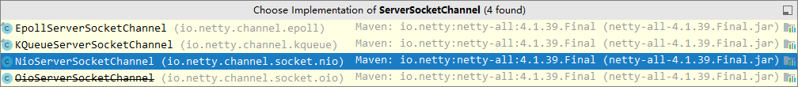

* 3 处，为啥方法叫 childHandler，是接下来添加的处理器都是给 SocketChannel 用的，而不是给 ServerSocketChannel。ChannelInitializer 处理器（仅执行一次），它的作用是待客户端 SocketChannel 建立连接后，执行 initChannel 以便添加更多的处理器

* 4 处，ServerSocketChannel 绑定的监听端口

* 5 处，SocketChannel 的处理器，解码 ByteBuf => String

* 6 处，SocketChannel 的业务处理器，使用上一个处理器的处理结果


### 2.3 客户端

```java
new Bootstrap()
    .group(new NioEventLoopGroup()) // 1
    .channel(NioSocketChannel.class) // 2
    .handler(new ChannelInitializer<Channel>() { // 3
        @Override
        protected void initChannel(Channel ch) {
            ch.pipeline().addLast(new StringEncoder()); // 8
        }
    })
    .connect("127.0.0.1", 8080) // 4
    .sync() // 5
    .channel() // 6
    .writeAndFlush(new Date() + ": hello world!"); // 7
```

代码解读

* 1 处，创建 NioEventLoopGroup，同 Server

* 2 处，选择客户 Socket 实现类，NioSocketChannel 表示基于 NIO 的客户端实现，其它实现还有

  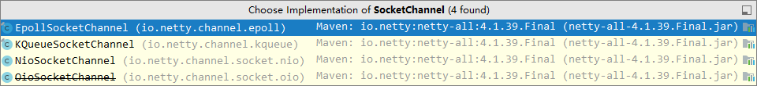

* 3 处，添加 SocketChannel 的处理器，ChannelInitializer 处理器（仅执行一次），它的作用是待客户端 SocketChannel 建立连接后，执行 initChannel 以便添加更多的处理器
* 4 处，指定要连接的服务器和端口
* 5 处，Netty 中很多方法都是异步的，如 connect，这时需要使用 sync 方法等待 connect 建立连接完毕
* 6 处，获取 channel 对象，它即为通道抽象，可以进行数据读写操作
* 7 处，写入消息并清空缓冲区
* 8 处，消息会经过通道 handler 处理，这里是将 String => ByteBuf 发出
* 数据经过网络传输，到达服务器端，服务器端 5 和 6 处的 handler 先后被触发，走完一个流程


### 2.4 流程梳理

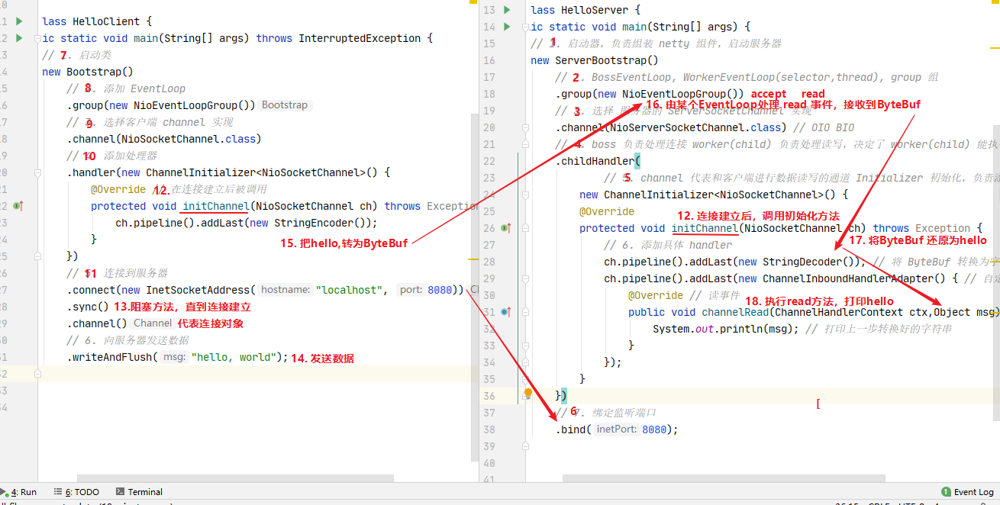

#### 💡 提示

> 一开始需要树立正确的观念
>
> * 把 channel 理解为数据的通道
> * 把 msg 理解为流动的数据，最开始输入是 ByteBuf，但经过 pipeline 的加工，会变成其它类型对象，最后输出又变成 ByteBuf
> * 把 handler 理解为数据的处理工序
>   * 工序有多道，合在一起就是 pipeline，pipeline 负责发布事件（读、读取完成...）传播给每个 handler， handler 对自己感兴趣的事件进行处理（重写了相应事件处理方法）
>   * handler 分 Inbound 和 Outbound 两类
> * 把 eventLoop 理解为处理数据的工人
>   * 工人可以管理多个 channel 的 io 操作，并且一旦工人负责了某个 channel，就要负责到底（绑定）
>   * 工人既可以执行 io 操作，也可以进行任务处理，每位工人有任务队列，队列里可以堆放多个 channel 的待处理任务，任务分为普通任务、定时任务
>   * 工人按照 pipeline 顺序，依次按照 handler 的规划（代码）处理数据，可以为每道工序指定不同的工人


## 3. 组件

### 3.1 EventLoop

事件循环对象

EventLoop 本质是一个单线程执行器（同时维护了一个 Selector），里面有 run 方法处理 Channel 上源源不断的 io 事件。

它的继承关系比较复杂

* 一条线是继承自 juc.ScheduledExecutorService 因此包含了线程池中所有的方法
* 另一条线是继承自 netty 自己的 OrderedEventExecutor，
  * 提供了 boolean inEventLoop(Thread thread) 方法判断一个线程是否属于此 EventLoop
  * 提供了 parent 方法来看看自己属于哪个 EventLoopGroup


事件循环组

EventLoopGroup 是一组 EventLoop，Channel 一般会调用 EventLoopGroup 的 register 方法来绑定其中一个 EventLoop，后续这个 Channel 上的 io 事件都由此 EventLoop 来处理（保证了 io 事件处理时的线程安全）

* 继承自 netty 自己的 EventExecutorGroup
  * 实现了 Iterable 接口提供遍历 EventLoop 的能力
  * 另有 next 方法获取集合中下一个 EventLoop

* 源码中默认的线程数，指定不会执行这个代码

  ```java
   private static final int DEFAULT_EVENT_LOOP_THREADS = Math.max(1, SystemPropertyUtil.getInt("io.netty.eventLoopThreads", NettyRuntime.availableProcessors() * 2));
  ```

  

以一个简单的实现为例：

```java
// 内部创建了两个 EventLoop, 每个 EventLoop 维护一个线程
DefaultEventLoopGroup group = new DefaultEventLoopGroup(2);
System.out.println(group.next());
System.out.println(group.next());
System.out.println(group.next());
```

输出

```
io.netty.channel.DefaultEventLoop@60f82f98
io.netty.channel.DefaultEventLoop@35f983a6
io.netty.channel.DefaultEventLoop@60f82f98//这里就重复了
```

也可以使用 for 循环

```java
DefaultEventLoopGroup group = new DefaultEventLoopGroup(2);
for (EventExecutor eventLoop : group) {
    System.out.println(eventLoop);
}
```

输出

```java
io.netty.channel.DefaultEventLoop@60f82f98
io.netty.channel.DefaultEventLoop@35f983a6
```

* 普通任务

  ```java
          group.next().submit(()->{
              try {
                  Thread.sleep(1000);
              } catch (InterruptedException e) {
                  throw new RuntimeException(e);
              }
              System.out.println("ok");
          });
          System.out.println("main");
  
  main
  ok
  ```

* 定时任务

  ```java
          //定时任务
          group.next().scheduleAtFixedRate(()->{
              System.out.println("ok");
          }, 0, 1, TimeUnit.SECONDS);
  ```

#####演示 NioEventLoop 处理 io 事件

* 一旦建立连接，channel就会和一个eventloop绑定，以后一直和它绑定

  ```java
  public class EventLoopClient {
      public static void main(String[] args) throws InterruptedException {
          //启动类
          Channel channel = new Bootstrap()
                  .group(new NioEventLoopGroup())
                  //选择客户端chnnel实现
                  .channel(NioSocketChannel.class)
                  .handler(new ChannelInitializer<NioSocketChannel>() {
                      @Override
                      protected void initChannel(NioSocketChannel nioSocketChannel) throws Exception {
                          nioSocketChannel.pipeline().addLast(new StringEncoder());
                      }
                  })
                  .connect(new InetSocketAddress("localhost", 8080))
                  .sync()
                  .channel();
          System.out.println(channel);
          System.out.println("");
  
      }
  }
  ```

  ```java
  public class EventLoopServer {
      public static void main(String[] args) {
          new ServerBootstrap()
                  .group(new NioEventLoopGroup())
                  .channel(NioServerSocketChannel.class)
                  .childHandler(new ChannelInitializer<NioSocketChannel>() {
                      @Override
                      protected void initChannel(NioSocketChannel nioSocketChannel) throws Exception {
                          nioSocketChannel.pipeline().addLast(new ChannelInboundHandlerAdapter(){
                              @Override
                              public void channelRead(ChannelHandlerContext ctx, Object msg) throws Exception {
                                  ByteBuf byteBuf= (ByteBuf) msg;
                                  System.out.println((byteBuf.toString(Charset.defaultCharset())));
                              }
                          });
                      }
                  }).bind(8080);
      }
  }
  ```

* 服务器端两个 nio worker 工人, boss和worker，worker只负责socketChannel，boss只负责accept事件。

```java
new ServerBootstrap()
    .group(new NioEventLoopGroup(1), new NioEventLoopGroup(2))
    .channel(NioServerSocketChannel.class)
    .childHandler(new ChannelInitializer<NioSocketChannel>() {
        @Override
        protected void initChannel(NioSocketChannel ch) {
            ch.pipeline().addLast(new ChannelInboundHandlerAdapter() {
                @Override
                public void channelRead(ChannelHandlerContext ctx, Object msg) {
                    ByteBuf byteBuf = msg instanceof ByteBuf ? ((ByteBuf) msg) : null;
                    if (byteBuf != null) {
                        byte[] buf = new byte[16];
                        ByteBuf len = byteBuf.readBytes(buf, 0, byteBuf.readableBytes());
                        log.debug(new String(buf));
                    }
                }
            });
        }
    }).bind(8080).sync();
```

客户端，启动三次，分别修改发送字符串为 zhangsan（第一次），lisi（第二次），wangwu（第三次）

```java
public static void main(String[] args) throws InterruptedException {
    Channel channel = new Bootstrap()
            .group(new NioEventLoopGroup(1))
            .handler(new ChannelInitializer<NioSocketChannel>() {
                @Override
                protected void initChannel(NioSocketChannel ch) throws Exception {
                    System.out.println("init...");
                    ch.pipeline().addLast(new LoggingHandler(LogLevel.DEBUG));
                }
            })
            .channel(NioSocketChannel.class).connect("localhost", 8080)
            .sync()
            .channel();

    channel.writeAndFlush(ByteBufAllocator.DEFAULT.buffer().writeBytes("wangwu".getBytes()));
    Thread.sleep(2000);
    channel.writeAndFlush(ByteBufAllocator.DEFAULT.buffer().writeBytes("wangwu".getBytes()));
```

最后输出

```
22:03:34 [DEBUG] [nioEventLoopGroup-3-1] c.i.o.EventLoopTest - zhangsan       
22:03:36 [DEBUG] [nioEventLoopGroup-3-1] c.i.o.EventLoopTest - zhangsan       
22:05:36 [DEBUG] [nioEventLoopGroup-3-2] c.i.o.EventLoopTest - lisi           
22:05:38 [DEBUG] [nioEventLoopGroup-3-2] c.i.o.EventLoopTest - lisi           
22:06:09 [DEBUG] [nioEventLoopGroup-3-1] c.i.o.EventLoopTest - wangwu        
22:06:11 [DEBUG] [nioEventLoopGroup-3-1] c.i.o.EventLoopTest - wangwu         
```

可以看到两个工人轮流处理 channel，但工人与 channel 之间进行了绑定。新问题出现了，如果有一条传输数据过长，其他的就会等待，因此还需要再一次细分角色，增加专门处理耗时较长的。

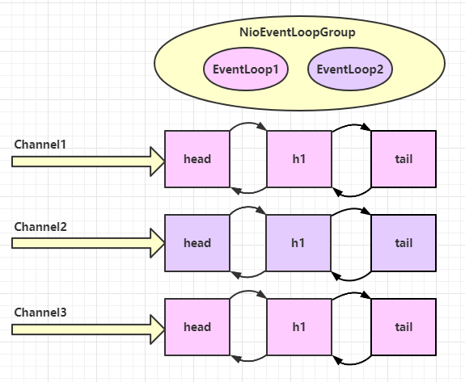


* 因此增加新角色。再增加两个非 nio 工人

```java
DefaultEventLoopGroup normalWorkers = new DefaultEventLoopGroup(2);
new ServerBootstrap()
    .group(new NioEventLoopGroup(1), new NioEventLoopGroup(2))
    .channel(NioServerSocketChannel.class)
    .childHandler(new ChannelInitializer<NioSocketChannel>() {
        @Override
        protected void initChannel(NioSocketChannel ch)  {
            ch.pipeline().addLast(new LoggingHandler(LogLevel.DEBUG));
            ch.pipeline().addLast(normalWorkers,"myhandler",
              new ChannelInboundHandlerAdapter() {
                @Override
                public void channelRead(ChannelHandlerContext ctx, Object msg) {
                    ByteBuf byteBuf = msg instanceof ByteBuf ? ((ByteBuf) msg) : null;
                    if (byteBuf != null) {
                        byte[] buf = new byte[16];
                        ByteBuf len = byteBuf.readBytes(buf, 0, byteBuf.readableBytes());
                        log.debug(new String(buf));
                    }
                }
            });
        }
    }).bind(8080).sync();
```

客户端代码不变，启动三次，分别修改发送字符串为 zhangsan（第一次），lisi（第二次），wangwu（第三次）       

可以看到，nio 工人和 非 nio 工人也分别绑定了 channel（LoggingHandler 由 nio 工人执行，而我们自己的 handler 由非 nio 工人执行）


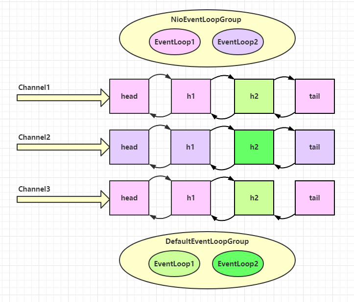


#### 💡 handler 执行中如何换人？

关键代码 `io.netty.channel.AbstractChannelHandlerContext#invokeChannelRead()`

```java
static void invokeChannelRead(final AbstractChannelHandlerContext next, Object msg) {
    final Object m = next.pipeline.touch(ObjectUtil.checkNotNull(msg, "msg"), next);
    // 下一个 handler 的事件循环是否与当前的事件循环是同一个线程
    EventExecutor executor = next.executor();
    
    // 是，直接调用
    if (executor.inEventLoop()) {
        next.invokeChannelRead(m);
    } 
    // 不是，将要执行的代码作为任务提交给下一个事件循环处理（换人）
    else {
        executor.execute(new Runnable() {
            @Override
            public void run() {
                next.invokeChannelRead(m);
            }
        });
    }
}
```

* 如果两个 handler 绑定的是同一个线程，那么就直接调用
* 否则，把要调用的代码封装为一个任务对象，由下一个 handler 的线程来调用


#### 演示 NioEventLoop 处理普通任务

NioEventLoop 除了可以处理 io 事件，同样可以向它提交普通任务

```java
NioEventLoopGroup nioWorkers = new NioEventLoopGroup(2);

log.debug("server start...");
Thread.sleep(2000);
nioWorkers.execute(()->{
    log.debug("normal task...");
});
```

输出

```
22:30:36 [DEBUG] [main] c.i.o.EventLoopTest2 - server start...
22:30:38 [DEBUG] [nioEventLoopGroup-2-1] c.i.o.EventLoopTest2 - normal task...
```

> 可以用来执行耗时较长的任务


#### 演示 NioEventLoop 处理定时任务

```java
NioEventLoopGroup nioWorkers = new NioEventLoopGroup(2);

log.debug("server start...");
Thread.sleep(2000);
nioWorkers.scheduleAtFixedRate(() -> {
    log.debug("running...");
}, 0, 1, TimeUnit.SECONDS);
```

输出

```
22:35:15 [DEBUG] [main] c.i.o.EventLoopTest2 - server start...
22:35:17 [DEBUG] [nioEventLoopGroup-2-1] c.i.o.EventLoopTest2 - running...
22:35:18 [DEBUG] [nioEventLoopGroup-2-1] c.i.o.EventLoopTest2 - running...
22:35:19 [DEBUG] [nioEventLoopGroup-2-1] c.i.o.EventLoopTest2 - running...
22:35:20 [DEBUG] [nioEventLoopGroup-2-1] c.i.o.EventLoopTest2 - running...
...
```

> 可以用来执行定时任务


### 3.2 Channel

channel 的主要作用

* close() 可以用来关闭 channel
* closeFuture() 用来处理 channel 的关闭
  * sync 方法作用是同步等待 channel 关闭
  * 而 addListener 方法是异步等待 channel 关闭
* pipeline() 方法添加处理器
* write() 方法将数据写入，但是是存在缓冲区，需要调用flush方法
* writeAndFlush() 方法将数据写入并刷出


#### ChannelFuture

这时刚才的客户端代码

```java
new Bootstrap()
    .group(new NioEventLoopGroup())
    .channel(NioSocketChannel.class)
    .handler(new ChannelInitializer<Channel>() {
        @Override
        protected void initChannel(Channel ch) {
            ch.pipeline().addLast(new StringEncoder());
        }
    })
    .connect("127.0.0.1", 8080)
    .sync()
    .channel()
    .writeAndFlush(new Date() + ": hello world!");
```

现在把它拆开来看

```java
ChannelFuture channelFuture = new Bootstrap()
    .group(new NioEventLoopGroup())
    .channel(NioSocketChannel.class)
    .handler(new ChannelInitializer<Channel>() {
        @Override
        protected void initChannel(Channel ch) {
            ch.pipeline().addLast(new StringEncoder());
        }
    })
    //异步非阻塞，主线程发起了调用，把连接交给另一个线程，是nio线程
    .connect("127.0.0.1", 8080); // 1

channelFuture.sync().channel().writeAndFlush(new Date() + ": hello world!");
```

* 1 处返回的是 ChannelFuture 对象，它的作用是利用 channel() 方法来获取 Channel 对象

**注意** ==connect 方法是异步的，意味着不等连接建立，方法执行就返回了。因此 channelFuture 对象中不能【立刻】获得到正确的 Channel 对象==。带有Future都是异步

实验如下：

```java
ChannelFuture channelFuture = new Bootstrap()
    .group(new NioEventLoopGroup())
    .channel(NioSocketChannel.class)
    .handler(new ChannelInitializer<Channel>() {
        @Override
        protected void initChannel(Channel ch) {
            ch.pipeline().addLast(new StringEncoder());
        }
    })
    .connect("127.0.0.1", 8080);

System.out.println(channelFuture.channel()); // 1
channelFuture.sync(); // 2
System.out.println(channelFuture.channel()); // 3
```

* 执行到 1 时，连接未建立，打印 `[id: 0x2e1884dd]`
* 执行到 2 时，sync 方法是同步等待连接建立完成
* 执行到 3 时，连接肯定建立了，打印 `[id: 0x2e1884dd, L:/127.0.0.1:57191 - R:/127.0.0.1:8080]`

**除了用 sync 方法可以让异步操作同步以外，还可以使用回调的方式（监听者）：**

```java
ChannelFuture channelFuture = new Bootstrap()
    .group(new NioEventLoopGroup())
    .channel(NioSocketChannel.class)
    .handler(new ChannelInitializer<Channel>() {
        @Override
        protected void initChannel(Channel ch) {
            ch.pipeline().addLast(new StringEncoder());
        }
    })
    .connect("127.0.0.1", 8080);
System.out.println(channelFuture.channel()); // 1
channelFuture.addListener((ChannelFutureListener) future -> {
    System.out.println(future.channel()); // 2
});
```

```java
        channelFuture.addListener(new ChannelFutureListener() {
            //连接好了，建立完成
            @Override
            public void operationComplete(ChannelFuture channelFuture) throws Exception {
                Channel channel1=channelFuture.channel();
            }
        });
```


* 执行到 1 时，连接未建立，打印 `[id: 0x749124ba]`
* ChannelFutureListener 会在连接建立时被调用（其中 operationComplete 方法），因此执行到 2 时，连接肯定建立了，打印 `[id: 0x749124ba, L:/127.0.0.1:57351 - R:/127.0.0.1:8080]`


#### CloseFuture

* channel.close();也是一个异步方法，即执行到这里时并不是直接关闭，他是一个新线程去关闭。两个线程谁先谁后是不能确定的。所以使用CloseFuture，它也是两个，一个同步，一个异步。

  ```java
  //第一种
          ChannelFuture closeFuture=channel.closeFuture();
          System.out.println("等待关闭");
          closeFuture.sync();
          System.out.println("关闭");
          //第二种
          closeFuture.addListener(new ChannelFutureListener() {
              @Override
              public void operationComplete(ChannelFuture channelFuture) throws Exception {
                  System.out.println("关闭");
              }
          });
  ```

  

```java
@Slf4j
public class CloseFutureClient {
    public static void main(String[] args) throws InterruptedException {
        //把他提出来
        NioEventLoopGroup group new NioEventLoopGroup();
        ChannelFuture channelFuture = new Bootstrap()
                .group(group)
                .channel(NioSocketChannel.class)
                .handler(new ChannelInitializer<NioSocketChannel>() {
                    @Override // 在连接建立后被调用
                    protected void initChannel(NioSocketChannel ch) throws Exception {
                        ch.pipeline().addLast(new LoggingHandler(LogLevel.DEBUG));
                        ch.pipeline().addLast(new StringEncoder());
                    }
                })
                .connect(new InetSocketAddress("localhost", 8080));
        Channel channel = channelFuture.sync().channel();
        log.debug("{}", channel);
        new Thread(()->{
            Scanner scanner = new Scanner(System.in);
            while (true) {
                String line = scanner.nextLine();
                if ("q".equals(line)) {
                    channel.close(); // close 异步操作 1s 之后
//                    log.debug("处理关闭之后的操作"); // 不能在这里善后
                    break;
                }
                channel.writeAndFlush(line);
            }
        }, "input").start();

        // 获取 CloseFuture 对象， 1) 同步处理关闭， 2) 异步处理关闭
        ChannelFuture closeFuture = channel.closeFuture();
        /*log.debug("waiting close...");
        closeFuture.sync();
        log.debug("处理关闭之后的操作");*/
        closeFuture.addListener(new ChannelFutureListener() {
            @Override
            public void operationComplete(ChannelFuture future) throws Exception {
                log.debug("处理关闭之后的操作");
                //先拒绝接受新的任务，然后再把现有任务处理完，最终停止。
                group.shutdownGracefully();
            }
        });
    }
}
```


#### 为什么需要异步

* 有些同学看到这里会有疑问：为什么不在一个线程中去执行建立连接、去执行关闭 channel，那样不是也可以吗？==非要用这么复杂的异步方式：比如一个线程发起建立连接，另一个线程去真正建立连接==

* 还有同学会笼统地回答，因为 netty 异步方式用了多线程、多线程就效率高。其实这些认识都比较片面，多线程和异步所提升的效率并不是所认为的

思考下面的场景，4 个医生给人看病，每个病人花费 20 分钟，而且医生看病的过程中是以病人为单位的，一个病人看完了，才能看下一个病人。假设病人源源不断地来，可以计算一下 4 个医生一天工作 8 小时，处理的病人总数是：`4 * 8 * 3 = 96`

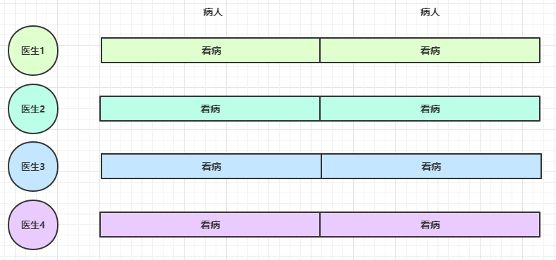


经研究发现，看病可以细分为四个步骤，经拆分后每个步骤需要 5 分钟，如下

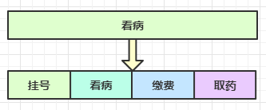


因此可以做如下优化==（操作系统的指令流水线==），只有一开始，医生 2、3、4 分别要等待 5、10、15 分钟才能执行工作，但只要后续病人源源不断地来，他们就能够满负荷工作，并且处理病人的能力提高到了 `4 * 8 * 12` 效率几乎是原来的四倍

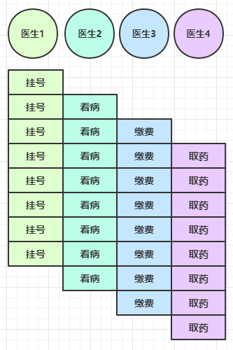

要点

* ==单线程没法异步提高效率，必须配合多线程、多核 cpu 才能发挥异步的优势==
* ==异步并没有缩短响应时间，反而有所增加（提高的是吞吐量）==
* 合理进行任务拆分，也是利用异步的关键


### 3.3 Future & Promise

在异步处理时，经常用到这两个接口

==首先要说明 netty 中的 Future 与 jdk 中的 Future 同名，但是是两个接口，netty 的 Future 继承自 jdk 的 Future，而 Promise 又对 netty Future 进行了扩展==

* jdk Future 只能同步等待任务结束（或成功、或失败）才能得到结果
* netty Future 可以同步等待任务结束得到结果，也可以异步方式得到结果，但都是要等任务结束
* netty Promise 不仅有 netty Future 的功能，而且脱离了任务独立存在，只作为两个线程间传递结果的容器

| 功能/名称    | jdk Future                     | netty Future                                                 | Promise      |
| ------------ | ------------------------------ | ------------------------------------------------------------ | ------------ |
| cancel       | 取消任务                       | -                                                            | -            |
| isCanceled   | 任务是否取消                   | -                                                            | -            |
| isDone       | 任务是否完成，不能区分成功失败 | -                                                            | -            |
| get          | 获取任务结果，阻塞等待         | -                                                            | -            |
| getNow       | -                              | 获取任务结果，非阻塞，还未产生结果时返回 null                | -            |
| await        | -                              | 等待任务结束，如果任务失败，不会抛异常，而是通过 isSuccess 判断 | -            |
| sync         | -                              | 等待任务结束，如果任务失败，抛出异常                         | -            |
| isSuccess    | -                              | 判断任务是否成功                                             | -            |
| cause        | -                              | 获取失败信息，非阻塞，如果没有失败，返回null                 | -            |
| addLinstener | -                              | 添加回调，异步接收结果                                       | -            |
| setSuccess   | -                              | -                                                            | 设置成功结果 |
| setFailure   | -                              | -                                                            | 设置失败结果 |


* 测试JDK的Future

  ```java
  public class TestJdkFuture {
      public static void main(String[] args) throws ExecutionException, InterruptedException {
          ExecutorService service= Executors.newFixedThreadPool(2);
          Future<Integer> future = service.submit(new Callable<Integer>() {
  
              @Override
              public Integer call() throws Exception {
                  System.out.println("执行计算");
                  Thread.sleep(1000);
                  return 52;
              }
          });
          //主线程可以通过future获得结果
          //也是一个阻塞方法，同步等待
          System.out.println("等待结果");
          System.out.println(future.get());
      }
  }
  等待结果
  执行计算
  52
  ```

* 测试netty的future

  ```java
  public class TestNettyFuture {
      public static void main(String[] args) throws ExecutionException, InterruptedException {
          //线程池
          NioEventLoopGroup group=new NioEventLoopGroup();
          EventLoop eventLoop=group.next();
          Future<Integer> future=eventLoop.submit(new Callable<Integer>() {
              @Override
              public Integer call() throws Exception {
                  System.out.println("执行");
                  Thread.sleep(1000);
                  return 78;
              }
          });
          System.out.println("等待结果");
          System.out.println(future.get());
      }
  }
  ```

  * 异步

    ```java
    public class TestNettyFuture {
        public static void main(String[] args) throws ExecutionException, InterruptedException {
            //线程池
            NioEventLoopGroup group=new NioEventLoopGroup();
            EventLoop eventLoop=group.next();
            Future<Integer> future=eventLoop.submit(new Callable<Integer>() {
                @Override
                public Integer call() throws Exception {
                    System.out.println("执行");
                    Thread.sleep(1000);
                    return 78;
                }
            });
            System.out.println("等待结果");
           future.addListener(new GenericFutureListener<Future<? super Integer>>() {
               @Override
               public void operationComplete(Future<? super Integer> future) throws Exception {
                   System.out.println(future.getNow());
               }
           });
        }
    }
    ```

* 测试promise

  ```java
  public class TestPromise {
      public static void main(String[] args) throws ExecutionException, InterruptedException {
          EventLoop eventLoop=new NioEventLoopGroup().next();
          DefaultPromise<Integer> promise=new DefaultPromise<>(eventLoop);
          new Thread(()->{
              //新线程把结果传给promise
              System.out.println("开始计算");
              try {
                  Thread.sleep(1000);
              } catch (InterruptedException e) {
                  throw new RuntimeException(e);
              }
              promise.setSuccess(80);
          }).start();
          //接收结果的线程
          System.out.println("等待结果");
          //也可以异步
          System.out.println(promise.get());
      }
  }
  ```

  

#### 例1

同步处理任务成功

```java
DefaultEventLoop eventExecutors = new DefaultEventLoop();
DefaultPromise<Integer> promise = new DefaultPromise<>(eventExecutors);

eventExecutors.execute(()->{
    try {
        Thread.sleep(1000);
    } catch (InterruptedException e) {
        e.printStackTrace();
    }
    log.debug("set success, {}",10);
    promise.setSuccess(10);
});

log.debug("start...");
log.debug("{}",promise.getNow()); // 还没有结果
log.debug("{}",promise.get());
```

输出

```
11:51:53 [DEBUG] [main] c.i.o.DefaultPromiseTest2 - start...
11:51:53 [DEBUG] [main] c.i.o.DefaultPromiseTest2 - null
11:51:54 [DEBUG] [defaultEventLoop-1-1] c.i.o.DefaultPromiseTest2 - set success, 10
11:51:54 [DEBUG] [main] c.i.o.DefaultPromiseTest2 - 10
```


#### 例2

异步处理任务成功

```java
DefaultEventLoop eventExecutors = new DefaultEventLoop();
DefaultPromise<Integer> promise = new DefaultPromise<>(eventExecutors);

// 设置回调，异步接收结果
promise.addListener(future -> {
    // 这里的 future 就是上面的 promise
    log.debug("{}",future.getNow());
});

// 等待 1000 后设置成功结果
eventExecutors.execute(()->{
    try {
        Thread.sleep(1000);
    } catch (InterruptedException e) {
        e.printStackTrace();
    }
    log.debug("set success, {}",10);
    promise.setSuccess(10);
});

log.debug("start...");
```

输出

```
11:49:30 [DEBUG] [main] c.i.o.DefaultPromiseTest2 - start...
11:49:31 [DEBUG] [defaultEventLoop-1-1] c.i.o.DefaultPromiseTest2 - set success, 10
11:49:31 [DEBUG] [defaultEventLoop-1-1] c.i.o.DefaultPromiseTest2 - 10
```


#### 例3

同步处理任务失败 - sync & get

```java
DefaultEventLoop eventExecutors = new DefaultEventLoop();
        DefaultPromise<Integer> promise = new DefaultPromise<>(eventExecutors);

        eventExecutors.execute(() -> {
            try {
                Thread.sleep(1000);
            } catch (InterruptedException e) {
                e.printStackTrace();
            }
            RuntimeException e = new RuntimeException("error...");
            log.debug("set failure, {}", e.toString());
            promise.setFailure(e);
        });

        log.debug("start...");
        log.debug("{}", promise.getNow());
        promise.get(); // sync() 也会出现异常，只是 get 会再用 ExecutionException 包一层异常
```

输出

```
12:11:07 [DEBUG] [main] c.i.o.DefaultPromiseTest2 - start...
12:11:07 [DEBUG] [main] c.i.o.DefaultPromiseTest2 - null
12:11:08 [DEBUG] [defaultEventLoop-1-1] c.i.o.DefaultPromiseTest2 - set failure, java.lang.RuntimeException: error...
Exception in thread "main" java.util.concurrent.ExecutionException: java.lang.RuntimeException: error...
	at io.netty.util.concurrent.AbstractFuture.get(AbstractFuture.java:41)
	at com.itcast.oio.DefaultPromiseTest2.main(DefaultPromiseTest2.java:34)
Caused by: java.lang.RuntimeException: error...
	at com.itcast.oio.DefaultPromiseTest2.lambda$main$0(DefaultPromiseTest2.java:27)
	at io.netty.channel.DefaultEventLoop.run(DefaultEventLoop.java:54)
	at io.netty.util.concurrent.SingleThreadEventExecutor$5.run(SingleThreadEventExecutor.java:918)
	at io.netty.util.internal.ThreadExecutorMap$2.run(ThreadExecutorMap.java:74)
	at io.netty.util.concurrent.FastThreadLocalRunnable.run(FastThreadLocalRunnable.java:30)
	at java.lang.Thread.run(Thread.java:745)
```


#### 例4

同步处理任务失败 - await

```java
DefaultEventLoop eventExecutors = new DefaultEventLoop();
DefaultPromise<Integer> promise = new DefaultPromise<>(eventExecutors);

eventExecutors.execute(() -> {
    try {
        Thread.sleep(1000);
    } catch (InterruptedException e) {
        e.printStackTrace();
    }
    RuntimeException e = new RuntimeException("error...");
    log.debug("set failure, {}", e.toString());
    promise.setFailure(e);
});

log.debug("start...");
log.debug("{}", promise.getNow());
promise.await(); // 与 sync 和 get 区别在于，不会抛异常
log.debug("result {}", (promise.isSuccess() ? promise.getNow() : promise.cause()).toString());
```

输出

```
12:18:53 [DEBUG] [main] c.i.o.DefaultPromiseTest2 - start...
12:18:53 [DEBUG] [main] c.i.o.DefaultPromiseTest2 - null
12:18:54 [DEBUG] [defaultEventLoop-1-1] c.i.o.DefaultPromiseTest2 - set failure, java.lang.RuntimeException: error...
12:18:54 [DEBUG] [main] c.i.o.DefaultPromiseTest2 - result java.lang.RuntimeException: error...
```


#### 例5

异步处理任务失败

```java
DefaultEventLoop eventExecutors = new DefaultEventLoop();
DefaultPromise<Integer> promise = new DefaultPromise<>(eventExecutors);

promise.addListener(future -> {
    log.debug("result {}", (promise.isSuccess() ? promise.getNow() : promise.cause()).toString());
});

eventExecutors.execute(() -> {
    try {
        Thread.sleep(1000);
    } catch (InterruptedException e) {
        e.printStackTrace();
    }
    RuntimeException e = new RuntimeException("error...");
    log.debug("set failure, {}", e.toString());
    promise.setFailure(e);
});

log.debug("start...");
```

输出

```
12:04:57 [DEBUG] [main] c.i.o.DefaultPromiseTest2 - start...
12:04:58 [DEBUG] [defaultEventLoop-1-1] c.i.o.DefaultPromiseTest2 - set failure, java.lang.RuntimeException: error...
12:04:58 [DEBUG] [defaultEventLoop-1-1] c.i.o.DefaultPromiseTest2 - result java.lang.RuntimeException: error...
```


#### 例6

await 死锁检查

```java
DefaultEventLoop eventExecutors = new DefaultEventLoop();
DefaultPromise<Integer> promise = new DefaultPromise<>(eventExecutors);

eventExecutors.submit(()->{
    System.out.println("1");
    try {
        promise.await();
        // 注意不能仅捕获 InterruptedException 异常
        // 否则 死锁检查抛出的 BlockingOperationException 会继续向上传播
        // 而提交的任务会被包装为 PromiseTask，它的 run 方法中会 catch 所有异常然后设置为 Promise 的失败结果而不会抛出
    } catch (Exception e) { 
        e.printStackTrace();
    }
    System.out.println("2");
});
eventExecutors.submit(()->{
    System.out.println("3");
    try {
        promise.await();
    } catch (Exception e) {
        e.printStackTrace();
    }
    System.out.println("4");
});
```

输出

```
1
2
3
4
io.netty.util.concurrent.BlockingOperationException: DefaultPromise@47499c2a(incomplete)
	at io.netty.util.concurrent.DefaultPromise.checkDeadLock(DefaultPromise.java:384)
	at io.netty.util.concurrent.DefaultPromise.await(DefaultPromise.java:212)
	at com.itcast.oio.DefaultPromiseTest.lambda$main$0(DefaultPromiseTest.java:27)
	at io.netty.util.concurrent.PromiseTask$RunnableAdapter.call(PromiseTask.java:38)
	at io.netty.util.concurrent.PromiseTask.run(PromiseTask.java:73)
	at io.netty.channel.DefaultEventLoop.run(DefaultEventLoop.java:54)
	at io.netty.util.concurrent.SingleThreadEventExecutor$5.run(SingleThreadEventExecutor.java:918)
	at io.netty.util.internal.ThreadExecutorMap$2.run(ThreadExecutorMap.java:74)
	at io.netty.util.concurrent.FastThreadLocalRunnable.run(FastThreadLocalRunnable.java:30)
	at java.lang.Thread.run(Thread.java:745)
io.netty.util.concurrent.BlockingOperationException: DefaultPromise@47499c2a(incomplete)
	at io.netty.util.concurrent.DefaultPromise.checkDeadLock(DefaultPromise.java:384)
	at io.netty.util.concurrent.DefaultPromise.await(DefaultPromise.java:212)
	at com.itcast.oio.DefaultPromiseTest.lambda$main$1(DefaultPromiseTest.java:36)
	at io.netty.util.concurrent.PromiseTask$RunnableAdapter.call(PromiseTask.java:38)
	at io.netty.util.concurrent.PromiseTask.run(PromiseTask.java:73)
	at io.netty.channel.DefaultEventLoop.run(DefaultEventLoop.java:54)
	at io.netty.util.concurrent.SingleThreadEventExecutor$5.run(SingleThreadEventExecutor.java:918)
	at io.netty.util.internal.ThreadExecutorMap$2.run(ThreadExecutorMap.java:74)
	at io.netty.util.concurrent.FastThreadLocalRunnable.run(FastThreadLocalRunnable.java:30)
	at java.lang.Thread.run(Thread.java:745)

```


### 3.4 Handler & Pipeline

ChannelHandler 用来处理 Channel 上的各种事件，分为入站、出站两种。所有 ChannelHandler 被连成一串，就是 Pipeline

* 入站处理器通常是 ChannelInboundHandlerAdapter 的子类，主要用来读取客户端数据，写回结果
* 出站处理器通常是 ChannelOutboundHandlerAdapter 的子类，主要对写回结果进行加工

打个比喻，每个 Channel 是一个产品的加工车间，Pipeline 是车间中的流水线，ChannelHandler 就是流水线上的各道工序，而后面要讲的 ByteBuf 是原材料，经过很多工序的加工：先经过一道道入站工序，再经过一道道出站工序最终变成产品


先搞清楚顺序，服务端 ==底层是一个单向链表==

```java
new ServerBootstrap()
    .group(new NioEventLoopGroup())
    .channel(NioServerSocketChannel.class)
    .childHandler(new ChannelInitializer<NioSocketChannel>() {
        protected void initChannel(NioSocketChannel ch) {
            ch.pipeline().addLast(new ChannelInboundHandlerAdapter(){
                @Override
                public void channelRead(ChannelHandlerContext ctx, Object msg) {
                    System.out.println(1);
                    ctx.fireChannelRead(msg); // 1
                }
            });
            ch.pipeline().addLast(new ChannelInboundHandlerAdapter(){
                @Override
                public void channelRead(ChannelHandlerContext ctx, Object msg) {
                    System.out.println(2);
                    ctx.fireChannelRead(msg); // 2
                }
            });
            ch.pipeline().addLast(new ChannelInboundHandlerAdapter(){
                @Override
                public void channelRead(ChannelHandlerContext ctx, Object msg) {
                    System.out.println(3);
                    ctx.channel().write(msg); // 3
                }
            });
            //出栈处理器，只有有数据时才会触发
            ch.pipeline().addLast(new ChannelOutboundHandlerAdapter(){
                @Override
                public void write(ChannelHandlerContext ctx, Object msg, 
                                  ChannelPromise promise) {
                    System.out.println(4);
                    ctx.write(msg, promise); // 4
                }
            });
            ch.pipeline().addLast(new ChannelOutboundHandlerAdapter(){
                @Override
                public void write(ChannelHandlerContext ctx, Object msg, 
                                  ChannelPromise promise) {
                    System.out.println(5);
                    ctx.write(msg, promise); // 5
                }
            });
            ch.pipeline().addLast(new ChannelOutboundHandlerAdapter(){
                @Override
                public void write(ChannelHandlerContext ctx, Object msg, 
                                  ChannelPromise promise) {
                    System.out.println(6);
                    ctx.write(msg, promise); // 6
                }
            });
        }
    })
    .bind(8080);
```

* ==注意：必须要有ctx.fireChannelRead(msg)或者**super**.channelRead(ctx, msg);要不然handle不会传递==

客户端

```java
new Bootstrap()
    .group(new NioEventLoopGroup())
    .channel(NioSocketChannel.class)
    .handler(new ChannelInitializer<Channel>() {
        @Override
        protected void initChannel(Channel ch) {
            ch.pipeline().addLast(new StringEncoder());
        }
    })
    .connect("127.0.0.1", 8080)
    .addListener((ChannelFutureListener) future -> {
        future.channel().writeAndFlush("hello,world");
    });
```

服务器端打印：

```
1
2
3
6
5
4
```

==可以看到，ChannelInboundHandlerAdapter 是按照 addLast 的顺序执行的，而 ChannelOutboundHandlerAdapter 是按照 addLast 的逆序执行的。==ChannelPipeline 的实现是一个 ChannelHandlerContext（包装了 ChannelHandler） 组成的双向链表

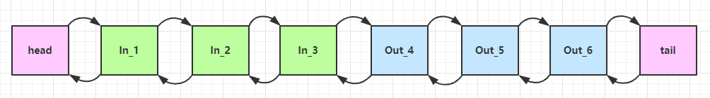

* 入站处理器中，ctx.fireChannelRead(msg) 是 **调用下一个入站处理器**
  * 如果注释掉 1 处代码，则仅会打印 1
  * 如果注释掉 2 处代码，则仅会打印 1 2
* 3 处的 ctx.channel().write(msg) 会 **从尾部开始触发** 后续出站处理器的执行
  * 如果注释掉 3 处代码，则仅会打印 1 2 3
* 类似的，出站处理器中，ctx.write(msg, promise) 的调用也会 **触发上一个出站处理器**
  * 如果注释掉 6 处代码，则仅会打印 1 2 3 6
* **ctx.channel().write(msg) vs ctx.write(msg)**
  * 都是触发出站处理器的执行
  * ==ctx.channel().write(msg) 从尾部（trail）开始查找出站处理器==
  * ==ctx.write(msg) 是从当前节点找上一个出站处理器==
  * 3 处的 ctx.channel().write(msg) 如果改为 ctx.write(msg) 仅会打印 1 2 3，因为节点3 之前没有其它出站处理器了
  * 6 处的 ctx.write(msg, promise) 如果改为 ctx.channel().write(msg) 会打印 1 2 3 6 6 6... 因为 ctx.channel().write() 是从尾部开始查找，结果又是节点6 自己


图1 - 服务端 pipeline 触发的原始流程，图中数字代表了处理步骤的先后次序

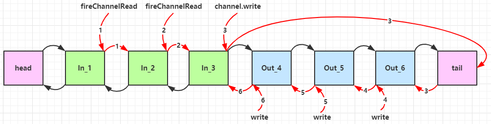


### 3.5 ByteBuf

是对字节数据的封装

#### 1）创建

```java
//可以扩容的
ByteBuf buffer = ByteBufAllocator.DEFAULT.buffer(10);
log(buffer);
```

上面代码创建了一个默认的 ByteBuf（池化基于直接内存的 ByteBuf），初始容量是 10

输出

```
read index:0 write index:0 capacity:10
```

* 查看长度

  ```java
  public class TetsByteBuf {
      public static void main(String[] args) {
          ByteBuf buffer = ByteBufAllocator.DEFAULT.buffer();
          System.out.println(buffer.toString());
          StringBuilder builder=new StringBuilder();
          for (int i = 0; i < 300; i++) {
              builder.append("a");
          }
          buffer.writeBytes(builder.toString().getBytes());
          System.out.println(buffer);
      }
  }
  ```

  

其中 log 方法参考如下

```java
private static void log(ByteBuf buffer) {
    int length = buffer.readableBytes();
    int rows = length / 16 + (length % 15 == 0 ? 0 : 1) + 4;
    StringBuilder buf = new StringBuilder(rows * 80 * 2)
        .append("read index:").append(buffer.readerIndex())
        .append(" write index:").append(buffer.writerIndex())
        .append(" capacity:").append(buffer.capacity())
        .append(NEWLINE);
    appendPrettyHexDump(buf, buffer);
    System.out.println(buf.toString());
}
```


#### 2）直接内存 vs 堆内存

可以使用下面的代码来创建池化基于堆的 ByteBuf

```java
ByteBuf buffer = ByteBufAllocator.DEFAULT.heapBuffer(10);
```

也可以使用下面的代码来创建池化基于直接内存的 ByteBuf

```java
ByteBuf buffer = ByteBufAllocator.DEFAULT.directBuffer(10);
```

* 直接内存创建和销毁的代价昂贵，但读写性能高（少一次内存复制），适合配合池化功能一起用
* 直接内存对 GC 压力小，因为这部分内存不受 JVM 垃圾回收的管理，但也要注意及时主动释放


#### 3）池化 vs 非池化

池化的最大意义在于可以重用 ByteBuf，优点有

* 没有池化，则每次都得创建新的 ByteBuf 实例，这个操作对直接内存代价昂贵，就算是堆内存，也会增加 GC 压力
* 有了池化，则可以重用池中 ByteBuf 实例，并且采用了与 jemalloc 类似的内存分配算法提升分配效率
* 高并发时，池化功能更节约内存，减少内存溢出的可能

池化功能是否开启，可以通过下面的系统环境变量来设置

```java
-Dio.netty.allocator.type={unpooled|pooled}
```

* 4.1 以后，非 Android 平台默认启用池化实现，Android 平台启用非池化实现
* ==4.1 之前，池化功能还不成熟，默认是非池化实现==


* 可以通过getclass查询是否使用池化

  ```java
  public class TetsByteBuf {
      public static void main(String[] args) {
          ByteBuf buffer = ByteBufAllocator.DEFAULT.buffer();
          System.out.println(buffer.getClass());
      }
  }
  ```

  


#### 4）组成

ByteBuf 由四部分组成，最大容量是是整数的最大值

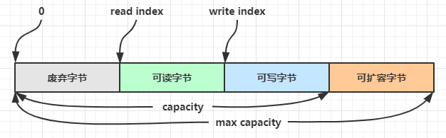

* 最开始读写指针都在 0 位置


#### 5）写入

方法列表，省略一些不重要的方法

| 方法签名                                                     | 含义                   | 备注                                        |
| ------------------------------------------------------------ | ---------------------- | ------------------------------------------- |
| writeBoolean(boolean value)                                  | 写入 boolean 值        | 用一字节 01\|00 代表 true\|false            |
| writeByte(int value)                                         | 写入 byte 值           |                                             |
| writeShort(int value)                                        | 写入 short 值          |                                             |
| writeInt(int value)                                          | 写入 int 值            | Big Endian，即 0x250，写入后 00 00 02 50    |
| writeIntLE(int value)                                        | 写入 int 值            | Little Endian，即 0x250，写入后 50 02 00 00 |
| writeLong(long value)                                        | 写入 long 值           |                                             |
| writeChar(int value)                                         | 写入 char 值           |                                             |
| writeFloat(float value)                                      | 写入 float 值          |                                             |
| writeDouble(double value)                                    | 写入 double 值         |                                             |
| writeBytes(ByteBuf src)                                      | 写入 netty 的 ByteBuf  |                                             |
| writeBytes(byte[] src)                                       | 写入 byte[]            |                                             |
| writeBytes(ByteBuffer src)                                   | 写入 nio 的 ByteBuffer |                                             |
| int writeCharSequence(CharSequence sequence, Charset charset) | 写入字符串             |                                             |

> 注意
>
> * 这些方法的未指明返回值的，其返回值都是 ByteBuf，意味着可以链式调用
> * 网络传输，默认习惯是 Big Endian


先写入 4 个字节

```java
buffer.writeBytes(new byte[]{1, 2, 3, 4});
log(buffer);
```

结果是

```
read index:0 write index:4 capacity:10
         +-------------------------------------------------+
         |  0  1  2  3  4  5  6  7  8  9  a  b  c  d  e  f |
+--------+-------------------------------------------------+----------------+
|00000000| 01 02 03 04                                     |....            |
+--------+-------------------------------------------------+----------------+
```

再写入一个 int 整数，也是 4 个字节

```java
buffer.writeInt(5);
log(buffer);
```

结果是

```
read index:0 write index:8 capacity:10
         +-------------------------------------------------+
         |  0  1  2  3  4  5  6  7  8  9  a  b  c  d  e  f |
+--------+-------------------------------------------------+----------------+
|00000000| 01 02 03 04 00 00 00 05                         |........        |
+--------+-------------------------------------------------+----------------+
```


还有一类方法是 set 开头的一系列方法，也可以写入数据，但不会改变写指针位置


#### 6）扩容

再写入一个 int 整数时，容量不够了（初始容量是 10），这时会引发扩容

```java
buffer.writeInt(6);
log(buffer);
```

扩容规则是

* ==如何写入后数据大小未超过 512，则选择下一个 16 的整数倍，例如写入后大小为 12 ，则扩容后 capacity 是 16==
* ==如果写入后数据大小超过 512，则选择下一个 2^n，例如写入后大小为 513，则扩容后 capacity 是 2^10=1024（2^9=512 已经不够了）==
* 扩容不能超过 max capacity 会报错

结果是

```
read index:0 write index:12 capacity:16
         +-------------------------------------------------+
         |  0  1  2  3  4  5  6  7  8  9  a  b  c  d  e  f |
+--------+-------------------------------------------------+----------------+
|00000000| 01 02 03 04 00 00 00 05 00 00 00 06             |............    |
+--------+-------------------------------------------------+----------------+
```


#### 7）读取

例如读了 4 次，每次一个字节

```java
System.out.println(buffer.readByte());
System.out.println(buffer.readByte());
System.out.println(buffer.readByte());
System.out.println(buffer.readByte());
log(buffer);
```

读过的内容，就属于废弃部分了，再读只能读那些尚未读取的部分

```
1
2
3
4
read index:4 write index:12 capacity:16
         +-------------------------------------------------+
         |  0  1  2  3  4  5  6  7  8  9  a  b  c  d  e  f |
+--------+-------------------------------------------------+----------------+
|00000000| 00 00 00 05 00 00 00 06                         |........        |
+--------+-------------------------------------------------+----------------+
```

如果需要重复读取 int 整数 5，怎么办？

可以在 read 前先做个标记 mark

```java
buffer.markReaderIndex();
System.out.println(buffer.readInt());
log(buffer);
```

结果

```
5
read index:8 write index:12 capacity:16
         +-------------------------------------------------+
         |  0  1  2  3  4  5  6  7  8  9  a  b  c  d  e  f |
+--------+-------------------------------------------------+----------------+
|00000000| 00 00 00 06                                     |....            |
+--------+-------------------------------------------------+----------------+
```

这时要重复读取的话，重置到标记位置 reset

```java
buffer.resetReaderIndex();
log(buffer);
```

这时

```
read index:4 write index:12 capacity:16
         +-------------------------------------------------+
         |  0  1  2  3  4  5  6  7  8  9  a  b  c  d  e  f |
+--------+-------------------------------------------------+----------------+
|00000000| 00 00 00 05 00 00 00 06                         |........        |
+--------+-------------------------------------------------+----------------+
```

还有种办法是采用 get 开头的一系列方法，这些方法不会改变 read index


#### 8）retain & release

由于 Netty 中有堆外内存的 ByteBuf 实现，堆外内存最好是手动来释放，而不是等 GC 垃圾回收。

* UnpooledHeapByteBuf 使用的是 JVM 内存，只需等 GC 回收内存即可
* UnpooledDirectByteBuf 使用的就是直接内存了，需要特殊的方法来回收内存
* PooledByteBuf 和它的子类使用了池化机制，需要更复杂的规则来回收内存


> 回收内存的源码实现，请关注下面方法的不同实现
>
> `protected abstract void deallocate()`


Netty 这里采用了引用计数法来控制回收内存，每个 ByteBuf 都实现了 ReferenceCounted 接口

* 每个 ByteBuf 对象的初始计数为 1
* 调用 release 方法计数减 1，如果计数为 0，ByteBuf 内存被回收
* 调用 retain 方法计数加 1，表示调用者没用完之前，其它 handler 即使调用了 release 也不会造成回收
* 当计数为 0 时，底层内存会被回收，这时即使 ByteBuf 对象还在，其各个方法均无法正常使用


谁来负责 release 呢？

不是我们想象的（一般情况下）

```java
ByteBuf buf = ...
try {
    ...
} finally {
    buf.release();
}
```

请思考，因为 pipeline 的存在，一般需要将 ByteBuf 传递给下一个 ChannelHandler，如果在 finally 中 release 了，就失去了传递性（当然，如果在这个 ChannelHandler 内这个 ByteBuf 已完成了它的使命，那么便无须再传递）

基本规则是，**谁是最后使用者，谁负责 release**，详细分析如下

* 起点，对于 NIO 实现来讲，在 io.netty.channel.nio.AbstractNioByteChannel.NioByteUnsafe#read 方法中首次创建 ByteBuf 放入 pipeline（line 163 pipeline.fireChannelRead(byteBuf)）
* 入站 ByteBuf 处理原则
  * 对原始 ByteBuf 不做处理，调用 ctx.fireChannelRead(msg) 向后传递，这时无须 release
  * 将原始 ByteBuf 转换为其它类型的 Java 对象，这时 ByteBuf 就没用了，必须 release
  * 如果不调用 ctx.fireChannelRead(msg) 向后传递，那么也必须 release
  * 注意各种异常，如果 ByteBuf 没有成功传递到下一个 ChannelHandler，必须 release
  * 假设消息一直向后传，那么 TailContext 会负责释放未处理消息（原始的 ByteBuf）
* 出站 ByteBuf 处理原则
  * 出站消息最终都会转为 ByteBuf 输出，一直向前传，由 HeadContext flush 后 release
* 异常处理原则
  * 有时候不清楚 ByteBuf 被引用了多少次，但又必须彻底释放，可以循环调用 release 直到返回 true


TailContext 释放未处理消息逻辑

```java
// io.netty.channel.DefaultChannelPipeline#onUnhandledInboundMessage(java.lang.Object)
protected void onUnhandledInboundMessage(Object msg) {
    try {
        logger.debug(
            "Discarded inbound message {} that reached at the tail of the pipeline. " +
            "Please check your pipeline configuration.", msg);
    } finally {
        ReferenceCountUtil.release(msg);
    }
}
```

具体代码

```java
// io.netty.util.ReferenceCountUtil#release(java.lang.Object)
public static boolean release(Object msg) {
    if (msg instanceof ReferenceCounted) {
        return ((ReferenceCounted) msg).release();
    }
    return false;
}
```


#### 9）slice

【零拷贝】的体现之一，对原始 ByteBuf 进行切片成多个 ByteBuf，切片后的 ByteBuf 并没有发生内存复制，还是使用原始 ByteBuf 的内存，切片后的 ByteBuf 维护独立的 read，write 指针

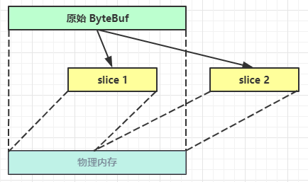

例，原始 ByteBuf 进行一些初始操作

```java
public class TestSlice {
    public static void main(String[] args) {
        ByteBuf buffer = ByteBufAllocator.DEFAULT.buffer();
        buffer.writeBytes(new byte[]{'a','b','c','d','e','f'});
        //他们用的是同一个内存，一个修改所有的都会修改
        //切片之后最大长度会受到限制
        //原始的释放掉，其他都会消失，所以要用retain语句，引用加1，RELEASE引用减1
        ByteBuf slice1 = buffer.slice(0, 2);
        slice1.retain();
        ByteBuf slice = buffer.slice(2, 5);
        System.out.println(slice);
        buffer.release();
    }
}
```

输出

```
         +-------------------------------------------------+
         |  0  1  2  3  4  5  6  7  8  9  a  b  c  d  e  f |
+--------+-------------------------------------------------+----------------+
|00000000| 02 03 04                                        |...             |
+--------+-------------------------------------------------+----------------+
```

这时调用 slice 进行切片，无参 slice 是从原始 ByteBuf 的 read index 到 write index 之间的内容进行切片，切片后的 max capacity 被固定为这个区间的大小，因此不能追加 write

```java
ByteBuf slice = origin.slice();
System.out.println(ByteBufUtil.prettyHexDump(slice));
// slice.writeByte(5); 如果执行，会报 IndexOutOfBoundsException 异常
```

输出

```
         +-------------------------------------------------+
         |  0  1  2  3  4  5  6  7  8  9  a  b  c  d  e  f |
+--------+-------------------------------------------------+----------------+
|00000000| 02 03 04                                        |...             |
+--------+-------------------------------------------------+----------------+
```

如果原始 ByteBuf 再次读操作（又读了一个字节）

```java
origin.readByte();
System.out.println(ByteBufUtil.prettyHexDump(origin));
```

输出

```
         +-------------------------------------------------+
         |  0  1  2  3  4  5  6  7  8  9  a  b  c  d  e  f |
+--------+-------------------------------------------------+----------------+
|00000000| 03 04                                           |..              |
+--------+-------------------------------------------------+----------------+
```

这时的 slice 不受影响，因为它有独立的读写指针

```java
System.out.println(ByteBufUtil.prettyHexDump(slice));
```

输出

```
         +-------------------------------------------------+
         |  0  1  2  3  4  5  6  7  8  9  a  b  c  d  e  f |
+--------+-------------------------------------------------+----------------+
|00000000| 02 03 04                                        |...             |
+--------+-------------------------------------------------+----------------+
```

如果 slice 的内容发生了更改

```java
slice.setByte(2, 5);
System.out.println(ByteBufUtil.prettyHexDump(slice));
```

输出

```
         +-------------------------------------------------+
         |  0  1  2  3  4  5  6  7  8  9  a  b  c  d  e  f |
+--------+-------------------------------------------------+----------------+
|00000000| 02 03 05                                        |...             |
+--------+-------------------------------------------------+----------------+
```

这时，原始 ByteBuf 也会受影响，因为底层都是同一块内存

```
System.out.println(ByteBufUtil.prettyHexDump(origin));
```

输出

```
         +-------------------------------------------------+
         |  0  1  2  3  4  5  6  7  8  9  a  b  c  d  e  f |
+--------+-------------------------------------------------+----------------+
|00000000| 03 05                                           |..              |
+--------+-------------------------------------------------+----------------+
```


#### 10）duplicate

【零拷贝】的体现之一，==就好比截取了原始 ByteBuf 所有内容，并且没有 max capacity 的限制==，也是与原始 ByteBuf 使用同一块底层内存，只是读写指针是独立的

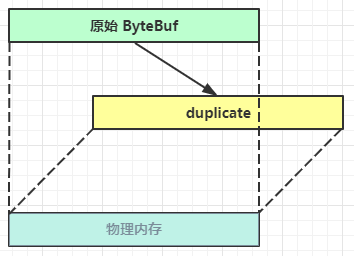


#### 11）copy

会将底层内存数据进行深拷贝，因此无论读写，都与原始 ByteBuf 无关


#### 12）CompositeByteBuf

【零拷贝】的体现之一，可以将多个 ByteBuf 合并为一个逻辑上的 ByteBuf，避免拷贝

有两个 ByteBuf 如下

```java
public class TestSlice {
    public static void main(String[] args) {
        ByteBuf buf1 = ByteBufAllocator.DEFAULT.buffer(5);
        buf1.writeBytes(new byte[]{1, 2, 3, 4, 5});
        ByteBuf buf2 = ByteBufAllocator.DEFAULT.buffer(5);
        buf2.writeBytes(new byte[]{6, 7, 8, 9, 10});
        CompositeByteBuf byteBuf=ByteBufAllocator.DEFAULT.compositeBuffer();
        CompositeByteBuf byteBuf2=ByteBufAllocator.DEFAULT.compositeBuffer();
        //不加true不会调正写入指针的位置
        byteBuf2.addComponents(false,buf1,buf2);
        byteBuf.addComponents(true,buf1,buf2);
        System.out.println(byteBuf2);
        System.out.println(byteBuf);
    }
}//也要小心release问题
```

输出

```
CompositeByteBuf(ridx: 0, widx: 0, cap: 10, components=2)
CompositeByteBuf(ridx: 0, widx: 10, cap: 10, components=2)
```

现在需要一个新的 ByteBuf，内容来自于刚才的 buf1 和 buf2，如何实现？

方法1：

```java
ByteBuf buf3 = ByteBufAllocator.DEFAULT
    .buffer(buf1.readableBytes()+buf2.readableBytes());
buf3.writeBytes(buf1);
buf3.writeBytes(buf2);
System.out.println(ByteBufUtil.prettyHexDump(buf3));
```

结果

```
         +-------------------------------------------------+
         |  0  1  2  3  4  5  6  7  8  9  a  b  c  d  e  f |
+--------+-------------------------------------------------+----------------+
|00000000| 01 02 03 04 05 06 07 08 09 0a                   |..........      |
+--------+-------------------------------------------------+----------------+
```

这种方法好不好？回答是不太好，因为进行了数据的内存复制操作


方法2：

```java
CompositeByteBuf buf3 = ByteBufAllocator.DEFAULT.compositeBuffer();
// true 表示增加新的 ByteBuf 自动递增 write index, 否则 write index 会始终为 0
buf3.addComponents(true, buf1, buf2);
```

结果是一样的

```
         +-------------------------------------------------+
         |  0  1  2  3  4  5  6  7  8  9  a  b  c  d  e  f |
+--------+-------------------------------------------------+----------------+
|00000000| 01 02 03 04 05 06 07 08 09 0a                   |..........      |
+--------+-------------------------------------------------+----------------+
```

CompositeByteBuf 是一个组合的 ByteBuf，它内部维护了一个 Component 数组，每个 Component 管理一个 ByteBuf，记录了这个 ByteBuf 相对于整体偏移量等信息，代表着整体中某一段的数据。

* 优点，对外是一个虚拟视图，组合这些 ByteBuf 不会产生内存复制
* 缺点，复杂了很多，多次操作会带来性能的损耗


#### 13）Unpooled

Unpooled 是一个工具类，类如其名，提供了非池化的 ByteBuf 创建、组合、复制等操作

这里仅介绍其跟【零拷贝】相关的 wrappedBuffer 方法，可以用来包装 ByteBuf

```java
ByteBuf buf1 = ByteBufAllocator.DEFAULT.buffer(5);
buf1.writeBytes(new byte[]{1, 2, 3, 4, 5});
ByteBuf buf2 = ByteBufAllocator.DEFAULT.buffer(5);
buf2.writeBytes(new byte[]{6, 7, 8, 9, 10});

// 当包装 ByteBuf 个数超过一个时, 底层使用了 CompositeByteBuf
ByteBuf buf3 = Unpooled.wrappedBuffer(buf1, buf2);
System.out.println(ByteBufUtil.prettyHexDump(buf3));
```

输出

```
         +-------------------------------------------------+
         |  0  1  2  3  4  5  6  7  8  9  a  b  c  d  e  f |
+--------+-------------------------------------------------+----------------+
|00000000| 01 02 03 04 05 06 07 08 09 0a                   |..........      |
+--------+-------------------------------------------------+----------------+
```

也可以用来包装普通字节数组，底层也不会有拷贝操作

```java
ByteBuf buf4 = Unpooled.wrappedBuffer(new byte[]{1, 2, 3}, new byte[]{4, 5, 6});
System.out.println(buf4.getClass());
System.out.println(ByteBufUtil.prettyHexDump(buf4));
```

输出

```
class io.netty.buffer.CompositeByteBuf
         +-------------------------------------------------+
         |  0  1  2  3  4  5  6  7  8  9  a  b  c  d  e  f |
+--------+-------------------------------------------------+----------------+
|00000000| 01 02 03 04 05 06                               |......          |
+--------+-------------------------------------------------+----------------+
```


#### 💡 ByteBuf 优势

* 池化 - 可以重用池中 ByteBuf 实例，更节约内存，减少内存溢出的可能
* 读写指针分离，不需要像 ByteBuffer 一样切换读写模式
* 可以自动扩容
* 支持链式调用，使用更流畅
* 很多地方体现零拷贝，例如 slice、duplicate、CompositeByteBuf


## 4. 双向通信

### 4.1 练习

实现一个 echo server

编写 server

```java
new ServerBootstrap()
    .group(new NioEventLoopGroup())
    .channel(NioServerSocketChannel.class)
    .childHandler(new ChannelInitializer<NioSocketChannel>() {
        @Override
        protected void initChannel(NioSocketChannel ch) {
            ch.pipeline().addLast(new ChannelInboundHandlerAdapter(){
                @Override
                public void channelRead(ChannelHandlerContext ctx, Object msg) {
                    ByteBuf buffer = (ByteBuf) msg;
                    System.out.println(buffer.toString(Charset.defaultCharset()));

                    // 建议使用 ctx.alloc() 创建 ByteBuf
                    ByteBuf response = ctx.alloc().buffer();
                    response.writeBytes(buffer);
                    ctx.writeAndFlush(response);

                    // 思考：需要释放 buffer 吗
                    // 思考：需要释放 response 吗
                }
            });
        }
    }).bind(8080);
```

编写 client

```java
NioEventLoopGroup group = new NioEventLoopGroup();
Channel channel = new Bootstrap()
    .group(group)
    .channel(NioSocketChannel.class)
    .handler(new ChannelInitializer<NioSocketChannel>() {
        @Override
        protected void initChannel(NioSocketChannel ch) throws Exception {
            ch.pipeline().addLast(new StringEncoder());
            ch.pipeline().addLast(new ChannelInboundHandlerAdapter() {
                @Override
                public void channelRead(ChannelHandlerContext ctx, Object msg) {
                    ByteBuf buffer = (ByteBuf) msg;
                    System.out.println(buffer.toString(Charset.defaultCharset()));

                    // 思考：需要释放 buffer 吗
                }
            });
        }
    }).connect("127.0.0.1", 8080).sync().channel();

channel.closeFuture().addListener(future -> {
    group.shutdownGracefully();
});

new Thread(() -> {
    Scanner scanner = new Scanner(System.in);
    while (true) {
        String line = scanner.nextLine();
        if ("q".equals(line)) {
            channel.close();
            break;
        }
        channel.writeAndFlush(line);
    }
}).start();
```


### 💡 读和写的误解


我最初在认识上有这样的误区，认为只有在 netty，nio 这样的多路复用 IO 模型时，读写才不会相互阻塞，才可以实现高效的双向通信，但实际上，Java Socket 是全双工的：在任意时刻，线路上存在`A 到 B` 和 `B 到 A` 的双向信号传输。即使是阻塞 IO，读和写是可以同时进行的，只要分别采用读线程和写线程即可，读不会阻塞写、写也不会阻塞读


例如

```java
public class TestServer {
    public static void main(String[] args) throws IOException {
        ServerSocket ss = new ServerSocket(8888);
        Socket s = ss.accept();

        new Thread(() -> {
            try {
                BufferedReader reader = new BufferedReader(new InputStreamReader(s.getInputStream()));
                while (true) {
                    System.out.println(reader.readLine());
                }
            } catch (IOException e) {
                e.printStackTrace();
            }
        }).start();

        new Thread(() -> {
            try {
                BufferedWriter writer = new BufferedWriter(new OutputStreamWriter(s.getOutputStream()));
                // 例如在这个位置加入 thread 级别断点，可以发现即使不写入数据，也不妨碍前面线程读取客户端数据
                for (int i = 0; i < 100; i++) {
                    writer.write(String.valueOf(i));
                    writer.newLine();
                    writer.flush();
                }
            } catch (IOException e) {
                e.printStackTrace();
            }
        }).start();
    }
}
```

客户端

```java
public class TestClient {
    public static void main(String[] args) throws IOException {
        Socket s = new Socket("localhost", 8888);

        new Thread(() -> {
            try {
                BufferedReader reader = new BufferedReader(new InputStreamReader(s.getInputStream()));
                while (true) {
                    System.out.println(reader.readLine());
                }
            } catch (IOException e) {
                e.printStackTrace();
            }
        }).start();

        new Thread(() -> {
            try {
                BufferedWriter writer = new BufferedWriter(new OutputStreamWriter(s.getOutputStream()));
                for (int i = 0; i < 100; i++) {
                    writer.write(String.valueOf(i));
                    writer.newLine();
                    writer.flush();
                }
            } catch (IOException e) {
                e.printStackTrace();
            }
        }).start();
    }
}
```


