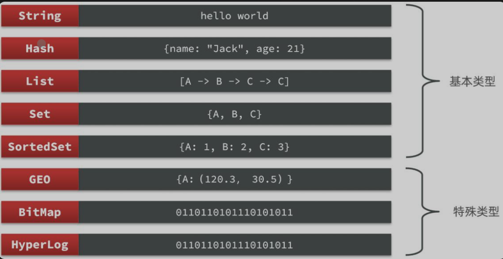

#### redis入门

*  Redis是一种键值型的NoSQL数据库，这里有两个关键字 

  * 键值型
  * NoSQL
  * 其中`键值型`是指Redis中存储的数据都是以Key-Value键值对的形式存储，而Value的形式多种多样，可以使字符串、数值甚至Json。而NoSQL则是相对于传统关系型数据库而言，有很大差异的一种数据库

*  传统关系型数据库能满足事务的ACID原则(原子性、一致性、独立性及持久性)。而非关系型数据库往往不支持事务，或者不能要个保证ACID的特性，只能实现基本的一致性 

  


* 存储方式
  - 关系型数据库基于磁盘进行存储，会有大量的磁盘IO，对性能有一定影响
  - ==非关系型数据库，他们的操作更多的是依赖于内存来操作，内存的读写速度会非常快，性能自然会好一些==

- 扩展性

  - ==关系型数据库集群模式一般是主从，主从数据一致，起到数据备份的作用，称为垂直扩展。==
  - 非关系型数据库可以将数据拆分，存储在不同机器上，可以保存海量数据，解决内存大小有限的问题。称为水平扩展。
  - 关系型数据库因为表之间存在关联关系，如果做水平扩展会给数据查询带来很多麻烦

- Redis诞生于2009年，全称是Remote Dictionary Server远程词典服务器，是一个基于内存的键值型NoSQL数据库。

- 特征：

  - 键值(Key-Value)型，Value支持多种不同的数据结构，功能丰富
  - 单线程，每个命令具有原子性
  - 低延迟，速度快(基于内存、IO多路复用、良好的编码)
  - 支持数据持久化
  - 支持主从集群、分片集群
  - 支持多语言客户端

  * 作者：Antirez   Redis官网：https://redis.io/

- redis的远程访问和后台启动

  * 修改配置文件redis.conf

    ```conf
    #bind 127.0.0.1默认是本机访问
    bind 0.0.0.0
    #protected-mode yes要求必须有密码才能远程连接
    protected-mode yes
    #为了远程安全，可以增加密码
    requirepass 123456
    #守护进程
    daemonize yes 
    ```

  * redis-serve运行

  * 结束，使用kill杀死

* redis数据类型

  

* 通用命令

  |     命令     |                           描述                           |
  | :----------: | :------------------------------------------------------: |
  | KEYs pattern |            查找所有符合给定模式(pattern)的key            |
  |  EXISTs key  |                   检查给定key是否存在                    |
  |   TYPE key   |                 返回key所储存的值的类型                  |
  |   TTL key    | 返回给定key的剩余生存时间(TTL, time to live)，以秒为单位 |
  |   DEL key    |               该命令用于在key存在是删除key               |
  * ```
    KEYS
    ```

    ：查看符合模板的所有key

    - 不建议在生产环境设备上使用，因为Redis是单线程的，==执行查询的时候会阻塞其他命令，当数据量很大的时候，使用KEYS进行模糊查询，效率很差==

  * ```
    DEL
    ```

    ：删除一个指定的key

    - 也可以删除多个key，`DEL name age`，会将name和age都删掉

  * ```
    EXISTS
    ```

    ：判断key是否存在

    - `EXISTS name`，如果存在返回1，不存在返回0

  * ```
    EXPIRE
    ```

    ：给一个key设置有效期，有效期到期时该key会被自动删除

    - `EXPIRE name 20`，给name设置20秒有效期，到期自动删除

  * ```
    TTL
    ```

    ：查看一个key的剩余有效期(Time-To-Live)

    - `TTL name`，查看name的剩余有效期，如果未设置有效期，则返回-1


* String类型

  * String类型，也就是字符串类型，是Redis中最简单的存储类型。其value是字符串，不过根据字符串的格式不同，又可以分为3类

    - `string`：普通字符串
    - `int`：整数类型，可以做自增、自减操作
    - `float`：浮点类型，可以做自增、自减操作不管是哪种格式，底层都是字节数组形式存储，只不过是编码方式不同，字符串类型的最大空间不能超过512M

  * 常见的命令

    |    命令     |                             描述                             |
    | :---------: | :----------------------------------------------------------: |
    |     SET     |         添加或者修改一个已经存在的String类型的键值对         |
    |     GET     |                 根据key获取String类型的value                 |
    |    MEST     |                批量添加多个String类型的键值对                |
    |    MGET     |             根据多个key获取多个String类型的value             |
    |    INCR     |                     让一个整形的key自增1                     |
    |   INCRBY    | 让一个整形的key自增并指定步长值，例如：incrby num 2，让num值自增2 |
    | INCRBYFLOAT |             让一个浮点类型的数字自增并指定步长值             |
    |    SETNX    | 添加一个String类型的键值对，前提是这个key不存在，否则不执行，可以理解为真正的`新`增 |
    |    SETEX    |    添加一个String类型的键值对，并指定有效期**已经失效了**    |

  * Redis没有类似MySQL中Table的概念，那么我们该如何区分不同类型的Key呢？例如：需要存储用户、商品信息到Redis，有一个用户的id是1，有一个商品的id恰好也是1，如果此时使用id作为key，那么就回冲突，该怎么办？

  * 我们可以通过给key添加前缀加以区分，不过这个前缀不是随便加的，有一定的规范

    - Redis的key允许有多个单词形成层级结构，多个单词之间用

      ```
      :
      ```

      隔开，格式如下

      ```
      PLAINTEXT项目名:业务名:类型:id
      ```

    - 这个格式也并非是固定的，可以根据自己的需求来删除/添加词条，这样我们就可以把不同数据类型的数据区分开了，从而避免了key的冲突问题

    - 例如我们的项目名叫reggie，有user和dish两种不同类型的数据，我们可以这样定义key

      - user相关的key：`reggie:user:1`
      - dish相关的key：`reggie:dish:1`

  * 如果value是一个Java对象，例如一个User对象，则可以将对象序列化为JSON字符串后存储

  |      KEY      |                    VALUE                    |
  | :-----------: | :-----------------------------------------: |
  | reggie:user:1 |     {“id”:1, “name”: “Jack”, “age”: 21}     |
  | reggie:dish:1 | {“id”:1, “name”: “鲟鱼火锅”, “price”: 4999} |

  - 并且在Redis的桌面客户端中，也会以相同前缀作为层次结构，让数据看起来层次分明，关系清晰


* Hash类型

  * Hash类型，也叫散列，其中value是一个无序字典，类似于Java中的HashMap结构

  * String结构是将对象序列化为JSON字符串后存储，当我们要修改对象的某个属性值的时候很不方便

  * Hash结构可以将对象中的每个字段独立存储，可以针对单个字段做CRUD

    

  * Hash常用命令

    |         命令         |                             描述                             |
    | :------------------: | :----------------------------------------------------------: |
    | HSET key field value |              添加或者修改hash类型key的field的值              |
    |    HGET key field    |                获取一个hash类型key的field的值                |
    |        HMSET         | 批量添加多个hash类型key的field的值（弃用了，HSET可以实现这个功能） |
    |        HMGET         |              批量获取多个hash类型key的field的值              |
    |       HGETALL        |         获取一个hash类型的key中的所有的field和value          |
    |        HKEYS         |             获取一个hash类型的key中的所有的field             |
    |       HINCRBY        |           让一个hash类型key的字段值自增并指定步长            |
    |        HSETNX        | 添加一个hash类型的key的field值，前提是这个field不存在，否则不执行 |


* List类型

  * Redis中的List类型与Java中的LinkedList类似，可以看做是一个双向链表结构。既可以支持正向检索和也可以支持反向检索。

  * 特征也与LinkedList类似：

    - 有序
    - 元素可以重复
    - 插入和删除快
    - 查询速度一般

  * 常用来存储一个有序数据，例如：朋友圈点赞列表，评论列表等。

  * List的常见命令有：

    |        命令         |                             描述                             |
    | :-----------------: | :----------------------------------------------------------: |
    | LPUSH key element … |                 向列表左侧插入一个或多个元素                 |
    |      LPOP key       |        移除并返回列表左侧的第一个元素，没有则返回nil         |
    | RPUSH key element … |                 向列表右侧插入一个或多个元素                 |
    |      RPOP key       |                移除并返回列表右侧的第一个元素                |
    | LRANGE key star end |                 返回一段角标范围内的所有元素                 |
    |    BLPOP和BRPOP     | 与LPOP和RPOP类似，只不过在没有元素时等待指定时间，而不是直接返回nil |


* Set类型

  * Redis的Set结构与Java中的HashSet类似，可以看做是一个value为null的HashMap。因为也是一个hash表，因此具备与HashSet类似的特征：

    - 无序
    - 元素不可重复
    - 查找快
    - 支持交集、并集、差集等功能

  * Set的常见命令有：

    |         命令         |            描述             |
    | :------------------: | :-------------------------: |
    |  SADD key member …   |  向set中添加一个或多个元素  |
    |  SREM key member …   |     移除set中的指定元素     |
    |      SCARD key       |     返回set中元素的个数     |
    | SISMEMBER key member | 判断一个元素是否存在于set中 |
    |       SMEMBERS       |     获取set中的所有元素     |
    |  SINTER key1 key2 …  |     求key1与key2的交集      |
    |  SUNION key1 key2 …  |     求key1与key2的并集      |
    |  SDIFF key1 key2 …   |     求key1与key2的差集      |


* SortedSet类型

  * Redis的SortedSet是一个可排序的set集合，与Java中的TreeSet有些类似，但底层数据结构却差别很大。SortedSet中的每一个元素都带有一个score属性，可以基于score属性对元素排序，底层的实现是一个跳表（SkipList）加 hash表。

  * SortedSet具备下列特性：

    - 可排序
    - 元素不重复
    - 查询速度快

  * 因为SortedSet的可排序特性，经常被用来实现排行榜这样的功能。

  * SortedSet的常见命令有：

    |             命令             |                             描述                             |
    | :--------------------------: | :----------------------------------------------------------: |
    |    ZADD key score member     | 添加一个或多个元素到sorted set ，如果已经存在则更新其score值 |
    |       ZREM key member        |                删除sorted set中的一个指定元素                |
    |      ZSCORE key member       |             获取sorted set中的指定元素的score值              |
    |       ZRANK key member       |              获取sorted set 中的指定元素的排名               |
    |          ZCARD key           |                  获取sorted set中的元素个数                  |
    |      ZCOUNT key min max      |           统计score值在给定范围内的所有元素的个数            |
    | ZINCRBY key increment member |    让sorted set中的指定元素自增，步长为指定的increment值     |
    |      ZRANGE key min max      |          按照score排序后，获取指定排名范围内的元素           |
    |  ZRANGEBYSCORE key min max   |          按照score排序后，获取指定score范围内的元素          |
    |    ZDIFF、ZINTER、ZUNION     |                      求差集、交集、并集                      |

    * 注意：所有的排名默认都是升序，如果要降序则在命令的Z后面添加REV即可。