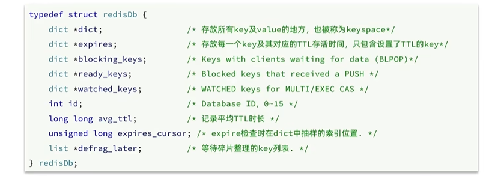

#### redis的通信协议

* 在Redis中采用的是RESP ( Redis serialization Protocol)协议:Redis 1.2版本引入了RESP协议
  * Redis 2.0版本中成为与Redis服务端通信的标准，称为RESP2
  * Redis 6.0版本中，从RESP2升级到了RESP3协议，增加了更多数据类型并且支持6.0的新特性--客户端缓存
* 在RESP中，通过首字节的字符来区分不同数据类型，常用的数据类型包括5种:
  * 单行字符串:首字节是'+'，后面跟上单行字符串，以CRLF ( "'\r\n")结尾。例如返回"OK":“+OK\r\n"
  * 错误（Errors)︰首字节是‘·，与单行字符串格式一样，只是字符串是异常信息，例如:"-Error message\r\n"数值:首字节是'∵'，后面跟上数字格式的字符串，以CRLF结尾。例如: ":10\r\n"
  * 多行字符串:首字节是‘\$'，表示二进制安全的字符串，最大支持512MB
    * 如果大小为0，则代表空字符串:"$0\r\n\r\n"
    * 如果大小为-1，则代表不存在:"$-1\r\n"
  * 数组:首字节是‘*'，后面跟上数组元素个数，再跟上元素，元素数据类型不限:

* Redis本身是一个典型的key-value内存存储数据库，因此所有的key、value都保存在之前学习过的Dict结构中。不过在其database结构体中，有两个Dict:一个用来记录key-value;另一个用来记录key-TTL。

  

* Redis是如何知道一个key是否过期呢?
  
  * 利用两个Dict分别记录key-value对及key-ttl对
  
* 是不是TTL到期就立即删除了呢?
  * 惰性删除
    * 惰性删除∶顾明思议并不是在TTL到期后就立刻删除，而是在访问一个key的时候，检查该key的存活时间，如果已经过期才执行删除。
  * 周期删除
    * 周期删除:顾明思议是通过一个定时任务，周期性的抽样部分过期的key，然后执行删除。
    * 执行周期有两种:
      * Redis会设置一个定时任务serverCron()，按照server.hz的频率来执行过期key清理，模式为SLOW
        * 执行频率受server.hz影响，默认为10，即每秒执行10次，每个执行周期100ms。
        * 执行清理耗时不超过一次执行周期的25%.
        * 逐个遍历db，逐个遍历db中的bucket，抽取20个key判断是否过期
        * 如果没达到时间上限（25ms）并且过期key比例大于10%，再进行一次抽样，否则结束
      * Redis的每个事件循环前会调用beforeSleep()函数，执行过期key清理，模式为FAST
        * ）执行频率受beforeSleep()调用频率影响，但两次FAST模式间隔不低于2ms
        * 执行清理耗时不超过1ms
        * 逐个遍历db，逐个遍历db中的bucket，抽取20个key判断是否过期
        * 如果没达到时间上限（1ms）并且过期key比例大于10%，再进行一次抽样，否则结束

* 内存淘汰:就是当Redis内存使用达到设置的阈值时，Redis主动挑选部分key删除以释放更多内存的流程。

  * Redis支持8种不同策略来选择要删除的key:

    * noeviction:不淘汰任何key，但是内存满时不允许写入新数据，默认就是这种策略。
    * volatile-ttl:对设置了TTL的key，比较key的剩余TTL值，TTL越小越先被淘汰
    * allkeys-random:对全体key，随机进行淘汰。也就是直接从db->dict中随机挑选
    * volatile-random:对设置了TTL的key，随机进行淘汰。也就是从db->expires中随机挑选。
    * allkeys-lru:对全体key，基于LRU算法进行淘汰
    * volatile-lru:对设置了TTL的key，基于LRU算法进行淘汰
    * allkeys-lfu:对全体key，基于LFU算法进行淘汰
    * volatile-lfu:对设置了TTL的key，基于LFl算法进行淘汰

  * 可以通过修改配置文件

    

  * LRU(Least Recently Used)，最少最近使用。用当前时间减去最后一次访问时间，这个值越大则淘汰优先级越高。LFU (Least Frequently Used)，最少频率使用。会统计每个key的访问频率，值越小淘汰优先级越高。
    

  * LFu的访问次数之所以叫做逻辑访问次数，是因为并不是每次key被访问都计数，而是通过运算:

    * 生成O~1之间的随机数R

    * 计算1/(旧次数* lfu_log_factor + 1)，记录为P，lfu_log_factor默认为10

    * 如果R<P，则计数器＋1，且最大不超过255

    * 访问次数会随时间衰减，距离上一次访问时间每隔lfu_decay_time分钟(默认1)，计数器-1

      
