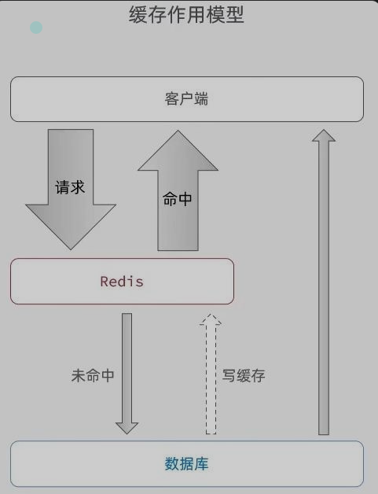
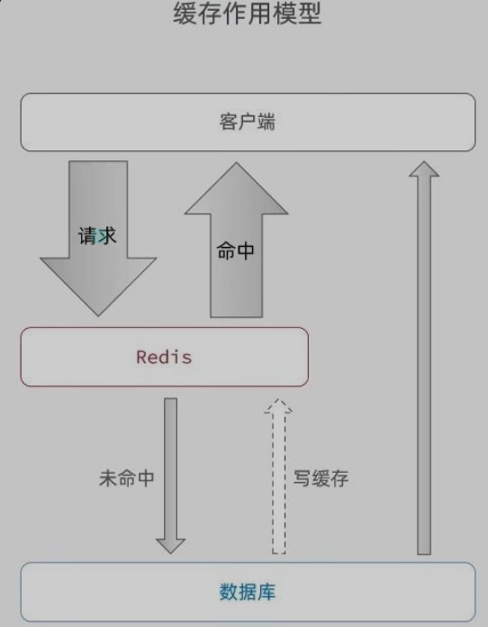
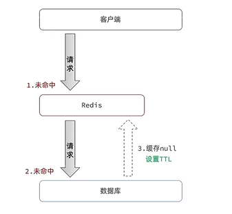
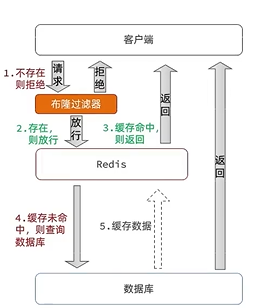
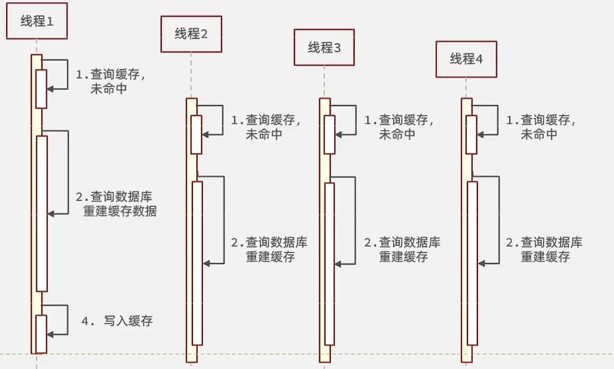
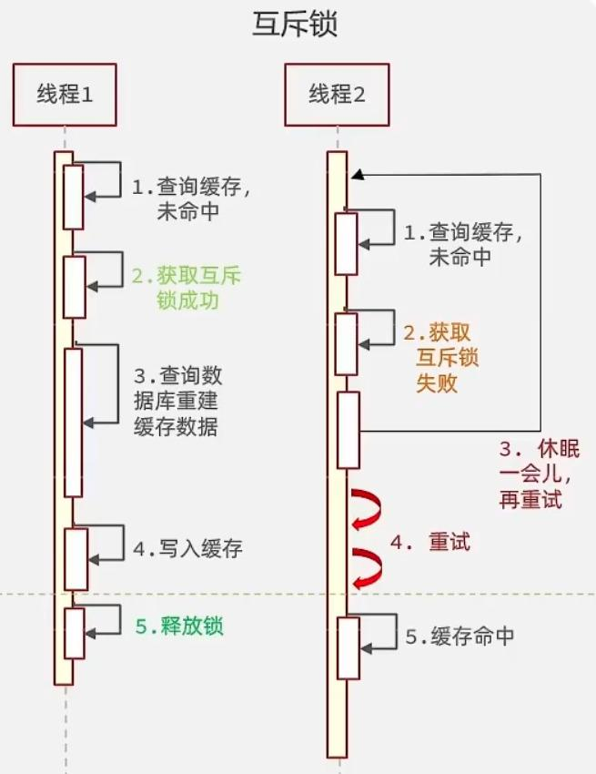
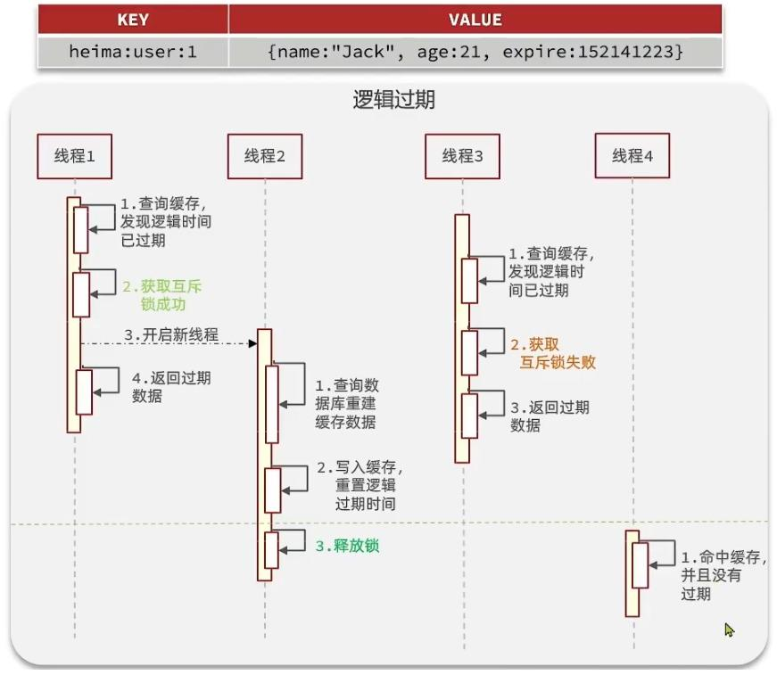
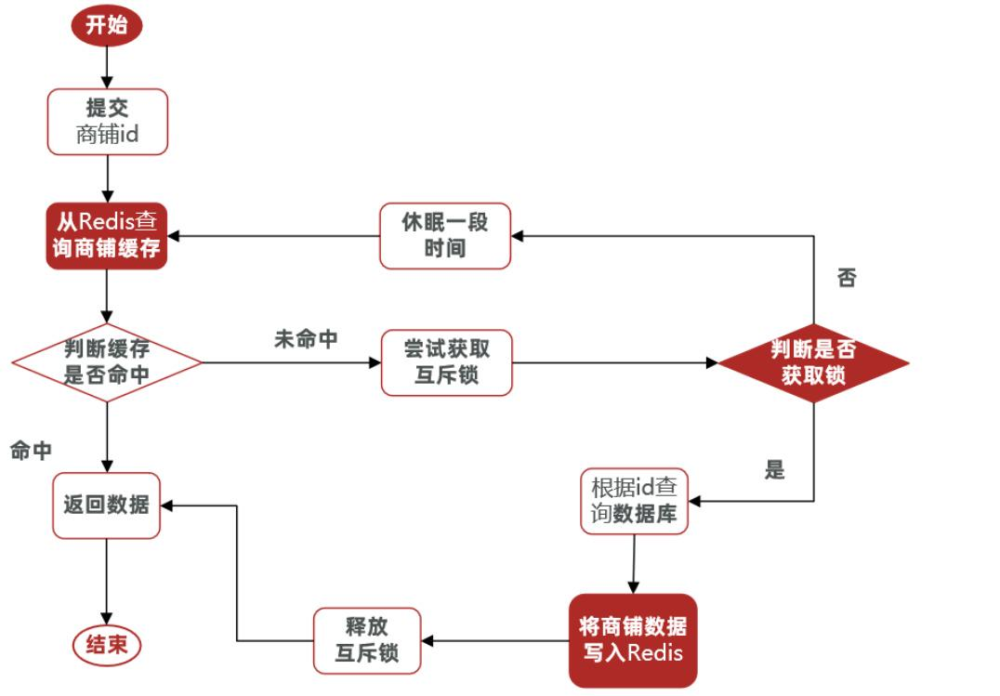

#### 缓存

* 实际开发中，会构筑多级缓存来时系统运行速度进一步提升，例如：本地缓存与Redis中的缓存并发使用

* `浏览器缓存：`主要是存在于浏览器端的缓存

* `应用层缓存：`可以分为toncat本地缓存，例如之前提到的map或者是使用Redis作为缓存

* `数据库缓存：`在数据库中有一片空间是buffer pool，增改查数据都会先加载到mysql的缓存中

* `CPU缓存：`当代计算机最大的问题就是CPU性能提升了，但是内存读写速度没有跟上，所以为了适应当下的情况，增加了CPU的L1，L2，L3级的缓存

* 缓存模型和思路

  - 标准的操作方式就是查询数据库之前先查询缓存，如果缓存数据存在，则直接从缓存中返回，如果缓存数据不存在，再查询数据库，然后将数据存入Redis。

    

* 

  

* 缓存更新策略

  * 缓存更新是Redis为了节约内存而设计出来的一个东西，主要是因为内存数据宝贵，当我们想Redis插入太多数据，此时就可能会导致缓存中数据过多，所以Redis会对部分数据进行更新，或者把它成为淘汰更合适
  * `内存淘汰`：Redis自动进行，当Redis内存大道我们设定的`max-memery`时，会自动触发淘汰机制，淘汰掉一些不重要的数据（可以自己设置策略方式）
  * `超时剔除`：当我们给Redis设置了过期时间TTL之后，Redis会将超时的数据进行删除，方便我们继续使用缓存
  * `主动更新`：我们可以手动调用方法把缓存删除掉，通常用于解决缓存和数据库不一致问题

  |          |                           内存淘汰                           |                           超时剔除                           |                    主动更新                    |
  | :------: | :----------------------------------------------------------: | :----------------------------------------------------------: | :--------------------------------------------: |
  |   说明   | 不用自己维护， 利用Redis的内存淘汰机制， 当内存不足时自动淘汰部分数据。 下次查询时更新缓存。 | 给缓存数据添加TTL时间， 到期后自动删除缓存。 下次查询时更新缓存。 | 编写业务逻辑， 在修改数据库的同时， 更新缓存。 |
  |  一致性  |                              差                              |                             一般                             |                       好                       |
  | 维护成本 |                              无                              |                              低                              |                       高                       |

  - 业务场景
    - 低一致性需求：使用内存淘汰机制，例如店铺类型的查询缓存（因为这个很长一段时间都不需要更新）
    - 高一致性需求：主动更新，并以超时剔除作为兜底方案，例如店铺详情查询的缓存

#### 数据库和缓存不一致解决方案

- 由于我们的缓存数据源来自数据库，而数据库的数据是会发生变化的，因此，如果当数据库中数据发生变化，而缓存却没有同步，此时就会有一致性问题存在，其后果是
  - 用户使用缓存中的过时数据，就会产生类似多线程数据安全问题，从而影响业务，产品口碑等
- 那么如何解决这个问题呢？有如下三种方式
  1. ==Cache Aside Pattern 人工编码方式：缓存调用者在更新完数据库之后再去更新缓存，也称之为双写方案。==
  2. ==Read/Write Through Pattern：缓存与数据库整合为一个服务，由服务来维护一致性。调用者调用该服务，无需关心缓存一致性问题。但是维护这样一个服务很复杂，市面上也不容易找到这样的一个现成的服务，开发成本高==
  3. ==Write Behind Caching Pattern：调用者只操作缓存，其他线程去异步处理数据库，最终实现一致性。但是维护这样的一个异步的任务很复杂，需要实时监控缓存中的数据更新，其他线程去异步更新数据库也可能不太及时，而且缓存服务器如果宕机，那么缓存的数据也就丢失了==

- 综上所述，在企业的实际应用中，``还是方案一最可靠``，但是方案一的调用者该如何处理呢？
- 如果采用方案一，假设我们每次操作完数据库之后，都去更新一下缓存，但是如果中间并没有人查询数据，``那么这个更新动作只有最后一次是有效的，中间的更新动作意义不大，所以我们可以把缓存直接删除，等到有人再次查询时，再将缓存中的数据加载出来``
- 对比删除缓存与更新缓存
  - `更新缓存`：每次更新数据库都需要更新缓存，无效写操作较多
  - `删除缓存`：更新数据库时让缓存失效，再次查询时更新缓存
- 如何保证缓存与数据库的操作同时成功/同时失败
  - `单体系统：`将缓存与数据库操作放在同一个事务
  - `分布式系统：`==利用TCC等分布式事务方案==
- 先操作缓存还是先操作数据库？我们来仔细分析一下这两种方式的线程安全问题
  - 先删除缓存，再操作数据库
    - 删除缓存的操作很快，但是更新数据库的操作相对较慢，如果此时有一个线程2刚好进来查询缓存，==由于我们刚刚才删除缓存，所以线程2需要查询数据库，并写入缓存，但是我们更新数据库的操作还未完成，所以线程2查询到的数据是脏数据，出现线程安全问题==
  -  先操作数据库，再删除缓存
    - 线程1在查询缓存的时候，缓存TTL刚好失效，需要查询数据库并写入缓存，这个操作耗时相对较短（相比较于上图来说），但是就在这么短的时间内，线程2进来了，更新数据库，删除缓存，但是线程1虽然查询完了数据（更新前的旧数据），但是还没来得及写入缓存，所以线程2的更新数据库与删除缓存，并没有影响到线程1的查询旧数据，写入缓存，造成线程安全问题

### 缓存穿透问题的解决思路

- `缓存穿透`：缓存穿透是指客户端请求的数据在缓存中和数据库中都不存在，这样缓存永远都不会生效（只有数据库查到了，才会让redis缓存，但现在的问题是查不到），会频繁的去访问数据库。

- 常见的结局方案有两种

  1. 缓存空对象
     - 优点：实现简单，维护方便
     - 缺点：额外的内存消耗，可能造成短期的不一致
  2. 布隆过滤
     - 优点：内存占用啥哦，没有多余的key
     - 缺点：实现复杂，可能存在误判

- `缓存空对象`思路分析：当我们客户端访问不存在的数据时，会先请求redis，但是此时redis中也没有数据，就会直接访问数据库，但是数据库里也没有数据，那么这个数据就穿透了缓存，直击数据库。但是数据库能承载的并发不如redis这么高，所以如果大量的请求同时都来访问这个不存在的数据，那么这些请求就会访问到数据库，简单的解决方案就是哪怕这个数据在数据库里不存在，我们也把这个这个数据存在redis中去（这就是为啥说会有`额外的内存消耗`），这样下次用户过来访问这个不存在的数据时，redis缓存中也能找到这个数据，不用去查数据库。可能造成的`短期不一致`是指在空对象的存活期间，我们更新了数据库，把这个空对象变成了正常的可以访问的数据，但由于空对象的TTL还没过，所以当用户来查询的时候，查询到的还是空对象，等TTL过了之后，才能访问到正确的数据，不过这种情况很少见罢了

  

- `布隆过滤`思路分析：布隆过滤器其实采用的是哈希思想来解决这个问题，通过一个庞大的二进制数组，根据哈希思想去判断当前这个要查询的数据是否存在，``如果布隆过滤器判断存在，则放行，这个请求会去访问redis，哪怕此时redis中的数据过期了，但是数据库里一定会存在这个数据，从数据库中查询到数据之后，再将其放到redis中。``如果布隆过滤器判断这个数据不存在，则直接返回。这种思想的优点在于节约内存空间，但存在误判，误判的原因在于：布隆过滤器使用的是哈希思想，只要是哈希思想，都可能存在哈希冲突

  

* 缓存穿透产生的原因是什么？
  - 用户请求的数据在缓存中和在数据库中都不存在，不断发起这样的请求，会给数据库带来巨大压力
* 缓存产投的解决方案有哪些？
  - 缓存null值
  - 布隆过滤
  - 增强id复杂度，避免被猜测id规律（可以采用雪花算法）
  - 做好数据的基础格式校验
  - 加强用户权限校验
  - 做好热点参数的限流

### 缓存雪崩问题及解决思路

- ==缓存雪崩是指在同一时间段，大量缓存的key同时失效，或者Redis服务宕机，导致大量请求到达数据库，带来巨大压力==
- 解决方案
  - ==给不同的Key的TTL添加随机值，让其在不同时间段分批失效==
  - 利用Redis集群提高服务的可用性（使用一个或者多个哨兵(`Sentinel`)实例组成的系统，对redis节点进行监控，在主节点出现故障的情况下，能将从节点中的一个升级为主节点，进行故障转义，保证系统的可用性。 ）
  - 给缓存业务添加降级限流策略
  - 给业务添加多级缓存（浏览器访问静态资源时，优先读取浏览器本地缓存；访问非静态资源（ajax查询数据）时，访问服务端；请求到达Nginx后，优先读取Nginx本地缓存；如果Nginx本地缓存未命中，则去直接查询Redis（不经过Tomcat）；如果Redis查询未命中，则查询Tomcat；请求进入Tomcat后，优先查询JVM进程缓存；如果JVM进程缓存未命中，则查询数据库）

### 缓存击穿问题及解决思路

- 缓存击穿也叫热点Key问题，就是一个被`高并发访问`并且`缓存重建业务较复杂`的key突然失效了，那么无数请求访问就会在瞬间给数据库带来巨大的冲击
- 举个不太恰当的例子：一件秒杀中的商品的key突然失效了，大家都在疯狂抢购，那么这个瞬间就会有无数的请求访问去直接抵达数据库，从而造成缓存击穿
- 常见的解决方案有两种
  1. 互斥锁
  2. 逻辑过期(就是永久不过期)
- `逻辑分析`：假设线程1在查询缓存之后未命中，本来应该去查询数据库，重建缓存数据，完成这些之后，其他线程也就能从缓存中加载这些数据了。但是在线程1还未执行完毕时，又进来了线程2、3、4同时来访问当前方法，那么这些线程都不能从缓存中查询到数据，那么他们就会在同一时刻访问数据库，执行SQL语句查询，对数据库访问压力过大
  
- `解决方案一`：互斥锁
- 利用锁的互斥性，假设线程过来，只能一个人一个人的访问数据库，从而避免对数据库频繁访问产生过大压力，但这也会影响查询的性能，将查询的性能从并行变成了串行，我们可以采用tryLock方法+double check来解决这个问题
- 线程1在操作的时候，拿着锁把房门锁上了，那么线程2、3、4就不能都进来操作数据库，只有1操作完了，把房门打开了，此时缓存数据也重建好了，线程2、3、4直接从redis中就可以查询到数据。

- `解决方案二`：逻辑过期方案
- 方案分析：我们之所以会出现缓存击穿问题，主要原因是在于我们对key设置了TTL，如果我们不设置TTL，那么就不会有缓存击穿问题，但是不设置TTL，数据又会一直占用我们的内存，所以我们可以采用逻辑过期方案
- 我们之前是TTL设置在redis的value中，注意：这个过期时间并不会直接作用于Redis，==而是我们后续通过逻辑去处理。假设线程1去查询缓存，然后从value中判断当前数据已经过期了，此时线程1去获得互斥锁，那么其他线程会进行阻塞，获得了锁的进程他会开启一个新线程去进行之前的重建缓存数据的逻辑，直到新开的线程完成者逻辑之后，才会释放锁，而线程1直接进行返回，假设现在线程3过来访问，由于线程2拿着锁，所以线程3无法获得锁，线程3也直接返回数据（但只能返回旧数据，牺牲了数据一致性，换取性能上的提高），只有等待线程2重建缓存数据之后，其他线程才能返回正确的数据==
- 这种方案巧妙在于，异步构建缓存数据，缺点是在重建完缓存数据之前，返回的都是脏数据
  

### 对比互斥锁与逻辑删除

- `互斥锁方案`：由于保证了互斥性，所以数据一致，且实现简单，只是加了一把锁而已，也没有其他的事情需要操心，所以没有额外的内存消耗，缺点在于有锁的情况，就可能死锁，所以只能串行执行，性能会受到影响
- `逻辑过期方案`：线程读取过程中不需要等待，性能好，有一个额外的线程持有锁去进行重构缓存数据，但是在重构数据完成之前，其他线程只能返回脏数据，且实现起来比较麻烦

| 解决方案 |                  优点                  |                  缺点                   |
| :------: | :------------------------------------: | :-------------------------------------: |
|  互斥锁  | 没有额外的内存消耗 保证一致性 实现简单 | 线程需要等待，性能受影响 可能有死锁风险 |
| 逻辑过期 |         线程无需等待，性能较好         |  不保证一致性 有额外内存消耗 实现复杂   |

### 利用互斥锁解决缓存击穿问题

- `核心思路`：相较于原来从缓存中查询不到数据后直接查询数据库而言，现在的方案是，进行查询之后，如果没有从缓存中查询到数据，则进行互斥锁的获取，获取互斥锁之后，判断是否获取到了锁，如果没获取到，则休眠一段时间，过一会儿再去尝试，知道获取到锁为止，才能进行查询
- 如果获取到了锁的线程，则进行查询，将查询到的数据写入Redis，再释放锁，返回数据，利用互斥锁就能保证只有一个线程去执行数据库的逻辑，防止缓存击穿
  

* redis有一个setnx命令，它是对于不存在的值进行创建，存在的则不创建，这样在并发的时候只能第一个线程创建，其他线程都不能创建。==它是分布式锁的基本原理==