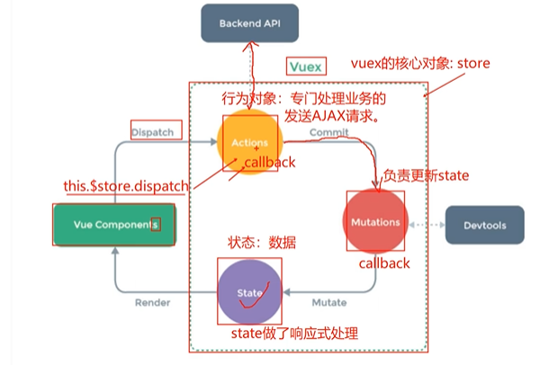

#### Vuex

*  vuex 是实现数据集中式状态管理的插件。数据由 vuex 统一管理。其它组件都去使用 vuex 中的数据。只要有其中一个组件去修改了这个共享的数据，其它组件会同步更新。一定要注意：全局事件总线和 vuex 插件的区别： 

  * 全局事件总线关注点：组件和组件之间数据如何传递，一个绑定$on，一个触发$emit。数据实际上还是在局部的组件当中，并没有真正的让数据共享。只是数据传来传去。 

* 安装

  *  安装 vuex（版本没对应一起，2对应3了）

    * (1) vue2 安装 vuex3 版本
      * ① npm i vuex@3
    * (2) vue3 安装 vuex4 版本
      * ① npm i vuex@4 

  *  创建目录和 js 文件（目录和文件名不是必须叫这个）

    * (1) 目录：vuex
    * (2) js 文件：store.js 

  * 创建对象

    ```js
    //引入插件
    import Vuex from 'vuex'
    //注册插件
    Vue.use(Vuex)
    //创建对象
    const actions={}
    const mutations = {}
    const state = {
        num:0
    }
    //Store是Vuex最核心的对象
    export default Vuex.Store({
        //这里配置项是固定的
        //行为对象
        actions:actions,
        //更新对象
        mutations,
        //状态对象
        state
    })
    ```

  * 导入插件

    ```js
    //导入插件
    import {p1} from './plugins'
    import store from './vuex/store'
    //插件的使用通常在创建Vue之前
    Vue.use(p1,1,2,3,4)
    
    new Vue({
      render: h => h(App),
      beforeCreate(){
        Vue.prototype.x = this
        store:store
        
      }
    }).$mount('#app')
    ```

  * 使用插件

    ```js
    this.$store.state.num++
    ```

    * 虽然这样写没问题，但是不建议这样写，代码得不到复用，每一个文件都要写这个代码。代码应该写到vuex中

      ```js
      const actions={
          //都是回调函数
          search:function(context,value){
              //context是上下文，value是数据
              //这里还可以调用其他的回调函数
              value=value+1;
              //提交上下文环境，再去调用mutations
              context.commit(SEARCH,value)
          }
      }
      const mutations = {
          //都是回调函数
          SEARCH(state,value){
              //上一环节传过来的value
              state.num+=value
          }
      }
      const state = {
          num:0
      }
      ```

    * 其他组件去调用这些

      ```js
                  //dispatch，调用这个方法后，store中的action名为search的回调函数会自动调用，交给那边的代码去看
                  this.$store.dispatch('search',this.num)
      ```

      

    * 而且可以多次分发

#### 案例：字符串翻转

* 使用Vuex

  ```js
  //引入插件
  import Vuex from 'vuex'
  import Vue from 'vue';
  //注册插件
  Vue.use(Vuex)
  //创建对象
  const actions={
  
  }
  const mutations = {
  }
  const state = {
      reversedName:''
  }
  //Store是Vuex最核心的对象
  const store=new Vuex.Store({
      //这里配置项是固定的
      //行为对象
      actions:actions,
      //更新对象
      mutations,
      //状态对象
      state:state
  })
  export default {
      store
  }
  ```

* main.js挂载

  ```js
  //导入插件
  import {p1} from './plugins'
  import store from './vuex/store'
  //插件的使用通常在创建Vue之前
  Vue.use(p1,1,2,3,4)
  
  var vm=new Vue({
    render: h => h(App),
    store:store
  }).$mount('#app')
  console.log(vm);
  ```

* 使用

  ```js
  <template>
      <div>
      <h3>字符串翻转</h3>
      <input type="text" v-model="$store.store.state.reversedName">
      <br>
      <h3>反转之后的用户名: {{$store.store.state.reversedName.split('').reverse().join('')}}</h3>
  
    </div>
  </template>
  
  ```

  

* 进一步优化，有一个新的配置项getters

  * 增加该配置项

    ```js
    //每一个getter可以看做计算属性
    const getters={
        reversedName(state){
            return state.reversedName.split('').reverse().join('');
        }
    }
    //Store是Vuex最核心的对象
    const store=new Vuex.Store({
        //这里配置项是固定的
        //行为对象
        actions:actions,
        //更新对象
        mutations,
        //状态对象
        state:state,
        getters
    })
    ```

  * 使用

    ```js
    <template>
        <div>
        <h3>字符串翻转</h3>
        <input type="text" v-model="$store.store.state.reversedName">
        <br>
        <h3>反转之后的用户名: {{$store.store.getters.reversedName}}</h3>
    
      </div>
    </template>
    ```

    

