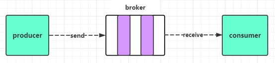

#### kafka入门

* 名字的由来

  * 由于Kafka的架构师 jay kreps 非常喜欢franz kafka (弗兰茨·卡夫卡)（是奥匈帝国一位使用德语的小说家和短篇犹太人故事家，被评论家们认为是20世纪作家中最具影响力的一位）,并且觉得Kafka这个名字很酷，因此把这一款消息传递系统取名为Kafka  
  * Kafka是由Scala语言编写而成，Scala运行在Java虚拟机上，并兼容现有的Java程序，因此部署Kakfa的时候，需要先安装JDK环境  

* kafka启动

  * Apache Kafka可以使用ZooKeeper或KRaft启动；但只能使用其中一种方式，不能同时使用；

    * KRaft：Apache Kafka的内置共识机制，用于取代 Apache ZooKeeper；

  * Kafka启动使用Zookeeper

    1、启动zookeeper：./zookeeper-server-start.sh ../config/zookeeper.properties &

    2、启动kafka：./kafka-server-start.sh ../config/server.properties &

    3、关闭Kafka：./kafka-server-stop.sh ../config/server.properties

    4、关闭zookeeper: ./zookeeper-server-stop.sh ../config/zookeeper.propertie

* 创建主题topic

  * 主题（Topic）类似于文件系统中的文件夹；主题（Topic）用于存储事件（Events）

    

  * 事件（Events）也称为记录或消息，比如支付交易、手机地理位置更新、运输订单、物联网设备或医疗设备的传感器测量数据等等都是事件（Events）；

    事件（Events）被组织和存储在主题（Topic）中

    简单来说，主题（Topic）类似于文件系统中的文件夹，事件（Events）是该文件夹中的文件

  * Broker：Kafka集群中包含的服务器，有一个或多个服务器，这种服务器被称为 Broker。

    * Broker 端不维护数据的消费状态，提升了性能。直接使用磁盘进行存储，线性读写，速度快。避免了在JVM 内存和系统内存之间的复制，减少耗性能的创建对象和垃圾回收。

  * Producer：负责发布消息到Kafka Broker

  * Consumer：负责从Broker 拉取（pull）数据并进行处

  *  Partition： 是物理上的概念，每个Topic 包含一个或多个Partition。kafka分配的单位是Partition 

  * Consumer Group：==每个Consumer 属于一个特定的Consumer Group，可为每个Consumer 指定Group name，若不指定group name 则属于默认的group。每条消息只可以被Consumer Goup 组中中的一个Consumer消费，但是可以指定多个Consumer Group，所以一个消息在Consumer Group 里面只可以被消费一次。==

  * ##### Topic & Partition：Topic 在kafka可以被认为是一个 queue，每发送一条消息必须指定它的Topic，可以简单理解为必须指明把这条消息放入到哪个queue里。为了使得kafka 的吞吐率可以线性提高，物理上把Topic 分成一个或多个Partition，每个Partition 在物理上对应一个文件夹，该文件夹下存储这个Partition 的所有消息和索引文件。若创建 Topic1 和Topic2 两个Topic，且分别有13个和19个分区，则整个集群上相应会生成共32个文件夹

  * ##### Replication-factor： 表示该Topic 需要再不同高德broker 中保存几分 

* 创建主题使用的命令

  * 创建主题使用：kafka-topics.sh 脚本；

    1、不带任何参数会告知该脚本如何使用：./kafka-topics.sh 

    2、创建主题：./kafka-topics.sh --create --topic quickstart-events --bootstrap-server localhost:9092

    3、列出所有的主题：./kafka-topics.sh --list --bootstrap-server localhost:9092

    4、删除主题：./kafka-topics.sh --delete --topic quickstart-events --bootstrap-server localhost:9092

    5、显示主题详细信息：./kafka-topics.sh --describe --topic quickstart-events --bootstrap-server localhost:9092

    6、修改主题信息：./kafka-topics.sh --alter --topic quickstart-events --partitions 5 --bootstrap-server localhost:9092   

* 写入事件

  * Kafka客户端通过网络与Kafka Brokers进行通信，可以写（或读）主题Topic中的事件Events  

    

  * Kafka Brokers一旦收到事件Event，就会将事件Event以持久和容错的方式存储起来，可以永久地存储；

  * 通过 kafka-console-producer.sh 脚本工具写入事件Events；

    * 不带任何参数会告知该脚本如何使用：./kafka-console-producer.sh 

    * ./kafka-console-producer.sh --topic quickstart-events --bootstrap-server localhost:9092

    * 每一次换行是一个事件Event；

    * 使用Ctrl+C退出，停止发送事件Event到主题Topic；

* 读取事件

  * 使用kafka-console-consumer.sh消费者客户端读取之前写入的事件Event：

    * 不带任何参数会告知该脚本如何使用：./kafka-console-consumer.sh 

    * ./kafka-console-consumer.sh --topic quickstart-events --from-beginning --bootstrap-server localhost:9092
      * --from-beginning 表示从kafka最早的消息开始消费

    * 使用Ctrl+C停止消费者客户端；

  * 事件Events是持久存储在Kafka中的，所以它们可以被任意多次读取  

* 图形界面工具

  * Offset Explorer (以前叫 Kafka Tool)，官网：https://www.kafkatool.com/
  * CMAK（以前叫 Kafka Manager） 官网：https://github.com/yahoo/CMAK 
  * EFAK（以前叫 kafka-eagle） 官网：https://www.kafka-eagle.org/