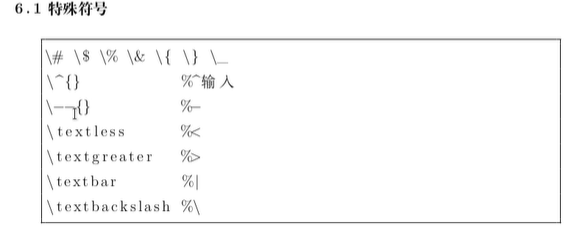
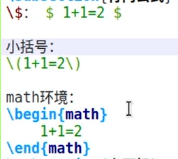
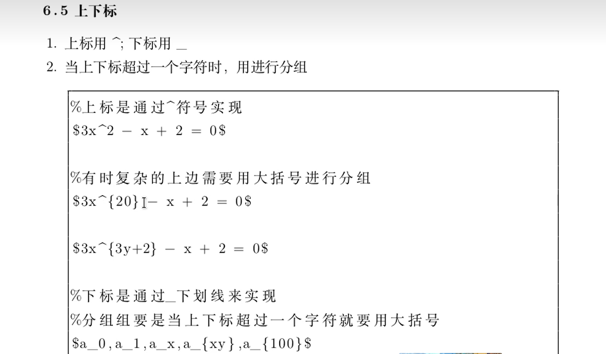
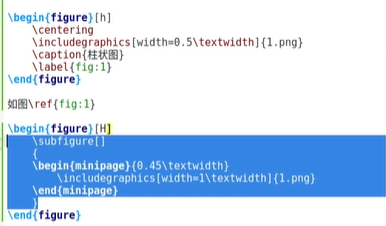
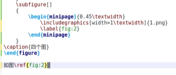
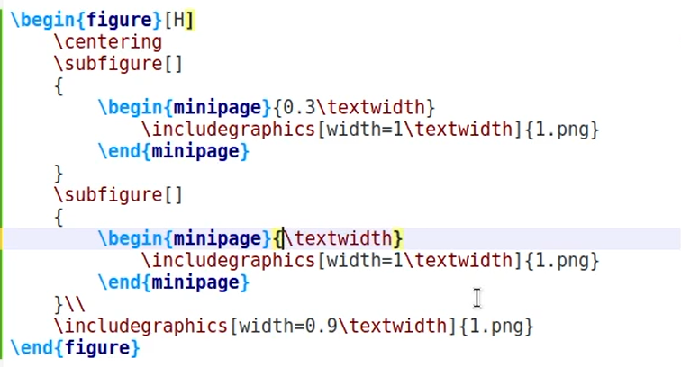
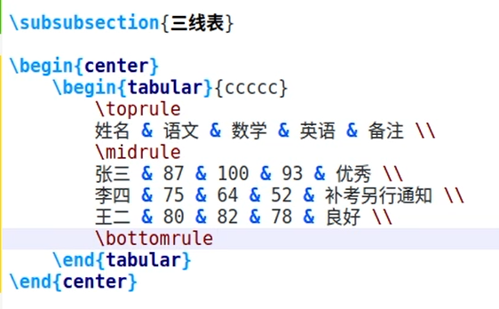

#### 基本结构

* \documentclass{class}

* ​	$f(x)$单/$表示内敛数学符号，双$$表示行间公式

* 空行就是回车

* ```latex
  \documentclass{class}%class可以为book report ,letter
  \tilde{aa}
  \author{aaa}
  \date{\today}
  
  %正文区
  \begin{doucument}
  	内容...
  	$f(x)$
  \end{doucument}
  ```

* eqution用于产生带编号的行间公式


#### 正文区

* 

* 公式的三种写法

  



* \mathrm{e}
* 

* \\\也是换行
* 
  * 引用

* 

* 三线表

  