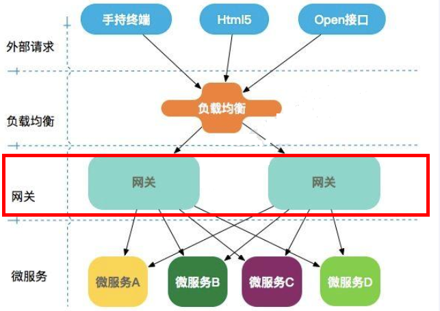

#### GetWay

* Gateway是在Spring生态系统之上构建的API网关服务，基于Spring6，Spring Boot 3和Project Reactor等技术。它旨在为微服务架构提供一种简单有效的统一的 API 路由管理方式，并为它们提供跨领域的关注点，例如：安全性、监控/度量和恢复能力。

* Cloud全家桶中有个很重要的组件就是网关，在1.x版本中都是采用的Zuul网关；但在2.x版本中，zuul的升级一直跳票，SpringCloud最后自己研发了一个网关SpringCloud Gateway替代Zuul，那就是SpringCloud Gateway一句话：gateway是原zuul1.x版的替代

* Gateway（网关）通常也被用作负载均衡器。在微服务架构中，Gateway的一个主要作用就是作为入口，为客户端程序提供服务路由和负载均衡的功能。

  * 具体而言，Gateway可以根据路由配置，将收到的请求动态地路由到后端的多个实例上，从而分摊服务压力，提高整体系统的性能和稳定性。它可以进行基于负载情况的动态路由，将请求分发到不同的服务实例上，以实现负载均衡。

  * 在网关中，通常会配置负载均衡算法，比如轮询、权重轮询、随机、最小连接数等，以使得请求在后端服务实例之间得到均衡分发。另外，Gateway本身会进行状态监控，及时剔除出现故障或不可用的实例，从而保证请求都能被分发到正常运行的服务实例上。

      

* 作用

  * 反向代理
  * 鉴权
  * 流量控制
  * 熔断
  * 日志监控

* GateWay三个核心

  * 在Spring Cloud Gateway中，有三个核心概念：Route（路由）、Predicate（断言）、Filter（过滤）：

    * Route（路由）：Route定义了请求应该被如何转发，可以理解为一条路线的定义。它定义了请求的转发规则，包括目标服务的地址、负载均衡规则、路径匹配规则等。通过定义Route，可以将请求映射到后端的一个或多个服务上。

    * Predicate（断言）：Predicate用于匹配请求，当请求到达Gateway时，Predicate会判断这个请求是否满足某些条件，比如请求的路径、请求的头部信息、请求的参数等。如果请求满足Predicate的条件，才会进一步按照对应的Route进行转发。

    * Filter（过滤）：Filter用于在请求被转发到目标服务之前或之后执行一些过滤操作。它可以用于修改请求和响应，实现请求过程中的日志记录、安全认证、流量控制、请求转发等功能。Gateway内置了多种不同用途的Filter，同时也支持自定义Filter。

* Gateway的使用

  * 导入pom

    ```xml
    <!--gateway-->
    <dependency>
        <groupId>org.springframework.cloud</groupId>
        <artifactId>spring-cloud-starter-gateway</artifactId>
    </dependency>
    ```

  * 配置

    ```yml
    server:
      port: 9527
     
    spring:
      application:
        name: cloud-gateway #以微服务注册进consul或nacos服务列表内
      cloud:
        consul: #配置consul地址
          host: localhost
          port: 8500
          discovery:
            prefer-ip-address: true
            service-name: ${spring.application.name}
        gateway:
          routes:
            - id: pay_routh1 #pay_routh1                #路由的ID(类似mysql主键ID)，没有固定规则但要求唯一，建议配合服务名
              // uri: http://localhost:8001                #匹配后提供服务的路由地址
              uri: lb://cloud-payment-service          #匹配后提供服务的路由地址
              predicates:
                - Path=/pay/gateway/get/              # 断言，路径相匹配的进行路由
     
            - id: pay_routh2 #pay_routh2                #路由的ID(类似mysql主键ID)，没有固定规则但要求唯一，建议配合服务名
              // uri: http://localhost:8001                #匹配后提供服务的路由地址
              uri: lb://cloud-payment-service          #匹配后提供服务的路由地址
              predicates:
                - Path=/pay/gateway/info/              # 断言，路径相匹配的进行路由
    ```

    

* ==同一家公司自己人，系统内环境，直接找微服务。不同家公司有外人，系统外访问，先找网关再服务==