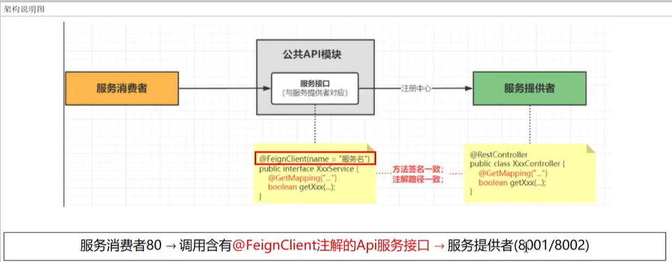

##### OpenFeign

* 它用的比较多，只有调用第三方的时候用RestTemplate

* 前面在使用SpringCloud LoadBalancer+RestTemplatel时，利用RestTemplate对http请求的封装处理形成了一套模版化油调用方法。但是在实际开发中,由于对服务依赖的调用可能不止一处，往往一个接口会被多处调用，所以通常都会针对每个微服务自行封装一些客户端类来包装这些依赖服务的调用。所以，OpenFeign在此基础上做了进一步封装，由他来帮助我们定义和实现依赖服务接口的定义。

* 在OpenFeign的实现下，我们只需创建一个接口并使用注解的方式来配置它(在一个微服务接口上面标注一个@FeignCLient注解即可)，即可完成对服务提供方的接口绑定，统一对外暴露可以被调用的接口方法，大大简化和降低了调用客户端的开发量，也即由服务提供者给出调用接口清单，消费者直接通过OpenFeign调用即可。

* 可以集成OpenFeign，可以在使用OpenFeign时提供Http客户端的负载均衡，也可以集成阿里巴巴Sentinel来提供熔断、降级等功能。而与SpringCloudLoadBalancer不同的是，通过OpenFeign只需要定义服务绑定接口且以声明式的方法，优雅而简单的实现了服务调用。

* 架构说明图

  

* 依赖的导入

  ```xml
  <!--openfeign-->
  <dependency>
      <groupId>org.springframework.cloud</groupId>
      <artifactId>spring-cloud-starter-openfeign</artifactId>
  </dependency>
  ```

* 加两个注解

  * ==主启动类上面配置@EnableFeignClients表示开启OpenFeign功能并激活,这个给消费者绑定的==

    ```java
    @SpringBootApplication
    @EnableDiscoveryClient //该注解用于向使用consul为注册中心时注册服务
    @EnableFeignClients//启用feign客户端,定义服务+绑定接口，以声明式的方法优雅而简单的实现服务调用
    public class MainOpenFeign80 {
        public static void main(String[] args) {
            SpringApplication.run(MainOpenFeign80.class,args);
        }
    ```

    

  * ==@FeignClient(value = "cloud-payment-service")这个注解声明Feign接口，这个给结构绑定的==

    ```java
    @FeignClient(value = "seata-account-service")
    public interface AccountFeignApi
    {
        //扣减账户余额
        @PostMapping("/account/decrease")
        ResultData decrease(@RequestParam("userId") Long userId, @RequestParam("money") Long money);
    }
    ```

    

* 超时控制

  * 默认OpenFeign客户端等待60秒钟，但是服务端处理超过规定时间会导致Feign客户端返回报错。
    为了避免这样的情况，有时候我们需要设置Feign客户端的超时控制，默认60秒太长或者业务时间太短都不好

  * yml文件中开启配置:

    * connectTimeout 连接超时时间

    * readTimeout 请求处理超时时间

    * 全局配置

      ```yml
      spring:
      	cloud:
      		openfeign:
      			client:
      				config:
      					default:
      						connectTimeout: 5000
      						readTimeout: 5000
      						loggerLevel: basic
      ```

    * 指定某一个模块的超时时间

      ```yml
          openfeign:
            client:
              config:
                cloud-payment-service:
                  connectTimeout: 20000 #连接超时时间
                  readTimeout: 20000 #读取超时时间
      ```

    *  如果全局配置和指定配置都用了，优先指定配置 


* 超时重连机制

  * 默认只请求一次

    ```java
    @Configuration
    public class FeignConfig {
        @Bean
        public Retryer myRetryer()
        {
            //return Retryer.NEVER_RETRY; //Feign默认配置是不走重试策略的
    
            //最大请求次数为3(1+2)，初始间隔时间为100ms，重试间最大间隔时间为1s
           return new Retryer.Default(100,1,3);
        }
    }
    ```

    

* OpenFeign默认HttpClient修改

  * OpenFeign中http client如果不做特殊配置，OpenFeign默认使用JDK自带的HttpURLConnection发送HTTP请求，由于默认HttpURLConnection没有连接池、性能和效率比较低，如果采用默认，性能上不是最牛B的，所以我们要用Apache HttpClient 5替换OpenFeign默认的HttpURLConnection。

  * 导入依赖

    ```xml
    <!-- httpclient5-->
    <dependency>
        <groupId>org.apache.httpcomponents.client5</groupId>
        <artifactId>httpclient5</artifactId>
        <version>5.3</version>
    </dependency>
    <!-- feign-hc5-->
    <dependency>
        <groupId>io.github.openfeign</groupId>
        <artifactId>feign-hc5</artifactId>
        <version>13.1</version>
    </dependency>
    ```

  * 开启

    ```yml
    #  Apache HttpClient5 配置开启
    spring:
      cloud:
        openfeign:
          httpclient:
            hc5:
              enabled: true
    ```

* ##### OpenFeign请求/响应压缩

  * 对请求和响应进行GZIP压缩

  * Spring Cloud OpenFeign支持对请求和响应进行GZIP压缩，以减少通信过程中的性能损耗。

  *  通过下面的两个参数设置，就能开启请求与相应的压缩功能： 

    ```properties
    spring.cloud.openfeign.compression.request.enabled=true
    spring.cloud.openfeign.compression.response.enabled=true
    ```

  * 细粒度化设置： 对请求压缩做一些更细致的设置，比如下面的配置内容指定压缩的请求数据类型并设置了请求压缩的大小下限，  只有超过这个大小的请求才会进行压缩。

    ```properties
    spring.cloud.openfeign.compression.request.enabled=true
    spring.cloud.openfeign.compression.request.mime-types=text/xml,application/xml,application/json #触发压缩数据类型
    spring.cloud.openfeign.compression.request.min-request-size=2048 #最小触发压缩的大小
    ```

* 日志注解功能

  *  Feign 提供了日志打印功能，我们可以通过配置来调整日志级别，从而了解 Feign 中 Http 请求的细节，说白了就是对Feign接口的调用情况进行监控和输出 

  * ###### 日志级别

    NONE：默认的，不显示任何日志；

    BASIC：仅记录请求方法、URL、响应状态码及执行时间；

    HEADERS：除了 BASIC 中定义的信息之外，还有请求和响应的头信息；

    FULL：除了 HEADERS 中定义的信息之外，还有请求和响应的正文及元数据。

  * 在配置文件中指定日志用什么级别监视（ logging.level + 含有@FeignClient注解的完整带包名的接口名+debug ）

    ```yml
    # feign日志以什么级别监控哪个接口
    logging:
      level:
        com:
          atguigu:
            cloud:
              apis:
                PayFeignApi: debug 
    ```

  * 配置类中开起注解

    ```java
    package com.atguigu.cloud.config;
     
    import feign.Logger;
    import feign.Retryer;
    import org.springframework.context.annotation.Bean;
    import org.springframework.context.annotation.Configuration;
     
    /
     * @auther zzyy
     * @create 2023-04-12 17:24
     */
    @Configuration
    public class FeignConfig
    {
        @Bean
        Logger.Level feignLoggerLevel() {
            return Logger.Level.FULL;
        }
    }
    ```

    