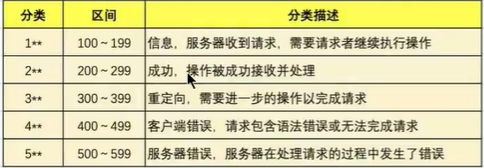

##### SpringCloud

* 微服务五部曲

  * 建module

  * 改POM

  * 写YML

  * 主启动

  * 业务类

    * 主实体 xxxBean

    * 不方便暴露的 使用XXXDTO暴露

    * 时间格式问题

    * 全局异常接入返回格式标准问题

    * API统一接口格式问题

      * code状态值 ：由后端统一定义各种返回结果的状态码

      * message描述：本次接口调用的结果描述（统一返回值对象ResultData）

        

      * data数据：本次返回的数据

      * timestamp：接口调用的时间

      * 所以需要定义一个枚举类（三部曲：举值、构造、遍历）

* RestTemplate
  * RestTemplate提供了多种便捷访问远程Http服务的方法，是一种简单便捷的访问restful服务模板类，是Spring提供的用于访问Rest服务的客户端模板工具集
  * 使用restTemplate访问restful接口非常的简单粗暴无脑。(url, requestMap, ResponseBean.class)这三个参数分别代表REST请求地址、请求参数、HTTP响应转换被转换成的对象类型。
* 微服务重复代码提取（bean实体类日，工具类），可以新建一个api模块
* 微服务所在的IP地址和端口号硬编码到订单微服务中，会存在非常多的问题
  * 如果订单微服务和支付微服务的IP地址或者端口号发生了变化，则支付微服务将变得不可用，需要同步修改订单微服务中调用支付微服务的IP地址和端口号。
  * 如果系统中提供了多个订单微服务和支付微服务，则无法实现微服务的负载均衡功能。
  * 如果系统需要支持更高的并发，需要部署更多的订单微服务和支付微服务，硬编码订单微服务则后续的维护会变得异常复杂。
  * 所以，在微服务开发的过程中，需要引入服务治理功能，实现微服务之间的动态注册与发现，从此刻开始我们正式进入SpringCloud实战

