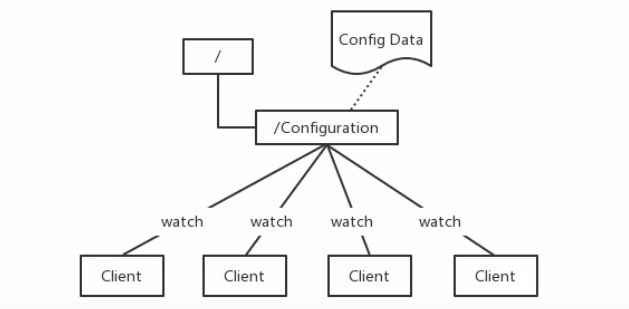
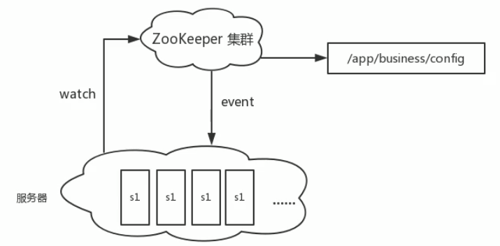

# Zookeeper

## 简介/快速入门

```
ZooKeeper is a centralized service for maintaining configuration information, naming, providing distributed synchronization, and providing group services. All of these kinds of services are used in some form or another by distributed applications. Each time they are implemented there is a lot of work that goes into fixing the bugs and race conditions that are inevitable. Because of the difficulty of implementing these kinds of services, applications initially usually skimp on them, which make them brittle in the presence of change and difficult to manage. Even when done correctly, different implementations of these services lead to management complexity when the applications are deployed.
```

`ZooKeeper`是一个集中的服务，用于维护配置信息、命名、提供分布式同步和提供组服务。所有这些类型的服务都以某种形式被分布式应用程序使用。每次它们被实现时，都会有大量的工作来修复不可避免的错误和竞争条件。由于实现这些服务的困难，应用程序最初通常会略过这些服务，这使得它们在出现更改时变得脆弱，并且难以管理。即使正确地执行了这些服务，在部署应用程序时，这些服务的不同实现也会导致管理复杂性

`zookeeper`由雅虎研究院开发,是` Google Chubby`的开源实现,后来托管到 `Apache`,于`2010年11月`正式成为`apache`的顶级项目

大数据生态系统里由很多组件的命名都是某些动物或者昆虫，比如`hadoop`大象，`hive`就是蜂巢，`zookeeper`即管理员，顾名思义就算管理大数据生态系统各组件的管理员，如下所示：


#### 应用场景

`zookeepepr`是一个经典的**分布式**数据一致性解决方案，致力于为分布式应用提供一个高性能、高可用,且具有严格顺序访问控制能力的分布式协调存储服务。

- 维护配置信息
- 分布式锁服务
- 集群管理
- 生成分布式唯一ID

1. **维护配置信息**

   - `java`编程经常会遇到配置项，比如数据库的`url`、 `schema`、`user`和 `password`等。通常这些配置项我们会放置在配置文件中，再将配置文件放置在服务器上当需要更改配置项时，需要去服务器上修改对应的配置文件。

     但是随着分布式系统的兴起,由于许多服务都需要使用到该配置文件,因此有**必须保证该配置服务的高可用性**(`highavailability`)和各台服务器上配置数据的一致性。

     通常会将配置文件部署在一个集群上，然而一个**集群动辄上千台**服务器，此时如果再一台台服务器逐个修改配置文件那将是非常繁琐且危险的的操作，因此就**需要一种服务**，**能够高效快速且可靠地完成配置项的更改等操作**，并能够保证各配置项在每台服务器上的数据一致性。

     **`zookeeper`就可以提供这样一种服务**，其使用`Zab`这种一致性协议来保证一致性。现在有很多开源项目使用`zookeeper`来维护配置，如在 `hbase`中，客户端就是连接一个 `zookeeper`，获得必要的 `hbase`集群的配置信息，然后才可以进一步操作。还有在开源的消息队列 `kafka`中，也便用`zookeeper`来维护 `brokers`的信息。在 `alibaba`开源的`soa`框架`dubbo`中也广泛的使用`zookeeper`管理一些配置来实现服务治理。

     

2. 分布式锁服务

   - 一个集群是一个分布式系统，由多台服务器组成。为了提高并发度和可靠性，多台服务器上运行着同一种服务。当多个服务在运行时就需要协调各服务的进度，有时候需要保证当某个服务在进行某个操作时，其他的服务都不能进行该操作，即对该操作进行加锁，如果当前机器挂掉后，释放锁并 `fail over`到其他的机器继续执行该服务

3. 集群管理

   - 一个集群有时会因为各种软硬件故障或者网络故障，出现棊些服务器挂掉而被移除集群，而某些服务器加入到集群中的情况，`zookeeper`会将这些服务器加入/移出的情况通知给集群中的其他正常工作的服务器，以及时调整存储和计算等任务的分配和执行等。此外`zookeeper`还会对故障的服务器做出诊断并尝试修复。

     

4. 生产分布式唯一ID

   - 在过去的单库单表型系统中，通常可以使用数据库字段自带的`auto_ increment`属性来自动为每条记录生成一个唯一的`ID`。但是分库分表后，就无法在依靠数据库的`auto_ Increment`属性来唯一标识一条记录了。此时我们就可以用`zookeeper`在分布式环境下生成全局唯一`ID`。

     做法如下:每次要生成一个新`id`时，创建一个持久顺序节点，创建操作返回的节点序号，即为新`id`，然后把比自己节点小的删除即可

#### Zookeeper的设计目标

`zooKeeper`致力于为分布式应用提供一个高性能、高可用，且具有严格顺序访问控制能力的分布式协调服务

1. 高性能
   - `zookeeper`将全量数据存储在**内存**中，并直接服务于客户端的所有非事务请求，尤其用于以读为主的应用场景
2. 高可用
   - `zookeeper`一般以集群的方式对外提供服务，一般`3~5`台机器就可以组成一个可用的 `Zookeeper`集群了，每台机器都会在内存中维护当前的服务器状态，井且每台机器之间都相互保持着通信。只要集群中超过一半的机器都能够正常工作，那么整个集群就能够正常对外服务
3. 严格顺序访问
   - ==对于来自客户端的每个更新请求，`Zookeeper`都会分配一个全局唯一的递增编号，这个编号反应了所有事务操作的先后顺序==


#### 数据模型

`zookeeper`的数据结点可以视为树状结构(或目录)，树中的各个结点被称为`znode `(即`zookeeper node`)，一个`znode`可以由多个子结点。`zookeeper`结点在结构上表现为树状；

使用路径`path`来定位某个`znode`，比如`/ns-1/itcast/mysqml/schemal1/table1`，此处`ns-1，itcast、mysql、schemal1、table1`分别是`根结点、2级结点、3级结点以及4级结点`；其中`ns-1`是`itcast`的父结点，`itcast`是`ns-1`的子结点，`itcast`是`mysql`的父结点....以此类推

`znode`，间距文件和目录两种特点，即像文件一样维护着数据、元信息、ACL、时间戳等数据结构，又像目录一样可以作为路径标识的一部分


那么如何描述一个`znode`呢？一个`znode`大体上分为`3`个部分：

- 结点的数据：即`znode data `(结点`path`，结点`data`)的关系就像是`Java map `中的 `key value `关系
- 结点的子结点`children`
- 结点的状态`stat`：用来描述当前结点的创建、修改记录，包括`cZxid`、`ctime`等

#### 结点状态stat的属性

在`zookeeper shell `中使用 `get `命令查看指定路径结点的`data`、`stat`信息


属性说明：

结点的各个属性如下。其中重要的概念是`Zxid(Zookeeper Transaction ID)`，`Zookeeper`结点的每一次更改都具有唯一的`Zxid`，如果`Zxid-1` 小于` Zxid-2` ，则`Zxid-1` 的更改发生在 `Zxid-2 `更改之前

<https://zookeeper.apache.org/doc/r3.4.14/zookeeperProgrammers.html#sc_zkDataModel_znodes>

- `cZxid`数据结点创建时的事务ID——针对于`zookeeper`数据结点的管理：我们对结点数据的一些写操作都会导致`zookeeper`自动地为我们去开启一个事务，并且自动地去为每一个事务维护一个事务`ID`
- `ctime`数据结点创建时的时间
- `mZxid`数据结点最后一次更新时的事务ID
- `mtime`数据结点最后一次更新时的时间
- `pZxid`数据节点最后一次修改此`znode`子节点更改的`zxid`
- `cversion`子结点的更改次数
- `dataVersion`结点数据的更改次数
- `aclVersion`结点的ACL更改次数——类似`linux`的权限列表，维护的是当前结点的权限列表被修改的次数
- `ephemeralOwner`如果结点是临时结点，则表示创建该结点的会话的`SessionID`；如果是持久结点，该属性值为0
- `dataLength`数据内容的长度
- `numChildren`数据结点当前的子结点个数

**结点类型**

`zookeeper`中的结点有两种，分别为**临时结点**和**永久结点**。结点的类型在创建时被确定，并且不能改变

- 临时节点：
  - 该节点的生命周期依赖于创建它们的会话。一旦会话( `Session`）结束，临时节点将被自动删除，当然可以也可以手动删除。==虽然每个临时的 `Znode`都会绑定到一个客户端会话，但他们对所有的客户端还是可见的。另外，`Zookeeper`的临时节点不允许拥有子节点==
- 持久化结点：
  - 该结点的生命周期不依赖于会话，并且只有在客户端显示执行删除操作的时候，它们才能被删除


#### 单机安装

测试系统环境`centos7.3`

`zookeeper:zookeeper-3.4.10.tar.gz`

`jdk:jdk-8u131-linux-x64.tar.gz`

<http://archive.apache.org/dist/zookeeper/>

1. 在`centos `中使用 `root`用户创建 `zookeeper`用户，用户名:`zookeeper `密码:`zookeeper`

   - ```shell
     useradd zookeeper
     passwd zookeeper
     su zookeeper
     ```

2. `zookeeper`底层依赖于jdk，`zookeeper`用户登录后，根目录下先进行jdk 的安装，jdk使用 `jdk-8u131-linux-x64.tar.gz`

   - ```
     tar -zxf tar.gz
     ```

3. 配置jdk 环境变量

   - ```shell
     vi /etc/profile
     JAVA_HOME=/home/zookeeper/jdk1.8.0_131
     export JAVA_HOME
     
     PATH=$JAVA_HOME/bin:$PATH
     export PATH
     
     souce /etc/profile
     ```

4. 检测jdk安装

   - `java -version` // 如果反馈了Java信息，则成功

5. `zookeeper` 上传解压

   - `tar -zxf tar.gz`

6. 为`zookeeper`准备配置文件

   - ```shell
     # 进入conf目录
     cd /home/zookeeper/zookeeper-3.4.10/conf
     # 复制配置文件
     cp zoo_sampe.cfg zoo.cfg
     # zookeeper 根目录下创建data目录
     mkdir data
     # vi 配置文件中的dataDir
     # 此路径用于存储zookeeper中数据的内存快照、及事务日志文件，虽然zookeeper是使用内存的，但是需要持久化一些数据来保证数据的安全，和redis一样
     dataDir=/home/zookeeper/zookeeper-3.4.10/data
     ```

7. 启动`zookeeper`

   - ```shell
     # 进入zookeeper的bin目录
     cd /home/zookeeper/zookeeper-3.4.10/bin
     # 启动zookeeper
     ./zkServer.sh start
     
     # 启动: zkServer.sh start
     # 停止: zkServer.sh stop
     # 查看状态：zkServer.sh status
     
     # 进入zookeeper 内部
     ./zkCli.sh
     ```

     


#### 常用shell命令

`zookeeper`——`getting started`——<https://zookeeper.apache.org/doc/r3.4.14/zookeeperStarted.html#sc_FileManagement>

https://zookeeper.apache.org/doc/current/zookeeperCLI.html

##### 操作结点

**查询**

`get /hadoop`  查看结点的数据和属性     `stat /hadoop` 查看结点的属性

**创建**

创建结点并写入数据：

`create [-s] [-e] path data` # 其中 -s 为有序结点（顺序节点，节点的编号自增），-e 临时结点（会话断开就关掉了），不写默认是持久结点

```shell
create /hadoop "123456"  # 此时，如果quit退出后再./ZkCient.sh 登入
                         # 再用输入 get /hadoop 获取，结点依然存在(永久结点)
				       
create -s /a "a"         # 创建一个持久化有序结点，创建的时候可以观察到返回的数据带上了一个id       
create -s /b "b"         # 返回的值，id递增了

create -s -e /aa "aa"    # 依然还会返回自增的id，quit后再进来，继续创建，id依然是往后推的，顺序临时节点

create /aa/xx            # 继续创建结点，可以看到pZxid变化了
```

**更新**

更新结点的命令是`set`，可以直接进行修改，如下：

`set path [version]`

```shell
set /hadoop "345"        # 修改结点值

set /hadoop "hadoop-x" 1 # 也可以基于版本号进行更改，类似于乐观锁，当传入版本号(dataVersion)
                         # 和当前结点的数据版本号不一致时，zookeeper会拒绝本次修改
```

**删除**

删除结点的语法如下：

`delete path [version]` 和 `set` 方法相似，也可以传入版本号

```shell
delete /hadoop           # 删除结点
delete /hadoop 1         # 乐观锁机制，与set 方法一致
```

要想删除某个结点及其所有后代结点，可以使用递归删除，命令为 `rmr path`

**查看结点列表**

```shell
ls /hadoop               # 可以查看结点的列表
ls2 /hadoop              # 可以查看结点的列表以及目标结点的信息，已经被淘汰了，建议使用ls -s

ls /                     # 根节点
quit                     #断开连接
```

**监听器get path [watch] | stat path [watch]** 

使用`get path [watch]` 注册的监听器能够在结点**内容发生改变**的时候，向客户端发出通知。需要注意的是`zookeeper`的触发器是一次性的(`One-time trigger`)，即触发一次后就会立即失效

```shell
get /hadoop watch        # get 的时候添加监听器，当值改变的时候，监听器返回消息
set /hadoop 45678        # 测试
```

**ls\ls2 path [watch]**

使用 `ls path [watch] 或 ls2 path [watch] `注册的监听器能够监听该结点下**所有子节点**的**增加**和**删除**操作

```shell
ls /hadoop watch         # 添加监听器
set /hadoop/node "node"
```


### zookeeper的Acl权限控制

<https://zookeeper.apache.org/doc/r3.4.14/zookeeperProgrammers.html#sc_ZooKeeperAccessControl>

`zookeeper `类似文件系统，`client`可以创建结点、更新结点、删除结点，那么如何做到结点的权限控制呢？

`zookeeper`的 `access control list` 访问控制列表可以做到这一点

`acl`权限控制，使用`scheme：id：permission `来标识，主要涵盖3个方面：

<https://zookeeper.apache.org/doc/r3.4.14/zookeeperProgrammers.html#sc_BuiltinACLSchemes>

- 权限模式(`scheme`)：授权的策略
- 授权对象(`id`)：授权的对象
- 权限(`permission`)：授予的权限

其特性如下：

- `zookeeper`的权限控制是基于每个`znode`结点的，需要对每个结点设置权限

- 每个`znode `支持多种权限控制方案和多个权限

- 子结点不会继承父结点的权限，客户端无权访问某结点，但可能可以访问它的子结点：

  例如`setAcl /test2 ip:192.168.133.133:crwda`  // 将结点权限设置为Ip：192.168.133.133 的客户端可以对节点进行
  增删改查和管理权限

**权限模式**

- 采用何种方式授权

- | 方案   | 描述                                                    |
  | ------ | ------------------------------------------------------- |
  | world  | 只有一个用户：`anyone`，代表登录`zookeeper`所有人(默认) |
  | ip     | 对客户端使用IP地址认证                                  |
  | auth   | 使用已添加认证的用户认证                                |
  | digest | 使用"用户名：密码"方式认证                              |

**授权对象**

- 给谁授予权限
- 授权对象ID是指，权限赋予的实体，例如：IP地址或用户

**授权的权限**

- 授予什么权限

- `create、delete、read、writer、admin`也就是 增、删、查、改、管理权限，这5种权限简写为 c d r w a，注意：
  这五种权限中，有的权限并不是对结点自身操作的例如：delete是指对**子结点**的删除权限

  可以试图删除父结点，但是子结点必须删除干净，所以`delete`的权限也是很有用的
  
- | 权限   | ACL简写 | 描述                               |
  | ------ | ------- | ---------------------------------- |
  | create | c       | 可以创建子结点                     |
  | delete | d       | 可以删除子结点(仅下一级结点)       |
  | read   | r       | 可以读取结点数据以及显示子结点列表 |
  | write  | w       | 可以设置结点数据                   |
  | admin  | a       | 可以设置结点访问控制权限列表       |

**授权的相关命令**

- | 命令    | 使用方式 | 描述         |
  | ------- | -------- | ------------ |
  | getAcl  | getAcl   | 读取ACL权限  |
  | setAcl  | setAcl   | 设置ACL权限  |
  | addauth | addauth  | 添加认证用户 |

#### 案例/远程登录

**`./zkServer.sh -server 192.168.133.133`** 可以远程登录

**world权限模式**

- `getAcl /node` // 读取权限信息
- `setAcl /node world:anyone:drwa` // 设置权限(禁用创建子结点的权限)

**ip模式**

`./zkServer.sh -server 192.168.133.133` 可以远程登录

- `setAcl /hadoop ip:192.168.133.133:drwa`
- 如果在两台不同的虚拟机中，另一台用远程连接的模式，进行上面这条命令，那么只会有一台被授权
- 需要两台虚拟机一起授权的话需要用**逗号**将授权列表隔开：`setAcl /hadoop ip:192.168.133.133:cdrwa,ip:192.168.133.132:cdrwa`

**auth认证用户模式**

**`addauth digest <user>:<password>`**

**`setAcl <path> auth:<user>:<acl>`**

- ```shell
  create /hadoop "hadoop"           # 初始化测试用的结点
  addauth digest itcast:123456      # 添加认证用户
  setAcl /hadoop auth:itcast:cdrwa  # 设置认证用户
  quit                              # 退出后再./zkCli.sh 进入
  get /hadoop                       # 这个时候就没有权限了，需要再次认证
  addauth digest itcast:123456      # 认证，密码错了的话 zookeeper 不会报错，但是不能认证
  get /hadoop
  ```

  

**Digest授权模式**

**`setAcl <path> digest:<user>:<password>:<acl>`**

- 这里的密码是经过`SHA1`以及`BASE64`处理的密文，在shell 中可以通过以下命令计算：

  - ```shell
    echo -n <user>:<password> | openssl dgst -binary -sha1 | openssl base64
    ```

  - ```shell
    # 计算密码
    echo -n itcast:12345 | openssl dgst -binary -sha1 | openssl base64
    # 获取密码，设置权限列表
    setAcl /hadoop digest:itcast:qUFSHxJjItUW/93UHFXFVGlvryY=:cdrwa
    # 现在想要get /hadoop 需要登录了
    addauth digest itcast:12345
    get /hadoop
    ```


**多种授权模式**

仅需逗号隔开

- ```shell
   setAcl /hadoop ip:192.168.133.132:cdrwa,auth:hadoop:cdrwa,digest:itcast:673OfZhUE8JEFMcu0l64qI8e5ek=:cdrwa
  ```

  

#### acl 超级管理员

- `zookeeper`的权限管理模式有一种叫做`super`，该模式提供一个超管，可以方便的访问任何权限的节点

  假设这个超管是`supper:admin`，需要为超管生产密码的密文

  ```shell
  echo -n super:admin | openssl dgst -binary -sha1 | openssl base64
  ```

- 那么打开`zookeeper`目录下`/bin/zkServer.sh`服务器脚本文件，找到如下一行：

  ```shell
   /nohup # 快速查找，可以看到如下
   nohup "$JAVA" "-Dzookeeper.log.dir=${ZOO_LOG_DIR}" "-Dzookeeper.root.logger=${ZOO_LOG4J_PROP}"
  ```

- 这个就算脚本中启动`zookeeper`的命令，默认只有以上两个配置项，我们需要添加一个超管的配置项

  ```
  "-Dzookeeper.DigestAuthenticationProvider.superDigest=super:xQJmxLMiHGwaqBvst5y6rkB6HQs="
  ```

- 修改后命令变成如下

  ```shell
  nohup "$JAVA" "-Dzookeeper.log.dir=${ZOO_LOG_DIR}" "-Dzookeeper.root.logger=${ZOO_LOG4J_PROP}" "-Dzookeeper.DigestAuthenticationProvider.superDigest=super:xQJmxLMiHGwaqBvst5y6rkB6HQs="
  ```

- ``` shell
  # 重起后，现在随便对任意节点添加权限限制
  setAcl /hadoop ip:192.168.1.1:cdrwa # 这个ip并非本机
  # 现在当前用户没有权限了
  getAcl /hadoop
  # 登录超管
  addauth digest super:admin
  # 强行操作节点
  get /hadoop
  ```

  


