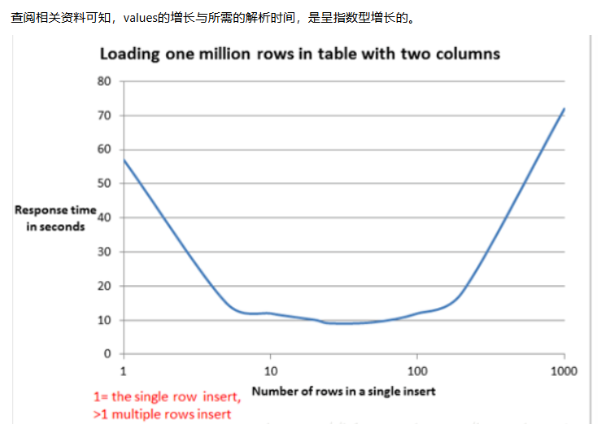

#### 格式化问题

* SimpleDateFormat是非线程安全的，看了源码发现SimpleDateFormat的format()、parse()为非线程安全，且没有做限制。
* SimpleDateFormat的操作中有对calendar对象进行清除和获取操作。如果在A线程set(time)之后，B线程进行了clear()操作，那A线程进行getTime()时，便会获取到“Thu Jan 01 00:00:00 CST 1970”，产生错误。
  * 多线程下是不安全的，不同的线程会对不同日期字符串进行解析，会出现线程A解析到一半被挂起，线程B运行时将A的解析到一半的字符串覆盖掉，这样轮到A运行时会解析失败或者使用了B的字符串。于是进到catch代码块，返回了false，或者时间不对，返回false了。


#### [上传文件报Failed to parse multipart servlet request; nested exception is java.io.IOException](https://confluence.log56.com/pages/viewpage.action?pageId=142410508)

* 文件上传或下载会创建临时文件保存post的数据，项目启动后，会创建临时文件目录，但linux系统会定时清理临时文件目录，清理后上传会报以上错误，所以项目启动需要创建临时目录，表示为项目的启动目录，该目录不会被清理

  解决方案1：

  在application.yml文件中配置，并重启项目

  ```
  server`
  ` ``tomcat:`
  `   ``basedir: /data/tmp
  ```


#### [delete和truncate的区别](https://confluence.log56.com/pages/viewpage.action?pageId=152191440)

* 删除内容比较
  * TRUNCATE TABLE：删除表中的所有行，但保留表结构和其元数据、索引等。
  * DELETE：根据WHERE子句的条件删除表中的行。如果没有指定WHERE子句，那么将删除表中的所有行。

* 日志记录
  * TRUNCATE：通常不记录在事务日志中，因为它是一个不可逆的操作，用于快速清理表。
  * DELETE：操作记录在事务日志中，因为它是一个可逆的操作，可以通过事务回滚来撤销。


#### ibatis动态列查询问题解决

* 这个问题是因为你查询的sql的列是变化的，但是ibatis默认的会缓存RS中的meta信息，如果你第一次查询的列和第二次查询的列不一样的话，那么第二次ibatis还会以第一次查询的列为key从RS里面获取数据，但是你的列是变化的，所以第二次取数据的时候，RS里面已经没有了你第一次的那个列了，所以会出错。 幸好ibatis 可以设置来改变这种缓存引起的问题，就是这个remapResults=true

  ```xml
  <select id="" parameterClass="" resultClass="" remapResults="true">
   
  </select>
  ```

#### [Mybatis IN 查询超过1000条解决办法](https://confluence.log56.com/pages/viewpage.action?pageId=168469200)

* 在使用MyBatis进行数据库查询时，有时会遇到使用IN条件查询导致的问题。当IN条件中的个数超过1000时，MySQL会抛出错误，因为默认情况下MySQL的参数个数限制为1000。
* 修改MySQL的参数限制：
  * 可以通过修改MySQL的参数`max_allowed_packet`来增加单个查询中允许的参数个数。你可以在MySQL配置文件中（例如`my.cnf`或`my.ini`）设置该参数，或者在运行时动态调整。
  * 例如，将`max_allowed_packet`设置为2M（约2000个字符）：
* 使用分页查询：
  * 如果不需要一次获取所有结果，可以将查询分页处理。例如，可以使用LIMIT关键字来限制每次查询返回的结果数。这样可以将一个大查询拆分成多个小查询，每个查询的参数个数都在MySQL的限制之内。
* 使用临时表：
  * 另一种解决方法是将大量的IN条件值[存储](https://cloud.baidu.com/product/bos.html)在临时表中，然后通过连接临时表来进行查询。这样可以绕过MySQL的参数个数限制。


#### mybatis 关于 if test 判断字符串的坑

* 场景一：bulkWaybillStatus是一个字符串类型，当传入参数的值为“0”时，仍然不能执行if判断下的sql语句

  ```xml
  <if test="bulkWaybillStatus == '0'">
      AND T.PAY_STATE = #{bulkWaybillStatus}
  </if>
  ```

* 场景二：bulkWaybillStatus是一个字符串类型，当传入参数的值为空字符串""时，注意不是null，会执行if判断下的sql语句；如果传的是null，和我们预期的一样，不会执行if判断下的sql语句

  ```xml
  <if test="bulkWaybillStatus == 0">
      AND T.PAY_STATE = #{bulkWaybillStatus}
  </if>
  ```

* 原因：读mybatis原理

  ```java
  public static int compareWithConversion(Object v1, Object v2) {
      int result;
      if (v1 == v2) {
          result = 0;
      } else {
          int t1 = getNumericType(v1);
          int t2 = getNumericType(v2);
          int type = getNumericType(t1, t2, true);
          switch(type) {
          case 6:
              result = bigIntValue(v1).compareTo(bigIntValue(v2));
              break;
          case 9:
              result = bigDecValue(v1).compareTo(bigDecValue(v2));
              break;
          case 10:
              if (t1 == 10 && t2 == 10) {
                  if (v1 instanceof Comparable && v1.getClass().isAssignableFrom(v2.getClass())) {
                      result = ((Comparable)v1).compareTo(v2);
                      break;
                  }
   
                  throw new IllegalArgumentException("invalid comparison: " + v1.getClass().getName() + " and " + v2.getClass().getName());
              }
          case 7:
          case 8:
              double dv1 = doubleValue(v1);
              double dv2 = doubleValue(v2);
              return dv1 == dv2 ? 0 : (dv1 < dv2 ? -1 : 1);
          default:
              long lv1 = longValue(v1);
              long lv2 = longValue(v2);
              return lv1 == lv2 ? 0 : (lv1 < lv2 ? -1 : 1);
          }
      }
   
      return result;
  }
  ```

  ```java
  //转成数字的源码    
  public static int getNumericType(Object value) {
          if (value != null) {
              Class c = value.getClass();
              if (c == Integer.class) {
                  return 4;
              }
  
              if (c == Double.class) {
                  return 8;
              }
  
              if (c == Boolean.class) {
                  return 0;
              }
  
              if (c == Byte.class) {
                  return 1;
              }
  
              if (c == Character.class) {
                  return 2;
              }
  
              if (c == Short.class) {
                  return 3;
              }
  
              if (c == Long.class) {
                  return 5;
              }
  
              if (c == Float.class) {
                  return 7;
              }
  
              if (c == BigInteger.class) {
                  return 6;
              }
  
              if (c == BigDecimal.class) {
                  return 9;
              }
          }
  
          return 10;
      }
  
  ```

  

* 对于场景1，由于v1是字符串类型，v2是字符类型，两个类型不同，会把v1和v2都转换成double类型来进行比较，v1转成的double类型值是0.0，v2转成的double类型值是48，所以最终比较的值不相等，走不到if判断下的sql语句

* 对于场景2，由于v1是字符串类型，v2是Integer类型，两个类型不同，会把v1和v2都转换成double类型来进行比较，注意看下面的doubleValue方法

  ```java
  
  public static double doubleValue(Object value) throws NumberFormatException {
      if (value == null) {
          return 0.0D;
      } else {
          Class c = value.getClass();
          if (c.getSuperclass() == Number.class) {
              return ((Number)value).doubleValue();
          } else if (c == Boolean.class) {
              return (Boolean)value ? 1.0D : 0.0D;
          } else if (c == Character.class) {
              return (double)(Character)value;
          } else {
              String s = stringValue(value, true);
              return s.length() == 0 ? 0.0D : Double.parseDouble(s);
          }
      }
  }
  ```

  ```xml
  
  <if test='bulkWaybillStatus == "0"'>
      AND T.PAY_STATE = #{bulkWaybillStatus}
  </if>
  <if test="bulkWaybillStatus == '0'.toString()">
      AND T.PAY_STATE = #{bulkWaybillStatus}
  </if>
  ```

* 当然，大多数的场景下我们可能用的是场景2里的写法，但是这种写法需要注意的就是如果入参可能是空字符串，并且又正好是和0比较的话，就会有问题。所以如果非要用场景2的那种写法，在和0比较的时候，最好写成

  ```xml
  <if test='bulkWaybillStatus != '' and bulkWaybillStatus == 0'>
      AND T.PAY_STATE = #{bulkWaybillStatus}
  </if>
  ```

  

#### JDBC流式读取

* 场景：我们有一个蚂蚁链的推送后台，大致流程是先查询所有已经终结但还没有推送过的运单列表（数据量很大，如果一次性加载出来容易OOM），然后调用接口判断是否符合推送条件，符合就推送，不符合就不推送。最开始想到的是使用分页查询，但由于每一页查询出来的数据有些满足推送条件有些不不满足推送条件，这就导致下一页的页码被打乱无法继续。例如：第一页查询出10条数据，但这10条有8条数据满足条件被处理了，此时实际想要的下一页数据应该是当前数据库中的第3条到第12条记录，可下一页查询页码无论设置为1还是2查询结果都不正确。而且分页查询每次都需要重新进行获取连接、开启事物等操作，效率上也不高。

* 解决办法：jdbc提供了一种通过流的方式获取数据。它是一次查询，每次客户端和服务端交互时，抓取fetchSize条数据到本地，然后通过ResultSet将结果一条一条的返回给调用者。因为是一次查询，就不存在分页查询中部分数据被处理了导致页码被打乱的问题；因为是获取到部分数据就处理掉，就不会出现OOM。当数据量比较大时，还可以通过增大fetchSize值来减少客户端和服务端的交互从而提高性能。

* 总结：在做数据库的相关开发的时候，可能有人面对过这些场景，从一个数据库把大数据量读取出来存放到另外一个数据库、做大数据量的报表、将大数据量的数据读取出来推送到接口。因为是大数据量，所以如果直接读取可能会存在OOM的问题，或者直接卡顿，因为使用JDBC连接数据库读取大数据量时候，所有的数据是直接从数据库服务端加载进入了客户端，所以内存占用过大，而且result.next()方法会阻塞。

  ```java
              preparedStatement = connctObj.prepareStatement(strSql, ResultSet.TYPE_FORWARD_ONLY,
                      ResultSet.CONCUR_READ_ONLY);
              preparedStatement.setFetchSize(1000);
              preparedStatement.setFetchDirection(ResultSet.FETCH_REVERSE);
              resultSet = preparedStatement.executeQuery();
  
  ```

  

#### mybatis不区分大小写问题

* sql查询里的别名写的是taxWaybillId，而不是taxWayBillId，所以ibatis在做结果映射的时候，最终是会把值给映射到taxWaybillId上面的，其实并不是这样的，那里的别名其实是不区分大小写的

  ```java
  private void initializeBeanResults(ResultSet rs) {
      try {
        ClassInfo classInfo = ClassInfo.getInstance(getResultClass());
        // 获取LcmCpiiBean里的所有set方法的属性
        String[] propertyNames = classInfo.getWriteablePropertyNames();
        // 将所有set属性存到propertyMap里去，map的key是属性的大写，LcmCpiiBean里有taxWaybillId和taxWayBillId两个字段属性，这两个属性转换成大写后都是TAXWAYBILLID，
        // 所以最终存到propertyMap里面的肯定是只有其中的一个，至于value到底是taxWaybillId还是taxWayBillId，又跟propertyNames的数组顺序有关系
        Map propertyMap = new HashMap();
        for (int i = 0; i < propertyNames.length; i++) {
          propertyMap.put(propertyNames[i].toUpperCase(java.util.Locale.ENGLISH), propertyNames[i]);
        }
   
        List resultMappingList = new ArrayList();
        ResultSetMetaData rsmd = rs.getMetaData();
        for (int i = 0, n = rsmd.getColumnCount(); i < n; i++) {
          // columnName就是sql查询里的字段别名
          String columnName = getColumnIdentifier(rsmd, i + 1);
          // 字段别名全部转成大写，所以我们的sql里TAX_WAYBILL_ID字段的别名即使写的是taxWaybillId，但是也被转成了TAXWAYBILLID
          String upperColumnName = columnName.toUpperCase(java.util.Locale.ENGLISH);
          // 将转换成大写的字段别名，也就是TAXWAYBILLID作为key，去从propertyMap里面拿到真正要映射的属性字段，至于真正拿的是哪个字段，我们再来看下ClassInfo的源码
          String matchedProp = (String) propertyMap.get(upperColumnName);
          Class type = null;
          if (matchedProp == null) {
            Probe p = ProbeFactory.getProbe(this.getResultClass());
            try {
              type = p.getPropertyTypeForSetter(this.getResultClass(), columnName);
            } catch (Exception e) {
              //TODO - add logging to this class?
            }
          } else {
            type = classInfo.getSetterType(matchedProp);
          }
          if (type != null || matchedProp != null) {
            ResultMapping resultMapping = new ResultMapping();
            resultMapping.setPropertyName((matchedProp != null ? matchedProp : columnName));
            resultMapping.setColumnName(columnName);
            resultMapping.setColumnIndex(i + 1);
            resultMapping.setTypeHandler(getDelegate().getTypeHandlerFactory().getTypeHandler(type)); //map SQL to JDBC type
            resultMappingList.add(resultMapping);
          }
        }
        setResultMappingList(resultMappingList);
   
      } catch (SQLException e) {
        throw new RuntimeException("Error automapping columns. Cause: " + e);
      }
   
    }
  ```

  

##### [Mybatis批量插入最优方式](https://confluence.log56.com/pages/viewpage.action?pageId=180475615)

* 普通插入：默认的插入方式是遍历insert语句，单条执行，效率肯定低下，如果成堆插入，更是性能有问题。

  ```sql
  INSERT INTO `table1` (`field1`, `field2`) VALUES ("data1", "data2");
  INSERT INTO `table1` (`field1`, `field2`) VALUES ("data1", "data2");
  INSERT INTO `table1` (`field1`, `field2`) VALUES ("data1", "data2");
  INSERT INTO `table1` (`field1`, `field2`) VALUES ("data1", "data2");
  INSERT INTO `table1` (`field1`, `field2`) VALUES ("data1", "data2");
  ```

  

* mybatis的for each 批量插入：如果要优化插入速度时，可以将许多小型操作组合到一个大型操作中。理想情况下，这样可以在单个连接中一次性发送许多新行的数据，并将所有索引更新和一致性检查延迟到最后才进行。

  ```sql
  INSERT INTO `table1` (`field1`, `field2`) 
  VALUES ("data1", "data2"),
  ("data1", "data2"),
  ("data1", "data2"),
  ("data1", "data2"),
  ("data1", "data2");
  ```

  * 这个慢的原因：默认执行器类型为Simple，会为每个语句创建一个新的预处理语句，也就是创建一个`PreparedStatement`对象。在我们的项目中，会不停地使用[批量插入](https://so.csdn.net/so/search?q=批量插入&spm=1001.2101.3001.7020)这个方法，而因为MyBatis对于含有的语句，无法采用缓存，那么在每次调用方法时，都会重新解析sql语句。

  * **当我们把批量所有的数据全放在一条sql语句中时：由于foreach后有大量的values，所以这个PreparedStatement预处理sql特别长，包含了很多占位符，对于占位符和参数的映射尤其耗时**

    

    * 所以，如果非要使用 foreach 的方式来进行批量插入的话，可以考虑减少一条 insert 语句中 values 的个数，最好能达到上面曲线的最底部的值，使速度最快。一般按经验来说，一次性插20~50行数量是比较合适的，时间消耗也能接受。
    * 此外Mysql 对执行的SQL语句大小进行限制，相当于对字符串进行限制。默认允许最大SQL是 4M 。

* `ExecutorType.BATCH`插入：原理：把SQL语句发个数据库，数据库预编译好，数据库等待需要运行的参数，接收到参数后一次运行，`ExecutorType.BATCH`只打印一次SQL语句，预编译一次sql，多次设置参数步骤。