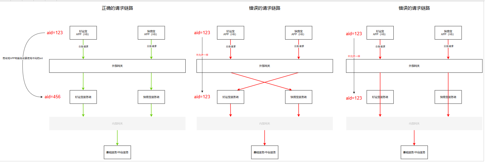
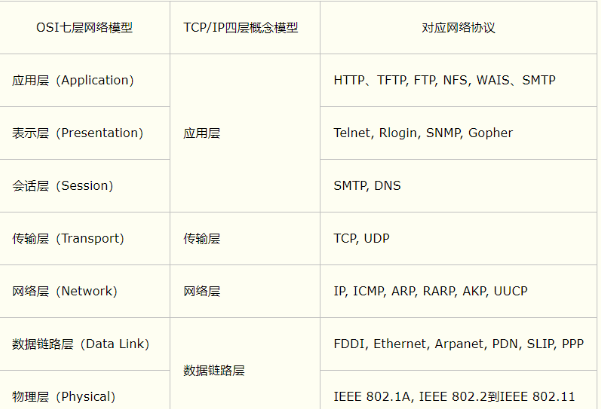

#### 项目设计

* 项目架构要求
  * 项目必须通过域名对外提供服务原则。
  * 项目访问通过统一网关访问后端服务,安全机制放在网关侧实现原则（敏感接口应该使用网关的报文整体加密或字段加密功能），[网关SDK文档（m-gateway）](https://confluence.log56.com/pages/viewpage.action?pageId=144640978)。
  * 项目结构符合前、后分离原则。(横向扩容)
  * 项目对中间件依赖必须是弱耦合，即中间件出现故障，不会导致项目不可访问。
  * 项目数据源单一原则。
  * 项目必须接入健康检查监控及异常告警监控原则。(无监控不上线)。接入方式参考：[项目健康检查接口](https://confluence.log56.com/pages/viewpage.action?pageId=139395388)
  * 项目必须接入防刷、限流机制原则。接入方式参考：[lg_anti_brush防刷限流组件](https://confluence.log56.com/pages/viewpage.action?pageId=135700698)
  * 项目必须接入apollo，存放系统参数，支持动态修改发布。
  * 项目必须是SpringBoot + MyBatis + Gradle + GitLab构建管理，部署打包是JAR类型的全量部署，并且使用Docker在CICD平台进行测试，预发，生产环境的部署。
  * 项目编码统一使用UTF-8，日志输入编码也统一使用UTF-8。[项目日志规范](https://confluence.log56.com/pages/viewpage.action?pageId=145938752)
  * 前端采用Nginx+CDN部署的方式，禁止把前端项目放到项目目录，具体说明参考：[前端架构规范](https://confluence.log56.com/pages/viewpage.action?pageId=141525839)。
  * 项目对外提供服务必须使用https协议。
  * 敏感信息（用户名，密码，手机号，验证码，身份证号，银行卡号等等）必须加密后向服务器发送，加密算法使用（RSA和SM2，RSA要求至少2048位，SM2要求至少256位），算法使用和说明参考：[lg-common-toolkits公用SDK](https://confluence.log56.com/pages/viewpage.action?pageId=145930728)
  * 新项目必须基于JDK8u202进行开发

##### 项目日志规范

* 不管是**jar项目**日志或**war项目**日志，都**需要存放到指定路径**/data/app/log/下。存放在指定路径下后，运维会定期转移脚本到nas服务器上，存储日志时间可达180-360天。
* 日志存储路径: `/data/app/log/`下或者为`/data/app/log/XXX(项目名)/`目录下（推荐）。
* 日志请研发自行**按天**（如日志过大，可先按采用按天+大小切割）进行切割。切割后日志名**举例**：`m-waybill_2020-11-04.log` 或`lucky-pds-api.log.2020-12-04.1.gz`。
  * ps: 要点是切割后日志需包含**项目名和日期**

##### 项目依赖规范

* 同一个前端系统/模块（APP/H5）只能调用对应的服务端接口。禁止直接调用另一个前端系统/模块对应的服务端接口。禁止直接调用基础服务或中台服务，必须经过对应的服务端进行服务聚合和透传。

* APP（H5）和服务端必须使用不同的aid，防止越权请求（APP（H5）使用一个aid访问其对应的服务端提供的接口，其对应的服务端使用另一个aid访问授权给服务端请求的基础服务和中台服务，如果使用的是同一个aid，那么就会出现APP（H5）本来无权限访问的接口，因为共用aid的原因都可以访问了，APP（H5）又是暴露在公网环境，这样就会导致本不该暴露出去的基础服务接口或者中台接口暴露出去）

  

##### 接口规范

* 请求参数里，字段传值的时候，只允许字段不传、传null或空字符串，不允许传"null"字符串。例如一个更新接口，当不传或传null的时候，接口不做处理；当传空字符串的时候，接口会把表里的字段置为空
* 响应参数里，字段如果为null，不需要将该字段特殊处理为空字符串或"null"字符串
* 对于查询、新增（包括批量新增）接口，需要将业务主键返回

#### 网络协议

