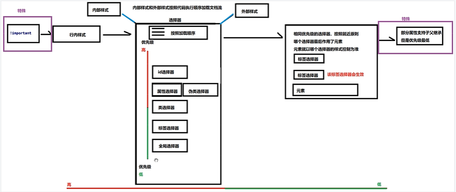
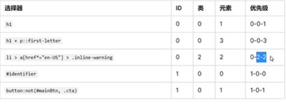
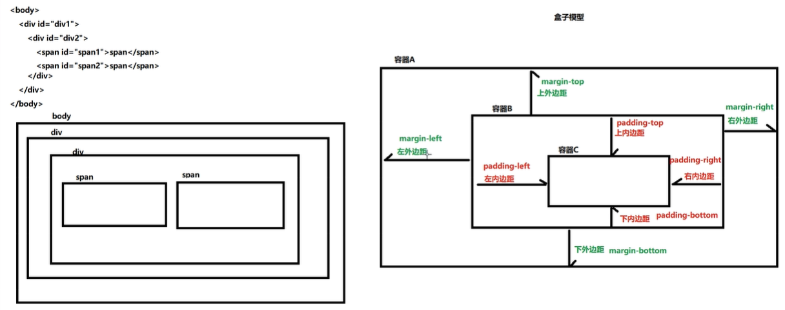

* 全局选择器*{

* 选择器有标签选择器，类选择器，全局选择器，属性选择器div[class]或者属性加属性值div[class=“a”]，id选择器

  ```html
  <!DOCTYPE html>
  <html lang="en">
  
  <head>
      <meta charset="UTF-8">
      <!-- 配置作者 -->
      <meta name="author" content="wangzi"></meta>
      <!-- 配置关键词，浏览器可以搜索到，多个关键字用逗号隔开 -->
      <meta name="keywords" content="aa,bb,cc"></meta>
      <!-- 描述 -->
      <meta name="desccription" content="dd,cc"></meta>
      <meta http-equiv="X-UA-Compatible" content="IE=edge">
      <meta name="viewport" content="width=device-width, initial-scale=1.0">
      <title>Document</title>
      <style>
          /* 标签选择 */
          p{
  
          }
          /* id选择 */
          #one{
              
          }
          /* 类选择器 */
          
          .a {
              color: aliceblue;
          }
          /* 属性选择器 */
          
          li[class="top"] {
              color: antiquewhite;
          }
          /* 子字符串，匹配以指定类型开头 */
          
          li[class^="a"] {
              color: red;
          }
          /* 子字符串，匹配以指定类型结尾 */
          
          li[class$="a"] {
              color: red;
          }
          /* 子字符串，只要包含 */
          
          li[class*="a"] {
              color: red;
          }
          /* 忽略大小写 */
          
          li[class="a" i] {
              color: antiquewhite;
          }
          /* 伪类选择器 */
      </style>
  </head>
  
  <body>
      <ul>
          <li>item1</li>
          <li class="a">item1</li>
          <li class="a b">item1</li>
          <li class="top-a">item1</li>
          <li class="top-b">item1</li>
      </ul>
  </body>
  
  </html>
  ```

  

* 伪类选择器。以：开头的选择器都是伪类选择器

  ```html
  <head>
      <meta charset="UTF-8">
      <!-- 配置作者 -->
      <meta name="author" content="wangzi"></meta>
      <!-- 配置关键词，浏览器可以搜索到，多个关键字用逗号隔开 -->
      <meta name="keywords" content="aa,bb,cc"></meta>
      <!-- 描述 -->
      <meta name="desccription" content="dd,cc"></meta>
      <meta http-equiv="X-UA-Compatible" content="IE=edge">
      <meta name="viewport" content="width=device-width, initial-scale=1.0">
      <title>Document</title>
      <style>
          /* 伪类选择器 */
          /* 子类第一个 ，等等许多这种，查阅文档*/
          
          p:first-child {
              color: aquamarine;
          }
          /* 行为伪类选择器 状态有四种：没有访问，移动到该标签，按下鼠标，访问之后*/
          
          a:link {
              color: aliceblue;
          }
          
          a:hover {
              color: #000;
          }
          
          a:active {
              color: rebeccapurple;
          }
          
          a:visited {
              color: azure;
          }
      </style>
  </head>
  
  <body>
      <ul>
          <li>item1</li>
          <li class="a">item1</li>
          <li class="a b">item1</li>
          <li class="top-a">item1</li>
          <li class="top-b">item1</li>
      </ul>
      <div>
          <p>aa</p>
          <p>bb</p>
          <p>cc</p>
      </div>
      <div>
          <p>dd</p>
          <p>ee</p>
          <p>ff</p>
      </div>
      <a href="http:baidu.com">点击</a>
  </body>
  ```

  


* 关系选择器

  ```html
  <head>
      <meta charset="UTF-8">
      <!-- 配置作者 -->
      <meta name="author" content="wangzi"></meta>
      <!-- 配置关键词，浏览器可以搜索到，多个关键字用逗号隔开 -->
      <meta name="keywords" content="aa,bb,cc"></meta>
      <!-- 描述 -->
      <meta name="desccription" content="dd,cc"></meta>
      <meta http-equiv="X-UA-Compatible" content="IE=edge">
      <meta name="viewport" content="width=device-width, initial-scale=1.0">
      <title>Document</title>
      <style>
          /* 先写标签，再选类 ，这是交集*/
          
          li.a {
              color: aliceblue;
          }
          /* 并集 中间用逗号，与顺序无关*/
          
          .a,
          li {
              color: antiquewhite;
          }
      </style>
  </head>
  
  <body>
      <ul>
          <li>item1</li>
          <li class="a">item1</li>
          <li class="a b">item1</li>
          <li class="top-a">item1</li>
          <li class="top-b">item1</li>
      </ul>
  </body>
  ```

  

* 后代选择器和子代选择器

  ```html
  <head>
      <meta charset="UTF-8">
      <!-- 配置作者 -->
      <meta name="author" content="wangzi"></meta>
      <!-- 配置关键词，浏览器可以搜索到，多个关键字用逗号隔开 -->
      <meta name="keywords" content="aa,bb,cc"></meta>
      <!-- 描述 -->
      <meta name="desccription" content="dd,cc"></meta>
      <meta http-equiv="X-UA-Compatible" content="IE=edge">
      <meta name="viewport" content="width=device-width, initial-scale=1.0">
      <title>Document</title>
      <style>
          /* 后代选择器 */
          
          ul li {
              color: aliceblue;
          }
          /* 子代选择器，只选一代 */
          
          ul>li {
              color: red;
          }
      </style>
  </head>
  
  <body>
      <ul>
          <li>item1</li>
          <li class="a">item1</li>
          <li class="a b">item1</li>
          <li class="top-a">item1</li>
          <ol>
              <li>aaaa</li>
          </ol>
          <li class="top-b">item1</li>
      </ul>
  </body>
  ```

  

* 兄弟选择器

  ```html
  <head>
      <meta charset="UTF-8">
      <!-- 配置作者 -->
      <meta name="author" content="wangzi"></meta>
      <!-- 配置关键词，浏览器可以搜索到，多个关键字用逗号隔开 -->
      <meta name="keywords" content="aa,bb,cc"></meta>
      <!-- 描述 -->
      <meta name="desccription" content="dd,cc"></meta>
      <meta http-equiv="X-UA-Compatible" content="IE=edge">
      <meta name="viewport" content="width=device-width, initial-scale=1.0">
      <title>Document</title>
      <style>
          /* 兄弟选择器 选择li相邻的ol标签*/
          
          li+ol {
              color: aliceblue;
          }
          /* 通用选择器，同一级别，这是选择所有 */
          li~ol{
  
          }
      </style>
  </head>
  
  <body>
      <ul>
          <li>item1</li>
          <li class="a">item1</li>
          <li class="a b">item1</li>
          <li class="top-a">item1</li>
          <ol>
              <li>aaaa</li>
          </ol>
          <li class="top-b">item1</li>
      </ul>
  </body>
  ```

  

* 引入css的三种样式：行内，内部，外部

* 行内样式优先级大于其他样式（内部和外部）

  * 外部样式和内部样式优先级是一样的，会根据加载顺序加载进来形成文档流，所以最后的优先级之和文档流有关，和内部外部引入无关。

  * 选择器的优先级：ID选择器>类选择器>属性选择器=伪类选择器（他两谁在下谁有效果，最后一个会生效）>标签选择器>全局选择器

  * 特殊情况1：可以通过关键字设置为最高优先级。在css属性里 加 !important

    ```html
      p{
          color: aliceblue !important;
       }
    ```

  * 特殊情况2：部分属性有属性继承，父容器的样式会传递给子容器，让子容器具备这种样式，但是这种样式的优先级是最低的，一旦子容器有自己的样式，就会覆盖父容器的样式。例如span标签

    

* 关系选择器的优先级

  * 一个选择器的优先级可以说是由三个不同的值(或分量)相加，可以认为是百(ID)十(类)个(元素)——三位数的三个位数;

    * .ID:选择器中包含ID选择则百位得一分。
    * 类:选择器中包含类选择器、属性选择器或者伪类则十位得一分。
    * 元素:选择器中包含元素、伪元素选择器则个位得一分。

  * 备注:通用选择器(*)、组合符(+、>.~、""》和调整优先级的选择器
    :where()）不会影响优先级。

  * 否定（:not(）和任意匹配了:is（）伪类本身对优先级没有影响，但它们的参数则会带来影响。参数中,对优先级算法有贡献的参数的优先级的最大值将作为该伪类选择器的优先级。

  * 特殊情况

    

  * 优先级一样时：就近原则


* 字体大小设置

  ```htm
  <head>
      <meta charset="UTF-8">
      <!-- 配置作者 -->
      <meta name="author" content="wangzi"></meta>
      <!-- 配置关键词，浏览器可以搜索到，多个关键字用逗号隔开 -->
      <meta name="keywords" content="aa,bb,cc"></meta>
      <!-- 描述 -->
      <meta name="desccription" content="dd,cc"></meta>
      <meta http-equiv="X-UA-Compatible" content="IE=edge">
      <meta name="viewport" content="width=device-width, initial-scale=1.0">
      <title>Document</title>
      <style>
          span {
              /* 比父容器字体大 */
              font-size: larger;
              /* 比父容器字体小 */
              font-size: small;
              /* 比父容器字体大120% */
              font-size: 120%;
              /* 按像素设置 */
              font-size: 16px;
              /* 比父容器字体大130% */
              font-size: 1.3em;
          }
          
          p {
              font-size: 20px;
          }
      </style>
  </head>
  
  <body>
      <p id="one" class="oneclass">
          段落
          <span>行内</span>
      </p>
  </body>
  ```

  

* 字体的一些属性

  ```html
          span {
              font-size: 20px;
              font-family: 20px;
              font-style: italic;
              font-weight: bold;
              /* 代表上面四个属性，必须保证后面两个顺序，顺序：其他字体属性  字体大小  字体族 */
              font: optional;
          }
  ```

  

* 常见的一些样式

  ```html
   <style>
          span {
              /* 下划线 */
              text-decoration: underline;
              /* 中划线 */
              text-decoration: line-through;
              /* 像素缩进，根据字体像素大小设置缩进量 */
              text-indent: 30px;
              /* 设置字体方式 */
              text-align: center;
              text-align: right;
              /* 行高 ，行高是从屏幕最上面计算的*/
              line-height: 16px;
          }
          
          li {
              /* 列表设置 */
              list-style-type: circle;
              list-style-type: upper-roman;
          }
          
          div {
              /* 边框宽度 */
              border-width: 1px;
              /* 边框样式 */
              border-style: solid;
              /* 边框颜色 */
              border-color: aliceblue;
          }
          
          p {
              font-size: 20px;
          }
      </style>
  ```

  

* 盒子模型

  
  * 块级元素可以设置高度和宽度，不能和其他元素在同一行
  * 行内元素不能设置高和宽，，但可以与其他元素在同一行。元素的高度一般由元素内部的字体大小决定，宽度由内容的长度控制。只能改变左右。行内元素只能容纳行内
  * 行内块级元素：行内元素可以和别的行内元素和行内块级元素共享一行，可以设置宽度和高度，例如img


* display属性：可以将一个元素类型转为另外一个元素类型属性值。
  * none此元素不会被显示，不保留物理空间。
  * block此元素将显示为块级元素，此元素前后会带有换行符。
  * inline此元素会被显示为行内元素，元素前后没有换行符。
  * inline-block行内块元素。


* 浮动

  * 先要理解文档流：

    * 从上到下，从左到右排布
    * 块级元素，独占一行
    * 行内元素，在同一行
    * 行内块级元素，在同一行

  * 浮动就是把二维的文档流变成三维的，浮动就是脱离文档流了，使它飘浮起来，并把原来的文档流推开

    ```html
            div {
                float: left;
            }
    ```

    

* 静态定位：所有的默认都是静态定位

  ```html
  div {
              position: static;
          }
  ```

  

* 动态定位：相对于静态定位的位置

  ```html
          div {
              position: relative;
              left: -12px;
          }
  ```

  

* 绝对定位：

  * 如果没有父容器,或者父容器没有定位(即没有position属性),就以浏览器为定位标准

  * 如果父容器有定位,就以父容器为定位标准

    ```html
            div {
                position: absolute;
                left: -12px;
            }
    ```

  

* 固定定位：相对浏览器窗口进行定位,不会相对其他元素，当浏览器出现滑动滚轮的时候，元素不会变

  

  