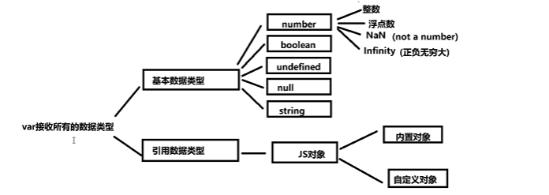
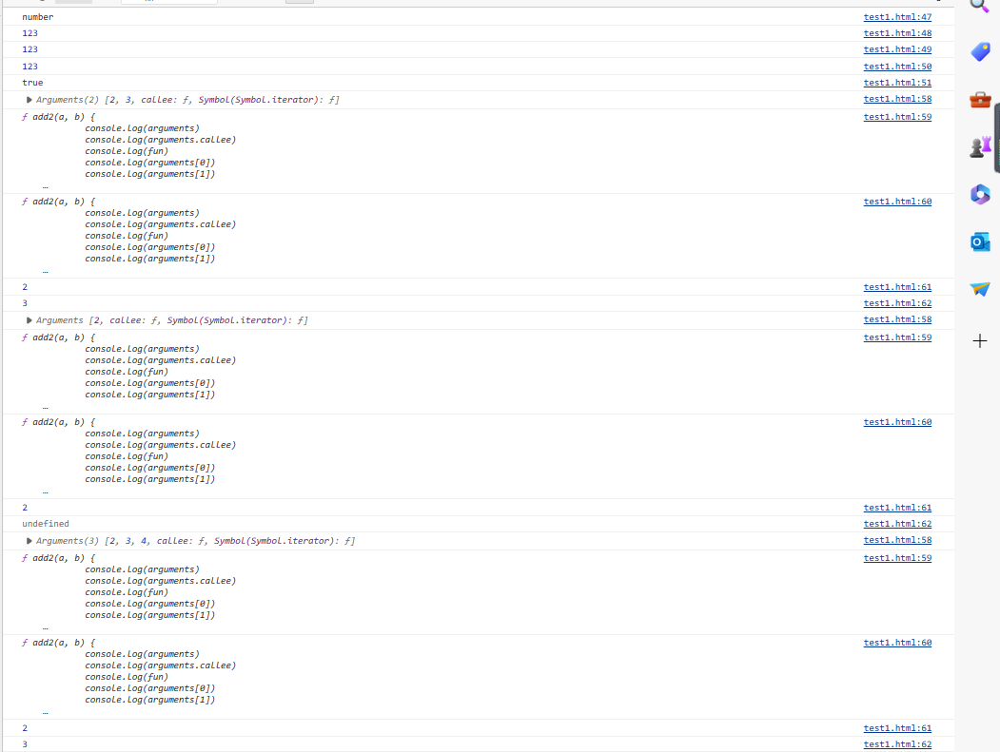
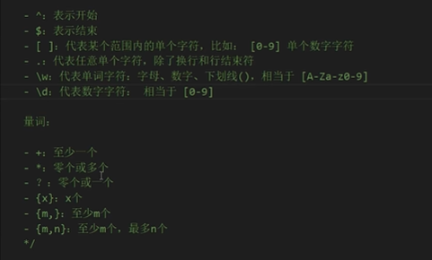
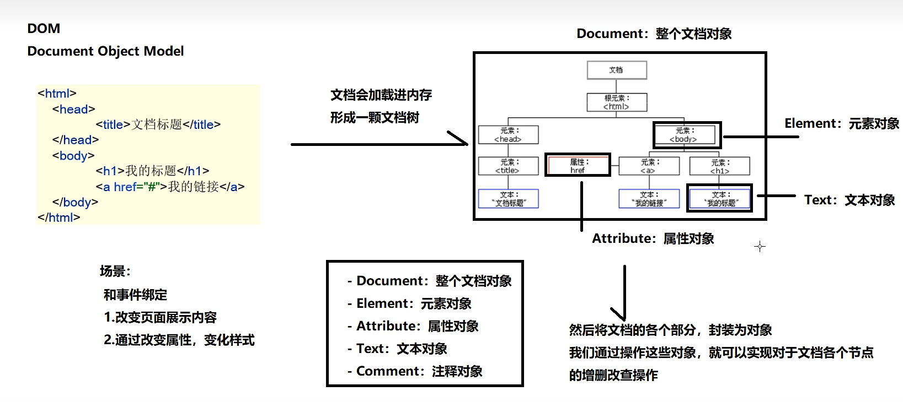

* JS的三部分组成：ECMA Script语法、DOM操作（文档操作）、BOM操作（浏览器操作）

* 内外部js没有优先级一说

* 变量名：字母数字下划线$字符，不能以数字开头。区分大小写。不能以关键字命名

* 数据类型

  
  * 用typeof查看类型

    ```html
        <script>
            var age = 18
            console.log(typeof age)
        </script>
    ```

  * 当value其值为0、-0、null、""、false、undefined或 NaN时，那么Boolean()转换成Boolean类型的值为 false.其他值会被转为true


* parseInt和parseFloat

  ```html
      <script>
          var age = 18
          console.log(typeof age)
          console.log(parseInt("123")); //123
          console.log(parseInt("123power456")); //123，遇到非数字部分停止转换
          console.log(parseInt(" 123  ")); //123空格不影响
      </script>
  ```

  

* 运算符
  * 数字运算符：+-/*%
  * 赋值运算符 =  +=
  * 比较运算符> >= < <=  == != ===(比较类型和值)
  * 逻辑运算符
  * 三元运算符：条件表达式？满足执行：不满足执行
  * 字符串连接运算符
* 隐式转换
  * 一侧有string。+会发生字符串拼接，会将数据转换字符串类型
  * 一侧有number，另一侧是基本类型+号运算的时候会将数据转换number类型有意义的转为1，比如true   var num=1+true  结果为2，无意义的转为0
  * NaN和undefined不会被转换
  * 在使用判断逻辑时，null，undefined，‘ ’，false，NaN这几个都是false，其他情况都是true
  * ==时，NaN和其他类型比较，永远返回false
  * String和number比较，先将String转换为number
  * null和undefined比较，结果是true。除此之外，underfined和其他任何结果比较都为false。


* 函数

  ```js
          function add(a, b) {
              return a + b
          }
          var a = add(10, 20)
          //函数对象
          var fun=function add2(a, b) {
              return a + b
          }
          var num=fun(2,3)
  ```

  * arguments对象：对函数参数的封装

    ```js
            var fun = function add2(a, b) {
                console.log(arguments)
                console.log(arguments.callee)
                console.log(fun)
                console.log(arguments[0])
                console.log(arguments[1])
            }
            var num = fun(2, 3)
            var num = fun(2)
            var num = fun(2, 3, 4)
    ```

    * arguments代表的是实参的信息，可以获取实参的所有数据

    * arguments.callee等价于函数

      

  * js允许声明的形参，在调用时允许少给或多给（例如只给两个）


* JS内置对象

  * Array. Boolean.Classe. Date. Error. Global. ]SON. Math· Number. RegExp. string·运算符·语句

  * String

    ```js
        <script>
            var a = "abcd"
                // 超过也不会抛异常，只是什么都没有拿到
            console.log(a.charAt(0))
            console.log(a.length)
                //返回出现的索引位置
            console.log(a.indexOf("b"))
        </script>
    ```

  * Array

    ```js
        <script>
            var arr = [];
            //可以存放不同的数据类型
            var arr2 = [1, 2, "22", true, undefined];
            //创建指定长度的数组
            var arr3 = new Array(10);
            var arr4 = new Array(11, 22)
            console.log(arr4.length)
                //改变数组长度
            arr4.length = 1
                //索引不存在返回undifined
                //遍历
            for (let index = 0; index < array.length; index++) {
                const element = array[index];
    
            }
            //尾部添加元素，返回是添加后数组的长度
            arr.push(55);
            //头部添加元素并返回
            arr.unshift(55)
            //删除最后元素，返回的是被删除的元素
            arr.pop()
            //删除第一个元素，返回的是被删除的元素
            arr.shift()
        </script>
    ```

  * Math

    ```js
        <script>
            console.log(Math.PI)
                //四舍五入
            console.log(Math.round(4.5))
                //先下取整
            console.log(Math.floor(1.8))
                //向上取整
            console.log(Math.ceil(1.2))
            //绝对值
            console.log(Math.abs(-1))
            //最小值
            console.log(Math.min(20,30))
            //最大值
            console.log(Math.max(10,20))
            //幂
            console.log(Math.pow(5,2))//25
            //随机数
            console.log(Math.random())
        </script>
    ```

  * Date

    ```js
        <script>
            //当前系统时间
            var d = new Date();
            //时间参数
            var d2 = new Date(2020, 11, 28, 15, 16, 30, 0)
                //毫秒值创建,以1970年为原点
            var d3 = new Date(1000)
                //字符串创建
            var d4 = new Date("2023/12/21")
                //获取年
            var year = d.getFullYear();
            var month = d.getDay();
            //设置
            d.setFullYear(2008)
        </script>
    ```

  * 正则表达式：格式/正则表达式/

    

    ```js
        <script>
            var reg = /^\w{6,12}$/;
            var str = "abc";
            var flag = reg.test(str);
        </script>
    ```

    

  * window

    * window.alert()   (window可以省略)

    *     <script>
              var account = window.prompt("请输入账号")
                  //确认框
              var flag =confirm("确认登录吗")
          </script>

  * 定时器

    ```js
        <script>
            var account = window.prompt("请输入账号")
                //确认框
            var flag = confirm("确认登录吗")
    
            function fun() {
    
            }
            //循环定时器
            setInterval(fun, 2000)
                //炸弹定时器
            function fun2() {
    
            }
            //十秒钟后执行，只执行一次
            setTimeout(fun2, 10000)
        </script>
    ```

    

  * 对象

    ```js
       <script>
            var obj = new Object();
            obj.name = "zhangsan";
            //设置方法
            obj.sleep = function() {
                    console.log(this.name)
                }
                //调用方法
            obj.sleep();
    
            //第二种创建方式，通过字面量创建
            var obj = {
                name: "张三",
                age: 18,
                show: function(girlfriend) {
                    console.log(this.name + "is" + girlfriend)
                }
            }
            console.log(obj.show("lisi"))
        </script>
    ```

    

  * DOM对象

    * 通过doucument对象获取元素对象

    

    ```js
       <script>
                //由于加载顺序的原因，script标签在body上面是拿不到body的元素的，要放到下面
            var aa = document.getElementById("one")
            var vv = document.getElementsByTagName("p")
            console.log(vv[0])
            var cc = document.getElementsByClassName("oneclass")
            var name = document.getElementsByName("aa")
        </script>
    ```

    * 操作元素对象

      ```js
          <script>
              var obj = new Object();
              obj.name = "zhangsan";
              //设置方法
              obj.sleep = function() {
                      console.log(this.name)
                  }
                  //调用方法
              obj.sleep();
      
              //第二种创建方式，通过字面量创建
              var obj = {
                  name: "张三",
                  age: 18,
                  show: function(girlfriend) {
                      console.log(this.name + "is" + girlfriend)
                  }
              }
              console.log(obj.show("lisi"))
                  //由于加载顺序的原因，script标签在body上面是拿不到body的元素的，要放到下面
              var aa = document.getElementById("one")
                  //获取属性值
              var attr = aa.getAttribute("class")
                  //判断属性存不存在
              var flag = aa.hasAttribute("name")
                  //设置或者添加属性，不存在即添加
              aa.setAttribute("value", "123")
                  //移除属性
              aa.removeAttribute("value")
                  //获取元素内容，包含内部标签
              aa.innerHTML;
              //获取元素内容，不包含内部标签
              aa.innerText;
              //设置标签体内容
              aa.innerHTML = "ssssss"
                  //标签内容拼接
              aa.innerHTML += "aa"
                  //获取父节点
              aa.parentNode;
              //获取子节点
              aa.childNodes;
              //创建一个元素节点
              var p = document.createElement("p"); //创建p标签对象
              p.innerText = "动力节点"
                  //插入元素节点
              aa.appendChild(p);
              //控制插入位置,控制插入到节点还是后面
              var span = document.getElementById("nei");
              span.insertBefore(p, aa);
              //删除节点：只能父节点删除子节点，不能自己删除自己
              aa.removeChild(p)
                  //子元素找到父节点，再删除自己
              p.parentNode.removeChild(p)
                  //获取表单的value信息
              var ele = document.getElementById("username")
              ele.value = "zhangsan"
                  //获取单选框的选中状态，或者设置状态
              var aa = document.getElementById("1");
              aa.checked = true;
              //设置下拉框
              var ele = document.getElementById("beijing")
              ele.selected = true;
              //实现禁用效果
              ele.disabled = true
          </script>
      </head>
      
      <body>
          <p id="one" class="oneclass" name="aa">
              段落
              <span id="nei">行内</span>
          </p>
          <form action="#" method="get">
              姓名：<input type="text" name="username" id="username"></input><br> 女
              <input type="radio" class="sex" value="woman" id="1"></input>
              男<input type="radio" class="sex" value="man" id="2"></input>
              故乡：<select id="" city>
                  <option value="023" id="chongqing">重庆</option>
                  <option value="021" id="beijing">北京</option>
                  <option value="027" id="shanghai">上海</option>
              </select>
              <input type="submit"></input>
          </form>
      </body>
      ```

      

  * DOM事件

    ```js
        <script>
            //事件来触发
            var span = document.getElementById("one");
            //绑定事件都要在事件前加on
            span.onclick = function() {
                    document.getElementById("one").innerHTML = "poo"
                }
                //聚焦点事件
            span.onfocus = function() {
    
                }
                //离开焦点
            span.blur = function() {
    
                }
                //改变事件
            span.onchange = function() {
    
                }
                //鼠标移入事件
            span.onmouseover = function() {
    
                }
                //鼠标移出事件
            span.onmouseout = function() {
    
                }
                //页面加载事件
            window.onload = function() {
    
                }
                //表单事件
            var form = window.getElementById("form");
            var submit = form.getElementById("submit");
            submit.onclick = function() {
    
            }
        </script>
    ```

    

  * BOM对象：允许浏览器和js对话

    * windows对象：可以访问内置函数

    * location对象，又称为地址栏对象

      ```js
          <script>
              //跳转
              location.href="http:www.baidu.com"
          </script>
      ```

    * history对象

      ```js
              history.forward();
              history.back();
      ```

  * 构造函数

    ```js
        <script>
            //构造函数
            function Person(name, age) {
                this.name = name;
                this.age = age;
            }
            var person = new Person("zhangsan", 18)
        </script>
    ```

  * 原型：每个对象都有一个原型对象，它可以使用原型对象的所有属性和方法

    ```js
        <script>
            //构造函数
            function Person(name, age) {
                this.name = name;
                this.age = age;
            }
            var person = new Person("zhangsan", 18)
            let stu = {
                name: "zhangsan"
            }
            stu._proto_.eat() = function() {
                    console.log("吃饭")
                }
                //访问原型方法
            stu.eat();
        </script>
    ```

    

  * 原型继承

    ```js
        <script>
            //原型继承，一个对象继承另外一个对象的属性和方法。即将原型和对象绑在一起
            //原型继承链，可以一直继承
            function Person(name, age) {
                this.name = name;
                this.age = age;
                this.eat = function() {
                    console.log("吃饭")
                }
            }
    
            function Student(score) {
                console.log(score)
            }
            Student.prototype = new Person("ZHANGSAN", 23)
                //所有对象最终的父类就是Object
            Object.prototype.eat = function() {
                console.log("obj原型的eat")
            }
            var stu = new Student(81);
            console.log(stu.eat())
            console.log(stu.name)
        </script>
    ```

    


*  Hoisting 是 JavaScript 将所有声明提升到当前作用域顶部的默认行为（提升到当前脚本或当前函数的顶部）。 因此var可以先使用后声明。
  *  用 `let` 或 `const` 声明的变量和常量不会被提升！ 