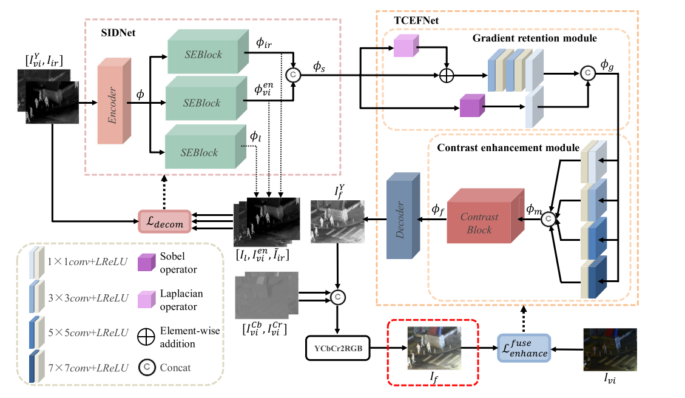
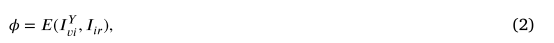
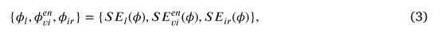

 红外与可见光图像融合是一种重要的图像增强技术，其目标是在极端环境下生成具有显著目标和丰富纹理的高质量融合图像。然而，目前的图像融合方法都是针对正常光照下的红外和可见光图像设计的。在夜景中，现有的方法由于可见光图像的严重退化，导致纹理细节较弱，视觉感知能力差，影响后续的视觉应用。为此，本文提出了一种无黑暗红外与可见光图像融合方法(DIVFusion)，该方法能够合理地照亮黑暗，促进互补信息的聚集。具体而言，针对夜间可见图像存在低照度、纹理隐藏、颜色失真等问题，我们首先设计了场景照明解纠缠网络(sceneillumination disnetwork, SIDNet)，在保留源图像信息特征的前提下去除夜间可见图像的照明退化。然后，设计了纹理-对比度增强融合网络(TCEFNet)，集成互补信息，增强融合特征的对比度和纹理细节。此外，设计了颜色一致性损失来减轻增强和融合过程中的颜色失真。最后，充分考虑了微光图像增强与图像融合之间的内在联系，实现了有效的耦合与互惠。这样，该方法能够端到端生成具有真实色彩和显著对比度的融合图像。大量的实验表明DIVFusion在视觉质量和定量评价方面优于目前最先进的算法。特别是弱光增强和双模态融合为融合后的图像提供了更有效的信息，促进了高级视觉任务的完成。我们的代码可以在https://github.com/XinyuXiang/DIVFusion公开获得。 

##### 介绍

 由于技术的限制和拍摄环境的影响，同一设备拍摄的单一图像往往不能全面描述整个场景。因此，图像融合技术应运而生，它可以从不同的源图像中提取最有意义的信息，并将其融合成融合后的图像。融合图像通常包含更丰富的信息，有助于后续应用。在图像融合领域中，红外与可见光图像融合是应用最广泛的图像融合技术[1]。可见图像包含丰富的纹理信息，更适合视觉感知。红外图像通过捕捉丰富的热辐射信息，即使在低光或其他极端恶劣的环境下，也能提供突出的重要目标，如车辆、行人等。因此，红外与可见光图像融合既能减少数据冗余，又能生成对比度显著、纹理细节丰富的高质量图像。基于这些优点，红外与可见光图像融合技术在军事监视[2]、目标检测[3]、车辆导航[4]等领域具有良好的应用前景。到目前为止，已经提出了相当多的红外和可见光图像融合方法，主要分为两大类:传统方法和基于深度学习的方法。传统的方法通常包括以下三个步骤。首先，对源图像进行特定变换提取特征，这是特征提取阶段。然后，在特征融合阶段，采用融合策略对特征进行融合。最后，在特征重建阶段，对融合后的特征进行逆变换，得到融合后的图像。传统的红外与可见光图像融合方法在应用数学变换的基础上，进一步分为基于多尺度变换[5,6]、基于稀疏表示的[7]、基于显著性的[8]、基于子空间的[9]和基于混合的[10]等五类。 

 深度学习的兴起为红外和可见光图像融合提供了更多的可能性，基于深度学习的方法通常能够取得比传统方法更理想的性能[11]。 基于深度学习的方法根据网络架构可以进一步分为三类：基于CNN的方法[12]、基于AE的方法[13]、基于GAN的方法[14]。 基于CNN的方法通过设计良好的网络结构和损失函数，可以实现特征提取、特征融合和特征重构，并获得独特的融合结果。 与基于CNN的特征提取方法不同，基于AE的特征提取方法采用自动编码器来完成特征提取和特征重构，而特征融合则通过特定的融合策略来完成。 在基于CNN方法的基础上，基于GAN的方法将生成对抗机制引入到红外与可见光图像融合领域。 基于GAN的融合方法包括生成器和鉴别器。 具体地，利用鉴别器来约束生成器生成的融合结果的分布，使其在无监督的情况下尽可能接近源图像。  

 虽然现有的基于深度学习的方法可以有效地整合可见光和红外图像中至关重要的互补信息，但仍存在一些障碍需要解决。 **首先，现有的方法都是针对正常光照条件设计的，从而忽略了夜间可见光图像中光照退化的困难。** 具体而言，在弱光条件下，以往的融合方法仅利用红外信息来填补可见光图像因光照退化而造成的场景赤字。 结果使得夜间可见光图像中丰富的场景信息无法在融合图像中得到表达，这与红外与可见光图像融合任务的初衷相背离。 其次，一个直观的解决方案是利用先进的微光增强算法对可见光图像进行预增强，然后通过融合方法对源图像进行合并。 然而，将图像增强和图像融合作为两个独立的任务，往往会导致图像融合效果不佳的问题，如图所示 1(c). 具体来说，由于夜景光线弱，夜间可见图像有轻微的颜色失真。 微光增强算法改变了光源的颜色分布，在一定程度上进一步放大了整个图像中的颜色失真[15]。 此外，在融合过程中，由于Y通道的融合策略改变了源图像的饱和度分布，融合图像也会发生颜色失真，如图所示 1(b)和(c)。  

 为了解决上述红外和可见光图像融合的挑战，我们将视觉增强和图像融合技术结合在一个网络中，实现增强任务对融合任务的促进。为了获得具有良好视觉感知的信息融合图像，该方法的关键是在很大程度上消除两个任务之间的不兼容性。为此，我们首先结合通道注意机制和Retinex理论，设计了一个场景照明解纠缠网络(SIDNet)。具体而言，考虑到增强与融合任务的耦合，在特征级应用Retinex理论，在生成增强的可见光图像和红外图像特征的同时，从混合特征中剥离退化光照。其次，设计了包含梯度保持模块(GRM)和对比度增强模块(CEM)的纹理-对比度增强融合网络(TCEFNet)，实现特征集成和特征增强;GRM通过一阶和二阶梯度剩余流最大限度地提取特征梯度。CEM考虑了多尺度的深度特征，并结合注意机制来实现特征级对比度增强。此外，我们还提出了一种颜色一致性损失的方法来保留融合后图像中更多的可见信息，同时也减轻了图像的颜色失真。具体来说，我们构建了一种基于可见光图像RGB颜色空间的角度损失，可以有效地减少夜间微弱光线对颜色信息的破坏。 

 概括而言，拟议方法的主要贡献如下：  

*  我们提出了一种新的视觉增强红外和可见光图像融合框架，以增强视觉感知和融合互补信息，特别是在极端弱光条件下。 设计了一种场景-光照分离网络(SIDNET)，以去除两种模式的退化光照特征，增强两种模式的独特性，实现视觉增强。 
* 构造了纹理-对比度增强融合网络，在增强对比度的同时增强纹理，实现了有效的互补信息集成。 设计了一个颜色一致性损失来保证融合图像的视觉质量，减少了融合图像中的颜色失真，为融合图像注入了更多的可见域信息。 
* 我们的融合结果具有更明亮的场景和更高的对比度，没有颜色失真，同时从源图像中获得互补信息，如图所示 1(d). 行人检测实验证明了我们的结果在高级视觉任务中的便利性。  

 第二节讨论了基于深度学习的红外与可见光图像融合方法和基于Retinex的图像增强方法。 在第3节中，我们描述了问题的表述、网络结构、损失函数和训练细节。 第4节对我们的数据融合方法进行了定性和定量的综合评价，并将其与一些先进的方法进行了比较。 最后，我们给出了第五节的结论。  

##### 相关工作

 在本节中，我们首先简要回顾现有的基于深度学习的融合方法。 然后介绍了基于Retinex理论[16]的图像增强方法。  

 基于卷积神经网络(CNN)的红外与可见光图像融合算法利用复杂的损耗函数和网络结构实现特征提取、聚合和图像重建。一个典型的基于cnn的工作是PMGI[12]，它设计了损耗中的梯度和强度比，引导网络直接生成最终的融合图像。但是，人工调整会改变梯度信息的保留，导致纹理结构的一些丢失。以上问题在后续的SDNet[17]版本中得到了改进。在STDFusionNet[18]中，为了将红外图像的对比度信息较大程度地注入融合图像中，利用显著目标掩模辅助融合任务。RXDNFuse[13]考虑到融合过程中多尺度特征的优势，结合ResNet[19]和DenseNet[20]的结构优势，更全面地提取不同层次的特征，实现有效的融合。为了完成不同分辨率下的融合任务，Li etal .[21]利用元学习，仅部署一个CNN模型完成红外和可见光图像的融合，极大地扩展了融合模型的应用范围。为了更好地将融合任务与高级视觉任务结合起来，Tang等人[22]利用一种新的语义损失使融合后的图像对高级视觉任务更友好。此外，Transformer结构最近被引入，类似于CNN，它在各种视觉任务中取得了令人印象深刻的性能[23,24]。因此，Ma等人[25]设计了一种基于Transformer架构的通用融合方法，其中注意力引导的跨域模块可以集成全局互补信息。尽管如此，光照条件也是融合任务中不可忽视的问题，PIAFusion[26]考虑了光照条件，但由于模型过于简单，无法在复杂环境中对光照进行调整。 

 随着研究的深入，研究者们提出了大量基于自动编码器的融合方法。 它们大多使用自动编码器从源图像中提取特征并完成图像重建。 特征融合过程主要应用人工设计的融合规则。 一种典型的基于声发射的融合方法，即DenseFuse[27]，由卷积层、融合层和密集块组成。 考虑到自动编码器结构的特征提取能力有限，Li等人。 进一步提出了NESTFUSE[3]和RFN-NEST[28]。 前者在网络中引入嵌套连接，可以从源图像中提取多尺度特征。 后者设计了新的细节保留损失函数和特征增强损失函数，以迫使网络获得更高集成度的细节特征。 由于多尺度特征不能消除源图像中的冗余信息，Jian等人。 [29]利用注意力机制来集中于源图像的显著目标和纹理细节。 为了在融合领域提供可解释性的初步探索，DRF[30]将源图像分解为场景分量和属性分量并分别融合。 DRF虽然考虑了特征提取的可解释性，但忽略了融合规则的可解释性，即手工制作的融合规则不一定适合于深度特征的融合。 因此，徐等人。 [31]进一步提出了一种可学习的融合规则，该规则评估特征中每个像素对分类结果的显著性，进而进一步提高网络的可解释性。  

 由于生成对抗网络具有以无监督方式估计概率分布的强大能力，因此它非常适合于无监督任务，如图像融合。fusongan[14]是将GAN技术应用于图像融合领域的先行者，在融合后的图像与可见光图像之间建立了生成对抗框架，使融合后的图像能更大程度地获得纹理结构。然而，单一的对抗游戏很容易导致不平衡的融合。针对这一问题，Ma et al.[32]提出了一种双鉴别器条件生成对抗网络(即DDcGAN[32])来实现均衡的图像融合，其中红外图像和可见光图像都参与对抗过程。AttentionFGAN[33]在DDcGAN的基础上，利用多尺度注意机制，保留了红外图像的前景目标信息和可见光图像丰富的背景细节特征。然而，具有双重鉴别器的生成式对抗网络并不容易训练。在此基础上，Ma et al.[34]进一步提出了具有多分类约束的生成对抗网络，该网络可用于平衡红外图像和可见光图像之间的信息。然而，这些方法追求更好的视觉质量，但忽略了对后续高水平视觉任务融合结果的促进作用。Liu等人[35]提出了融合与检测联合问题的双层优化公式。然而，现有的基于深度学习的融合方法和传统的融合方法都强调红外和可见光图像互补信息的注入和平衡，而忽略了极端环境，如最常见的光照退化。在夜间环境中，严重的黑暗场景会使可见图像急剧下降，融合后的图像不再提供良好的视觉感知。因此，相应的高级视觉任务可能会受到严重影响。值得注意的是，夜间融合是红外与可见光图像融合的重要应用场景，但现有的融合方法无法实现。为此，迫切需要设计一种适合夜间等极端条件下的红外与可见光图像融合方法。 

 视网膜理论是色彩恒常性的计算理论。作为人类视觉感知的模型，假设观测到的图像可以分解为反射率和照度，表示为: 𝐼 = 𝑅 ⋅ L

 其中R和L分别表示原始图像的反射率和照度。 反射率描述了物体在任何亮度条件下都可以被认为是一致的固有属性。 照明依赖于物体上的环境光。  

 随后，Retinex模型被引入到弱光增强问题中。 乔布森等人。 [36]首先使用单尺度视网膜(SSR)从暗图像中剥离光照，将反射率作为增强图像。 然而，简单的分解会造成严重的颜色失真。 MSRCR[37]是为了改善以往方法的颜色失真问题而提出的。 然而，上述方法的最终增强效果往往看起来不自然，在某些地方会出现过度增强。 王等人。 [38]提出联合增强对比度和保留光照的自然性。 为了处理Lesseffective图像分解和收敛慢的问题，Hao等人。 [39]提出了半解耦分解模型，它的估计和在一个更明智的方法。  

 随着深度学习的出现，弱光增强社区也试图利用网络来估计反射率和光照图。 RetineXnet[15]结合Retinex理论设计了一个包含分解模块和光照调整模块的深度网络。 基于RetinexNet，Zhang等人。 开发的种类[40]，它另外设计了一个新颖的网络来实现反射恢复。 为了提高KINDE在调节光照水平方面的灵活性，他们[41]对KINDE进行了修正，提出了一种多尺度照度关注模块。 而且，张等人。 [42]在以无监督方式完成有效分解之前提供了一种有效的直方图均衡。 特别地，它们正则化直方图均衡化增强图像与恢复图像之间的相似性。 在此基础上，我们在特征层采用Retinex理论去除退化光照，从而实现图像增强。  

##### 方法

 在本节中，我们详细介绍我们的DivFusion。 首先，在3.1节中给出了问题的表述。 然后，在第3.2节中，我们描述了用于消除光照退化的场景-光照分离网络（SIDNET）和用于特征增强和融合的纹理-对比度增强融合网络（TCEFNET）。 最后，在3.3节中，我们给出了训练SIDNET和TCEFNET的具体损失函数。  

 当夜间可见光图像出现光照退化时，夜间红外与可见光图像融合任务可分为可见光图像增强和红外与可见光图像融合两个子问题。 然而，现有弱光增强算法与融合算法的简单组合存在严重的不兼容问题。 因此，如何对增强与融合任务进行联合建模，弥合两者之间的差距，成为实现夜间红外与可见光图像融合的关键。 基于以上问题，我们联合设计了SIDNET和TCEFNET来最大限度地减小弱光增强和图像融合之间的差距。 前者用于在特征级剥离退化可见图像中的照度分量。 具体而言，在SIDNET中，利用自编码器和信道关注机制对两幅源图像进行重构，保留了源图像的有用信息，促进了后续的融合工作。 后者实现特征集成，从纹理和对比度方面增强整体视觉感知。 总体框架在图中作了示意性说明 2.  

 具体来说，给定一对严格配准的红外图像𝐼𝑖𝑟和可见光图像𝐼𝑣𝑖。两者在通道尺寸上串联并馈送到SIDNet的编码器𝐸(⋅)，见 图 3以获得包含两个域信息的混合特征。 上述过程可制定如下：  

 其中𝐼𝑌𝑣𝑖为可见图像的Y通道。然后，将包含两个域信息的混合特征输入三个挤压激励块(SEblock);SEblocks的目的是从混合特征中选择红外和可见光图像的特定领域特征表示。此外，SIDNet的另一个作用是分离可见图像的照明成分。因此，我们在特征层次上采用Retinex理论，将可见光图像分解为退化光照特征和增强可见光特征。然后，三个seblock结合Retinex理论，最终获得红外特征、退化照度特征和增强的可见特征。整个过程可以表示为: 

