 摘要:生物医学成像技术的最新进展为卫生保健部门和生物医学社区提供了巨大的机会。然而，对医学专家来说，收集、测量和分析大量与健康相关的数据(如图像)是一项费时费力的工作。因此，在这方面，人工智能应用(包括机器和深度学习系统)有助于早期诊断各种传染性/癌症疾病，如肺癌。由于肺癌或肺癌可能没有明显或明确的初期症状，开发和推广计算机辅助检测(CAD)系统是必要的，它可以支持医学专家在早期对肺结节进行分类和检测。因此，在本文中，我们通过CT图像中肺结节的分类和良、恶性的检测来分析肺癌的诊断问题。**为了实现这一目标，引入了一个基于深度学习的自动化系统来分类和检测肺结节。**此外，我们还采用了最新的检测架构，包括Faster-RCNN、YOLOv3和SSD，用于检测目的。所有深度学习模型都使用公开可用的LIDC-IDRI基准数据集进行评估。实验结果表明，该方法降低了误报率(FPR)，提高了准确率。 

#### 介绍

 人工智能的应用和范式随着新的改进和算法不断增长。开发出的先进方法为各种领域提供了解决方案，这些领域管理着他们的实力和能力，以推动早期面临挑战或难以实现[1]，[2]的决策和调查。例如，在生物医学图像分析中，人工智能范式通过改进的机器学习和基于深度学习的技术，通过巧妙的工程来处理复杂的问题，使人们能够更好地洞察各种问题。此外，计算机的能力提供了令人难以置信的计算能力，规模允许对这些范例进行更好的分析。此外，它还可以评估人工智能的现状，以及智能系统或机器的开发如何帮助各自领域的医学专家。生物医学研究和分析涉及的领域很多，如组学、生物医学成像、医学成像、脑/身体、机器接口等，如图1所示。生物医学成像涉及为诊断和治疗目的捕捉图像的行动。人工智能应用程序被用作生物医学图像分析、放射学、治疗反应、后果预测和大量不同的生物医学学科的工具，这些学科需要计算改进和超越人类思维的高吞吐量处理。因此，尽管人工智能从人类皮层的绝对原则出发，但它的力量也开启了一些特殊的秘密，生物医学科学是一种值得关注的力量——这是人类刚刚开始踏上的旅程。 

 人工智能在生物医学应用中的应用可以分为三个主要领域，如图1所示。首先，它在生物医学方面的应用涵盖了不同的医疗水平。从基因组应用，如DNA/RNA翻译、基因表达、基因组序列分析[3]，到医学影像。基因组应用包括细胞、组织和器官分析，利用组织学、x射线、MRI、CT扫描图像(如[4]、[5]和[6])诊断致命和癌症疾病。然后从医学成像到公共卫生管理，比如预测人口信息或传染性感染流行病，以及大流行病[7]。首先，这些先进的技术提供计算机辅助系统(CAD)系统，以协助医疗专家充分和早期诊断，更可靠的依从性和更小的冲突诊断。二是进一步加强对患者的药学服务，给予适当的个性化治疗、疗法，增强人体健康。例如，通过检查与环境影响相关的感染传播和社会实践，或执行脑机接口，如控制机械臂[8]的感觉和中风神经康复[9]。 

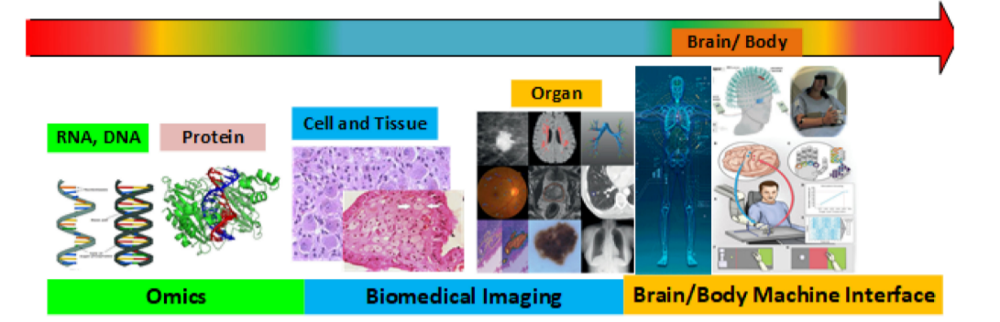

 生物医学成像是一个最有前途的工具，可以自动量化和诊断不同的疾病，如人类大脑疾病和不同种类的癌症。然而，医学专家通常需要检查大量的生物医学数据，如x射线、MRI、CT扫描等图像，这些图像耗时且容易出错。为此，引入了基于深度学习的自动分类和检测技术，在高分辨率生物医学图像[10]中对各种癌症的初始阶段进行分类、识别和诊断。此外，由于人工智能在生物医学成像方面的成功应用，本文还讨论了在患者CT扫描图像中检测肺癌的问题。它被认为是世界上最常见的癌症之一。根据这些报告，20211年，全世界报告的不同类型的癌症新病例超过221万例，死亡病例约221万例。高死亡率背后的一个主要原因是在疾病的初始阶段没有明显的临床体征和症状。因为在大多数情况下，患者错过了最合适的治疗时间，在早期阶段通过药物和手术可以有效地治疗癌症。因此，肺癌的初步诊断和治疗侧重于控制和预防疾病以及更好的筛查程序，从而提高了患者的治疗效果。 

 在早期，肺结节是肺癌的主要症状，可以通过CT扫描确定。==肺结节是一种常见病，是一种椭圆形组织或肺内生长的小圆圈。==早期研究表明，低剂量螺旋CT是分析肺癌结节的有效方法之一，与x线摄影相比，它也降低了死亡率[11]。然而，在这种方法中，通常需要检查整个肺来识别小的肺结节，为每个患者产生许多图像。**对医学专家来说，在大量CT扫描中通过消除血管和支气管等不相关组织来检查这些大图像和识别结节是一项具有挑战性的任务。此外，医学专家的疲劳、分心和干扰，导致不寻常的、大量的、可怕的图像数量很容易导致误诊。因此，有必要研制一种有效的自动化肺结节监测和筛查系统。**因此，开发CAD系统是一种可行的方法，可以帮助医学专家在广泛的数据集和大量的CT扫描中检测和分类肺结节。此外，该系统有望减少肺部结节漏诊，提高CT扫描图像分析的准确性和有效性。一个常见的自动化CAD系统包括三个部分:预处理、肺/结节分类和检测。预处理的核心目标是对数据进行归一化，提高图像质量和克服噪声。在预处理之后，分类和检测阶段利用不同的机器学习和深度学习架构/模型来识别所有的结节。 

 本文旨在提供一个自动系统，以确定指定的问题，从初步监测和筛选的观点。其核心目的是在测试前通过过滤步骤消除不相关的图像，以减少误报。开发的自动化系统基于深度学习，对CT扫描中的结节进行分类和检测。首先，我们在训练和测试前进行必要的预处理和过滤步骤，去除不相关的样本，以降低误报率。然后，自动系统从整个肺部CT扫描图像中筛选出结节，然后使用基于深度学习的检测器检测出结节在肺部CT扫描中的确切位置。通过应用迁移学习，我们训练了不同的深度学习架构或模型来监测有可疑结节的目标图像。为此，我们探索了不同的基本分类体系，如VGG-16[12]、Resnet 101[13]和Mobilenet[14]，以选择和分类肺结节图像。为了提取CT扫描结节的准确位置，我们使用了新型的深度学习探测器，包括Faster-RCNN[15]、YOLOv3[16]和SSD[17]。这样一来，分类体系可以在病例CT扫描中立即选择出疑似肺结节，检测器模型可以检测出疑似结节在图像中的位置。使用公开可用的基准测试LIDCIDRI数据集2执行广泛的实验分析。主要贡献如下: 

*  提出一个自动化的肺结节分类和定位系统，该系统使用基于深度学习的分类架构和检测器的鲁棒性。
* 在训练和测试前执行必要的预处理和过滤步骤，以减少误报和提高深度学习体系结构的准确性。
* 为此，深度学习可以学习肺结节的判别特征，并准确预测边界盒坐标，无需使用任何手工或传统的特征，如大小、形状、纹理等。
* 采用转移学习方法，利用已训练模型的权值对生物医学图像进行检测和包围盒预测，探索深度学习的泛化性能，以提高肺结节分类检测系统的准确性。 

 本文所做的工作组织如下:在第2节中介绍了用于肺结节检测和分类的不同技术的回顾。然后，第三部分解释了所提出的工作的细节;我们讨论LIDC-IDRI数据集，用于开发的自动化系统的训练和测试。本节还讨论了不同的分类体系结构和检测器。接下来，实验结果和性能评价结果将在第4节中描述。最后，第五部分总结了本文的未来发展方向。 

##### 相关工作

 在过去的十年里，机器学习[18]、[19]、[20]和深度学习技术[21]在生物医学成像领域得到了广泛的研究，特别是结合了图像处理和计算机视觉方法。此外，肺部CT扫描结节的分类和检测是生物医学图像处理中具有挑战性和高度关注的问题。研究人员已经开发了各种基于特征和深度学习的方法来解决这个问题。Akram等人，[22]使用SVM分类器和混合特征，包括二维和三维几何和强度统计特征用于肺CT扫描结节的分类。GoneA§alves等人，**[23]也使用SVM分类器来检测结节恶性，使用强度、纹理和基于形状的特征。**Hancock等人，[24]提出了一种非线性方法，并使用各种类型的==非线性分类器、直径和体积特征，使用LIDC-IDRI数据集检测肺结节==。Firmino等人，[25]使用SVM分类器和不同的基于特征的方法，如分水岭、纹理、形状、外观和HoG特征来处理肺结节检测。在[26]中，作者使用了随机森林和集合形状梯度特征。在另一项工作[27]中，作者在LIDC-IDRI数据集中使用几何和统计特征来检测肺ct中的结节。Lu等人，[28]提出了一种基于机器学习和特征的方法，该方法是基于回归树算法和各种混合方案的特征。 

 人工智能和大规模标注数据集的频繁可靠性以及深度学习架构的最新进展，在图像和视频处理领域[19]经历了巨大的增长。为了提高[29]的效果，引入了一些改进和优化技术，并在生物医学成像领域[30]、[31]、[32]不断取得成功。Golan等人，[33]推荐了一种使用卷积网络检测肺部结节的方法，该方法实践了公共数据集LIDC IDRI。深度学习模型有助于避免特征提取过程中属性缺失或不完整的困难，进一步增强检测系统[33]的自我调节能力。 

 [34]的作者对各种用于肺结节自动分类和检测的深度学习模型进行了综述。作者在[35]中介绍了一种使用卷积网络进行结节检测的特征提取技术。Setio等人在[36]和[37]中也引入了一种卷积网络，用于利用丹麦肺癌筛查试验(DLCST)和Kaggle数据科学碗2017 (DSB17)检测肺结节。[38]的作者使用LUNA 16数据集3提出了一个用于识别结节的卷积模型。Wang等，[39]研究了用于结节检测的fast - rcnnmodel。Gruetzemacher等人[40]根据结节的体积对数据集进行分组。然后，他们增加了肺结节数据集，以训练该模型处理超过3.5万张图像。当作者研究需要大量训练数据集的深度学习范式时，数据集的数量也通过随机裁剪得到了扩展。 

 在[41]中，作者设计了一个四通道卷积神经网络来学习放射科医生识别结节的经验。结果表明，多组训练系统有效地提高了芽的检测性能。Ronneberger等人提出了一种3D卷积神经网络系统，该系统采用滑动窗口扫描方法来搜索候选结节并提供有效的性能。Ahmed等人[43]利用Faster-RCNN架构对x射线图像进行COVID-19病毒分类和识别。[44]还提出了另一种基于三维神经网络的肺结节分类算法。该算法由一个基本的三维卷积网络和一个新颖的多输出网络组成。 

 通过以上讨论，我们得出结论，对于CT扫描图像中肺结节或肺结节的分类和检测，研究者们做了很有意义的研究。在他们的工作中，**研究人员主要使用各种手工制作的基于特征的方法和机器学习分类器[45]来识别肺结节。虽然利用手工制作的特征是研究人员的挑战性任务之一**;我们还发现，在深度学习和人工智能[46]、[47]、[48]和[49]在检测和/或分类应用中具有较高的准确性之后，研究人员现在也将它们用于CT扫描中的结节检测和分类。此外，无论深度学习技术和模型是在相同或多个数据集上训练和测试的，具有可比性的性能水平都是趋势。 

##### 方法

 本文介绍了一种用于肺CT扫描图像分类和结节检测的自动、有效的实时深度学习系统。这项工作的技术细节如图2所示。在本文中，我们应用了从LIDC-IDRI数据库收集的数据集。我们进行了必要的预处理步骤和过滤步骤。首先，从XML文件中读取关于每个结节的位置和大小的CT扫描图像和信息。它包含关于结节的各种特征。边缘映射表示结节的位置，即结节边框上像素的位置。由于数据集包含了各种不合适的图像，因此我们进行了一个过滤步骤，去掉了不相关的图像，从而平衡了结节图像样本和非结节图像样本的数据集。然后我们将结节的位置转换为体素坐标。采集的图像使用均值和标准差重新缩放，并通过将像素值转换为HU (Hounsfield units)进行归一化。在预处理后，我们对数据进行了扩充，以提高数据集的异构性和系统的性能。将数据集按70%和30%的比例随机分割为训练集和测试集。如图2所示，所开发的深度学习系统分为两个阶段;第一阶段包括VGG-16、[12]、Resnet 101[13]和Mobilenet[14]训练分类体系结构。而对于结节位置的检测和定位，我们使用的检测模块包括fast - rcnn[15]、YOLOv3[16]、SSD[17]。在对分类模型和检测模型进行训练后，用一个测试集来评估该方法的性能。用于实验的数据集和图2中所示的开发系统的细节在以下小节中给出: 

###### 3.1 LIDC-IDRI数据集 

 在这项工作中，我们利用了一组公开可用的LIDC-IDRI数据集，其中包括总计1018例肺癌病例。所有病例均包括临床胸部CT扫描和一个XML文件，其中包含四位经验丰富的胸部放射科医生的报告。这些结果是用两阶段图像标注方法得到的。第一阶段，也称为盲读阶段，包括由不同的放射科医生分别检查所有CT扫描;标注的区域或病变必须是三类之一(非结节3mm，结节3mm，结节< 3mm)。在第二个阶段，称为非盲读阶段，所有放射科医生分别检查自己和其他标注的标记，以提供最终结论。该过程旨在有效地识别所有CT扫描中的所有肺结节，而不需要有限的同意。为了得到结节的诊断报告，我们使用了与[50]中相同的预处理步骤。标注的结节被评为1至5级，分别表示良性和恶性的极端。零类表示分析不可用，将被忽略。该方法检查至少由三位专家诊断的肺结节，估计诊断结节标注分类的中位数，并使用中位数小于3为良性，大于3为恶性。 

###### 3.2预处理 

 在CT扫描图像中，CT值描述了x射线束，该x射线束显示了不同频率的人体各部位，以识别各种组织和器官。物质的密度或频率越大，CT值越大，以HU为单位测量。我们知道，肺或肺CT值在-600 ~ -450 HU之间;血液在13 - 32 HU范围内，身体松弛在-20 -10 HU。一些自然病例也被认为是原始CT图像，包括空气、骨头和水，如人体骨骼的CT值约为1000，空气约为- 1000 HU，水约为0 HU。由于ct扫描的HU值在0到3000之间，它会给深度学习体系结构带来梯度消失和爆炸的问题。当渐变被应用于更新权重时，当权重到达架构的开始层时，就会发生这种情况。因此，它不会改变初始层的权值，因此训练效率不高。规格化输入解决了困难，并加速了训练过程，因为数字的确定更琐碎。因此，我们首先定义最小HUmin 500和最大HUmax为1000。 

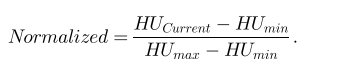

 通过阈值过滤掉不必要或不相关的样本图像，得到清晰的图像，其值为1;000HU > 500HU如图3a所示，并归一化至0-1范围。在此之后，我们获得肺结节清晰的CT扫描，如图3b、3c所示。然后，对选定的切片进行预处理，开发的系统读取包含CT扫描中每个结节信息的xml文件。如前所述，它具有许多特征:恶性评分范围从0到4。边缘图以像素表示结节的位置，通常是结节的边框像素信息。因此，为了得到结节的质心，我们应用如下公式: 

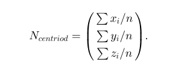

 上式中，结节的质心ncentrod为x的所有位置i的总和;每个结节的位置现在是在世界坐标中确定的，但为了在CT扫描上定位和识别结节，我们使用体素坐标。因此，我们应用了一个函数，使用世界坐标作为输入，并将所有位置转换为所需的体素坐标，我们还进行了广泛的数据扩充:空间增强，包括(镜像、旋转、缩放)、颜色增强(对比度、亮度和伽玛调整)和噪声增强。由于深度学习体系结构的搜索空间很大，因此我们裁剪输入CT扫描，并从512 512深度中提取64 64的patch。这些作物图像块被分成训练样本和测试样本。 

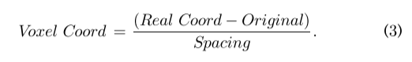

###### 3.3 肺/肺结节分类 

 为了将肺结节图像与非结节图像(良性和恶性)进行分类，如图2所示，我们使用了三种不同的分类架构;这些架构也被应用于图像特征的提取。每个体系结构的细节将在以下小节中解释: 

###### ##3.3.1VGG16

 出于分类目的，我们使用vg -16[12]作为基本架构。它是在ImageNet数据集[51]上训练的一个简单且常用的卷积神经网络。然而，这个架构相当深，有16层，有1.38亿个参数。总体网络架构如图4所示。训练时需要固定大小的22224张图像。它从每个像素减去训练数据集上估计的平均值。输入图像被给予一个卷积层块，该块有3个滤波器。它利用的参数很少，具有更多的非线性，除了一种配置，即11个卷积滤波器，也定义为输入通道的线性变换。卷积层的输入步幅，3个卷积层的空间填充为1像素。它保证了卷积层之后的空间表示保存。有五个最大池化层，它们支持卷积层，并有助于空间池化。Max-pooling是在一个22像素的窗口上跨越两步完成的。最后，三个完全连通的层支撑一堆卷积层;每一个都有不同的深度，如图4所示。最后一层是softmax层。 

#######3.3.2ResNet

 用于分类目的的第二个卷积神经网络架构是Resnet-50。它有50个深层，包含2600万个参数。建筑从残差中学习特征。它使用跳跃连接在卷积层上提供数据。Resnet将第n层的输入合并为ðn þ xÞth层，允许额外的层积累，并建立一个广泛的神经网络。网络中有48个卷积层，一个最大池化层，一个平均池化层。网络结构如图5所示。卷积层的核大小为7 7，有64个不同的核，max-pooling的stride大小为2。在后面的卷积块中，有一个3 3;64内核支持一个11;256内核;这三个层总共重复了三次，最后提供了九层。 

###### 3.3.3 MobileNet

 另一种用于肺结节CT扫描分类的架构是MobileNet[14]。总体网络架构如图6所示。它有两个全局超参数，分辨率和宽度乘子，允许根据条件在效率或延迟率之间进行权衡。它从根本上应用了被称为深度层的可分离卷积，而不是旧网络中应用的传统卷积，以产生更小的图案。每个深度可分离的卷积层由点方向和深度方向的卷积层组成。将这些卷积作为单独的层计算，它有28层之和。一般的体系结构由420万个参数组成，这些参数可以通过调整超参数(例如，宽度乘法器)进行修改。 

##### 3.4 肺/肺结节检测 

  如图2所示，分类后，我们使用深度学习体系结构对CT扫描图像中的肺结节进行检测和定位。我们练习Faster R-CNN [15]， SSD[17]和YOLOv3[16]，用于结节的定位和良恶性鉴别。这些体系结构在LIDC-IDRI数据集上进行训练，就像它们最初使用MS-COCO数据集[52]进行训练一样。我们应用了转移学习的方法，显著增加了肺结节检测的结果。下面的小节将详细介绍不同的检测器。 

###### 3.4.1Faster-RCNN

 我们首先执行Faster R-CNN[15]进行检测，如图1所示。它也被认为是一个两相检测器;第一阶段使用区域建议网络(region Proposal Network, RPN)为结节病变生成区域锚定，第二阶段应用检测到的锚定区域信息进行分类(如良、恶性)。检测器模型的输出是检测到的矩形包围盒保持(坐标、高度和宽度信息)，以及置信分数和类标签的值。图7所示的整体方法主要有三个步骤。通过卷积层提取输入图像的特征，并进一步用于生成特征图。采用滑动窗口方法生成锚点病灶或区域边界框，进一步细化以明确结节。我们使用一个小的网络对检测到的锚点进行细化，并估计损失函数，以确定最需要的锚点病变。损失函数的数学表达式为[15]: 

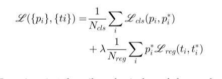

 式4中，i表示检测到的锚定区域的索引，pi为预测到类的概率，表示为。基本真理是用p表示的;如果PI值为1，则检测到的锚点与检测到结节的正类相关联;如果值为0，则表示为负类。要改变包围框的预测坐标，需要使用一个矢量ti;为了表示边界框的实际坐标，应用了t I。利用经过训练的RPN通过卷积特征映射获得感兴趣区域。一旦使用ROI池层提取特征图，就可以确定损失函数，包括分类函数和回归函数。 

######3.4.2Ssd

 另一个用于肺部检测的深度学习检测器是SSD[17]。总体架构如图8所示。它包括一个由一个步幅为11的点卷积层支持的3个深度卷积层。检测器模型提取结节特征，然后应用卷积滤波器对特定结节进行识别和定位。应用不同的特征映射来表示分类和定位回归。如图8所示，为特征映射的每个块定义一个默认框的集合。对于所有的特征图，它给出了四个不同大小的预测边界框。得到特征图上所有检测位置的k个具有不同纵横比和大小的包围盒的数量。损失函数确定为[17]: 

 上式中的N表示检测到的和预测到的边界盒数，a定义了为损失函数稳定的权值。Lconf显示了confidence的loss函数，Lloc描述了localization的loss函数。Lconf用[17]表示: 

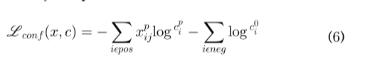

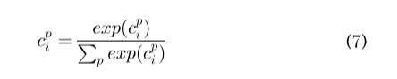

 对于不同的结节置信值，置信函数(Softmax)[53]用c表示。对于映射实际的包围盒jth，用预测检测到的盒ith，应用xp ij的值，在本例中分别为1和0。式5中的Lloc定义为: 

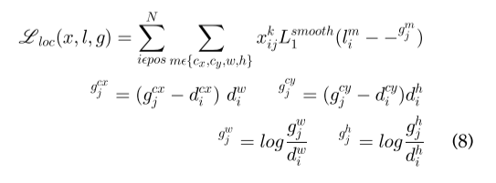

 式8给出了定位的损失函数值，在实际和预测的包围盒之间计算，分别用g和l表示。其中xk ij表示第i映射检测或预测的包围盒坐标与目标结节的第j实际坐标。所检测到的包围盒的高度和宽度用h表示;W，质心点用cx表示;安西。 

###### yolov3

 为了在肺部CT扫描中识别和定位结节，还使用了另一种先进的检测体系结构，即YOLOv3。在图9所示的肺结节数据集上使用该检测器架构进行训练。与SSD一样，YOLOv3也是一种单阶段架构，它可以预测完整输入CT扫描中相同的包围盒和结节类型的概率。卷积层用于提取输入图像的特征，全连通层用于识别类概率和预测。一般的体系结构被分割成区域，也被定义为网格单元。这些也与类的概率和包围盒的预测有关。图像中检测到的结节的中心是否在细胞内，正如这些网格细胞所预测的那样。对于肺结节的检测，需要确定相关区域或病灶。利用置信度的值来获得检测到的包围盒。最后，对确定的肺结节边界盒定义损失函数，该函数结合回归和分类两个函数。分类损失函数Lc表示为[54]: 

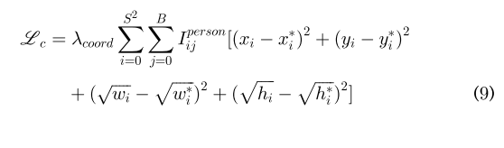

 式9中缩放边界盒坐标时，利用坐标参数co5。在网格单元中，用xi、yi、hi、wi表示预测位置的包围框。网格单元中的地面真值位置表示为x i、y i、h i、w i。IOUtruth pred的边界盒回归损失LIOU定义为: 

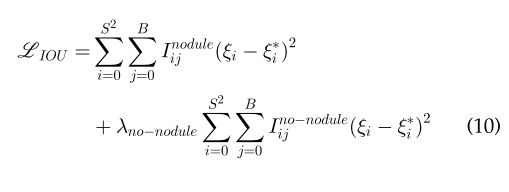

 上式中，用非结节来定义分类误差;而网格单元ith的置信度值如i所示，预测值/检测值与实际值为i。Inodule图示在网格细胞和第j个包围框中检测到的结节。 

##### 4实验和评价结果 

 使用LIDC-IDRI数据集对上述分类和检测体系结构进行训练和测试。在本节中，将详细讨论实验结果的细节，包括训练、测试观察和视觉结果。实验中，我们使用NVIDIA Deep Learning GPU Training System (DIGITS)，定义网络，实现数据增强，并使用Intel i5系统和NVIDIA GeForce GTX 1080 GPU进行训练和测试。所有架构的培训时间大约为6个小时。上述架构的训练和测试观察结果如图10和图11所示。这是100个时代的训练。可以看出，在训练和测试过程中，损失在第10 epoch处是递减的，如图10所示。Faster-RCNN的训练和测试损耗分别为0.6%、0.5%，SSD为0.45%、0.4%，YOLO为0.45%、0.3%。此外，从图11中还可以看出，在初始20 epoch之后，训练和测试精度有所提高。fast - rcnn的训练和测试精度分别为0.86和0.84,SSD为0.87和0.9,YOLOv3为0.92和0.94。 

###### 4.1分类及检测结果 

 基于深度学习的自动化系统分类检测结果如图12、图13所示。该系统首先使用基于深度学习的分类体系对CT扫描图像中的良、恶性结节进行分类。然后，利用基于深度学习的目标检测器对CT图像中结节的位置和位置进行定位。图12为肺良性结节的分型结果;可以看出，所开发的系统能够对不同结节大小的各种CT扫描图像进行准确的分类。此外，良性肺芽的检测结果如图12所示。 

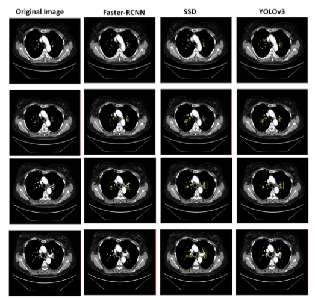

 第一列是原始的测试图像，第二列是FasterRCNN的结果;可以看出，通过对CT图像中不同大小的良性结节进行检测，模型效果良好。类似地，在后面的两列中，我们展示了SSD和YOLOv3探测器的结果;与fast - rcnn相比，可以看出这两种模型对不同大小的良性肺结节检测出更精确的边界盒，结果很好。在图13中，我们展示了肺部恶性CT扫描和肺结节的分类和检测结果。从结果中可以看出，深度学习架构通过对肺部CT良、恶性扫描进行分类，取得了很好的结果，如图12所示。然而，由于结节的特征大多与恶性结节相似，这是一项困难的工作，但深度学习体系自动选择更稳健的特征，并对恶性结节和良性结节的CT扫描进行分类。值得注意的是，深度学习模型能够准确定位各种大小的肺结节。此外，CT扫描结节也以黄色边框定位。此外，从结果中可以看出YOLOv3和SSD的性能优于FasterRCNN。 

###### 4.2性能评价 

 基于深度学习架构的性能使用不同的参数来评估，如真阳性(TP)、真阴性(TN)、假阳性(FP)和假阴性(FN)。使用这些参数计算精度(Precision)、召回率(Recall)、准确度(Accuracy)、真阳性率(TPR)和假阳性率(FPR)。标准偏差和平均值被用来确定平均精密度、召回率和准确度。在图14中，我们展示了不同深度学习体系结构的分类精度。可以看出，深度学习体系结构对非结节、良性和恶性CT扫描图像都有很好的效果。VGG-16的分类精度为0.93、0.92、0.93,Resnet50为0.94、0.94、0.95，而Mobilenet对Non-Nodule、Benign、Malignant图像的分类精度分别为0.95、0.95、0.95。 

 我们还展示了使用不同参数的探测器模型的性能，如图15所示;可见，所有模型对肺良恶性结节均有较好的治疗效果。图中给出了三种不同架构的TPR、Accuracy、Precision和Recall。fast - rcnn的TPR、Accuracy、Accuracy、Recall值分别为0.91、0.93、0.89、0.70,SSD的TPR值分别为0.92、0.94、0.9、0.75,YOLOv3的TPR值分别为0.93、0.94、0.91、0.89。fast - rcnn的TPR值为0.91、0.93、0.89、0.70,SSD的TPR值为0.92、0.94、0.9、0.75,YOLOv3的TPR值为0.93、0.94、0.91、0.89。 

 在表1中，我们展示了不同分类和基础架构的检测模型的总体性能结果，可以观察到，fast - rcnn (VGG-16)的精度为0.90,fast - rcnn (Resnet50) 0.91, fast - rcnn (Mobilenet) 0.91，而SSD (VGG16)达到，0.92,SSD (Resnet50)， 0.925, SSD (Mobilenet) 0.94。与其他模型YOLOv3 (VGG-16) 0.93、YOLOv3 (Resnet50) 0.935和YOLOv3 (Mobilenet) 0.94相比，精度更高。由于滤波步骤的存在，FPR也有所降低，对于各种深度学习模型，滤波步骤的范围在0.2到0.06之间。fast - rcnn与VGG-16、Resnet和Mobilenet的TPR值分别为0.91、0.92和0.92。SSD和YOLOv3型号的VGG-16、Resnet和Mobilenet的TPR分别为0.92、0.93、0.93和0.93、0.935和0.94。 

##### 5 结论

 生物医学成像技术和基于人工智能的系统的进步有助于早期诊断几种传染性/癌症，如肺癌。因此，本文对肺癌或肺癌的问题进行了分析。在CT扫描中，肺结节的良、恶性的分类和检测是利用基于深度学习的系统进行的。开发的系统研究了肺结节分类的不同基础结构，如VGG-16、Resnet 101和Mobilenetv3。此外，我们还使用了新的深度学习检测器，包括Faster-RCNN、YOLOv3和SSD进行检测。实验是使用一个公开可用的基准LIDC-IDRI数据集进行的。为了提高系统的性能，需要进行必要的预处理，并引入一个滤波步骤，以消除不必要的样本/图像从数据集。因此，所有的深度学习模型都取得了很好的分类和检测精度。实验结果表明，该方法降低了FPR，提高了精度。分类体系的平均正确率在0.92和0.95之间，而平均检测精度为0.93和0.94。在未来，这项工作可能会以不同的基于深度学习的架构进行;我们将使用使用其他基准数据集的各种癌症图像来推广所提出的系统的性能。 