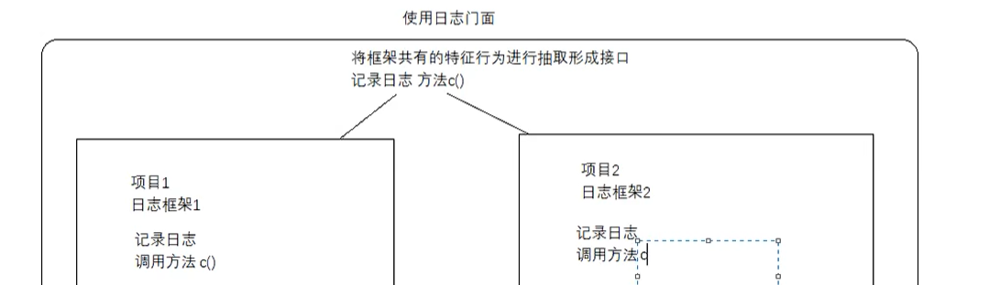
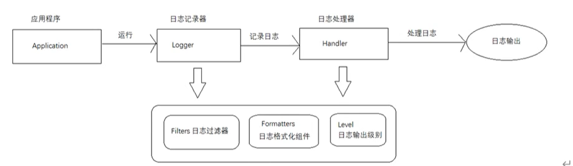

#### 日志文件

* 日志可以分为调试日志和系统日志

* 日志框架的作用

  * 1.控制日志输出的内容和格式。
  * 2.控制日志输出的位置。
  * 3.日志文件相关的优化，如异步操作、归档、压缩..
  * 4.日志系统的维护
  * 5.面向接口开发 -日志的门面

* 市面流行的日志框架

  * java的原生日志框架：JUL ：java util logging
  * apache的开源项目：log4j
  * log4j之父做的另外一个开源项目logback，称为log4j后浪
  * log4j推出第二个版本log4j2

* 日志文件和日志门面的区别

  * 日志框架技术 JUL、Logback、Log4j、Log4j2用来方便有效地记录日志信息

  * 日志门面技术 JCL、SLF4j

  * 为什么要使用日志门面技术（规定api）

    * 每一种日志框架都有自己单独的API，要使用对应的框架就要使用对应的API，这就大大的增加了应用程序代码对于日志框架的耦合性。

    * 我们使用了日志门面技术之后，对于应用程序来说，无论底层的日志框架如何改变，应用程序不需要修改任意一行代码，就可以直接上线了。

      


#### JUL

* 它是java原生的日志框架，不需要引用第三方类库

* 使用方便，应用在小型应用

  
  * Logger:被称为记录器，应用程序通过获取Logger 对象，抵用其API来发布日志信息。Logger通常被认为是访问日志系统的入口程序。
  
  * Handler:处理器，每个Logger 都会关联一个或者是一组 Handler，Logger 会将日志交给关联的 Handler 去做处理，由Handler负责将日志做记录。Handler具体实现了日志的输出位置，比如可以输出到控制台或者是文件中等等。
  
  * Filter:过滤器，根据需要定制哪些信息会被记录，哪些信息会被略过。
  
  * Formatter:格式化组件，它负责对日志中的数据和信息进行转换和格式化，所以它决定了我们输出日志最终的形式。
  
  * Level:日志的输出级别，每条日志消息都有一个关联的级别。我们根据输出级别的设置，用来展现最终所呈现的日志信息。
  
    * 级别分类
  
      * SEVERE :(最高级)错误
      * WARNING :警告
      * INFO :(默认级别)消息
      * CONFIG :配置信息
      * FINE :详细信息（少）
      * FINER :详细信息（中）
      * FINEST :详细信息（最高级，详细信息最全的）最低级的信息级别
  
    * 两个特殊的级别
  
      * OFF 可用来关闭日志记录
      * ALL 启用所有消息的目志记录
  
    * 第二个参数：数值
  
      * 这个数值的意义在于，如果我们设置的日志的级别是INFO--800那么最终展现的目志信息，必须是数值大于800的所有的日志信息最终展现的就是
        * SEVERE
        * WARNING
        * INFO
  
      ```java
              logger.severe("severe信息");
              logger.warning("warning信息");
              logger.info("info信息");
              logger.config("config信息");
              logger.fine("fine信息");
              logger.finer("finer信息");
              logger.finest("finest信息");
      二月 29, 2024 6:52:21 下午 wang.zi.jie.TestLog testLog
      严重: severe信息
      二月 29, 2024 6:52:21 下午 wang.zi.jie.TestLog testLog
      警告: warning信息
      二月 29, 2024 6:52:21 下午 wang.zi.jie.TestLog testLog
      信息: info信息
      ```
  
      * 我们可以看到他只输出到了info级别，所以说默认就是Info级别
  
    * 自定义级别，必须联合handle
  
      ```java
              //关闭默认的handle
      		logger.setUseParentHandlers(false);
      //控制台handle
              ConsoleHandler handler=new ConsoleHandler();
              //日志格式化对象
              SimpleFormatter formatter=new SimpleFormatter();
      
              //设置输出格式
              handler.setFormatter(formatter);
              //添加处理器
              logger.addHandler(handler);
              //设置日志级别
              //此处必须将目志记录器和处理器的级别进行统一的设置，才会达到目志是示相应级别的效果
              handler.setLevel(Level.ALL);
              logger.setLevel(Level.ALL);//所有日志
              logger.severe("severe信息");
              logger.warning("warning信息");
              logger.info("info信息");
              logger.config("config信息");
              logger.fine("fine信息");
              logger.finer("finer信息");
              logger.finest("finest信息");
      ```
  
    * 日志输出到具体的文件夹中
  
      ```java
          @Test
          public void testFileLogger() throws IOException {
              Logger logger = Logger.getLogger("wang.zi.jie.TestLog");
              logger.setUseParentHandlers(false);
              //文件日志处理器
              FileHandler handler=new FileHandler("D:\\myTestLog.log");
              SimpleFormatter simpleFormatter=new SimpleFormatter();
              handler.setFormatter(simpleFormatter);
              handler.setLevel(Level.ALL);
              logger.addHandler(handler);
              logger.setLevel(Level.ALL);
              logger.severe("severe信息");
              logger.warning("warning信息");
              logger.info("info信息");
              logger.config("config信息");
              logger.fine("fine信息");
              logger.finer("finer信息");
              logger.finest("finest信息");
          }
      ```
  
      
  
    * 控制台和文件同时输出，就是添加两个handle
  
      ```java
          @Test
          public void testFileLogger() throws IOException {
              Logger logger = Logger.getLogger("wang.zi.jie.TestLog");
              logger.setUseParentHandlers(false);
              //文件日志处理器
              FileHandler handler=new FileHandler("D:\\myTestLog.log");
              //控制台处理器
              ConsoleHandler handler1=new ConsoleHandler();
              SimpleFormatter simpleFormatter=new SimpleFormatter();
              handler.setFormatter(simpleFormatter);
              handler1.setFormatter(simpleFormatter);
      
              handler.setLevel(Level.ALL);
              handler1.setLevel(Level.CONFIG);
              logger.addHandler(handler);
              logger.addHandler(handler1);
              logger.setLevel(Level.ALL);
              logger.severe("severe信息");
              logger.warning("warning信息");
              logger.info("info信息");
              logger.config("config信息");
              logger.fine("fine信息");
              logger.finer("finer信息");
              logger.finest("finest信息");
          }
      ```
  
      * logger用于记录日志,handler用于输出
  
* Logger之间的父子关系

  * 不是继承关系，是通过树状结构继承的

    ```java
    public void testParent(){
            //这样logger1是logger2的父亲，越具体越低
            Logger logger1 = Logger.getLogger("wang.zi.jie");
            //父Logger是RootLogger，名称是空字符串，RootLogger是树的根
            Logger logger3 = Logger.getLogger("wang.zi");
            Logger logger2 = Logger.getLogger("wang.zi.jie.TestLog");
            System.out.println(logger2.getParent()==logger1);//true
            System.out.println(logger2.getParent()==logger3);//false
            System.out.println("logg1的父引用:"+logger1.getParent()+"，logg1名称为"+logger1.getName()+",父名称"+logger1.getParent().getName());
            System.out.println("logg2的父引用:"+logger2.getParent()+"，logg2名称为"+logger2.getName()+",父名称"+logger2.getParent().getName());
            System.out.println("logg2的父引用:"+logger3.getParent()+"，logg3名称为"+logger3.getName()+",父名称"+logger3.getParent().getName());
        }
    true
    false
    logg1的父引用:java.util.logging.Logger@32a1bec0，logg1名称为wang.zi.jie,父名称wang.zi
    logg2的父引用:java.util.logging.Logger@22927a81，logg2名称为wang.zi.jie.TestLog,父名称wang.zi.jie
    logg2的父引用:java.util.logging.LogManager$RootLogger@78e03bb5，logg3名称为wang.zi,父名称
    ```

  * 父亲做的设置，儿子默认跟随父亲的设置

    ```java
            logger1.setUseParentHandlers(false);
            ConsoleHandler handler=new ConsoleHandler();
            SimpleFormatter formatter=new SimpleFormatter();
            handler.setFormatter(formatter);
            logger1.addHandler(handler);
            logger1.setLevel(Level.ALL);
            handler.setLevel(Level.ALL);
    
            //儿子做打印
            logger2.severe("severe信息");
            logger2.warning("warning信息");
            logger2.config("config信息");
            logger2.fine("fine信息");
            logger2.finer("finer信息");
            logger2.finest("finest信息");
            logger2.info("info信息");
    ```

* 查看源码，追踪父Logger

  * 首先，Logger logger1 = Logger.*getLogger*(**"wang.zi.jie"**);

    ```java
        public static Logger getLogger(String name) {
            return demandLogger(name, null, Reflection.getCallerClass());
        }
    ```

  * 其次，点击demandLogger

    ```java
        private static Logger demandLogger(String name, String resourceBundleName, Class<?> caller) {
            LogManager manager = LogManager.getLogManager();
            SecurityManager sm = System.getSecurityManager();
            if (sm != null && !SystemLoggerHelper.disableCallerCheck) {
                if (caller.getClassLoader() == null) {
                    return manager.demandSystemLogger(name, resourceBundleName);
                }
            }
            return manager.demandLogger(name, resourceBundleName, caller);
        }
    ```

  * LogManager manager = LogManager.*getLogManager*();

    ```java
        public static LogManager getLogManager() {
            if (manager != null) {
                manager.ensureLogManagerInitialized();
            }
            return manager;
        }
    ```

  * **manager**.ensureLogManagerInitialized();

    ```java
        final void ensureLogManagerInitialized() {
            final LogManager owner = this;
            if (initializationDone || owner != manager) {
                return;
            }
            synchronized(this) {
                final boolean isRecursiveInitialization = (initializedCalled == true);
    
                assert initializedCalled || !initializationDone
                        : "Initialization can't be done if initialized has not been called!";
    
                if (isRecursiveInitialization || initializationDone) {
                    return;
                }
                initializedCalled = true;
                try {
                    AccessController.doPrivileged(new PrivilegedAction<Object>() {
                        @Override
                        public Object run() {
                            assert rootLogger == null;
                            assert initializedCalled && !initializationDone;
                            owner.readPrimordialConfiguration();
                            owner.rootLogger = owner.new RootLogger();
                            owner.addLogger(owner.rootLogger);
                            if (!owner.rootLogger.isLevelInitialized()) {
                                owner.rootLogger.setLevel(defaultLevel);
                            }
                            @SuppressWarnings("deprecation")
                            final Logger global = Logger.global;
                            owner.addLogger(global);
                            return null;
                        }
                    });
                } finally {
                    initializationDone = true;
                }
            }
        }
    
    ```

  * owner.**rootLogger** = owner.**new** RootLogger();它是作为LogManger的内部类

    

  * 进行节点挂载

    

  * 点进去

    ```java
        public boolean addLogger(Logger logger) {
            final String name = logger.getName();
            if (name == null) {
                throw new NullPointerException();
            }
            drainLoggerRefQueueBounded();
            LoggerContext cx = getUserContext();
            if (cx.addLocalLogger(logger)) {
                // Do we have a per logger handler too?
                // Note: this will add a 200ms penalty
                loadLoggerHandlers(logger, name, name + ".handlers");
                return true;
            } else {
                return false;
            }
        }
    ```

  * LoggerContext cx = getUserContext();它是一种map关系，点击LoggerContext

    

  * 名字作为key，引用作为value，点击引用

    

  * 有一个LogNode

    


* JUL使用配置文件，默认有配置文件，系统默认的配置，可以通过查看源码

  
  * java.home指的就是jre，所以在jre/lib下

    

  * 打开文件

    ```properties
    #使用什么handle
    handlers= java.util.logging.ConsoleHandler
    #级别
    .level= INFO
    #输出文件的路径
    java.util.logging.FileHandler.pattern = %h/java%u.log
    #输出文件限制的字节数
    java.util.logging.FileHandler.limit = 50000
    #日志文件的数量
    java.util.logging.FileHandler.count = 1
    #输出日志的格式，默认使用xml格式
    java.util.logging.FileHandler.formatter = java.util.logging.XMLFormatter
    #控制台输出级别
    java.util.logging.ConsoleHandler.level = INFO
    #控制台格式
    java.util.logging.ConsoleHandler.formatter = java.util.logging.SimpleFormatter
    #日志级别设置到具体的某个包下
    com.xyz.foo.level = SEVERE
    ```

    * 默认是控制台handle，如果想要添加其他的处理器，在当前处理器类后面通过以逗号的形式进行分隔，可以添加多个处理器

  * 读取自定义的配置文件

    ```java
        public void testProperties() throws IOException {
            InputStream inputStream=new FileInputStream("D://test.properties");
            LogManager logManager=LogManager.getLogManager();
            logManager.readConfiguration(inputStream);
            Logger logger = Logger.getLogger("wang.zi.jie.TestLog");
        }
    ```

    ```properties
    handlers= java.util.logging.ConsoleHandler
    .level= INFO
    
    java.util.logging.FileHandler.pattern = %h/java%u.log
    java.util.logging.FileHandler.limit = 50000
    java.util.logging.FileHandler.count = 1
    java.util.logging.FileHandler.formatter = java.util.logging.XMLFormatter
    
    java.util.logging.ConsoleHandler.level = INFO
    java.util.logging.ConsoleHandler.formatter = java.util.logging.SimpleFormatter
    #自定义Logger，wang.zi.jie代表包下的所有handlers要执行我们自己定义的handle
    wang.zi.jie.handlers=java.util.logging.FileHandler
    #自定义Logger日志等级
    wang.zi.jie.level= CONFIG
    #屏蔽父Logger的日志设置
    wang.zi.jie.userParentHandlers=false
    
    com.xyz.foo.level = SEVERE
    
    ```

    ```java
        @Test
        public void testProperties() throws IOException {
            InputStream inputStream=new FileInputStream("D:\\test.properties");
            LogManager logManager=LogManager.getLogManager();
            logManager.readConfiguration(inputStream);
            Logger logger = Logger.getLogger("wang.zi.jie.TestLog");
            logger.severe("severe信息");
            logger.warning("warning信息");
            logger.info("info信息");
            logger.config("config信息");
            logger.fine("fine信息");
            logger.finer("finer信息");
            logger.finest("finest信息");
        }
    ```

    

    

* 日志追加

  * 默认是覆盖
  * 输出日志文件是否是追加，在配置文件中增加java.util.logging.FileHandler.append=true

* 总结：

  