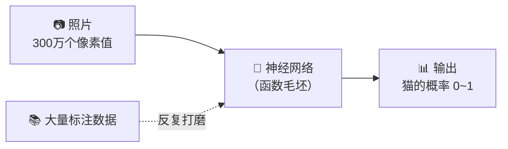
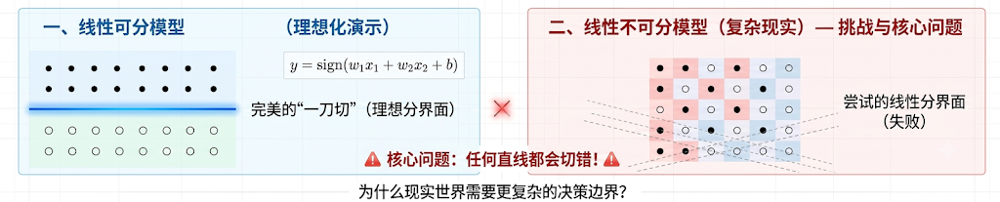
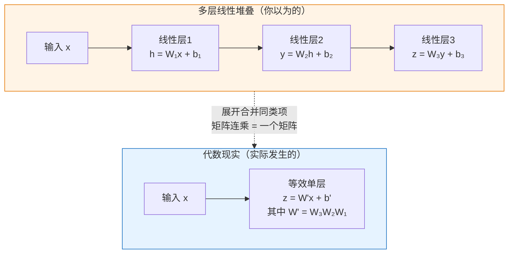
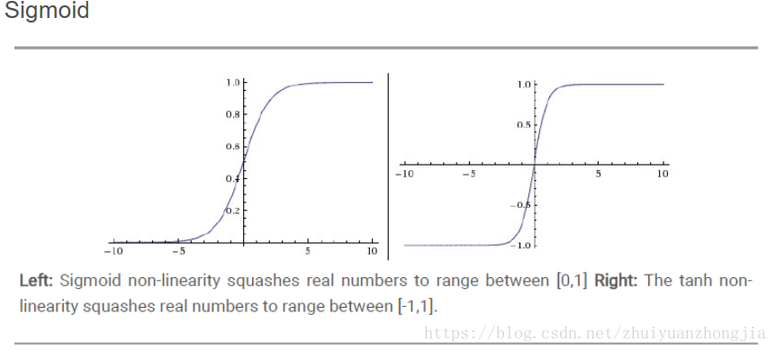
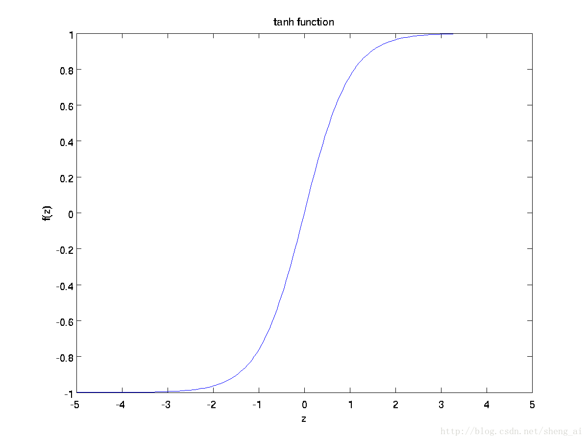
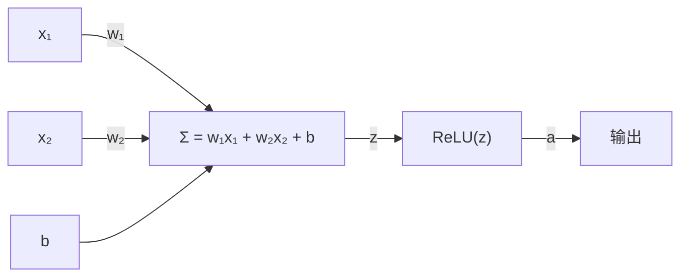
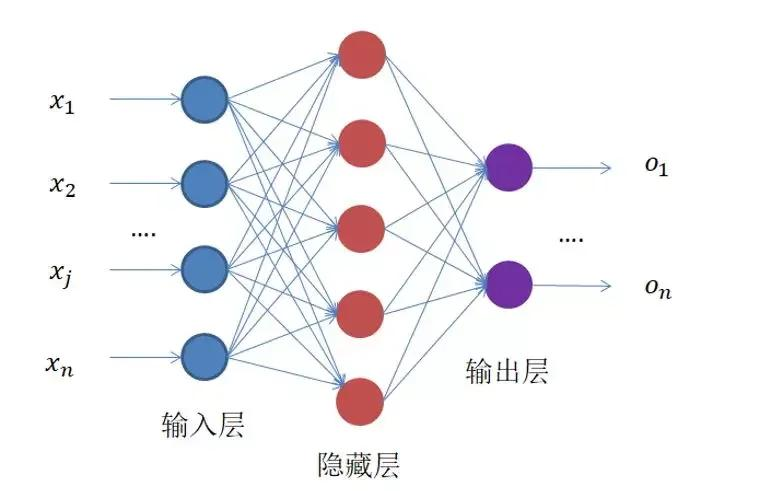
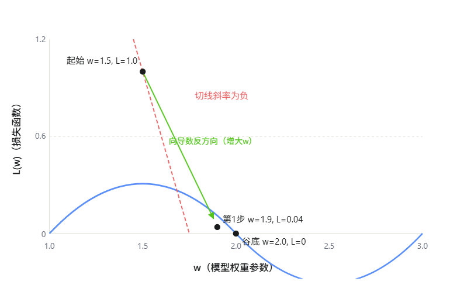
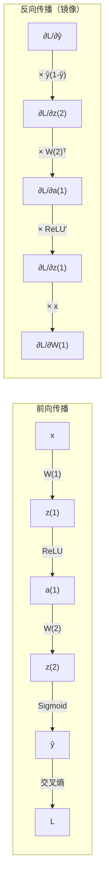

### 一、从函数到神经网络

**你会怎么让电脑认出猫？**

* 想象一下，你手机相册里有成千上万张照片，你想让程序自动把有猫的照片挑出来。你会怎么做？

  - **第一反应：写规则。** 猫有尖耳朵、圆眼睛、长胡须……于是你写下一连串的"如果-那么"语句。但很快你就会崩溃——猫会趴着、仰着、藏在盒子里只露出脑袋，光照、角度、毛色千变万化，同一只猫在不同姿态下可能被判断为完全不同的东西。用死板的规则去穷尽猫的所有可能性，这条路走不通。


  - **换个思路：找一个映射器。** 你不需要亲手定义"什么是猫"。你需要的是一个黑箱：给它照片，它就吐出答案。在数学上，这种从输入到输出的映射关系就叫**函数**。

**那这个函数具体长什么样？**

* 一张 $1000 \times 1000$ 的彩色照片由三原色（RGB）组成，每个像素有红、绿、蓝三个亮度值。所以一张照片总共是 $1000 \times 1000 \times 3 = 3{,}000{,}000$ 个数字。输出是一个数——比如 1 代表猫，0 代表不是猫。我们要找的，就是从 300 万个数字到 1 个数字的超级复杂映射。

* 从数学上看，这是在做一个**函数逼近**——给定一批输入输出数据，找一个函数来拟合。传统函数逼近论有两个"纠结"：第一，选什么类型的基函数（多项式？三角函数？）？第二，基函数的次数选多高？次数太低，表达能力不够（欠拟合）；次数太高，函数疯狂震荡（过拟合）。这两个纠结困扰了数学家几百年——直到神经网络的出现，给出了一个全新的答案。

* 函数长什么样？我们最熟悉的函数是 $y = 2x + 1$——给它一个 $x$，它乘以 2 再加 1，吐出 $y$。这个规则很简单，人可以手写。但猫识别函数呢？给它 300 万个像素值，它要吐出"猫"或"不是猫"。这个规则太复杂了——300 万个输入变量之间的关系，没有人能用人手写出来。那怎么办？

- **最终答案：让计算机自己把这个函数"造"出来。** 搭建一个极其灵活的函数毛坯，用大量标注好的猫照片去"打磨"它。每看一张图，毛坯就自我调整一点，最终长成我们需要的形态。这个函数毛坯，就是**神经网络**。



---


#### 1.1 线性函数：最简单的起点，也是最深的瓶颈

* 搭建函数毛坯，得从最基本的单元开始。最基本的函数是线性函数：

$$
y = wx + b
$$

* 三个角色：输入 $x$、**权重** $w$、**偏置** $b$。$w$ 控制 $x$ 对结果的影响力大小和方向，$b$ 让整条直线可以上下平移——如果没有 $b$，直线必须穿过原点，那灵活性就大打折扣。这个简单的结构是所有神经网络的基础。

* 当输入变成 300 万个像素 $x_1, x_2, \ldots, x_{3000000}$，线性函数自然地扩展为：

$$
y = w_1 x_1 + w_2 x_2 + \cdots + w_{3000000} x_{3000000} + b
$$

* 在几何上，这个函数定义了一个**超平面**——高维空间中的"一刀切"。
* 为什么线性函数等于"一刀切"？因为 $y = w_1 x_1 + w_2 x_2 + b$ 的决策边界——即 $y = 0$ 这条线——永远是直的。线的这边预测"猫"，线的那边预测"不是猫"。线性函数没有弯曲的能力，它画不出曲线、圆圈、波浪——它只能一刀切。


* 为了理解为什么"一刀切"不行，我们把问题简化到二维平面上。假设每张照片只有 2 个像素（而不是 300 万个）——像素1的值作为横坐标 $x_1$，像素2的值作为纵坐标 $x_2$，这样每张照片就变成了平面上的一个点。是猫的照片标记为 ●，不是猫的标记为 ○：

* 注意：下面两张图都是散点图——图上每个点各代表一张照片（不是一张照片里有多个物体），● 是猫照片，○ 是非猫照片。

  

```
  线性可分（理想情况）              线性不可分（现实情况）
  
  ●  ●  ●  ●                      ●  ○  ●  ○
  ●  ●  ●  ●                      ○  ●  ○  ●
  ───────────── 一刀切              ●  ○  ●  ○
  ○  ○  ○  ○                      ○  ●  ○  ●
  ○  ○  ○  ○                      
                                   任何直线都会切错！
```

* 同一只猫在不同光照下的两个像素点（A 和 B），可能比一只猫和一张桌子的像素点（A 和 C）距离还要远。数据不是排好队等你来切的，而是像一堆乱麻一样缠绕在一起。

* 可以在二维平面上试着画一条直线——无论斜率多大、截距多少，右半边（现实情况）的数据总有一部分 ● 和 ○ 被划到同一边。**直线只有两个自由度（斜率 $w$ 和截距 $b$），而猫的视觉模式需要远远更多的自由度来描述。** 把这个原理推广到 300 万维空间：超平面是多了一个自由度（可以倾斜的方向更多了），但它依然只是一次"切割"，无法画出弯曲的、环绕的、多岛状的复杂分类边界。

> 单层线性函数，表达能力太弱。

那多叠几层呢？直觉上，**多个简单函数组合起来应该能表达更复杂的东西**。先用 $n$ 个线性函数并行处理输入，再把它们的输出加权组合：

* **第一层**（$n$ 个线性函数并行，每个有自己的一套权重）：

$$
\begin{aligned}
h_1 &= w_{11}x_1 + w_{12}x_2 + \cdots + w_{1,3000000}\,x_{3000000} + b_1 \\
h_2 &= w_{21}x_1 + w_{22}x_2 + \cdots + w_{2,3000000}\,x_{3000000} + b_2 \\
    &\;\;\vdots \\
h_n &= w_{n1}x_1 + w_{n2}x_2 + \cdots + w_{n,3000000}\,x_{3000000} + b_n
\end{aligned}
$$

* **第二层**（把第一层的 $n$ 个输出做加权组合）：

$$
y = v_1 h_1 + v_2 h_2 + \cdots + v_n h_n + c
$$

* 注意这里用到了**线性代数**的视角：第一层的计算本质上是一个**矩阵乘法**。把所有权重写成矩阵 $\mathbf{W}$，输入写成向量 $\mathbf{x}$，偏置写成向量 $\mathbf{b}$，那么整个第一层可以简洁地写成 $\mathbf{h} = \mathbf{W}\mathbf{x} + \mathbf{b}$。这不仅写法紧凑，更重要的是——矩阵乘法可以在 GPU 上并行执行，这就是深度学习能处理海量数据的底层原因。线性代数不是装饰，是整个大厦的钢筋。

好，回到正题。把第一层的 $h_1, h_2, \ldots, h_n$ 全部代入第二层的 $y$，做代数展开和合并同类项：

$$
\begin{aligned}
y &= v_1(w_{11}x_1 + \cdots + b_1) + v_2(w_{21}x_1 + \cdots + b_2) + \cdots + v_n(w_{n1}x_1 + \cdots + b_n) + c \\
  &= (v_1 w_{11} + v_2 w_{21} + \cdots + v_n w_{n1}) x_1 + \cdots + (v_1 b_1 + v_2 b_2 + \cdots + v_n b_n + c)
\end{aligned}
$$

> 最终的 $y$ 依然可以写成 $x_1, x_2, \ldots, x_{3000000}$ 的一个线性组合——$y = w'_1 x_1 + w'_2 x_2 + \cdots + w'_{3000000} x_{3000000} + b'$，其中 $w'_i$ 和 $b'$ 只是原有参数的加减乘组合。

* 用矩阵形式写，这个结论更加简洁：

$$\mathbf{y} = \mathbf{W}_2(\mathbf{W}_1\mathbf{x} + \mathbf{b}_1) + \mathbf{b}_2 = (\mathbf{W}_2\mathbf{W}_1)\mathbf{x} + (\mathbf{W}_2\mathbf{b}_1 + \mathbf{b}_2) = \mathbf{W}'\mathbf{x} + \mathbf{b}'$$

* 两个矩阵相乘，结果还是一个矩阵。整个过程可以概括为：



* 就像无论多少张透明玻璃叠在一起，透光效果不会多于一张玻璃——光线还是直线穿过。**线性 + 线性 = 线性。** 你只是在浪费计算量，没有增加任何新的表达能力。

> 堆叠解决不了问题。线性 + 线性 = 线性。我们需要的是**非线性**。

---

### 1.2. 激活函数：一个转折，打破线性魔咒

* 问题的根源很清楚：每一层都在做"乘法 + 加法"，堆来堆去还是在做"乘法 + 加法"。要打破这个闭环，必须在层与层之间插入一个**不是乘加运算的非线性变换**——激活函数（Activation Function）。

**ReLU**（Rectified Linear Unit，线性整流函数）的规则出奇简单：

$$\text{ReLU}(z) = \max(0, z)$$

- $z > 0$：原样通过，不做任何改变
- $z \leq 0$：一刀截断，输出 0

```
  ReLU(z)
    │    ╱
    │   ╱
    │  ╱
    │ ╱
    │╱
────┼──────── z
    │
```

* 这个"转折"看似微不足道，但它彻底改变了函数的性质——ReLU 不是线性函数。你不可能用 $w \cdot z + b$ 的形式表达 $\max(0, z)$。
* 但 ReLU 并不是一开始就有的选择——在它出现之前，**Sigmoid** 和 **Tanh** 统治了神经网络将近三十年。ReLU 是后来居上的"挑战者"。要理解它为什么最终胜出，得先看看两位前辈长什么样，以及它们有一个怎样的致命缺陷。


#### 为什么 ReLU 最终胜出？

* 历史上，最早流行的激活函数是 **Sigmoid** 和 **Tanh**：

$$\sigma(z) = \frac{1}{1 + e^{-z}}$$​



```
  σ(z)
1 ┤    ▁▁▁▁▁▁▁▁
  │   ╱
  │  ╱
  │ ╱    ← 中间陡峭（导数大）
0 ┤▔▔▔▔▔▔▔▔
  └──────────────── z
    负          正
    ← 两端平坦（饱和区，导数≈0）→
```

* Sigmoid 把任何输入平滑地挤压到 $(0, 1)$ 区间，Tanh 挤压到 $(-1, 1)$。它们看起来很优雅——连续、可导、有界。但有一个致命缺陷：

$$\sigma'(z) = \sigma(z)(1 - \sigma(z))$$

* 当输入 $z$ 的绝对值稍大（比如 $|z| > 4$），$\sigma(z)$ 就非常接近 0 或 1，此时导数 $\sigma'(z)$​​ 几乎为 0。Tanh 同理。这意味着在**饱和区**，梯度信号直接消失——后面的章节会详细展开这个灾难性的后果。

$$\quad \tanh(z) = \frac{e^z - e^{-z}}{e^z + e^{-z}}$$



* ReLU 的导数则简单得多：

$$\text{ReLU}'(z) = \begin{cases} 1, & z > 0 \\ 0, & z \leq 0 \end{cases}$$

* 对于所有正输入，导数是恒定的 1。信号不会衰减。而且 ReLU 的计算极其廉价——只需要一次比较操作，没有指数运算。简单、快速、不衰减，这让 ReLU 在实践中碾压了 Sigmoid 和 Tanh，成为现代神经网络的标准配置。

#### 神经元：最小的计算单元

* 有了激活函数，我们就可以定义**神经元**——神经网络的最小计算单元：

1. 接收来自上一层的输入 $x_1, x_2, \ldots$
2. 做线性组合 $z = w_1 x_1 + w_2 x_2 + \cdots + b$
3. 通过激活函数：$a = \text{ReLU}(z)$



* 这个 $a$ 不再是一个纯线性函数的输出——它在 $z = 0$ 处有一个转折。把成百上千个带转折的神经元堆叠起来，整体函数就有了表达任意复杂映射的能力。

#### 万能逼近定理：为什么这样就能表达一切？

* 先看一个具体例子。用三个 ReLU 神经元构造一个三角形的"山丘"：

$$f(x) = \text{ReLU}(x + 1) + \text{ReLU}(x - 1) - 2 \cdot \text{ReLU}(x)$$

* 追踪 $x$ 从左到右验证这个公式：

| 区间 | $\text{ReLU}(x+1)$ | $\text{ReLU}(x-1)$ | $2\cdot\text{ReLU}(x)$ | $f(x)$ | 形状 |
|------|---------------------|---------------------|-------------------------|--------|------|
| $x < -1$ | 0 | 0 | 0 | 0 | 平地 |
| $-1 \leq x < 0$ | $x+1$ | 0 | 0 | $x+1$ | 线性上升 |
| $0 \leq x < 1$ | $x+1$ | 0 | $2x$ | $(x+1)-2x=1-x$ | 线性下降 |
| $x \geq 1$ | $x+1$ | $x-1$ | $2x$ | $(x+1)+(x-1)-2x=0$ | 归零 |

```
  f(x)
   │
 1 ┤    ╱╲
   │   ╱  ╲
   │  ╱    ╲
 0 ┤─╱      ╲──
   └────────────── x
      -1   0   1
    
  三个 ReLU 拼出的三角形山丘
```

* 这个三角形山丘就是万能逼近定理的最基本积木。调整每个 ReLU 的权重和拐点位置，就能控制山丘的**位置**、**宽度**和**高度**。注意这里用了三个 ReLU 而非两个——两个 ReLU 只能产生台阶，产生真正的"凸起"需要至少三个 ReLU 的配合。更一般地，你可以把 $f(x)$ 看作一个**加权和**：$f(x) = v_1 \cdot \text{ReLU}(x - b_1) + v_2 \cdot \text{ReLU}(x - b_2) + v_3 \cdot \text{ReLU}(x - b_3)$，其中权重 $v_i$ 和拐点 $b_i$ 共同决定山丘的形状。

##### 用山丘拼出任意函数

* 现在你手上有一批这样的山丘。每个山丘由一组 ReLU 生成，有四个可调参数：
- **位置**（拐点在哪里）——由权重和偏置控制
- **宽度**（山丘有多宽）——由两个拐点之间的距离控制
- **高度**（山丘有多高）——由输出权重控制
- **形状**（尖的还是平的）——由 ReLU 的组合方式控制

```
  目标函数 f(x)
   │    ╭──╮
   │   ╱    ╲     ╭─╮
   │  ╱      ╲   ╱  ╲
   │ ╱        ╲ ╱    ╲
   │╱          ╳      ╲
   └────────────────────── x

  = 山丘₁ + 山丘₂ + 山丘₃ + ...
  
     ╭──╮
    ╱    ╲          ╭─╮
   ╱      ╲   +    ╱  ╲   +  ...
  ╱        ╲      ╱    ╲
 ╱          ╲    ╱      ╲
```

* 想象你有一千个不同位置、不同宽度、不同高度的三角形山丘。把它们全部加在一起——就像在一张画布上叠放几百个半透明的小色块。只要山丘数量够多、排列够密，叠加出来的形状可以无限逼近你想要的任何连续曲线。每个峰被一组密集的山丘填满，每个谷被负山丘（向下凹陷）挖出来。

这不是比喻——这是严格的数学事实。

##### 定理的正式表述

**万能逼近定理**（Universal Approximation Theorem，Cybenko 1989, Hornik et al. 1989）：

> 设 $\sigma$ 是一个非常数、有界、单调递增的连续函数（如 Sigmoid），或任意非常数的分段线性函数（如 ReLU）。那么，对于定义在 $\mathbb{R}^n$ 的**紧致子集**上的任意连续函数 $f$ 和任意 $\epsilon > 0$，存在一个单隐藏层的前馈神经网络：
> 
> $$F(x) = \sum_{i=1}^{N} v_i \,\sigma(w_i^\top x + b_i)$$
> 
> 使得对所有 $x$，有 $|F(x) - f(x)| < \epsilon$。

* 用大白话说：**只要激活函数不是常函数，一个隐藏层、神经元足够多，就能在任意紧致集上以任意精度逼近任意连续函数。** 注意两个关键条件——"紧致集"（有界闭集，在实际问题中这总是满足的——输入数据的取值范围总是有限的）和"非常数激活函数"（线性函数不行，必须是非线性）。$\epsilon$ 是你可以接受的误差——你把 $\epsilon$ 定到多小，网络就能精细到什么程度。

##### 直观理解：从基函数展开的角度

* 如果你学过傅里叶级数，万能逼近定理的构造非常类似：

| | 傅里叶级数 | 神经网络 |
|---|---|---|
| 基函数 | $\sin(nx), \cos(nx)$（正弦波） | $\sigma(w^\top x + b)$（神经元） |
| 调整方式 | 频率 $n$、振幅 $a_n, b_n$ | 权重 $w$、偏置 $b$、输出权重 $v$ |
| 展开式 | $f(x) = \sum_n a_n \sin(nx) + b_n \cos(nx)$ | $f(x) = \sum_i v_i \sigma(w_i^\top x + b_i)$ |
| 逼近能力 | 逼近任意周期函数 | 逼近任意连续函数 |
* 这个对比揭示了神经网络的一个深层本质：**传统逼近论需要人类手工选择基函数（正弦波、多项式……），而神经网络让基函数本身也可以从数据中学习。** 激活函数 $sigma$ 只是一个"元函数"——通过权重 $w$（伸缩）和偏置 $b$（平移）的仿射变换，同一个 $sigma$ 可以生成形状各异、位置不同的山丘。网络训练的过程，本质上就是在学习该用哪些山丘、每个山丘该放在哪里、该有多大多高——也就是在**学习基函数**。这是神经网络与传统函数逼近最根本的区别：人类不再需要纠结"选什么基函数、选多少次"，把这两个纠结交给了数据和梯度下降。


* 傅里叶级数用不同频率的**正弦波**拼出目标函数，神经网络用不同位置和形状的**非线性基函数**（在 ReLU 情况下就是那些山丘）拼出目标函数。正弦波是全局的——每个正弦波在整个定义域上都有值。ReLU 山丘是**局部的**——一个山丘只在特定区间内有非零值。这个局部性让 ReLU 网络在逼近那些有尖角、有跳跃、有局部特征的函数时更加灵活。

##### 定理告诉我们什么，没告诉我们什么

**定理保证的**：
- **存在性**——这样的网络一定存在。神经网络的设计不是盲目猜测，而是有坚实的理论支撑
- **只需一个隐藏层**——从表达能力上说，深度不是必须的。一个足够宽的隐藏层理论上就够了

**定理没保证的**：
- **需要多少神经元**——定理只说"存在某个 $N$"。实际中 $N$ 可能大到不切实际。对于复杂函数，浅层网络需要的神经元数量可能是指数级的
- **怎么找到这些权重**——定理是存在性定理，不是构造性定理。它不告诉你用什么训练算法能够找到这些参数。梯度下降能不能找到好参数，是另一个完全不同的问题
- **深度没用了吗**——绝对不是。深度网络可以用少得多的参数达到同样的逼近精度：一个 $d$ 层的网络可能只需要 $O(n)$ 个神经元就能做到浅层网络需要 $O(2^n)$ 个神经元才能做到的事。**深度带来效率**，而不是表达能力——浅层已经能表达一切，但深度让表达变得经济

* 这最后一点是深度学习革命的核心。万能逼近定理在 1989 年就证明了，但此后近 20 年深度网络都没有成为主流——不是不知道它们能逼近函数，而是**不知道怎么训练它们**。直到反向传播 + ReLU + 大规模数据 + GPU 这四个条件在 2010 年代同时具备，理论的潜力才被释放到实践中。

> 激活函数解决了"线性堆叠无效"的问题。但下一个问题随之而来：我们有成千上万个神经元，每个都有自己的权重和偏置。怎么把它们系统地组织起来？

---

### 3. 全连接层与矩阵运算：从神经元到网络

* 上一节末尾我们有了这样一个图景：万能逼近定理告诉我们，足够多的神经元可以逼近任何函数。但定理只说"存在"这样的神经元组合，没说怎么把它们组织成一个可以工作的系统。

* 想象你手上有一千个工人，每个工人都能做一件事——把一个输入向量加权求和，过一遍 ReLU，输出一个数。一千个工人排成一排，各自独立地处理同一个输入，得出一千个结果。然后呢？这些结果怎么汇总？谁来根据汇总的结果做下一步判断？如果还需要更高级的特征，第二层工人怎么利用第一层工人的输出？

**需要一个组织架构。** 这就是从"单个神经元"到"神经网络"的关键一跃。

#### 问题：怎么把神经元连起来？

* 先明确约束条件。在开始训练之前，我们不知道哪些输入特征对最终任务重要，也不知道哪些神经元之间应该合作。假设你要识别猫——你事先不知道耳朵检测器和眼睛检测器的输出应该传给同一个下游神经元，还是不同的下游神经元。你不知道边缘检测器该和色块检测器分开，还是合并。

* 在这个信息为零的起点，最合理的策略是：**把所有可能的连接都建立起来，让数据自己去决定哪些连接重要、哪些连接可以忽略。** 重要的连接，训练过程中权重会变大；不重要的，权重自然趋近于零。不做任何预设，每条连接都给你一个可调的权重旋钮——这就是"全连接"的含义。

* 具体来说，**全连接层**（Fully Connected Layer）的规则是：前一层的**每一个**神经元，都与后一层的**每一个**神经元有一条带权重的连接。后层任意一个神经元接收的输入信号，是前层**所有**神经元输出的加权和。

#### 矩阵形式：为什么线性代数恰好是答案？

* 现在把这条规则写成数学。假设前一层有 $n$ 个神经元，输出值分别是 $a_1, a_2, \ldots, a_n$。后一层有 $m$ 个神经元。$w_{ji}$ 表示前层第 $i$ 个神经元到后层第 $j$ 个神经元之间的**权重**，$b_j$ 是第 $j$​ 个后层神经元自己的**偏置**。

  

* 后层每个神经元都独立地做一次加权和——$m$ 个神经元就是 $m$ 条公式，每条有自己的权重和偏置：

$$
\begin{aligned}
z_1 &= w_{11} a_1 + w_{12} a_2 + \cdots + w_{1n} a_n + b_1 \\
z_2 &= w_{21} a_1 + w_{22} a_2 + \cdots + w_{2n} a_n + b_2 \\
    &\;\;\vdots \\
z_m &= w_{m1} a_1 + w_{m2} a_2 + \cdots + w_{mn} a_n + b_m
\end{aligned}
$$

* 一眼看去，这是 $m$ 条长得几乎一样的式子——每条都是 $n$ 次乘加，总共 $m \times n$ 个权重。每个后层神经元通过自己那一行权重，从前层所有信号中提取自己关心的组合——这就是为什么不同神经元学到不同的检测模式。

* 上图是单个神经元的视角。而全连接层的本质，就是 $m$ 个这样的神经元**并行工作**：同一个输入向量 $\mathbf{a}$，同时送入 $m$ 个神经元，每个神经元用自己的权重行做检测，产生 $m$ 个输出。写成矩阵形式，这 $m$ 条公式被压缩成一行：

$$
\mathbf{z} = \mathbf{W} \mathbf{a} + \mathbf{b}
$$

* 展开来看每一部分长什么样（以前层 3 个神经元、后层 4 个神经元为例）：

$$
\begin{bmatrix} z_1 \\ z_2 \\ z_3 \\ z_4 \end{bmatrix}
=
\begin{bmatrix}
w_{11} & w_{12} & w_{13} \\
w_{21} & w_{22} & w_{23} \\
w_{31} & w_{32} & w_{33} \\
w_{41} & w_{42} & w_{43}
\end{bmatrix}
\begin{bmatrix} a_1 \\ a_2 \\ a_3 \end{bmatrix}
+
\begin{bmatrix} b_1 \\ b_2 \\ b_3 \\ b_4 \end{bmatrix}
$$

* 留意这个矩阵的形状：**4 行 3 列。** 每一行对应后层的一个神经元，那一行里的 3 个数字就是这个神经元对前层 3 个输入各自分配的权重。每一列对应前层的一个输出，那一列的 4 个数字就是这个输出对后层 4 个神经元各自的影响力。矩阵乘法把 $4 \times 3 = 12$ 次标量乘加运算浓缩成一行代码。

* 加上激活函数，一层完整的全连接层计算就是：

$$
\mathbf{a}^{(l+1)} = \text{ReLU}\big(\mathbf{W}^{(l)} \mathbf{a}^{(l)} + \mathbf{b}^{(l)}\big)
$$

这个简洁的单行公式包含了三个操作，各自承担不同的角色：

| 操作 | 数学形式 | 在做什么 | 直觉 |
|------|---------|---------|------|
| 矩阵乘法 | $\mathbf{W} \mathbf{a}$ | 前层每个输出按不同权重分配到后层每个神经元 | **信息的混合与重组**——每个后层神经元从前层所有信号中提取自己关心的那部分 |
| 加偏置 | $+ \;\mathbf{b}$ | 给每个后层神经元一个独立的"基线值" | **阈值的平移**——即使前层输出全为零，后层神经元仍有一个基础激活水平 |
| 激活函数 | $\text{ReLU}(\cdot)$ | 对每个元素单独做非线性变换 | **引入转折**——打破线性，让多层叠加有意义（第 2 节的核心结论） |

* 这不算完。真正的威力在于，矩阵乘法在 GPU 上可以**并行执行**。一个 $1024 \times 3{,}000{,}000$ 的矩阵乘法涉及约 30 亿次标量乘法和 30 亿次加法，在 CPU 上按顺序做是天文数字——但 GPU 有成千上万个计算核心，把矩阵切分成小块同时算，毫秒级别就能完成。线性代数不只是在纸面上让公式变短，它直接决定了神经网络能不能**实际算出来**。这就是"线性代数是神经网络的母语"这句话的真正分量。

#### 从几何看：每一层在做什么？

* 矩阵乘法 $\mathbf{W} \mathbf{a}$ 在几何上是一个**线性变换**——它把输入向量 $\mathbf{a}$ 所在的 $n$ 维空间映射到 $\mathbf{z}$ 所在的 $m$ 维空间。这个映射可以做三件事：

- **旋转**：改变向量的方向。原来在两个不同方向的输入向量，经过 $\mathbf{W}$ 后可能被拉到更分开或更靠近。
- **缩放**：每个维度上的长度可以独立地拉长或压缩。有些特征被放大（权重绝对值大），有些被抑制（权重接近零）。
- **剪切**：把一个维度的信息"推"到另一个维度上，产生扭曲。

* 加上偏置 $\mathbf{b}$ 后变成了**仿射变换**——在上述线性变换之后再做一个平移。整个数据点云被旋转、拉伸、然后整坨平移到一个新位置。

* 然后 ReLU 上场。它把仿射变换结果中所有负值一刀切为零。几何上，这相当于把空间沿 $z = 0$ 这个"边界"**折叠**了一下——所有落在负半空间的数据点被压到了零平面上，正半空间的点保持原样。

* 一层全连接层 = **一次空间扭曲（仿射变换） + 一次折叠（ReLU）**。多层堆叠 = 反复扭曲 + 折叠 + 扭曲 + 折叠。最初纠缠在一起的数据（猫的像素和桌子的像素混在一团），经过一层层扭曲和折叠，最终在高维空间的某个区域被干净地分离开。

#### 数据流：从像素到语义的逐层抽象

* 回到猫识别的具体例子，看数据如何经过三个全连接隐藏层，从 300 万个像素值逐步变成"有猫"这个判断。

```
  输入层              隐藏层 1           隐藏层 2           隐藏层 3          输出层
  (3,000,000)        (1024)            (512)             (256)            (1)
  
  像素值             边缘/色块/纹理      轮廓/区域/表面      部件               猫的概率
  
  p₁ ────────┐
  p₂ ──────┐ │      ┌─ 水平边缘检测器
  ...      │ ├──────┤─ 竖直边缘检测器    ┌─ 圆形结构
  pₙ ────┐ │ │      ├─ 红色块检测器 ────┤─ 毛发纹理 ────┐
          │ │ │      ├─ 蓝色块检测器     ├─ 亮斑区域 ────┤─ 耳朵状部件 ──┐
          │ │ │      ├─ 斜纹理检测器     ├─ ...      ────┤─ 眼睛状部件 ──┤─ 猫的概率
          │ │ │      ├─ ...              ├─ ...          ├─ 头状部件 ────┤  (0~1)
          │ │ │      ├─ ...              │               ├─ ...
          │ │ │      └─ ...              └─ ...          └─ ...
  
  每个像素值          每个隐藏神经元是一个"特征检测器"                  每个输出神经元
  只是原始数据        把前层特征加权组合，检测更复杂的模式               汇总所有部件证据
```

**输入层**——这不是一层执行计算的"神经元"，它只是把照片的 300 万个像素值原样排好，准备送入第一层。在公式里它就是 $\mathbf{x}$，不做任何变换。

**隐藏层 1**（1024 个神经元）——网络的第一道"感知器官"。每个神经元用自己的一套权重去扫描全部 300 万个像素，检测一种特定的**低级视觉模式**。神经元 A 的权重可能在水平相邻像素上是大正数、垂直相邻像素上是大负数——它就对"水平边缘"敏感。神经元 B 的权重可能在红色通道上聚集——它就变成了"红色区域检测器"。1024 个神经元就是 1024 种不同的低级检测器，每个都把"300 万像素值"压缩成"1 个数字"（这个模式在这里有多强）。这一层的输出是对原始图像的一种**重新编码**——不再是像素的亮度值，而是"这里有多少水平边缘、多少红色块、多少这种纹理"。

**隐藏层 2**（512 个神经元）——接收的是 1024 个低级特征值，不是原始像素。这一层的神经元看到的不再是"某个像素有多亮"，而是"图像里有多少水平边缘、多少竖直边缘、多少红色块……同时存在"。它可以把这些低级特征组合起来：水平边缘 + 竖直边缘 + 它们围成一个闭合区域 → **轮廓**。红色块 + 特定纹理 + 轮廓是圆形 → 可能是**眼睛区域**。注意，它还不知道这是猫眼还是狗眼——它只检测到"这是一个圆形的、有纹理的、被边缘包围的区域"。

**隐藏层 3**（256 个神经元）——继续往上组合。圆形轮廓 + 毛发纹理 + 成对出现（两个眼睛）+ 上方还有三角形结构（耳朵）+ 下方有杏仁形结构（鼻子）→ 这堆特征的组合强烈暗示**"猫的面部"**。到了这一层，神经元不再是检测孤立的视觉模式，而是检测**语义上有意义的部件**。它们的工作离"像素"已经很远了——输入是特征，输出也是特征，但抽象的层次越来越高。

**输出层**（1 个神经元）——把 256 个高级部件检测器的结果加权求和。如果"猫耳检测器"、"猫眼检测器"、"猫鼻子检测器"都输出很大的值，加权和 $z$ 就是一个很大的正数。经过 Sigmoid 变成概率：

$$\hat{y} = \sigma(z) = \frac{1}{1 + e^{-z}}$$

* $\hat{y} \approx 1$ 意味着"非常确信是猫"，$\hat{y} \approx 0$ 意味着"非常确信不是猫"。输出层使用 Sigmoid 而不是 ReLU 是因为任务需要——分类问题的最终输出应该是一个概率（0 到 1 之间），而不是一个无界的实数。

* 对于区分猫/狗/鸟等多分类问题，输出层会有 $K$ 个神经元（每个类别一个），然后用 **Softmax** 替代 Sigmoid：

$$\hat{y}_k = \frac{e^{z_k}}{\sum_{j=1}^{K} e^{z_j}}$$

* Softmax 把 $K$ 个任意实数分数变成 $K$ 个总和为 1 的正数——一份概率分布，每个值代表网络认为图片属于该类别的概率。

* 整个网络的前向传播，写成一个嵌套函数：

$$f(\mathbf{x}) = \sigma\Big(\mathbf{W}^{(3)} \cdot \text{ReLU}\big(\mathbf{W}^{(2)} \cdot \text{ReLU}(\mathbf{W}^{(1)} \mathbf{x} + \mathbf{b}^{(1)}) + \mathbf{b}^{(2)}\big) + b^{(3)}\Big)$$

* 从 $\mathbf{x}$ 到 $\hat{y}$，数据经历了三次"矩阵乘法 + 偏置 + ReLU"的变换，最后用一次 Sigmoid 映射到概率。每一层的输出都成为下一层的输入，层层递进。这就是**前向传播**（Forward Propagation）的完整过程。

> 全连接层用"连接一切"的策略解决了神经元组织问题。矩阵乘法让计算可以在 GPU 上高效并行。但"连接一切"也意味着参数数量爆炸——以及一个更根本的问题。

#### 全连接层的代价：参数爆炸与空间盲

* 全连接意味着前一层的**每一个**神经元都和后一层的**每一个**神经元相连，各自拥有一条独立的权重。回到猫识别的例子：

- 输入层 3,000,000 个值 → 隐藏层 1（1024 个神经元）：$3{,}000{,}000 \times 1024 \approx \mathbf{30 亿}$ 个权重
- 隐藏层 1 → 隐藏层 2（512 个神经元）：$1024 \times 512 = 524{,}288$ 个
- 隐藏层 2 → 隐藏层 3（256 个神经元）：$512 \times 256 = 131{,}072$ 个
- 隐藏层 3 → 输出层（1 个神经元）：$256 \times 1 = 256$ 个

* 仅第一层就占了 30 亿个参数。整个网络约 31 亿个可调旋钮。每个旋钮是一个 4 字节浮点数，光存储这些权重就需要约 12 GB 显存——这还只是存参数，没算训练时的中间值和梯度。而 $1000 \times 1000$ 只是入门级分辨率。

* 但数量还不是最根本的问题。更致命的是——**全连接层对图像的空间结构完全是盲的**。

* 在全连接层眼中，输入的 300 万个像素值只是被打平的一串数字。像素 $(50, 30)$ 和像素 $(50, 31)$ 在图像上是紧挨着的邻居——它们大概率属于同一个物体、有相似的颜色——但在打平后的长向量里，它们只是碰巧相邻的两个编号。网络**不知道**它们是邻居。事实上，如果你每次输入时用同一种固定的方式把所有像素随机打乱，全连接网络的输出不会有任何变化——因为对它来说，每个像素从来就是一个孤立的输入编号，从来就没有"谁与谁相邻"这个概念。

这意味着三个后果：

- **没有局部感知能力。** 猫的耳朵不是由一个像素定义的——它由一片相邻区域的像素共同构成的特定形状。全连接层不会自动去关注"邻近像素之间的关系"，它要从 30 亿个权重中去慢慢学到"编号 150050 和 150051 有关联"——花大量的参数和训练时间去重新发现图像本身就有的二维空间结构。
- **没有平移不变性。** 一只猫在图片左上角和右下角，对应完全不同的两组输入编号。网络必须分别学习这两个位置的猫——即使它们是同一只猫。就像你每次换到不同座位后，都要重新认识坐在同一个教室里的每一位同学——因为你的记忆是和座位号绑定的，而不是和"那个人"绑定的。
- **参数量随输入尺寸平方增长。** $1000 \times 1000$ 产生 300 万像素→30 亿参数（仅第一层）。$2000 \times 2000$ 的高清图呢？1200 万像素→**120 亿参数**（仅第一层）。全连接层面对高分辨率图像时根本不可行。

```
  全连接层看到的数据              真实图像中的关系
  
  输入[150050] ← 权重 → 神经元     (50, 30) ─ 相邻 ─ (50, 31)
  输入[150051] ← 权重 → 神经元         │                  │
  输入[150052] ← 权重 → 神经元         │     猫的左耳      │
  ...                                  │                  │
  输入[450000] ← 权重 → 神经元     (150,100) ─ 相邻 ─ (150,101)
                                    （猫的右耳区域）
  每个输入编号孤立处理              空间邻近 = 信息相关
  网络不知道谁挨着谁                但网络无从得知这个结构
```

> 这个困境揭示了一条根本原则：**好的网络架构应该把人类对该问题的先验知识（inductive bias）编码进网络结构。** 图像有空间局部性——邻近像素高度相关——那就设计一个天然利用这种局部性的层，而不是让网络从零开始重新发现"像素有空间位置"这个事实。这就是卷积神经网络（CNN）的动机，我们将在后续章节展开。

但先回到眼前的问题。全连接层尽管有这些缺陷，它仍然让我们搭建出了第一个完整的前向传播网络。**不过，此刻所有参数都是随机的——输入一张猫片，它输出 0.02。怎么让它变得准确？**

---

### 4. 损失函数与梯度下降：把函数"拧"对方向

* 网络里数以百万计的权重和偏置，每一个都是一个待调的**旋钮**。我们有一堆标注好的训练数据（照片 + 正确答案），目标是把这些旋钮调到这样一个状态：对所有训练图片，网络的输出都尽可能接近正确答案。

* 这本质上是一个**优化问题**：在百万维参数空间中，找到让"错误量"最小的那个点。



```
  L(w)
   │
   │  ●                      ← 起始 w=1.5, L=1.0
   │   ╲   ← 切线斜率为负
   │    ╲       (向导数反方向，即增大 w)
   │     ╲  ●               ← 第1步 w=1.9, L=0.04
   │      ╲ ╱
   │       ╳                 ← 谷底 w=2.0, L=0
   └────────────── w
```
*梯度下降：站在当前位置，沿切线斜率↘的反方向迈一小步，反复逼近谷底。*

1. 坐标轴含义

   - 横轴 w：模型参数（比如神经网络里的权重 wji，是我们能调整的变量）

   - 纵轴 L(w)：损失函数，代表预测误差，**值越小代表模型效果越好**

   - 谷底 w=2.0,L=0：最优参数，误差最小的目标位置

2. 图里每个标记的含义

   1. **起点：w=1.5, L=1.0**

      一开始随便给权重设一个初始值 1.5，此时损失很大，误差很高，我们要调整 w 往谷底走。

   1. **切线斜率为负**

      在 w=1.5 这个点，曲线向下倾斜，数学上导数 / 梯度 dL/dw<0（负数）。

      斜率负代表：**当前 w 增大，损失 L 会变小**。

   1. **沿导数反方向走一步**

      梯度下降核心规则：更新参数 = 往**梯度（导数）的反方向**移动

      梯度是负数，反方向就是**增大 w**，所以 w 从 1.5 变大到 1.9。

   1. **第一步更新后：w=1.9, L=0.04**

      调整完权重，损失从 1.0 降到 0.04，误差大幅缩小，离谷底更近。

   1. **谷底 w=2.0, L=0**

      这里曲线切线水平，梯度 = 0，没法再减小损失，达到最优解，停止迭代。

3. 数学公式对应（梯度下降更新式）

   * w_new=_wold−η⋅dwdL

   * η：学习率（控制每一步迈多大）

   * 结合图中场景：

     - wold=1.5，导数 dwdL<0

     - 减去一个负数，等价于 wold+∣η⋅dwdL∣，w 变大，和图里走势完全一致。

4. 生活化比喻
   * 把曲线想象成山坡，你站在山坡上，目标走到山底（损失最小）：
     * 脚下地面的倾斜程度 = 梯度（导数）；
     * 山坡向下斜（斜率负），说明右边更低；
     * 梯度下降不会直接跳谷底，只会朝下坡方向迈一小步；
     * 重复迈步，一点点靠近最低点。

5. 结合之前的神经网络场景
   * 神经网络里我们要优化所有权重 wji 和偏置 bj：
     * 输入数据算出预测值，对比真实标签算出整体损失 L；
     * 对每一个权重 wji 求梯度（损失对权重的导数）；
     * 所有权重统一沿梯度反方向小幅更新；
     * 循环往复，直到损失降到很低，网络训练完成。

6.补充：如果在谷底右侧会怎样？

* 假设 w=2.5，曲线向上翘，斜率为正（梯度 > 0），按照公式 正数，w 会变小，同样往谷底 2.0 靠拢，算法双向收敛。

#### 损失函数：量化"错得有多离谱"

* 首先需要一个标尺来衡量当前的"海拔高度"。**损失函数**（Loss Function）就是这把尺子——输入是网络输出和正确答案，输出是一个数字，数字越大表示错得越离谱。损失函数的选择取决于任务类型。

**均方误差（MSE）—— 回归任务的标配**

* 对于预测连续值的回归问题（比如预测房价、温度），最自然的选择是**均方误差**：

$$L_{\text{MSE}} = \frac{1}{m} \sum_{i=1}^{m} (\hat{y}_i - y_i)^2$$

* MSE 衡量的是预测值和真实值之间的欧几里得距离。从几何上看，它就是我们熟知的"两点之间的距离平方"，天然适合输出是连续实数的场景。它的一个重要性质是**凸性**——对于线性模型，MSE 是一个开口向上的抛物线（高维中是椭球面），有唯一的全局最小值，梯度下降一定能找到。

* 但 MSE 用于分类问题就有问题。当输出层用 Sigmoid 时，MSE 的梯度是：

$$\frac{\partial L_{\text{MSE}}}{\partial w} = \frac{2}{m}(\hat{y} - y) \cdot \hat{y}(1 - \hat{y}) \cdot x$$

* 注意那个 $\hat{y}(1 - \hat{y})$ 因子——当网络输出非常确信（$\hat{y} \to 0$ 或 $\hat{y} \to 1$）时，这个因子趋近于 0，梯度消失，学习停滞。实际训练中常数因子 $\frac{2}{m}$ 常被吸收到学习率中，但这里保留完整形式以便理解 MSE 与交叉熵梯度结构的本质差异。网络在最需要调整的时候（做出了错误但非常确信的预测），反而学不动了。

**交叉熵（Cross-Entropy）—— 分类任务的正解**

* 对于分类问题，标准选择是**交叉熵**。

* 先从二分类说起。真实标签 $y$ 是 0 或 1，网络预测 $\hat{y}$ 是 0 到 1 之间的概率。**二元交叉熵**定义为：

$$L_{\text{BCE}} = -\big[y \log(\hat{y}) + (1 - y) \log(1 - \hat{y})\big]$$

这个公式在做什么？分两种情况看：

- 如果真实标签 $y = 1$：$L = -\log(\hat{y})$。当 $\hat{y} \to 1$（预测正确且确信），$L \to 0$。当 $\hat{y} \to 0$（预测错误且确信），$L \to +\infty$——对确信的错误施以**指数级的惩罚**。
- 如果真实标签 $y = 0$：$L = -\log(1 - \hat{y})$。对称的逻辑。

* 交叉熵不是凭空捏造的。它源自**信息论**——衡量真实分布 $y$ 和预测分布 $\hat{y}$ 之间的"距离"。具体说，交叉熵 = 真实分布的熵 + KL 散度（预测分布与真实分布的差异）。最小化交叉熵，等价于让预测分布尽可能接近真实分布。

* 对于多分类（$K$ 个类别），交叉熵推广为：

$$L_{\text{CE}} = -\sum_{k=1}^{K} y_k \log(\hat{y}_k)$$

* 其中 $y_k$ 是 one-hot 编码（只有一个位置为 1，表示真实类别），$\hat{y}_k$ 是 Softmax 输出的第 $k$ 类的概率。

**为什么交叉熵配 Sigmoid 是绝配？**

* Sigmoid + 交叉熵的组合有一个极其优雅的数学性质。求 $L$ 对输出层原始分数 $z$ 的导数（$z$ 是 Sigmoid 的输入，$\hat{y} = \sigma(z)$）：

$$\frac{\partial L}{\partial z} = \frac{\partial L}{\partial \hat{y}} \cdot \frac{\partial \hat{y}}{\partial z}$$

* 第一项 $\frac{\partial L}{\partial \hat{y}} = -\frac{y}{\hat{y}} + \frac{1-y}{1-\hat{y}}$（交叉熵对 $\hat{y}$ 的导数）。

* 第二项 $\frac{\partial \hat{y}}{\partial z} = \sigma(z)(1 - \sigma(z)) = \hat{y}(1 - \hat{y})$（Sigmoid 的导数）。

* 两项相乘，奇迹发生了——$\hat{y}(1-\hat{y})$ 这个因子被**精确地约掉**：

$$\frac{\partial L}{\partial z} = \hat{y} - y$$

* 最终的梯度就是"预测值 - 真实值"，干净利落。没有任何饱和因子来阻碍学习。网络输出 0.99 但正确答案是 0 时（确信的错误），梯度是 $0.99 - 0 = 0.99$——信号非常强，网络会被狠狠纠正。而 MSE + Sigmoid 在这种情况下梯度趋近于零，网络毫无反应。

| 组合 | 梯度 | 确信错误时的表现 |
|------|------|-----------------|
| MSE + Sigmoid | $2(\hat{y} - y) \cdot \hat{y}(1 - \hat{y})$ | 梯度消失 ❌ |
| Cross-Entropy + Sigmoid | $\hat{y} - y$ | 梯度强烈 ✅ |

* 这就是为什么分类任务几乎无一例外地使用**交叉熵 + Sigmoid/Softmax** 的组合——不是因为习惯，而是因为数学上的绝佳配合。

#### 梯度下降：在百万维空间中寻路

* 有了损失函数，现在需要一种算法来找到让损失最小的参数。先看最简单的单参数模型。

**单参数梯度下降**

* 用 $y = wx$ 拟合数据，训练样本 $x = 2, y = 4$。使用 MSE 损失：

$$L(w) = (wx - y)^2 = (2w - 4)^2$$

* 这是一个开口向上的抛物线，$w = 2$ 时 $L = 0$。现在 $w = 1.5$，$L = 1.0$。应该增大还是减小 $w$？

* 对 $L(w)$ 求导：

$$\frac{dL}{dw} = 2 \times (2w - 4) \times 2 = 8w - 16$$

* 代入 $w = 1.5$：$\frac{dL}{dw} = -4$。

**导数的几何含义**是在该点处切线的斜率。斜率为负，意味着曲线正在下降。要想损失变小，应该朝导数的**反方向**移动——增大 $w$。

**梯度下降更新公式**：

$$w_{\text{新}} = w_{\text{旧}} - \eta \cdot \frac{dL}{dw}$$

* $\eta = 0.1$ 时：$w = 1.5 - 0.1 \times (-4) = 1.9$，向最优值 2.0 靠近了一步。

**学习率 $\eta$ 的影响**：

- **太小**（比如 0.0001）：每次只挪动极其微小的一步，收敛极慢，可能需要上百万次迭代。
- **太大**（比如 1.0）：步幅过大，可能在谷底附近反复跳跃甚至越过谷底——$w = 1.5 - 1.0 \times (-4) = 5.5$，直接冲到了抛物线的另一边，而且离最优更远了。反复震荡甚至发散。
- **适中**（比如 0.01 ~ 0.1）：稳定而高效地收敛。

* 实践中，学习率通常从 0.1、0.01、0.001 等数量级开始尝试，并配合**学习率衰减**策略——训练初期用大步快速逼近，后期用小步精细调整。

**多参数梯度下降**

* 现在推广到真实场景：网络有参数 $w_1, w_2, \ldots, w_n$（百万个）。损失函数 $L(\mathbf{w})$ 是一个百万维空间中的曲面。对每个参数分别求**偏导数**——把其他参数当常数，只看 $w_i$ 变化时 $L$ 如何变化，记作 $\frac{\partial L}{\partial w_i}$。

所有偏导数排成的向量就是**梯度**：

$$\nabla L = \begin{bmatrix} \frac{\partial L}{\partial w_1} & \frac{\partial L}{\partial w_2} & \cdots & \frac{\partial L}{\partial w_n} \end{bmatrix}^\top$$

* 梯度有一个重要的几何性质：它指向函数**上升最快**的方向。所以更新时，我们沿着梯度的反方向：

$$w_i \leftarrow w_i - \eta \frac{\partial L}{\partial w_i}$$

* 或者用向量形式：

$$\mathbf{w} \leftarrow \mathbf{w} - \eta \nabla L$$

#### 梯度下降的三种变体

* 最简单的梯度下降对整个训练集计算一次梯度然后更新参数，这叫**批量梯度下降**（Batch GD）。问题是：如果训练集有几百万张图片，每更新一小步就要遍历全部数据，计算量巨大。

**随机梯度下降（SGD）**
* 每次只看**一个**样本，算它的梯度，立即更新参数。优点：极快，每一步的计算量最小。缺点：单个样本的梯度波动剧烈——这一步说往左，下一步说往右，参数更新路径像醉汉行走一样不规则。但恰恰是这种"噪声"，有时能帮助跳出不太好的局部最小值。

**小批量梯度下降（Mini-batch GD）**
* 折中方案——每次取一小批样本（比如 32、64 或 128 张图片），计算这批样本的平均梯度，然后更新参数。既有 SGD 的效率，又因为取平均而减少了噪声。这是**目前深度学习的标准做法**。实践中"说 SGD"往往指的就是 Mini-batch SGD。

* 一个 **epoch** 指的是网络看过整个训练集的全部样本一遍。如果训练集有 50,000 张图，batch size 为 100，那么一个 epoch 需要 500 次参数更新。

#### 动量与自适应优化器

* 朴素的梯度下降有一个问题：参数更新的方向完全由当前位置的梯度决定，没有"历史的惯性"。

**动量（Momentum）**
* 引入物理中"惯性"的概念。不是只看当前梯度，而是维护一个指数衰减的"速度"：

$$v_t = \beta v_{t-1} + (1 - \beta) \nabla L_t$$
$$\mathbf{w} \leftarrow \mathbf{w} - \eta v_t$$

* $\beta$ 通常取 0.9。直觉：如果前几步的梯度都指向大致相同的方向，$v_t$ 会累积变大，迈出更大的步子（加速通过平坦区域）。如果梯度来回震荡，$v_t$ 会趋于抵消（减少震荡）。就像推一个球下坡——球越滚越快，而不是每一步都从静止开始推。

**Adam（Adaptive Moment Estimation）**
* 目前最广泛使用的优化器之一。它结合了两个想法：
1. **动量**——用指数移动平均平滑梯度方向
2. **自适应学习率**——每个参数有自己的步长。频繁变化的参数用小步长，很少变化的参数用大步长

* 具体来说，Adam 维护两个指数移动平均：
- $m_t$：梯度的**一阶矩**（均值），作用类似动量，指示方向
- $v_t$：梯度的**二阶矩**（未中心化的方差），指示每个参数的波动程度

* 更新公式：

$$m_t = \beta_1 m_{t-1} + (1 - \beta_1) \nabla L_t$$
$$v_t = \beta_2 v_{t-1} + (1 - \beta_2) (\nabla L_t)^2$$
$$\mathbf{w} \leftarrow \mathbf{w} - \eta \cdot \frac{m_t}{\sqrt{v_t} + \epsilon}$$

* 分子 $m_t$ 提供平滑的方向信号，分母 $\sqrt{v_t}$ 对频繁大幅变化的参数自动缩小步长。$\epsilon = 10^{-8}$ 防止除以零，$\beta_1 = 0.9$、$\beta_2 = 0.999$ 是标准配置。

* **注意**：上面的 $m_t$ 和 $v_t$ 是简化版本——由于 $m_0 = 0$、$v_0 = 0$ 的初始化，在训练最初几步 $m_t$ 和 $v_t$ 会严重偏向零。实践中需做**偏差校正**：$\hat{m}_t = m_t / (1 - \beta_1^t)$，$\hat{v}_t = v_t / (1 - \beta_2^t)$，用校正后的值更新参数。第二章对此有更完整的展开。

> 损失函数定义了"什么是好"，梯度下降及其变体给出了"如何变好"的迭代算法。但下一个问题是：百万个参数，每个都要算偏导数。逐个算？需要百万次完整的前向传播，计算量爆炸。有没有办法一次性高效算完？

---

### 5. 反向传播：链式法则的一次系统性传递

* 这是整个神经网络中技术上最精妙的部分。我们要计算百万个参数的偏导数，但神经网络有一个特殊结构——输出是层层嵌套的复合函数。**链式法则**恰好能把"复合函数的导数"拆解成"各层局部导数的乘积"，让所有梯度在一次从后往前的传递中全部算完。

  ```mermaid
  graph LR
      x1["x₁=1.0"] -->|"w₁₁=0.2"| z1["z₁"]
      x1 -->|"w₂₁=0.3"| z2["z₂"]
      x2["x₂=0.5"] -->|"w₁₂=0.4"| z1
      x2 -->|"w₂₂=0.1"| z2
      
      b1["b₁=0.1"] --> z1
      b2["b₂=0.2"] --> z2
      
      z1 -->|"ReLU"| a1["a₁=0.5"]
      z2 -->|"ReLU"| a2["a₂=0.55"]
      
      a1 -->|"v₁=0.5"| zout["z_out=0.415"]
      a2 -->|"v₂=0.3"| zout
      c["c=0.0"] --> zout
      
      zout -->|"Sigmoid"| yhat["ŷ=0.602"]
      yhat -->|"交叉熵"| L["L≈0.507"]
      y["y=1 真实标签"] --> L
      
      style x1 fill:#e1f5fe
      style x2 fill:#e1f5fe
      style a1 fill:#fff3e0
      style a2 fill:#fff3e0
      style yhat fill:#e8f5e9
      style L fill:#ffebee
  ```

  

#### 链式法则：把大问题拆成小步骤

* 链式法则的数学表述很简单：如果 $L = L(\hat{y})$，$\hat{y} = a(z)$，$z = z(w)$，那么：

$$\frac{\partial L}{\partial w} = \frac{\partial L}{\partial \hat{y}} \cdot \frac{\partial \hat{y}}{\partial z} \cdot \frac{\partial z}{\partial w}$$

* 每个因子只涉及**局部**的计算，不需要知道整个网络的结构。以单层网络 $\hat{y} = a(z)$，$z = wx + b$ 为例：

$$\frac{\partial L}{\partial w} = \underbrace{\frac{\partial L}{\partial \hat{y}}}_{\text{损失对输出}} \cdot \underbrace{\frac{\partial \hat{y}}{\partial z}}_{\text{激活函数导数}} \cdot \underbrace{\frac{\partial z}{\partial w}}_{=\,x}$$

$$\frac{\partial L}{\partial b} = \underbrace{\frac{\partial L}{\partial \hat{y}}}_{\text{损失对输出}} \cdot \underbrace{\frac{\partial \hat{y}}{\partial z}}_{\text{激活函数导数}} \cdot \underbrace{\frac{\partial z}{\partial b}}_{=\,1}$$

| 因子 | 依赖什么 | 含义 |
|------|---------|------|
| $\frac{\partial L}{\partial \hat{y}}$ | 损失函数的定义 | "误差信号"——网络错得多离谱？ |
| $\frac{\partial \hat{y}}{\partial z}$ | 激活函数的导数 | 激活函数在这一点的局部敏感度 |
| $\frac{\partial z}{\partial w} = x$ | 这一层的输入 | 这个权重被"用"了多少 |

#### 一个完整的数值例子

* 让我们用一个微型网络走一遍完整的计算，把所有数字摆出来。这样反向传播不再是抽象概念，而是一组具体的乘法和加法。

**网络结构**：2 个输入 → 1 个隐藏层（2 个神经元，ReLU）→ 1 个输出（Sigmoid）→ 交叉熵损失。

**已知数据**：
- 输入：$x_1 = 1.0,\; x_2 = 0.5$
- 真实标签：$y = 1$（是猫）
- 权重（随机初始化）：
  - 隐藏层：$w_{11} = 0.2,\; w_{12} = 0.4,\; b_1 = 0.1$（第1个神经元）
  - 隐藏层：$w_{21} = 0.3,\; w_{22} = 0.1,\; b_2 = 0.2$（第2个神经元）
  - 输出层：$v_1 = 0.5,\; v_2 = 0.3,\; c = 0.0$

---

**第一步：前向传播**

*隐藏层神经元 1*：

* $z_1 = w_{11}x_1 + w_{12}x_2 + b_1 = 0.2 \times 1.0 + 0.4 \times 0.5 + 0.1 = 0.2 + 0.2 + 0.1 = 0.5$
* $a_1 = \text{ReLU}(0.5) = 0.5$（正数，直接通过）

*隐藏层神经元 2*：

* $z_2 = w_{21}x_1 + w_{22}x_2 + b_2 = 0.3 \times 1.0 + 0.1 \times 0.5 + 0.2 = 0.3 + 0.05 + 0.2 = 0.55$
* $a_2 = \text{ReLU}(0.55) = 0.55$

*输出层*：
* $z_{\text{out}} = v_1 a_1 + v_2 a_2 + c = 0.5 \times 0.5 + 0.3 \times 0.55 + 0.0 = 0.25 + 0.165 = 0.415$
* $\hat{y} = \sigma(0.415) = \frac{1}{1 + e^{-0.415}} \approx 0.602$

*计算损失*（交叉熵，$y = 1$）：
* $L = -\log(0.602) \approx 0.507$

* 网络预测猫的概率是 60.2%，损失是 0.507。现在要把损失变小。

---

**第二步：反向传播**

* 反向传播从输出端开始，往输入端逐层推进。每一步只用到本层的局部信息以及从后面传过来的误差信号。
* **二元交叉熵**的定义是： $L = -[y \log(\hat{y}) + (1-y) \log(1-\hat{y})]$，
  * 当 $y=1$ 时只剩 $-\log(\hat{y})$，当 $y=0$ 时只剩 $-\log(1-\hat{y})$。
  * 对 $\hat{y}$ 求导得 $\frac{\partial L}{\partial \hat{y}} = -\frac{y}{\hat{y}} + \frac{1-y}{1-\hat{y}}$​​。


*节点 1：损失对输出的梯度*

$$\frac{\partial L}{\partial \hat{y}} = -\frac{y}{\hat{y}} + \frac{1-y}{1-\hat{y}} = -\frac{1}{0.602} + \frac{0}{0.398} = -1.661$$

*节点 2：经过 Sigmoid 的梯度*
$$\frac{\partial \hat{y}}{\partial z_{\text{out}}} = \hat{y}(1 - \hat{y}) = 0.602 \times 0.398 \approx 0.240$$

*节点 3：损失对输出层原始分数的梯度（误差信号的起点）*
$$\frac{\partial L}{\partial z_{\text{out}}} = \frac{\partial L}{\partial \hat{y}} \cdot \frac{\partial \hat{y}}{\partial z_{\text{out}}} = -1.661 \times 0.240 \approx -0.398$$

* 注意到 $\frac{\partial L}{\partial z_{\text{out}}} = \hat{y} - y = 0.602 - 1 = -0.398$——正是我们之前说的简洁形式！交叉熵 + Sigmoid 自动约掉了 $\hat{y}(1-\hat{y})$。

*节点 4：输出层参数 $v_1$、$v_2$、$c$ 的梯度*
$$\frac{\partial L}{\partial v_1} = \frac{\partial L}{\partial z_{\text{out}}} \cdot \frac{\partial z_{\text{out}}}{\partial v_1} = -0.398 \times a_1 = -0.398 \times 0.5 = -0.199$$
$$\frac{\partial L}{\partial v_2} = \frac{\partial L}{\partial z_{\text{out}}} \cdot \frac{\partial z_{\text{out}}}{\partial v_2} = -0.398 \times a_2 = -0.398 \times 0.55 \approx -0.219$$
$$\frac{\partial L}{\partial c} = \frac{\partial L}{\partial z_{\text{out}}} \cdot \frac{\partial z_{\text{out}}}{\partial c} = -0.398 \times 1 = -0.398$$

* 现在输出层的三个参数都有了梯度。但还需要把误差信号继续往前传到隐藏层。

*节点 5：误差信号穿过输出层，到达隐藏层输出*
$$\frac{\partial L}{\partial a_1} = \frac{\partial L}{\partial z_{\text{out}}} \cdot \frac{\partial z_{\text{out}}}{\partial a_1} = -0.398 \times v_1 = -0.398 \times 0.5 = -0.199$$
$$\frac{\partial L}{\partial a_2} = \frac{\partial L}{\partial z_{\text{out}}} \cdot \frac{\partial z_{\text{out}}}{\partial a_2} = -0.398 \times v_2 = -0.398 \times 0.3 \approx -0.119$$

* 注意：$\frac{\partial z_{\text{out}}}{\partial a_1} = v_1$——这就是为什么反向传播中出现了**权重的转置**。前向传播时 $\mathbf{a}$ 乘 $\mathbf{W}$，反向传播时误差乘的是 $\mathbf{W}^\top$。

*节点 6：经过 ReLU 的梯度*

* ReLU 导数：$z > 0$ 时为 1，$z \leq 0$ 时为 0。两个隐藏神经元的 $z$ 都是正数（0.5 和 0.55），所以：
$$\frac{\partial a_1}{\partial z_1} = 1,\quad \frac{\partial a_2}{\partial z_2} = 1$$

$$\frac{\partial L}{\partial z_1} = \frac{\partial L}{\partial a_1} \cdot \frac{\partial a_1}{\partial z_1} = -0.199 \times 1 = -0.199$$
$$\frac{\partial L}{\partial z_2} = \frac{\partial L}{\partial a_2} \cdot \frac{\partial a_2}{\partial z_2} = -0.119 \times 1 = -0.119$$

*节点 7：隐藏层参数 $w_{ij}$、$b_i$ 的梯度*
$$\frac{\partial L}{\partial w_{11}} = \frac{\partial L}{\partial z_1} \cdot x_1 = -0.199 \times 1.0 = -0.199$$
$$\frac{\partial L}{\partial w_{12}} = \frac{\partial L}{\partial z_1} \cdot x_2 = -0.199 \times 0.5 \approx -0.100$$
$$\frac{\partial L}{\partial b_1} = \frac{\partial L}{\partial z_1} \cdot 1 = -0.199$$
$$\frac{\partial L}{\partial w_{21}} = \frac{\partial L}{\partial z_2} \cdot x_1 = -0.119 \times 1.0 = -0.119$$
$$\frac{\partial L}{\partial w_{22}} = \frac{\partial L}{\partial z_2} \cdot x_2 = -0.119 \times 0.5 \approx -0.060$$
$$\frac{\partial L}{\partial b_2} = \frac{\partial L}{\partial z_2} \cdot 1 = -0.119$$

---

**第三步：参数更新**（使用学习率 $\eta = 0.1$）

所有 9 个参数的梯度全部算出。一步梯度下降：

$$v_1 \leftarrow 0.5 - 0.1 \times (-0.199) = 0.520$$
$$v_2 \leftarrow 0.3 - 0.1 \times (-0.219) = 0.322$$
$$c \leftarrow 0.0 - 0.1 \times (-0.398) = 0.040$$
$$w_{11} \leftarrow 0.2 - 0.1 \times (-0.199) = 0.220$$
$$\vdots$$

所有参数都向让损失变小的方向微调了一小步。

---

#### 为什么反向传播是高效的？

* 回顾整个过程，我们注意到了几个关键事实：

1. **每个局部梯度只依赖本层的输入和激活函数**。$\frac{\partial z}{\partial w} = x$（本层的输入值），$\frac{\partial z}{\partial b} = 1$，$\frac{\partial a}{\partial z}$ 只取决于激活函数的导数。这些都不需要知道整个网络的其他部分。

2. **中间梯度只算一次，多次复用**。$\frac{\partial L}{\partial z_{\text{out}}}$ 只需要算一次，但被 $v_1$、$v_2$、$c$ 三个参数的梯度计算以及往隐藏层传误差时反复使用。

3. **计算量约等于两次前向传播**。前向传播做了 ~$O(n)$ 的计算（$n$ 是参数数量），反向传播也做了 ~$O(n)$ 的计算。总共 ~$2n$ 的复杂度，而不是独立计算每个参数梯度的 ~$n^2$。

4. **前向和反向有优美的对称性**。前向时数据流经 $\mathbf{W}$，反向时误差流经 $\mathbf{W}^\top$。前向时经由激活函数 $a(\cdot)$ 变换，反向时乘的是 $a'(\cdot)$ 的导数。每一步都是前向计算的"镜像"。



> 一次前向 + 一次反向，以约两倍前向传播的计算成本，一次性算出了整个网络所有参数的梯度。这就是反向传播之所以是深度学习基石的数学原因。

* 但这个机制也揭示了一个隐患：误差信号在逐层往回传的过程中，每一层都要乘以一个因子。如果这个因子持续小于 1……

---

### 6. 梯度消失：为什么深度曾是奢侈品

* 回顾反向传播的步骤：每往上一层，误差信号要乘以本层激活函数的导数。对于 Sigmoid：

$$\sigma'(z) = \sigma(z)(1 - \sigma(z))$$

* 这个导数的最大值是多少？令 $\sigma(z) = 0.5$ 时取最大值 $0.5 \times 0.5 = 0.25$。也就是说，Sigmoid 的导数绝不会超过 0.25。当 $|z| > 4$，$\sigma(z)$ 接近 0 或 1，导数就接近 0——这是 **Sigmoid 的饱和区**。

* Tanh 稍好一点：$\tanh'(z) = 1 - \tanh^2(z)$，最大值为 1（在 $z = 0$ 处），但同样存在饱和区。

* 现在想象一个 50 层的全连接网络，全部用 Sigmoid 激活。误差信号从输出层往回传，每一层至少乘以 0.25（在最好的情况下），更多时候乘以远小于 0.25 的数。传到第 10 层，信号已经缩小了 $0.25^{10} \approx 0.000001$——百万分之一。传到第 50 层，它实际上已经是零。

* 梯度为零意味着什么？在 $w \leftarrow w - \eta \cdot \frac{\partial L}{\partial w}$ 中，如果 $\frac{\partial L}{\partial w} \approx 0$，那么 $w$ 几乎不更新。**网络的浅层权重停止学习。** 一个 50 层的网络，前 40 层都是随机的、从未被训练过的——整个深度白费了，效果还不如一个 10 层的浅层网络。

* 这就是**梯度消失**（Vanishing Gradient），2010 年代之前深度学习最大的拦路虎。

#### ReLU 如何改变局面

* ReLU 的导数：

$$\text{ReLU}'(z) = \begin{cases} 1, & z > 0 \\ 0, & z \leq 0 \end{cases}$$

* 对于正输入，导数恒为 1。这意味着误差信号在经过 ReLU 层时**不会衰减**。50 层的 ReLU 网络，只要大部分神经元处于激活状态（$z > 0$），梯度就能一路畅通地从第 50 层传回第 1 层。

* 这就是 ReLU 取代 Sigmoid/Tanh 成为标配的根本原因。不是因为 ReLU 的形状更"对"，而是因为它的导数特性让深层网络的训练成为可能。简单打败了优雅。

#### ReLU 的代价：死亡神经元

* 但 ReLU 也有代价。如果某个神经元对所有训练样本都输出 $z \leq 0$，它的梯度永远为 0，权重永远不会更新——这个神经元就**"死"了**。一旦死亡，永远无法复活，因为梯度为 0 意味着没有信号告诉它该改变自己。在网络中，死掉的神经元相当于被永久移除，浪费了模型容量。

**Leaky ReLU** 通过给负区间一个微小斜率（比如 $0.01z$）来保持梯度流动，防止神经元彻底死亡。**ELU**（Exponential Linear Unit）在负区间用指数衰减替代硬截断，同时在正区间保持 ReLU 的优势。**GELU**（Gaussian Error Linear Unit）是 Transformer 模型的选择，它在 ReLU 的基础上引入了概率性的平滑——输入越小，被"关掉"的概率越大，但不是硬截断。

* 此外，**权重初始化**策略也至关重要。如果初始权重让大量神经元的 $z$ 一开始就落在负区间，很多神经元在训练开始时就死了。**He 初始化**（以 ReLU 发明者何恺明命名）根据前一层的神经元数量来缩放初始权重的方差，使每一层的输出方差保持一致，大大降低了死亡神经元的比例。

> 梯度消失被 ReLU 大幅缓解，深层网络的训练终于成为可能。但训练中的另一个问题也在暗中浮现：网络在训练数据上表现得无可挑剔，一放到新数据上就原形毕露。

---

### 7. 过拟合与泛化：学习的真正目标不是记住，是理解

* 训练进行到一定阶段，一个诡异的现象出现了：网络在训练集上的损失趋近于零——几乎每张图都判断正确——但一放到从未见过的测试图片上，准确率惨不忍睹。

```
  欠拟合                        适度拟合                       过拟合
  
  ○  ●  ●  ○                    ○  ●  ●  ○                    ○  ●  ●  ○
  ○  ●  ●  ○                    ○  ●  ●  ○                    ○  ●  ●  ○
  ──────────                    ╱╲   ╱╲                       ╱╲╱╲╱╲╱╲╱╲
  画条直线                        平滑曲线                       每个点都穿过
  怎么画都不对                    学到了趋势                     背下了所有噪音
```

* 发生了什么？网络并没有理解"猫"这个概念。它只是把训练集中每一张猫图片的像素细节——包括背景里的沙发花纹、窗外的光线角度、猫毛上偶然的灰尘——全部**背了下来**。换一张哪怕只是角度稍有倾斜的猫照片，它就不认识了。这就是**过拟合**（Overfitting）。

* 更根本地说，机器学习面临一个核心的张力：

- **欠拟合**（Underfitting）：模型容量太小，连训练数据中的模式都捕捉不到。像只会画直线的人去临摹一幅复杂油画——无论给多少数据，怎么画都不像。损失在训练集上就居高不下。

- **过拟合**（Overfitting）：模型容量太大（神经网络参数动辄百万甚至十亿级），它有能力记住整个训练集的每一个细节——包括那些纯属巧合的噪声。在训练集上表现完美，但**泛化**（Generalization）能力为零。

- **目标**：在这两个极端之间找到平衡点。不是让损失降到最低，而是让模型在**从未见过的数据**上表现最好。考试考的是没做过的题，不是背过的题。

* 这个张力也被称为**偏差-方差权衡**（Bias-Variance Tradeoff）：简单模型偏差高（怎么学都学不准），复杂模型方差高（每次学的结果差别很大）。神经网络属于极复杂的模型，方差问题远大于偏差问题——过拟合是它天生的弱点。

#### 怎么对抗过拟合？

* 实践中，有一整套策略来约束神经网络、逼迫它去学习可泛化的规律而不是去死记硬背：

**早停（Early Stopping）**
* 训练时，把数据分成三份：训练集（用来更新参数）、验证集（用来监控泛化能力）、测试集（最终评估）。每个 epoch 后，在验证集上评估一次模型。当验证集的损失不再下降、甚至开始上升时，立刻停止训练——尽管训练集上的损失还在降。验证损失上升，就是过拟合开始的信号。见好就收。

**L2 正则化（权重衰减）**
* 在损失函数中加上一项 $\frac{\lambda}{2} \sum w_i^2$，惩罚过大的权重。直觉：如果某个权重很大，意味着网络极度依赖某一个像素或某一个特征来做判断——这是过拟合的典型表现。正则化迫使权重分散、均匀、不大不小，网络因此被迫去学习更鲁棒的模式。$\lambda$ 控制惩罚力度：太小没效果，太大会让所有权重趋近于零（变成欠拟合）。

**Dropout**
* 训练时，每个批次随机"关掉"一部分神经元（以概率 $p$ 将其输出置零）。这相当于每次训练的都是一个随机抽取的不同子网络。一个神经元不知道这次训练时它的"同伴"在不在，所以被迫要学会独立地提取有用的特征，不能偷懒依赖别人。在测试时，所有神经元都启用，但输出按 $p$ 比例缩放——相当于把训练时所有子网络的结果做了**集成**（Ensemble）。$p = 0.5$ 是常见的起点。

**数据增强（Data Augmentation）**
* 与其让模型去拟合有限的原始数据，不如人为扩充数据的多样性。对训练图片随机旋转、裁剪、水平翻转、调整亮度对比度——每张图在每个 epoch 看到的版本都略有不同。模型被迫忽略那些不重要的变化（角度、光照），去关注真正有区分力的特征（形状、结构）。数据增强让过拟合变得困难，因为"背答案"的策略在面对不断变化的数据时不再奏效。

**增加数据量**
* 归根结底，过拟合是因为模型从有限样本中归纳出了错误的规律。更多的真实训练数据，意味着偶然的噪声被更多的样本平均掉，真实的模式被更多的样本强化。这是对抗过拟合最根本、最有效的方法——但也是最贵的。

> 这些技术共同构成了神经网络的**调优**工具箱。它们不能根治过拟合，但可以在实践中把模型约束在可泛化的范围内。神经网络不是调好参数就一劳永逸的系统——它需要持续的博弈和平衡。

---

## 总结

* 回到最初的问题——**怎样让电脑认出猫？** 整个探索是一条环环相扣的因果链，每一步都在解决上一步暴露的问题：

1. **规则写不出来** → 把问题重新定义为找一个**函数**：300 万像素 → 猫/非猫的概率（Sigmoid 输出）
2. **单层线性函数一刀切，分不开复杂数据** → 堆叠多层。但代数证明：线性 + 线性 = 仍然线性，堆叠无效
3. **线性堆叠失败** → 在层间插入**非线性激活函数**。ReLU 凭导数恒为 1 的特性，在 Sigmoid/Tanh 的梯度消失困境中胜出。万能逼近定理保证：足够多的神经元可以逼近任意函数
4. **神经元散乱无序** → 用**全连接层**系统化组织，矩阵运算让信息逐层向上抽象——从边缘到纹理到部件
5. **随机函数毫无用处** → 定义**损失函数**（交叉熵配 Sigmoid，数学上梯度退化为 $\hat{y} - y$ 的优雅形式），用**梯度下降**沿下坡方向更新参数。Adam 等优化器通过动量和自适应学习率加速收敛
6. **百万参数逐个算梯度不可行** → **链式法则 + 反向传播**：一次前向缓存中间值，一次反向传误差信号，7 个节点依次计算，所有参数的梯度一次性算出。复杂度 $O(n)$ 而非 $O(n^2)$
7. **网络越深前面越学不到** → **梯度消失**：Sigmoid 导数 $\leq$ 0.25，累乘后趋近于零。ReLU 导数恒为 1 大幅缓解，但引入死亡神经元问题。Leaky ReLU、ELU、GELU 和 He 初始化进一步改进
8. **训练集全对、测试集全错** → **过拟合**：网络记住了噪声而非规律。用早停、L2 正则化、Dropout、数据增强等手段，在欠拟合和过拟合之间维持泛化的平衡

* 从 $y = wx + b$ 出发，到能识别猫的深度网络，每一步都不是凭空设计，而是对前一步困境的回应。最终得到的不是一个被编程的程序，而是一个从数据中自动生长出来的复合函数。它不是魔法——是数学、算法和工程在每一个瓶颈面前的精密协作。
