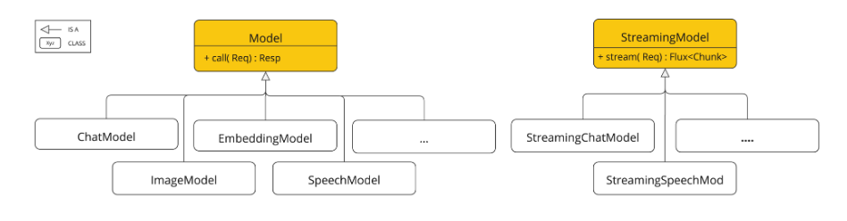
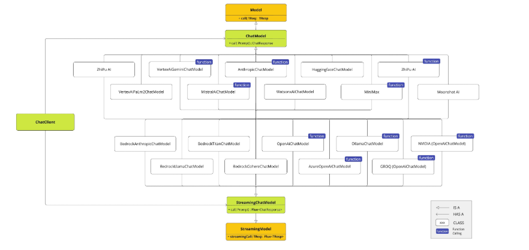

#### Spring AI模型

* 支持`Model API`跨 AI 提供商的`Chat`、`Text to Image`、`Audio Transcription`、`Text to Speech`和`Embedding`模型。同时支持 API`synchronous`和`stream`选项。还支持下拉访问特定模型的功能。

  

* 支持来自 OpenAI、微软、亚马逊、谷歌、Amazon Bedrock、Hugging Face 等公司的 AI 模型。

  

* [ChatModel](https://github.com/spring-projects/spring-ai/blob/main/spring-ai-model/src/main/java/org/springframework/ai/chat/model/ChatModel.java)接口的定义

  ```java
  public interface ChatModel extends Model<Prompt, ChatResponse>, StreamingChatModel {
      default @Nullable String call(String message) {
          Prompt prompt = new Prompt(new UserMessage(message));
          Generation generation = this.call(prompt).getResult();
          return generation != null ? generation.getOutput().getText() : "";
      }
  
      default @Nullable String call(Message... messages) {
          Prompt prompt = new Prompt(Arrays.asList(messages));
          Generation generation = this.call(prompt).getResult();
          return generation != null ? generation.getOutput().getText() : "";
      }
  
      ChatResponse call(Prompt var1);
  
      default ChatOptions getDefaultOptions() {
          return ChatOptions.builder().build();
      }
  
      default Flux<ChatResponse> stream(Prompt prompt) {
          throw new UnsupportedOperationException("streaming is not supported");
      }
  }
  ```

  

* 流输出聊天模型**`StreamingChatModel`**：用于流式（逐Token返回）的聊天完成请求，基于Reactive的`Flux` API实现。

  ```java
  @FunctionalInterface
  public interface StreamingChatModel extends StreamingModel<Prompt, ChatResponse> {
      default Flux<String> stream(String message) {
          Prompt prompt = new Prompt(message);
          return this.stream(prompt).map((response) -> {
              return (String)Optional.ofNullable(response.getResult()).map(Generation::getOutput).map(AbstractMessage::getText).orElse("");
          });
      }
  
      default Flux<String> stream(Message... messages) {
          Prompt prompt = new Prompt(Arrays.asList(messages));
          return this.stream(prompt).map((response) -> {
              return (String)Optional.ofNullable(response.getResult()).map(Generation::getOutput).map(AbstractMessage::getText).orElse("");
          });
      }
  
      Flux<ChatResponse> stream(Prompt var1);
  }
  ```

  

* Spring对接的AI:https://docs.spring.io/spring-ai/reference/api/chat/deepseek-chat.html

* Call方法放回参数

  * `String content()`返回响应的字符串内容
  * `ChatResponse chatResponse()`返回`ChatResponse`包含多个世代的对象，以及有关响应的元数据，例如用于创建响应的令牌数量。
  * `ChatClientResponse chatClientResponse()`返回一个`ChatClientResponse`包含`ChatResponse`对象和 ChatClient 执行上下文的对象，使您可以访问顾问执行期间使用的其他数据（例如在 RAG 流程中检索的相关文档）。
  * `entity()`返回 Java 类型
    - `entity(ParameterizedTypeReference<T> type)`用于返回`Collection`实体类型的集合。
    - `entity(Class<T> type)`用于返回特定实体类型。
    - `entity(StructuredOutputConverter<T> structuredOutputConverter)``StructuredOutputConverter`：用于指定要将 a 转换`String`为实体类型的实例。
  * `responseEntity()`同时返回`ChatResponse`Java 类型。当您需要在一次调用中访问完整的 AI 模型响应（包含元数据和生成过程）以及结构化的输出实体时，此功能非常有用。
    - `responseEntity(Class<T> type)`用于返回`ResponseEntity`包含完整`ChatResponse`对象和特定实体类型的对象。
    - `responseEntity(ParameterizedTypeReference<T> type)`用于返回`ResponseEntity`包含完整`ChatResponse`对象和`Collection`实体类型的数组。
    - `responseEntity(StructuredOutputConverter<T> structuredOutputConverter)`：用于返回`ResponseEntity`包含完整`ChatResponse`对象和使用指定方法转换的实体的数组`StructuredOutputConverter`。

  

* Stream返回值

  * `Flux<String> content()`返回`Flux`AI 模型生成的字符串。
  * `Flux<ChatResponse> chatResponse()`返回对象`Flux`的一个`ChatResponse`数组，其中包含有关响应的附加元数据。
  * `Flux<ChatClientResponse> chatClientResponse()`返回包含对象和 ChatClient 执行上下文的对象`Flux`，使您可以访问顾问执行期间使用的其他数据（例如在 RAG 流程中检索的相关文档）。`ChatClientResponse``ChatResponse`

  

  

  

  


#### ChatClient

* `ChatClient`是通过`ChatClient.Builder`对象创建的。您可以获取`ChatClient.Builder`任何Spring Boot [ChatModel](https://docs.spring.io/spring-ai/reference/api/chatmodel.html)自动配置的自动配置实例，也可以通过编程方式创建一个。

* **`ChatModel` 是核心的、低层次的SPI（服务提供接口），直接与AI模型进行通信；而 `ChatClient` 是构建在其之上的、面向开发者的更高层次、更易用的API门面**。
  * **`ChatModel`**：
    - **底层接口**：它直接定义了如何调用AI模型（如OpenAI、Gemini等），处理请求的序列化、网络传输、响应解析等底层细节。
    - **标准化契约**：所有具体模型的实现（如`OpenAiChatModel`、`OllamaChatModel`）都实现这个接口，确保上层代码可以统一调用。
    - **细粒度控制**：你需要自己构造`Prompt`（包含`Message`列表和`ChatOptions`），直接调用`call`或`stream`方法。
  * **`ChatClient`**：
    - **高层门面**：它封装了`ChatModel`，提供一种更符合人类直觉的、流畅的（fluent）API来构建聊天请求。
    - **用户友好**：隐藏了`Prompt`、`Message`等构造细节，让你能以“设置用户消息→设置系统消息→设置参数→调用”的链式风格编写代码。
    - **多种变体**：通常提供同步、流式（`Flux`）、以及响应式（`Mono`）的变体，方便在不同编程模型中使用。
  
* 创建

  * `ChatClient`是通过`ChatClient.Builder`对象创建的。可以获取`ChatClient.Builder`任何Spring Boot [ChatModel](https://docs.spring.io/spring-ai/reference/api/chatmodel.html)自动配置的自动配置实例，也可以通过编程方式创建一个。

  * 在最简单的使用场景中，Spring AI 提供 Spring Boot 自动配置功能，它会创建一个原型`ChatClient.Builder`bean 注入到类中。

    ```java
    @RestController
    class MyController {
    
        private final ChatClient chatClient;
    
        public MyController(ChatClient.Builder chatClientBuilder) {
            this.chatClient = chatClientBuilder.build();
        }
    
        @GetMapping("/ai")
        String generation(String userInput) {
            return this.chatClient.prompt()
                .user(userInput)
                .call()
                .content();
        }
    }
    ```

    


* 在以下几种情况下，可能需要在单个应用程序中使用多个聊天模型：

  - 针对不同类型的任务使用不同的模型（例如，对于复杂的推理任务使用功能强大的模型，对于更简单的任务使用速度更快、成本更低的模型）。
  - 当某个模型服务不可用时，实施备用机制
  - A/B 测试不同的模型或配置
  - 根据用户的喜好，为其提供多种型号选择。
  - 结合专用模型（一个用于代码生成，另一个用于创意内容生成等）

  * 默认情况下，Spring AI 会自动配置单个`ChatClient.Builder`bean。但是，应用程序可能需要使用多个聊天模型。以下是处理这种情况的方法：

  在任何情况下，都需要`ChatClient.Builder`通过设置属性来禁用自动配置`spring.ai.chat.client.enabled=false`。

  这样就可以`ChatClient`手动创建多个实例。

* 多个AI模型

  ```java
  import org.springframework.ai.chat.ChatClient;
  import org.springframework.context.annotation.Bean;
  import org.springframework.context.annotation.Configuration;
  
  @Configuration
  public class ChatClientConfig {
  
      @Bean
      public ChatClient openAiChatClient(OpenAiChatModel chatModel) {
          return ChatClient.create(chatModel);
      }
  
      @Bean
      public ChatClient anthropicChatClient(AnthropicChatModel chatModel) {
          return ChatClient.create(chatModel);
      }
  }
  ```

  

* AI模型返回的响应是一个由类型定义的复杂结构`ChatResponse`。它包含响应生成方式的元数据，并且可以包含多个响应（称为“[代](https://docs.spring.io/spring-ai/reference/api/chatmodel.html#Generation)”），每个响应都有自己的元数据。元数据包括用于创建响应的词元数量（每个词元大约是单词的四分之三）。此信息至关重要，因为托管AI模型按每次请求使用的词元数量收费。

  ```java
  ChatResponse chatResponse = chatClient.prompt()
      .user("Tell me a joke")
      .call()
      .chatResponse();
  ```

* 返回一个由返回值映射而来的实体类`String`。该`entity()`方法提供了此功能。ActorFilms是一个实体类。

  ```java
  ActorFilms actorFilms = chatClient.prompt()
      .user("Generate the filmography for a random actor.")
      .call()
      .entity(ActorFilms.class);
  ```

  
