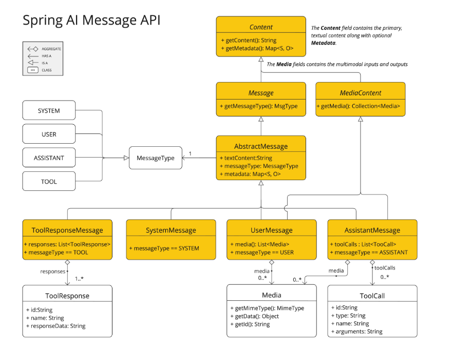
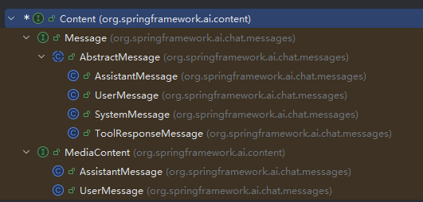
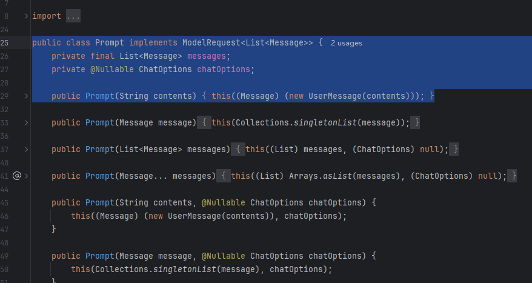

#### Spring AI之Message和Prompt

* 在 Spring AI 中，与 AI 模型的交互是通过`Prompt`和`Message`来完成的。

  - **Prompt (提示词)**：是发送给 AI 模型的整个输入对象。你可以把它看作是一个**容器**，它内部包含了：

    - 一个有序的`Message`对象列表。
    - 可选的请求级别配置（`ChatOptions`），如温度参数、最大Token数等。

  - **Message (消息)**：是构成 Prompt 的基本单元。每一个`Message`都代表了对话中的一句话或一段信息，并被赋予一个特定的**角色**（Role）。通过组合不同角色的 Message，可以构建出复杂的、上下文相关的对话。

    ```json
    {
      "model": "gpt-3.5-turbo",
      "messages": [
        {
          "role": "system",
          "content": "你是一个专业的编程助手，你的名字是 CodeBuddy。"
        },
        {
          "role": "user",
          "content": "请用Java写一个快速排序算法。"
        }
      ],
      "temperature": 0.7,
      "max_tokens": 500
    }
    ```

    

* 所有消息都实现自`Message`接口

  * 下面是Spring AI官网的架构图，最上层是Content

    

  * 黄色的是继承关系，下面是idea中继承关系图

    

  * 左边可以看到四种实现的Message,即在`MessageType`枚举定义了消息在对话中的角色

    | 角色         | MessageType 枚举 | 说明                                                         |
    | :----------- | :--------------- | :----------------------------------------------------------- |
    | **系统角色** | `SYSTEM`         | 用于设定 AI 的行为、身份和回答风格。它就像是给 AI 的**顶层指令**，在整个对话开始前设置上下文和规则。 |
    | **用户角色** | `USER`           | 代表**用户**的输入，即向 AI 提出的问题、发出的指令或陈述。这是最基础、最常见的消息类型。 |
    | **助理角色** | `ASSISTANT`      | 代表 **AI 模型** 的回复。在多轮对话中，将之前的 Assistant 消息传回给模型，能帮助模型保持对话的连贯性。该角色也可能包含请求调用工具（Function Calling）的信息。 |
    | **工具角色** | `TOOL`           | 当 AI 模型请求调用一个工具（如查询天气、计算数学题）时，该角色用于**返回工具执行的结果**给模型。 |

  * MediaContent是多模态的消息类型


#### Prompt

* 我们通过报文发现，Prompt=message数组加上一些模型配置参数

  

  * **`ModelRequest` 接口**：这是 Spring AI 中定义的一个更高级的抽象，代表一个“对 AI 模型的请求”。它的核心作用是封装发送给模型的数据以及控制模型行为的参数。

  * **泛型 `List<Message>`**：指明了这个请求的**请求体类型**是一个 `Message` 的列表。也就是说，`Prompt` 将一组有序的 `Message` 对象作为主要的输入数据提供给模型。

  *  `List<Message> messages` —— 消息列表

    - 这是一个有序的列表，包含了构成整个对话的多个 `Message` 对象。
    - 列表的顺序至关重要：模型会按照这个顺序来理解对话的上下文。
    - 每个 `Message` 都有自己的角色（`MessageType`）和内容，例如一个系统消息后跟一个用户消息。

  * `ChatOptions chatOptions` —— 请求选项

    - 这是一个可选的对象，用于控制模型生成行为的具体参数。

    - `ChatOptions` 是一个接口，不同的模型提供商有自己的实现（如 `OpenAiChatOptions`、`OllamaOptions`）。

    - 常见选项包括：

      - `temperature`：控制生成结果的随机性（0~2）。
      - `maxTokens`：限制生成的最大令牌数。
      - `topP`：核采样参数。
      - `model`：指定使用的具体模型名称（有时在 `ChatModel` 层面配置，也可以在 `Prompt` 级别覆盖）。

    - 这里不同的模型厂商也会有自己的实现在start
    
      

* 可以通过多种方式创建 `Prompt` 实例，最常见的是通过 `PromptTemplate` 或直接构造。

  * 直接构造

    ```java
    // 创建单个消息的 Prompt
    Message userMessage = new UserMessage("你好，今天怎么样？");
    Prompt prompt1 = new Prompt(userMessage); // 单个消息会被自动包装成列表
    
    // 创建包含多个消息的 Prompt（例如包含历史对话）
    Message systemMessage = new SystemMessage("你是一个友好的助手。");
    Message userMessage2 = new UserMessage("你能做什么？");
    Prompt prompt2 = new Prompt(List.of(systemMessage, userMessage2));
    
    // 同时指定请求选项
    ChatOptions options = ChatOptions.builder().withTemperature(0.5).build();
    Prompt prompt3 = new Prompt(List.of(systemMessage, userMessage2), options);
    ```


  * 通过 `PromptTemplate` 构建,`PromptTemplate` 提供了方便的模板渲染功能，最终也是返回 `Prompt` 对象。

    ```java
    PromptTemplate template = new PromptTemplate("给我讲一个关于 {topic} 的笑话。");
    Prompt prompt = template.create(Map.of("topic", "程序员"));
    // 也可以附加选项
    Prompt promptWithOptions = template.create(Map.of("topic", "程序员"), options);
    ```

    

  * 通过 `SystemPromptTemplate` 等专用模板，这些专用模板本质上也是生成 `Message`，然后组合成 `Prompt`。本身是PromptTemplate继承

    ```java
    SystemPromptTemplate systemTemplate = new SystemPromptTemplate("你的名字是 {name}。");
    Message systemMsg = systemTemplate.createMessage(Map.of("name", "小艾"));
    Prompt prompt = new Prompt(List.of(systemMsg, new UserMessage("你是谁？")));
    ```

    

  

  

* PromptTemplate和Prompt区别

  * 概念与职责对比

    | 维度                 | `PromptTemplate`                                | `Prompt`                                                     |
    | :------------------- | :---------------------------------------------- | :----------------------------------------------------------- |
    | **角色**             | **构建器/工厂**：负责根据模板和变量生成提示内容 | **数据容器**：封装最终发送给模型的完整请求                   |
    | **核心职责**         | 模板渲染、创建 `Message` 或 `Prompt` 对象       | 携带 `Message` 列表和 `ChatOptions`，作为 `ChatModel` 的输入 |
    | **是否包含动态逻辑** | 是，通过模板变量和渲染引擎实现动态化            | 否，一旦创建，其内容就是静态的（但变量已被渲染）             |
    | **生命周期**         | 在构建 `Prompt` 之前使用                        | 从构建完成到被 `ChatModel` 调用期间使用                      |

  * 原理层面的区别

    - **`Prompt` 的原理本质**：`Prompt` 实现了 `ModelRequest<List<Message>>` 接口，本质是一个 POJO（普通 Java 对象），持有：
      - `List<Message> messages`：有序的消息列表，是对话的核心。
      - `ChatOptions chatOptions`：控制模型行为的参数（如温度、最大令牌数等）。

    - **不变性**：`Prompt` 对象一旦创建，其内容通常不再改变（虽然技术上可以修改，但最佳实践是将其视为不可变对象）。

    - **与模型无关**：它不关心具体如何调用模型，只是将数据传递给 `ChatModel`，由后者根据具体实现转换成对应的 API 请求。

  *  `PromptTemplate` 的原理

    - **模板引擎集成**：`PromptTemplate` 内部持有一个 `TemplateRenderer`（默认是 `StTemplateRenderer`，基于 [StringTemplate](https://www.stringtemplate.org/) 引擎）。它负责将模板字符串中的占位符（如 `{name}`）替换为实际值。
      - **多层次输出接口**：`PromptTemplate` 实现了三个接口，分别对应不同的产出粒度：
        - `PromptTemplateStringActions`：产出纯字符串（`render()` 方法）。
        - `PromptTemplateMessageActions`：产出 `Message` 对象（`createMessage()` 方法）。
        - `PromptTemplateActions`：产出 `Prompt` 对象（`create()` 方法）。

    - **延迟渲染**：模板的渲染通常发生在调用 `create()` 或 `render()` 方法时，此时传入变量 Map，动态生成最终内容。

  * 实现层面的区别

    ```java
    public class Prompt implements ModelRequest<List<Message>> {
        private final List<Message> messages;      // 不可变列表
        private ChatOptions chatOptions;            // 可选配置
    
        public Prompt(List<Message> messages) {
            this.messages = List.copyOf(messages);  // 防御性复制
        }
    
        public Prompt(List<Message> messages, ChatOptions chatOptions) {
            this(messages);
            this.chatOptions = chatOptions;
        }
    
        // 其他构造方法（如单个 Message 的便捷构造）
    
        @Override
        public List<Message> getInstructions() {
            return this.messages;
        }
    
        @Override
        public ChatOptions getOptions() {
            return this.chatOptions;
        }
    }
    ```

    - 内部使用不可变列表保证安全性。

    - 实现了 `ModelRequest` 接口的 `getInstructions()` 和 `getOptions()` 方法，供 `ChatModel` 读取数据。

    ```java
    public class PromptTemplate implements PromptTemplateActions, 
                                           PromptTemplateMessageActions, 
                                           PromptTemplateStringActions {
    
        private final String template;
        private final TemplateRenderer renderer;
    
        // 默认构造函数使用默认渲染器
        public PromptTemplate(String template) {
            this(template, new StTemplateRenderer());
        }
    
        // 允许自定义渲染器
        public PromptTemplate(String template, TemplateRenderer renderer) {
            this.template = template;
            this.renderer = renderer;
        }
    
        // 来自 PromptTemplateStringActions
        @Override
        public String render() {
            return render(Collections.emptyMap());
        }
    
        @Override
        public String render(Map<String, Object> model) {
            return this.renderer.apply(this.template, model);
        }
    
        // 来自 PromptTemplateMessageActions
        @Override
        public Message createMessage() {
            return createMessage(Collections.emptyMap());
        }
    
        @Override
        public Message createMessage(Map<String, Object> model) {
            String content = render(model);
            // 默认创建用户消息，子类可覆盖（如 SystemPromptTemplate）
            return new UserMessage(content);
        }
    
        // 来自 PromptTemplateActions
        @Override
        public Prompt create() {
            return create(Collections.emptyMap());
        }
    
        @Override
        public Prompt create(Map<String, Object> model) {
            Message message = createMessage(model);
            return new Prompt(message);
        }
    
        @Override
        public Prompt create(Map<String, Object> model, ChatOptions modelOptions) {
            Message message = createMessage(model);
            return new Prompt(List.of(message), modelOptions);
        }
    
        // 其他重载方法...
    }
    ```

    - **模板存储**：持有原始模板字符串。

    - **渲染委托**：所有产出最终都依赖 `renderer.apply()` 完成字符串替换。

    - **灵活性**：通过 `createMessage()` 可生成单条消息，再通过 `Prompt` 构造器包装成最终 `Prompt`；也可直接 `create()` 返回 `Prompt`。

    - **可扩展性**：`SystemPromptTemplate` 继承自 `PromptTemplate`，仅重写 `createMessage()` 返回 `SystemMessage`，实现角色专用模板。

  * 典型使用场景对比

    * 使用 `PromptTemplate` 构建动态 Prompt

      ```java
      // 场景：需要根据用户输入动态生成提示词
      String template = "请用{language}写一个{function}函数。";
      PromptTemplate promptTemplate = new PromptTemplate(template);
      
      // 渲染并创建 Prompt
      Prompt prompt = promptTemplate.create(
          Map.of("language", "Java", "function", "快速排序")
      );
      
      // 调用模型
      ChatResponse response = chatModel.call(prompt);
      ```

    * 直接使用 `Prompt` 组装已有 Message

      ```java
      // 场景：从数据库加载历史对话记录，已有 Message 对象列表
      List<Message> historyMessages = loadHistoryFromDB(); // 包含 SystemMessage, UserMessage 等
      Message currentUserMessage = new UserMessage("继续刚才的话题");
      
      List<Message> allMessages = new ArrayList<>();
      allMessages.addAll(historyMessages);
      allMessages.add(currentUserMessage);
      
      // 直接构建 Prompt，无需模板
      Prompt prompt = new Prompt(allMessages, ChatOptions.builder().withTemperature(0.8).build());
      ```

    * 混合使用

      ```java
      // 场景：历史消息固定，但当前提问需要动态生成
      SystemPromptTemplate systemTemplate = new SystemPromptTemplate("你是{name}，用{style}风格回答。");
      Message systemMessage = systemTemplate.createMessage(Map.of("name", "小智", "style", "简洁"));
      
      Message userMessage = new UserMessage("今天天气如何？");  // 也可以从模板创建
      
      Prompt prompt = new Prompt(List.of(systemMessage, userMessage));
      ```

      

  * 总结
    * **`Prompt`** 是 **“数据”**，代表一次模型调用的完整请求，包含消息列表和选项。它是静态的，一旦创建内容即固定。
    * **`PromptTemplate`** 是 **“工具”**，用于动态构建 `Prompt`。它通过模板引擎将变量渲染到模板中，并提供了从字符串到 `Message` 再到 `Prompt` 的多种创建方式。
    * **设计思想**：`PromptTemplate` 体现了 **“分离关注点”**——将提示词的静态结构（模板）与动态数据（变量）分离，让代码更简洁、可维护。而 `Prompt` 作为统一输入格式，屏蔽了底层模型的差异。