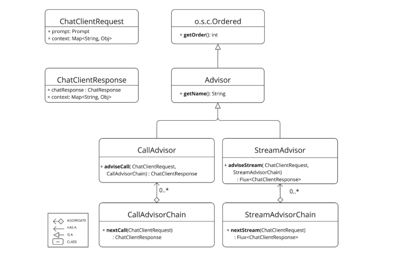
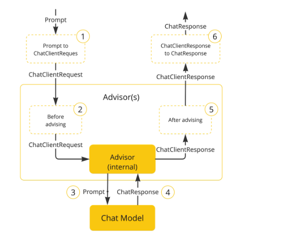

#### Spring AI之Advisor

* Spring AI的Advisors API为AI交互提供了一个**拦截器（Interceptor）风格的编程模型**，它允许你在请求发送给大语言模型（LLM）之前，以及从LLM获得响应之后，插入自定义的处理逻辑。这类似于Spring Web中的过滤器或拦截器，但专门为AI应用场景设计。
* 作用：使用用户文本调用 AI 模型时，常见的做法是向提示信息添加或扩充上下文数据。
  - **公司的数据**：这是人工智能模型未曾训练过的数据。即使模型见过类似的数据，附加的上下文数据在生成响应时也会优先考虑。
  - **对话历史记录**：聊天模型的 API 是无状态的。如果您告诉 AI 模型您的姓名，它不会在后续交互中记住它。每次请求都必须发送对话历史记录，以确保在生成响应时考虑之前的交互。
  - 日志记录

* Advisors 加到链中的顺序至关重要，因为它决定了它们的执行顺序。每个Advisors 都会以某种方式修改提示或上下文，而一个Advisors 所做的更改会传递给链中的下一个顾问。

  ```java
  ChatClient.builder(chatModel)
      .build()
      .prompt()
      .advisors(
          MessageChatMemoryAdvisor.builder(chatMemory).build(),
          QuestionAnswerAdvisor.builder(vectorStore).build()
      )
      .user(userText)
      .call()
      .content();
  ```

  

* 该 API 包括用于非流式场景的 CallAdvisor`Prompt` 和`ChatCompletion`，以及用于流式场景的 `Prompt` 和 `ChatCompletion`。它还包括用于表示未密封提示请求的 `Prompt` 和用于表示聊天完成响应的 `ChatCompletion`。两者都持有一个 ` State` 以在顾问链中共享状态。

  * `CallAdvisorChain``StreamAdvisor``StreamAdvisorChain``ChatClientRequest``ChatClientResponse``advise-context`和`adviseCall()`是`adviseStream()`关键的顾问方法，通常执行诸如检查未密封的提示数据、自定义和增强提示数据、调用顾问链中的下一个实体、可选地阻止请求、检查聊天完成响应以及抛出异常以指示处理错误等操作。

    

    

  * Spring AI 框架根据`ChatClientRequest`用户创建了一个对象`Prompt`以及一个空的顾问`context`对象。

  * 链中的每个顾问都会处理请求，并可能对其进行修改。或者，它也可以选择阻止该请求，即不调用下一个实体。在后一种情况下，顾问负责填写响应。

  * 由框架提供的最终顾问将请求发送给`Chat Model`。

  * 聊天模型的响应随后通过顾问链传递回去并转换为`ChatClientResponse`。之后会包含共享的顾问`context`实例。

  * 每个顾问都可以处理或修改回复。

  * 最终结果`ChatClientResponse`通过提取返回给客户端`ChatCompletion`。


* 主要的 Advisor 接口位于该软件包中`org.springframework.ai.chat.client.advisor.api`

  ```java
  public interface Advisor extends Ordered {
  
  	String getName();
  
  }
  ```

  

* 同步型和响应式顾问的两个子接口是：

  ```JAVA
  public interface CallAdvisor extends Advisor {
  
  	ChatClientResponse adviseCall(
  		ChatClientRequest chatClientRequest, CallAdvisorChain callAdvisorChain);
  
  }
  public interface StreamAdvisor extends Advisor {
  
  	Flux<ChatClientResponse> adviseStream(
  		ChatClientRequest chatClientRequest, StreamAdvisorChain streamAdvisorChain);
  
  }
  ```

* 一般都是实现Call或者Stream接口

  ```java
  public ChatClientResponse adviseCall(ChatClientRequest request, CallAdvisorChain chain) {
      log.info("请求前");               // 请求阶段
      ChatClientResponse response = chain.nextCall(request); // 调用下一个（或大模型）
      log.info("响应后");               // 响应阶段
      return response;
  }
  ```

* 也可以使用BaseAdvisor，内部帮处理了

  ```java
  public interface BaseAdvisor extends CallAdvisor, StreamAdvisor {
      
      // 留给开发者实现的钩子
      ChatClientRequest before(ChatClientRequest request, AdvisorChain chain);
      ChatClientResponse after(ChatClientResponse response, AdvisorChain chain);
  
      // CallAdvisor 的默认实现
      @Override
      default ChatClientResponse adviseCall(ChatClientRequest request, CallAdvisorChain chain) {
          ChatClientRequest processedRequest = before(request, chain);
          ChatClientResponse response = chain.nextCall(processedRequest);
          return after(response, chain);
      }
  
      // StreamAdvisor 的默认实现
      @Override
      default Flux<ChatClientResponse> adviseStream(ChatClientRequest request, StreamAdvisorChain chain) {
          ChatClientRequest processedRequest = before(request, chain);
          Flux<ChatClientResponse> responses = chain.nextStream(processedRequest);
          // 这里会聚合流，使 after 拿到完整响应
          return ChatClientMessageAggregator.aggregate(responses, 
              fullResponse -> after(fullResponse, chain));
      }
  }
  ```

  