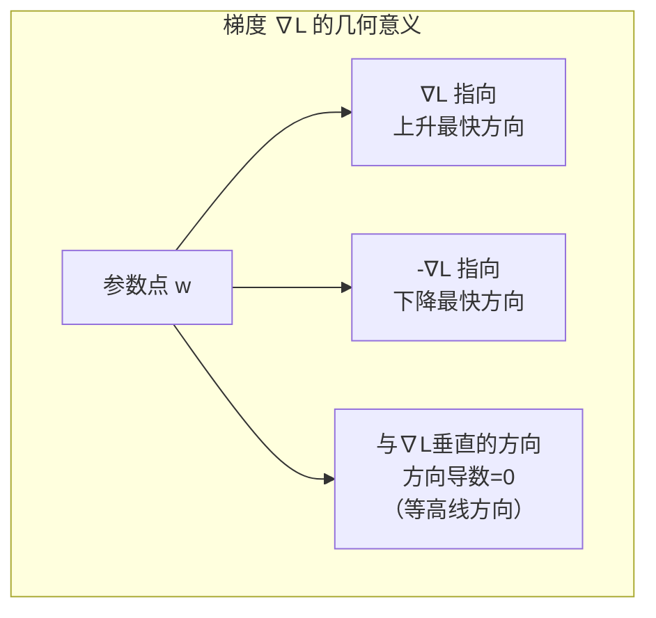

### 二、优化与激活——让网络真正学起来

**第一章我们搭好了骨架，但骨架不会自己走路。**

* 第一章的核心成就是一条完整的因果链：从 $y = wx + b$ 出发，到能识别猫的深度网络。前向传播算出了预测值，损失函数量出了差距，反向传播算出了所有参数的梯度——网络"知道怎么改进自己"了。

* 但知道方向，和走到目的地，中间还隔着很大一段距离。第一章的梯度下降用的是最基本的公式 $w \leftarrow w - \eta \nabla L$——步长固定、方向只看当前梯度、没有任何历史记忆。这就像一个人蒙着眼在百万维的高山上行走，每步只能感受脚下的坡度，看不到全局地形。他会不会困在山谷里？会不会在一块平地上原地踏步？脚下的坡度信号真的可靠吗？

* 此外，第一章用 ReLU 解决了"线性堆叠无效"的问题，并简要提到了 Sigmoid 和 Tanh。但没有回答：ReLU 之后呢？Transformer 凭什么选了 GELU？不同激活函数在数学特性上的差异，会如何影响一个网络的实际表现？

* 这一章要做的，就是把"训练"这件事从"能训练"推进到"训练得好"。具体来说，解决四个问题：

1. 梯度到底指向哪里？为什么它恰好是"最快"的方向？（2.1 节）
2. 百万维参数空间里，到底有没有那么多"山谷"困住我们？（2.2 节）
3. 有了梯度方向，怎么迈步才最高效？（2.3—2.4 节）
4. 激活函数除了 ReLU，还有什么选择？各自在什么场景下最优？（2.5 节）

* 最后，我们把视角拉到高处，看一看神经网络损失函数的真实地形——为什么有时训练得好好的，换个初始值就完全不一样了？（2.6 节）

---

#### 2.1 梯度：百万维空间中的指南针

* 第一章定义了梯度：所有偏导数排成的向量 $\nabla L = [\frac{\partial L}{\partial w_1}, \frac{\partial L}{\partial w_2}, \ldots]^\top$，并说梯度指向函数**上升最快**的方向，所以梯度下降沿反方向走。但为什么梯度恰好是"最快"的方向？这个结论不是定义，是需要证明的。

##### 方向导数：沿任意方向的变化率

* 先回到只有一个参数的场景。$L(w)$ 的导数 $\frac{dL}{dw}$ 告诉我们：当 $w$ 增加一个微小量时，$L$ 会变化多少。具体来说：

$$L(w + \Delta w) \approx L(w) + \frac{dL}{dw} \cdot \Delta w$$

* 但这个公式隐含了一个前提：我们只允许 $w$ 变化，变化的方向只有一个——沿数轴的正方向或负方向。当参数有 $n$ 个时，空间变为 $n$ 维，你可以沿**任意方向**迈步。问题自然浮现：**沿不同方向走，损失函数的变化速度一样吗？**

* 把一个特定的方向表示为单位向量 $\mathbf{u} = (u_1, u_2, \ldots, u_n)$，满足 $\|\mathbf{u}\| = 1$。沿 $\mathbf{u}$ 方向走一小步 $\epsilon$，参数从 $\mathbf{w}$ 变为 $\mathbf{w} + \epsilon \mathbf{u}$。**方向导数**定义为：

$$D_{\mathbf{u}} L(\mathbf{w}) = \lim_{\epsilon \to 0} \frac{L(\mathbf{w} + \epsilon \mathbf{u}) - L(\mathbf{w})}{\epsilon}$$

* 方向导数回答的是一个几何问题：站在 $\mathbf{w}$ 这个点上，面朝 $\mathbf{u}$ 方向，我脚下的坡度有多陡？如果 $D_{\mathbf{u}} L > 0$，说明沿 $\mathbf{u}$ 方向走 $L$ 会增大；如果 $D_{\mathbf{u}} L < 0$，沿 $\mathbf{u}$ 方向走 $L$ 会减小。

* 现在引入**全微分**。对于多元函数 $L(w_1, w_2, \ldots, w_n)$，当每个参数都发生微小变化 $\Delta w_i$ 时，$L$ 的总变化近似为各分量变化的加权和：

$$\Delta L \approx \frac{\partial L}{\partial w_1} \Delta w_1 + \frac{\partial L}{\partial w_2} \Delta w_2 + \cdots + \frac{\partial L}{\partial w_n} \Delta w_n$$

* 把 $\Delta w_i = \epsilon u_i$ 代入：

$$L(\mathbf{w} + \epsilon \mathbf{u}) - L(\mathbf{w}) \approx \epsilon \left( \frac{\partial L}{\partial w_1} u_1 + \frac{\partial L}{\partial w_2} u_2 + \cdots + \frac{\partial L}{\partial w_n} u_n \right)$$

* 两边除以 $\epsilon$ 取极限，括号中的表达式正是两个向量的**内积**：

$$D_{\mathbf{u}} L = \frac{\partial L}{\partial w_1} u_1 + \frac{\partial L}{\partial w_2} u_2 + \cdots + \frac{\partial L}{\partial w_n} u_n = \nabla L \cdot \mathbf{u}$$

* 这个结果极其重要：**任意方向的方向导数，就是梯度向量与该方向单位向量的内积。** 梯度 $\nabla L$ 不是为某个特定方向服务的——它一次性编码了函数在所有方向上的瞬时变化率。想知道沿 $\mathbf{u}$ 方向的变化率？拿 $\nabla L$ 和 $\mathbf{u}$​ 做一次内积就得到答案。

* 方向导数 = 梯度向量・方向单位向量；

  当 u 和梯度 ∇L **同向**时，内积最大，方向导数最大 → 损失上升最快（梯度上升）；

  当 u 和梯度 ∇L **反向**时，内积最小（最负），方向导数最小 → 损失下降最快（梯度下降）。

##### 为什么梯度指向"最快"方向？

* 内积有一个等价的几何定义：

$$\nabla L \cdot \mathbf{u} = \|\nabla L\| \cdot \|\mathbf{u}\| \cdot \cos\theta = \|\nabla L\| \cdot \cos\theta$$

* 其中 $\theta$ 是 $\nabla L$ 和 $\mathbf{u}$ 之间的夹角，$\|\mathbf{u}\| = 1$。

* 现在问题变成了：固定 $\|\nabla L\|$，选择哪个 $\mathbf{u}$ 能让 $\cos\theta$ 取最大值？

* $\cos\theta$ 的最大值是 1，当 $\theta = 0$——即 $\mathbf{u}$ 与 $\nabla L$ **完全同向**时取到。此时 $D_{\mathbf{u}} L = \|\nabla L\|$，方向导数为正且最大——这就是上升最快的方向。$\cos\theta$ 的最小值是 -1，当 $\theta = \pi$——即 $\mathbf{u}$ 与 $\nabla L$ **完全反向**时取到，此时 $D_{\mathbf{u}} L = -\|\nabla L\|$——这就是下降最快的方向。
* 一个直观的类比：想象一根木棍，一头钉在你脚下，另一头指向空中某个方向。这根木棍就是梯度 $\nabla L$——它指向最陡的上坡方向，长度等于那个方向的坡度。现在你想知道：如果朝另一个方向走（比如偏左 30°），坡度是多少？答案很简单——把木棍投影到你想走的那条线上。投影的长度，就是那个方向的坡度。如果你选的线和木棍完全重合，投影就是木棍本身的长度——坡度最大；如果你选的线和木棍垂直，投影长度为 0——那是平路，高度不变（等高线方向）；如果你背向木棍走（夹角 180°），投影是负的最大——最陡的下坡方向。所以，梯度自动成为最陡方向，不是巧合：任何其他方向都是它的"打折投影"，折扣由夹角的余弦决定。余弦最大是 1，此时夹角为 0——完全同向，投影不打折，当然最陡。




* 梯度下降选择 $-\nabla L$ 方向，不是任意的约定，而是**数学上唯一的最优选择**——在当前位置，没有任何其他方向能让损失函数下降得更快。这就是为什么它不是"一种优化方法"，而是"在只知道局部一阶信息的前提下，最速的优化方法"。

* 但"最速"这个词要谨慎理解。它是**局部**最优——只保证当前这一步在无穷小步长下最快（所以叫"最速下降法 / Steepest Descent"）。它不保证你走的方向能直达全局最小值，也不保证大步长时仍然最优。实际上，在峡谷地形中，最速下降方向往往指向峡谷的两壁而不是谷底出口，导致锯齿状震荡。

* 理解了梯度的几何本质之后，第一个问题随之而来：如果梯度在每个局部都指向下山最快方向，为什么神经网络训练中会"卡住"？

---

#### 2.2 局部最优：百万维中的假想敌

* 传统优化课程教给我们的第一个忧虑是：梯度下降可能陷入**局部最小值**——一个在山腰上的小坑，梯度为零，算法误以为到了谷底，停止不前。

```
  低维直觉（2D 损失曲面）
  
  L
  │  ╭──╮          ╭────╮
  │ ╱    ╲        ╱      ╲
  │╱      ╲      ╱        ╲
  │        ╲    ╱          ╲
  │         ╲  ╱    全局最小值
  │          ╲╱
  └────────────────────────── w
  
  局部最小值困住梯度下降？这是二维空间中的焦虑。
```

* 这个直觉完全正确——当参数空间是二维或三维时。但在百万维的空间中，情况发生了根本性的变化。

##### 临界点的数学分类

* 给定一个临界点 $\mathbf{w}^*$（此处 $\nabla L = \mathbf{0}$），它的性质由 **Hessian 矩阵** $H$ 决定——$H$ 是一个 $n \times n$ 的方阵，其中 $H_{ij} = \frac{\partial^2 L}{\partial w_i \partial w_j}$。

* 对 $H$ 做特征值分解，得到 $n$ 个特征值 $\lambda_1, \lambda_2, \ldots, \lambda_n$。每个特征值描述沿对应特征向量方向的**曲率**——$\lambda_i > 0$ 意味着沿该方向曲面向上弯曲（局部极小），$\lambda_i < 0$ 意味着向下弯曲（局部极大）。

| 条件 | 临界点类型 | 直觉 |
|------|-----------|------|
| 所有 $\lambda_i > 0$ | **局部极小值** | 所有方向都向上弯——你确实在一个坑底 |
| 所有 $\lambda_i < 0$ | **局部极大值** | 所有方向都向下弯——你在一个山顶 |
| 有正有负 | **鞍点** | 某些方向向上弯，某些方向向下弯 |
| 某些 $\lambda_i = 0$ | **退化临界点** | 某些方向曲率为零，无法用二阶信息判断 |

* 鞍点是关键。在鞍点处，梯度同样为零，但它不是局部极小——有一些方向是"下坡路"可以继续走。

##### 高维的真相：鞍点泛滥

* 现在追问一个核心问题：对于高维空间中的随机临界点，它是局部极小的概率有多大？

* 如果 Hessian 的特征值是独立随机分布的（简化假设——这是一个"思想实验"，足以说明问题的本质），每个特征值为正或为负的概率各约为 1/2。一个临界点要成为局部极小值，必须**所有 $n$ 个特征值全部为正**。如果每个特征值独立地以 $p$ 概率为正，那么：

$$P(\text{局部极小}) = p^n$$

* 当 $n$ 的数量级是百万时，$p^n$ 是一个无法用语言形容的微小数字。即使 $p = 0.99$（极其乐观），$0.99^{1{,}000{,}000} \approx 10^{-4365}$——基本等于零。

* 这意味着什么？在百万维空间中，**几乎所有梯度为零的点都是鞍点，而非局部极小值。** 你不是被困在了"坑"里——你是站在马鞍上，四面八方有些方向向上翘、有些方向向下斜。真正的困难不是"找不到下坡路"，而是**在成千上万个或平坦或上升的方向中，找到那条下降的方向**。

```
  高维真相（鞍点主导）
  
  二维鞍点（马鞍形状）              高维鞍点（百万维）
  
      ↑ 向上弯                       每个维度随机地
      │╲  ╱                          向上弯或向下弯
      │ ╲╱                            
      │  ╳ ← 鞍点                    P(所有维度都向上弯)
      │ ╱╲                           = (1/2)^1,000,000
      │╱  ╲                          ≈ 0
      └────────→ 向下弯
```

* 2014 年，Dauphin 等人（Bengio 团队，NIPS 2014）用统计物理的方法分析了这个问题：对于高维随机高斯场（一个理论模型），临界点的 Hessian 特征值分布趋近于 Wigner 半圆律——正负特征值各约占一半，纯局部极小值的比例随维度 $n$ 呈指数级衰减。鞍点才是高维损失曲面的"默认地貌"。需要说明：真实神经网络 Hessian 的特征值并不严格独立，上述简化和随机矩阵理论模型都是"思想实验"级别的直觉引导，而非严格定理——但它们指出的方向是正确的。

##### 那么真正阻碍训练的是什么？

* 如果局部极小不是问题，那为什么训练深度网络在 2010 年代之前那么困难？

* 答案是**鞍点 + 平坦区域（plateau）的组合**。在鞍点附近，某些方向的梯度分量非常接近于零——不是严格的零，但小到以浮点精度来看几乎不动。在没有动量、没有自适应学习率的朴素 SGD 下，参数在这些方向上每一步只移动极其微小的距离，宏观表现就是"卡住了"。

* 此外，随机初始化后的网络，其损失值通常落在高原区域（而非峡谷）。在这个区域，大部分方向的曲率都很低，梯度信号微弱且各向同性——所有方向看起来都差不多。SGD 需要大量的迭代才能"跌入"一个有意义的峡谷。

* 随机梯度下降（SGD）的噪声在这里反而是好事。每次只用一个 mini-batch 计算梯度，梯度估计本身就含有方差。这个噪声让参数在平坦区域中随机游走，增大了"碰巧滑入一个下坡峡谷"的概率。全批量梯度下降反而是最容易被鞍点困住的。

* SGD 的噪声在逃离鞍点和平坦区域上的作用，在 2.6 节还会以另一种方式再次出现——噪声不只帮我们"脱困"，还会引导参数走向泛化更好的区域。

> 在百万维空间中，"困在局部极小"是假想敌。真正的敌人是鞍点和平坦区域——以及没有动量、没有自适应步长来应对它们的朴素优化算法。

---

#### 2.3 优化算法演进史：每一步都在解决前一步的痛

* 第一章介绍了最基本的梯度下降：$\mathbf{w} \leftarrow \mathbf{w} - \eta \nabla L$。这个公式有一个隐含假设——当前位置的梯度是完美的方向指引，步长 $\eta$ 对所有参数一视同仁。在实践中，这两个假设都不成立。优化算法的演进史，就是逐步打破这两个假设的历史。

**朴素 SGD —— 基准线**

* 第一章已详述了梯度下降的三种变体：批量 GD（全数据集算梯度）、SGD（单样本算梯度）、Mini-batch GD（小批量算梯度）。这里简述要点后直接进入改进算法的推演。

* Mini-batch SGD 是目前的标准做法：每次从训练集中随机抽取 $B$ 个样本，计算它们的平均梯度然后更新参数。这样既有计算效率（比全批量快），又有梯度估计的稳定性（比单样本稳）。batch size $B$ 通常取 32、64、128 或 256。后面提到"SGD"时，指的都是 Mini-batch SGD。

* 朴素 SGD 有两个明显的痛处：

  - **峡谷震荡**：在狭长的峡谷地形中，梯度指向的不是谷底出口，而是近乎垂直于峡谷方向的两壁。每一步都跨过谷底，下一步又跨回来，在峡谷两侧反复震荡，沿谷底方向的前进速度极慢。
  - **各向同性的步长**：$\eta$ 对所有参数都一样。但不同层的权重、不同神经元的偏置，它们的梯度量级可能差几个数量级。用一个全局 $\eta$ 去适配所有参数，就像要求姚明和郭敬明穿同一尺码的鞋。

```
  峡谷震荡示意
  
  等高线（俯视图）
  ┌─────────────────────┐
  │  ╲                   │
  │   ╲   ←谷底方向       │
  │    ╲                 │
  │  ╱  ╲  ╱  ╲  ╱      │  ← SGD 路径：反复横跳
  │ ╱    ╲╱    ╲╱       │    沿谷底走得很慢
  │╱                    │
  │ 起点                 │
  └─────────────────────┘
```

##### Momentum：给梯度加惯性

* 物理直觉：把优化想象成推一个球下山。朴素 SGD 每一步都从静止开始推——只看当前坡度，没有速度记忆。一个真实的球则不同——它在滚下山的过程中会**积累动量**。如果连续几步的梯度方向都大致相同，球会越滚越快。如果遇到一个局部的小凸起，球的惯性可能帮它冲过去。

* **动量**（Momentum）将这种物理直觉翻译成数学。引入一个速度变量 $\mathbf{v}$，每一步不直接用梯度更新参数，而是用速度：

$$\mathbf{v}_t = \beta \mathbf{v}_{t-1} + \eta \nabla L_t$$
$$\mathbf{w}_{t+1} = \mathbf{w}_t - \mathbf{v}_t$$

* $\beta \in [0, 1)$ 控制"惯性"的大小。$\beta = 0$ 时退化为朴素 SGD；$\beta = 0.9$（常用默认值）时，当前速度的 90% 来自历史累积、10% 来自当前梯度。

* **注意**：这里动量采用 $v_t = \beta v_{t-1} + \eta \nabla L_t$ 的参数化（Polyak 重球法形式），$\eta$ 与 $\beta$ 解耦。第一章的动量使用 $v_t = \beta v_{t-1} + (1-\beta)\nabla L_t$（指数移动平均形式，Sutskever 等人的写法），更新为 $w \leftarrow w - \eta v_t$。两种都是文献中的标准写法，但相同 $\eta$ 值下有效缩放因子不同——第一章的梯度有效缩放为 $\eta(1-\beta)$，本章为 $\eta$。阅读或实现时需注意区分。

* 在峡谷地形中，动量的优势立即显现：垂直于谷底方向的梯度分量在每一步都改变符号（左壁→右壁→左壁），在速度累积中互相抵消。沿谷底方向的梯度分量则始终指向同一侧，速度越来越大。结果是：横向震荡被抑制，纵向进展被加速。

* 将速度展开，可以看出动量实际上是梯度的**指数加权移动平均**：

$$\mathbf{v}_t = \eta \sum_{k=1}^{t} \beta^{t-k} \nabla L_k$$

* 越近的梯度权重越大，越远的梯度指数衰减。$\beta$ 越大，考虑的历史越久远；$\beta$ 越小，越倾向于"活在当下"。

##### Nesterov Accelerated Gradient：先看前方，再迈步

* 动量有一个潜在的问题：球滚到谷底附近时，速度仍然很大——它可能因为惯性冲过头，越过谷底，然后花很多步来回调整。能不能在迈步之前先"看一眼"前方的情况？

* **Nesterov 加速梯度**（NAG）的想法简单而精巧：不计算当前位置 $\mathbf{w}_t$ 的梯度，而是计算**预估的下一个位置** $\mathbf{w}_t - \beta \mathbf{v}_{t-1}$ 上的梯度：

$$\mathbf{v}_t = \beta \mathbf{v}_{t-1} + \eta \nabla L(\mathbf{w}_t - \beta \mathbf{v}_{t-1})$$
$$\mathbf{w}_{t+1} = \mathbf{w}_t - \mathbf{v}_t$$

* 如果前方的坡度在减小（接近谷底），Nesterov 提前感知到并自动减速。如果前方的坡度还在增大（还在下坡），它加大油门。相比于标准动量，Nesterov 提供了一个"纠正项"——在速度可能带来过大位移时提前刹车。在凸优化理论中，Nesterov 被证明拥有最优的收敛速度：对于光滑凸函数，Nesterov 加速梯度法达到 $O(1/k^2)$ 的收敛率，而标准动量法为 $O(1/k)$（$k$ 为迭代步数）——这意味着达到相同精度所需的迭代步数，Nesterov 法大约是动量法的平方根量级。

##### AdaGrad：不同参数，不同待遇

* 动量解决了"方向震荡"的问题，但没有解决"步长统一"的问题。**AdaGrad**（Adaptive Gradient）是第一次尝试为每个参数独立调整学习率。

* 核心思想：记录每个参数的历史梯度平方和。变化频繁的参数（梯度方差大），说明它已经在一个区域内来回震荡了很久，应该减小步长。变化稀少的参数（梯度一直很弱），说明它可能处于平坦区域，应该加大步长。

$$G_{t,i} = \sum_{k=1}^{t} (\nabla L_{k,i})^2$$
$$w_{t+1,i} = w_{t,i} - \frac{\eta}{\sqrt{G_{t,i} + \epsilon}} \cdot \nabla L_{t,i}$$

* $G_{t,i}$ 是第 $i$ 个参数从训练开始到当前步的所有梯度平方的总和。它**单调递增**——每一步都加上一个非负的平方项，$G_{t,i}$ 只会变大不会变小。分母 $\sqrt{G_{t,i}}$ 随之单调增大，这意味着**每个参数的有效学习率只能减小，永远不会恢复**。

* 这带来了 AdaGrad 的致命缺陷：如果训练初期某个参数遭遇了大量的大梯度（这在随机初始化后很常见），它的 $G$ 会迅速膨胀，有效学习率早早就衰减到接近于零——这个参数之后几乎不再更新，无论后续任务还需要它怎样调整。对于需要长时间训练的深度网络，AdaGrad 在"过早停止学习"这个问题上是致命的。

##### RMSprop：用指数平均修复 AdaGrad

* **RMSprop**（Root Mean Square Propagation）的修改简单而有效：不用总和，用**指数移动平均**（EMA）来累积梯度平方。指数移动平均赋予近期梯度更大的权重，远期梯度的贡献指数衰减——这就防止了 $G$ 的单调无限增大。

$$G_t = \beta G_{t-1} + (1 - \beta) (\nabla L_t)^2$$
$$w_{t+1} = w_t - \frac{\eta}{\sqrt{G_t + \epsilon}} \cdot \nabla L_t$$

* 这里的 $G_t$ 不再是一直增长的总和，而是"最近一段时间的梯度平方的平滑估计"。如果参数从活跃期进入平稳期，旧的梯度信息会逐渐"过期"被遗忘，有效学习率会自然回升。

* $\beta$ 通常取 0.9 或 0.99，控制平滑窗口的长度。$\beta = 0.9$ 意味着当前的 $G_t$ 大约由最近 10 步的梯度主导（$1/(1-\beta) \approx 10$）。

* RMSprop 在实践中工作得远比 AdaGrad 好，但它只解决了"自适应学习率"这一半问题——方向上的震荡仍然需要动量来抑制。

##### Adam：把两个好想法合在一起

* **Adam**（Adaptive Moment Estimation）是动量 + 自适应学习率的集大成者。它同时维护两个指数移动平均：

  - $m_t$：梯度的**一阶矩**（均值）——把握方向，作用等价于动量
  - $v_t$：梯度的**二阶矩**（未中心化方差）——调节每个参数的步长，作用等价于 RMSprop

$$m_t = \beta_1 m_{t-1} + (1 - \beta_1) \nabla L_t$$
$$v_t = \beta_2 v_{t-1} + (1 - \beta_2) (\nabla L_t)^2$$

* 初看这个公式，有一个细微的问题：在训练的第一步（$t = 1$），$m_0 = \mathbf{0}$，$v_0 = \mathbf{0}$，因此 $m_1 = (1 - \beta_1) \nabla L_1$，$v_1 = (1 - \beta_2)(\nabla L_1)^2$。如果 $\beta_1 = 0.9$，$m_1$ 只有真实梯度的 1/10——第一步就走偏了。

* 这个偏差在初期特别明显，但随着 $t$ 增大，$\beta^t \to 0$，偏差自然消失。Adam 显式地做了**偏差校正**：

$$\hat{m}_t = \frac{m_t}{1 - \beta_1^t}, \quad \hat{v}_t = \frac{v_t}{1 - \beta_2^t}$$

* 最终的参数更新：

$$\mathbf{w}_{t+1} = \mathbf{w}_t - \eta \cdot \frac{\hat{m}_t}{\sqrt{\hat{v}_t} + \epsilon}$$

* 标准超参数：$\beta_1 = 0.9$（一阶矩的衰减率），$\beta_2 = 0.999$（二阶矩的衰减率），$\epsilon = 10^{-8}$（数值稳定），$\eta = 0.001$（学习率，虽然 Adam 自适应，但全局学习率仍然影响整体尺度）。

* 分子 $\hat{m}_t$ 提供平滑的方向信号（抑制震荡），分母 $\sqrt{\hat{v}_t}$ 为每个参数独立缩放步长（频繁变化的参数用小步，安静变化的参数用大步）。Adam 几乎不需要手动调参就能在大多数任务上稳定工作。

##### AdamW：权重衰减的正确姿势

* 在讨论 AdamW 之前，需要澄清一个历史遗留的概念混淆：**L2 正则化 $\neq$ 权重衰减**。

* L2 正则化在损失函数中加一项 $\frac{\lambda}{2} \sum w_i^2$，梯度中因此多出一个 $\lambda w_i$ 的项。对于朴素 SGD，这个 $\lambda w_i$ 直接和 $-\eta \lambda w_i$ 的更新绑定——等价于每次更新前先把权重缩小一点（乘以 $1 - \eta\lambda$），这就是"权重衰减"名称的由来。

* 但在 Adam 中，梯度中的 $\lambda w$ 项进入了 $m_t$ 和 $v_t$ 的指数移动平均，它不再等价于直接衰减权重。具体来说，L2 正则化在 Adam 中的实际效果取决于 $\hat{v}_t$ 的大小——不同参数的衰减幅度不同，而且会受到梯度历史的影响。你设了 $\lambda = 0.01$，并不等价于每个参数每步都衰减 $1 - \eta \cdot 0.01$。

* **AdamW** 的修改极其简洁：把权重衰减从梯度计算中拿出来，直接作用于参数本身：

$$\mathbf{w}_{t+1} = \mathbf{w}_t - \eta \left( \frac{\hat{m}_t}{\sqrt{\hat{v}_t} + \epsilon} + \lambda \mathbf{w}_t \right)$$

* 或者更直观的两步写法——先在当前权重上做衰减，再做 Adam 更新（注意顺序：**衰减在前，梯度更新在后**，与一步写法等价）：

$$\mathbf{w}_t' = (1 - \eta\lambda) \mathbf{w}_t$$
$$\mathbf{w}_{t+1} = \mathbf{w}_t' - \eta \cdot \frac{\hat{m}_t}{\sqrt{\hat{v}_t} + \epsilon}$$

* 这个修改看似微小，实际效果显著。AdamW 解耦了"学习率适配"和"正则化强度"——$\lambda$ 只管正则化，$\eta$ 只管学习。在 CNN 和 Transformer 的训练中，AdamW 通常是默认选择。

##### 各优化器的对比

| 优化器 | 核心改进 | 关键参数 | 主要弱点 |
|--------|---------|---------|---------|
| SGD | 基础梯度下降 | $\eta$ | 峡谷震荡、步长统一 |
| Momentum | 速度惯性 | $\eta, \beta$ | 可能冲过头 |
| Nesterov | 前瞻梯度 | $\eta, \beta$ | 计算两次梯度 |
| AdaGrad | 参数独立学习率 | $\eta$ | 学习率单调衰减至零 |
| RMSprop | EMA 梯度平方 | $\eta, \beta$ | 没有动量 |
| Adam | 动量 + 自适应 | $\eta, \beta_1, \beta_2$ | 泛化可能不如 SGD |
| AdamW | 解耦权重衰减 | $\eta, \beta_1, \beta_2, \lambda$ | 多一个超参数 |

**选型建议**：
  - **CNN 图像分类/检测**：SGD + Momentum（$0.9$）是经过大量验证的经典选择，泛化往往略优于 Adam
  - **Transformer / NLP**：Adam / AdamW 几乎是唯一选择。Transformer 对优化器敏感，SGD 通常效果不佳
  - **GAN / 生成模型**：Adam 是主流，$\beta_1$ 可能调低到 0.5 以增加梯度信号的灵活性
  - **快速原型 / 不确定时**：AdamW 作为默认，因为它几乎不需要调参就能稳定工作

---

#### 2.4 学习率调度：步长的艺术

* 2.3 节的所有优化器都还有一个共同的超参数：$\eta$——全局学习率。即使 Adam 为每个参数独立缩放步长，$\eta$ 仍然控制着整体更新的幅度。那么 $\eta$ 在整个训练过程中应该保持不变吗？

* 直觉上不应该。训练初期，网络参数是随机的，函数曲面在你脚下可能很陡——太大步会发散。训练中后期，你接近了一个不错的区域，需要精细调整——太大步可能跳出去。但随着训练的推进，参数越来越接近"好区域"，对方向的判断也越来越可靠——这时你反而希望步子大一些来加速收敛。

* 这个"先小后大再小"的矛盾节奏，不能靠一个固定 $\eta$ 解决。学习率需要在训练过程中**动态变化**——这就是学习率调度。

##### 阶梯衰减与指数衰减

* 最朴素的调度策略：每隔 $T$ 个 epoch，把学习率乘以一个衰减因子 $\gamma < 1$（比如 0.1）。

$$\eta_t = \eta_0 \cdot \gamma^{\lfloor t / T \rfloor}$$

* 阶梯衰减的长处是简单，短处是"阶梯"本身——学习率在衰减的那一步突然跳跃式下降，而训练过程中并没有任何信号告诉你"这个时刻恰好是该衰减的时机"。衰减过早，错过了进一步降低损失的机会；衰减过晚，在已经收敛的区域浪费了太多步。

* **指数衰减**把阶梯换成了连续：$\eta_t = \eta_0 \cdot \gamma^t$。每个 epoch 都衰减，没有突变。但衰减速度完全由 $\gamma$ 决定——如果开始时定错了速度，整个训练过程的学习率就一直走在错误的轨迹上。

##### 余弦退火：平滑的周期重启

* **余弦退火**（Cosine Annealing）是目前最广泛使用的调度策略之一。它让学习率沿一个余弦曲线平滑下降：

$$\eta_t = \eta_{\min} + \frac{\eta_0 - \eta_{\min}}{2} \left(1 + \cos\left(\frac{\pi t}{T}\right)\right)$$

* $t = 0$ 时 $\cos(0) = 1$，$\eta_0$ 取最大值；$t = T$ 时 $\cos(\pi) = -1$，$\eta_t$ 平滑降到最小值 $\eta_{\min}$。整个衰减过程没有突变，且初期衰减缓慢（在高学习率区域停留更久）、后期也衰减缓慢（在低学习率区域精细搜索）。

* 余弦退火的一个重要变体是**带重启的余弦退火**（Cosine Annealing with Warm Restarts）：训练到 $t = T$ 后，学习率不是停在 $\eta_{\min}$，而是直接跳回 $\eta_0$ 重新开始一个余弦周期。这个"重启"有两个好处：
  - 参数可能在上一轮周期结束时陷入了一个不够好的局部区域，突然提高的学习率给参数一个"冲击"，帮它跳出
  - 多次重启后，取每次周期末端的模型做**快照集成**（Snapshot Ensembling）——多个局部极小值的平均，泛化更好

##### Warmup：先慢后快

* 2.3 节的末尾提到 Adam 的偏差校正——$m_t$ 和 $v_t$ 在最初几步是不准确的。但这只是 warmup 被需要的次要原因。更根本的原因是：

* 训练开始时，网络权重是随机的。损失曲面在随机初始化点的局部结构非常不规则——某些方向的曲率极高，某些方向极平。用大学习率迈第一步，可能直接跳到数值不稳定区域（损失变成 NaN）。但如果学习率本身就会被调度到很小（比如余弦退火的末期），那前面小心翼翼的几十步又可能会浪费。

* **Warmup** 的策略是：训练的最初 $T_{\text{warmup}}$ 步，学习率从接近零的值线性（或指数）增长到目标值 $\eta_0$。之后才进入正式的学习率调度（如余弦退火）。

$$\eta_t = \eta_0 \cdot \frac{t}{T_{\text{warmup}}}, \quad t < T_{\text{warmup}}$$

* Warmup 在 Transformer 训练中是**必需品**而非可选项。原始 Transformer 论文中，warmup 步数为 4000——没有这个阶段，训练直接发散。原因是 Transformer 的 Layer Normalization 和残差连接在初始化时产生了极大的梯度方差，需要小学习率让归一化层的参数先稳定下来。

* 与 warmup 配合的另一项防发散技术是**梯度裁剪**（Gradient Clipping）——当梯度的模长超过阈值时，按比例缩回阈值以内，防止单步过大跳入数值不稳定区域。在 RNN 和 Transformer 训练中，梯度裁剪与 warmup 常常同时使用。

##### 学习率与 Batch Size 的缩放关系

* Batch size 增大，每次梯度估计的方差减小——你有了更准确的梯度，理论上可以用更大的步子。具体应该大多少？

* **线性缩放法则**（Goyal et al., 2017）：batch size 增大 $k$ 倍，学习率也应该增大约 $k$ 倍。直觉是：在 $k$ 次小批量更新中，SGD 累积走了约 $-k\eta \nabla L$ 的距离。一次大批量更新要走同样的距离，学习率就该设为 $k\eta$。

* 但这是有上限的。当学习率过大时，梯度的线性近似（$L(w - \eta\nabla L) \approx L(w) - \eta\|\nabla L\|^2$）不再成立，更新会跳到损失曲面上一个与当前位置毫无关系的区域——此时 batch size 多大都救不回来。

---

#### 2.5 激活函数全景：不止有 ReLU

* 2.3 和 2.4 节解决了"方向怎么走、步子迈多大"的问题——它们属于优化算法的设计。但优化成功的另一个前置条件，是优化器每一步收到的梯度信号本身的质量。激活函数的选择直接决定了梯度的平滑程度、饱和区间和数值范围——这些因素深刻影响着优化器在每一步能获得多可靠的方向指引。比如，ReLU 的硬截断产生不连续的梯度，GELU 的平滑概率门控则给出处处可导的信号——两者对 Adam 或 SGD 的行为影响截然不同。

* 第一章第 2 节详细推导了为什么需要激活函数（线性 + 线性 = 线性，堆叠无效），并重点介绍了 ReLU 及其在万能逼近定理中的角色。这里不再重复那条因果链，而是回答一个第一章留下的问题：**除了 ReLU，还有什么选择？它们各自在哪个体现场景下最优？**

##### Sigmoid：曾经的王者

* Sigmoid 函数定义为：

$$\sigma(z) = \frac{1}{1 + e^{-z}}$$

* 在 1980 年代到 2000 年代，Sigmoid 是神经网络激活函数的默认选择。原因不难理解：它的输出在 $(0, 1)$ 之间，天然可以被解释为概率或"激活强度"的归一化值。它连续、光滑、单调递增——在数学上无可挑剔。从生物学角度看，Sigmoid 是对真实神经元放电频率-输入电流关系的粗略模仿（真实神经元的响应曲线也是 S 形的）。

* 但第一章（第 6 节）已经展示了 Sigmoid 的致命缺陷——**饱和导致梯度消失**。这里补充一个当时略过的角度：输出非零中心的问题。

* Sigmoid 的输出全部是正数。这意味着对于下一层来说，**同一个神经元**的所有输入 $a_i$ 都是正的。那么该神经元所有权重的梯度 $\frac{\partial L}{\partial w_i} = \frac{\partial L}{\partial z} \cdot a_i$ 的**符号完全由 $\frac{\partial L}{\partial z}$ 决定**——同一个神经元的所有 $w_i$ 的梯度要么同时为正，要么同时为负。注意：这个约束只作用于同一个神经元内部；不同神经元的 $\frac{\partial L}{\partial z}$ 各不相同，它们的梯度符号可以不同。网络整体仍然可以表达丰富的更新方向——但每个神经元内部的优化路径是锯齿形的，每次只能沿象限对角线方向调整，而不能沿最优方向直线前进。Tanh 通过将输出中心化为零，部分修复了这个问题。

##### Tanh：零中心的改进

* Tanh 可以理解为 Sigmoid 的"拉伸 + 平移"版：

$$\tanh(z) = \frac{e^z - e^{-z}}{e^z + e^{-z}} = 2\sigma(2z) - 1$$

* 输出范围变为 $(-1, 1)$，均值约等于 0——梯度不再被迫同号更新。但饱和问题依旧：$|z| > 4$ 时输出趋于 $\pm 1$，导数 $\tanh'(z) = 1 - \tanh^2(z)$ 趋于 0。

* RNN 和 LSTM 内部至今仍普遍使用 Tanh（配合各种门控的 Sigmoid），因为在循环结构中，有界的激活值可以防止隐藏状态在时间展开步数多时无限膨胀。但在前馈网络的隐藏层中，Tanh 已经被 ReLU 取代。

##### ReLU 家族简述

* 第一章已详述 ReLU 的定义、导数特性、以及它如何通过导数恒为 1（正区间）来解决梯度消失。这里只做简要回顾并补充 Leaky ReLU 和 PReLU：

$$\text{ReLU}(z) = \max(0, z), \quad \text{ReLU}'(z) = \begin{cases} 1, & z > 0 \\ 0, & z \leq 0 \end{cases}$$

* **死亡神经元**是 ReLU 的代价：如果某个神经元对所有训练样本的输入 $z$ 都 $\leq 0$，它的输出和梯度都恒为零，权重永不再更新。一旦死了就无法复活。

* **Leaky ReLU** 给负区间一个微小斜率 $\alpha$（比如 0.01），让死亡神经元仍有微小的梯度可以慢慢调整回来：

$$\text{LeakyReLU}(z) = \max(\alpha z, z)$$

* **PReLU**（Parametric ReLU）将 $\alpha$ 变成一个可学习的参数——每个通道学出自己的斜率。代价是多了参数，但在大规模数据集上有时能带来微小提升。

##### ELU 与 SELU：平滑的负区间

* Leaky ReLU 在 $z = 0$ 处有一个折角——函数连续但不可导（严格说 ReLU 家族在 $z = 0$ 处都没有定义良好的导数，实践中用次梯度 0 或 1 代替）。这个折角是否影响优化？在某些情况下会——折角处的"梯度跳跃"可能造成优化路径的不稳定性。

* **ELU**（Exponential Linear Unit）用指数衰减替代了负区间的硬截断或线性延续：

$$\text{ELU}(z) = \begin{cases} z, & z > 0 \\ \alpha (e^z - 1), & z \leq 0 \end{cases}$$

* 三个关键特性：
  - 在 $z = 0$ 处**也可导**（$\alpha = 1$ 时一阶导数连续），没有 ReLU 的折角
  - 负区间输出趋近于 $-\alpha$（而非 0），使得输出的均值更接近零——**加速收敛**，因为下一层的输入是零中心的
  - 负区间仍然需要指数运算，计算量比 ReLU 大一个量级

* **SELU**（Scaled ELU）更进一步——用特定的 $\alpha \approx 1.6733$ 和缩放因子 $\lambda \approx 1.0507$，证明了在特定条件下，SELU 网络具有**自归一化**性质：经过足够多层后，激活值的均值和方差会自动收敛到 0 和 1。这意味着不需要 Batch Normalization——网络自己维持了数值稳定性。

$$\text{SELU}(z) = \lambda \begin{cases} z, & z > 0 \\ \alpha (e^z - 1), & z \leq 0 \end{cases}$$

* 但自归一化的前提条件很严格（需要 LeCun 正态初始化、全连接网络、输入标准化），在实践中 CNN 和 Transformer 很少直接依赖它。

##### GELU：Transformer 时代的新标配

* **GELU**（Gaussian Error Linear Unit）是目前最重要、但第一章完全没展开的激活函数。它被 BERT、GPT-2、GPT-3 以及后续几乎所有主流 Transformer 模型采用。

$$\text{GELU}(z) = z \cdot \Phi(z) = z \cdot \frac{1}{2}\left[1 + \text{erf}\left(\frac{z}{\sqrt{2}}\right)\right]$$

* $\Phi(z)$ 是标准正态分布的累积分布函数（CDF）——$P(Z \leq z)$，其中 $Z \sim \mathcal{N}(0, 1)$。

* 这个公式在做什么？**用概率决定要不要激活。** ReLU 的规则是"$z > 0$ 就原样通过，$z \leq 0$ 就一刀截断"。GELU 的规则是"$z$ 越大，通过的概率越接近 1；$z$ 越小，通过的概率越接近 0；$z$ 在零附近时，通过的概率在 50% 左右"。本质是对 ReLU 做了一个**概率性的平滑版本**——输入乘以"这个输入值在随机波动中被保留的期望概率"。

```
  GELU vs ReLU
  
  输出
   │    ╱╱  GELU（平滑，负区有微小的非零输出）
   │   ╱╱
   │  ╱╱    ReLU（硬截断）
   │ ╱╱
   │╱╱
   └────────── 输入
    ╱╱
   ╱
```

* GELU 在全负区间并非零输出——对于 $z = -1$，$\Phi(-1) \approx 0.159$，GELU 输出约 $-0.159$。负区间的微小输出意味着**梯度不会完全截断**（类似 Leaky ReLU 的动机，但更平滑）。

* 实践中不用准确的 $\text{erf}$ 实现，而是用以下近似（速度更快）：

$$\text{GELU}(z) \approx 0.5z\left(1 + \tanh\left(\sqrt{\frac{2}{\pi}}\left(z + 0.044715 z^3\right)\right)\right)$$

* 为什么 Transformer 选择 GELU 而不是 ReLU？目前没有严格的理论证明，但经验证据指向几个方向：GELU 的平滑性在小批次训练中提供了更稳定的梯度；GELU 在负区间的非零输出让注意力机制中的某些"抑制"信号可以更精细地表达（不只是 0 或正数）；以及——在 BERT 的消融实验中，GELU 确实比 ReLU 在下游任务上高 1-2 个点。

##### Swish / SiLU：自动搜索发现的最优解

* **Swish** 是 Google Brain 在 2017 年用自动架构搜索（NAS）发现的一个激活函数。它的形式出乎意料地简单：

$$\text{Swish}(z) = z \cdot \sigma(z) = \frac{z}{1 + e^{-z}}$$

* Swish 可以理解为 GELU 的"近亲"——GELU 用高斯 CDF 做门控，Swish 用 Sigmoid 做门控。两者都是"输入 $\times$ 门控概率"的模式，统称为**自门控**（Self-Gated）激活函数。

* Swish 有一个 GELU 没有的性质：当 $z$ 为绝对值较大的负数时，Swish 会轻微地"上扬"——它在负半轴有一个**非单调的凸起**（极小值在 $z \approx -1.28$ 处，约 $-0.28$）。这个非单调性在某些任务中可能让 Swish 具有更强的表达能力。

* SiLU（Sigmoid Linear Unit）是同一函数的另一个名字，PyTorch 中使用 `F.silu()`。两者等价。

##### 横向对比

| 激活函数 | 公式 | 值域 | 导数最大值 | 在 $z<0$ 的导数 | 计算开销 | 主力场景 |
|---------|------|------|-----------|----------------|---------|---------|
| Sigmoid | $1/(1+e^{-z})$ | $(0, 1)$ | 0.25 | $\to 0$（饱和） | 高（$\exp$） | 输出层二分类 |
| Tanh | $\frac{e^z-e^{-z}}{e^z+e^{-z}}$ | $(-1, 1)$ | 1 | $\to 0$（饱和） | 高（$\exp$） | RNN/LSTM 内部 |
| ReLU | $\max(0, z)$ | $[0, \infty)$ | 1 | $0$（硬截断） | 极低 | CNN 隐藏层 |
| Leaky ReLU | $\max(\alpha z, z)$ | $(-\infty, \infty)$ | 1 | $\alpha$（常数） | 极低 | CNN（替代 ReLU） |
| ELU | $z>0$: $z$, $z\leq0$: $\alpha(e^z-1)$ | $(-\alpha, \infty)$ | 1 | $\alpha e^z$（平滑） | 中（$\exp$ 负数） | 需要平滑时 |
| GELU | $z \cdot \Phi(z)$ | $(-0.17, \infty)$ | $\approx 1.13$ | 平滑非零 | 中（近似） | **Transformer** |
| Swish | $z \cdot \sigma(z)$ | $(-0.28, \infty)$ | $\approx 1.10$ | 非单调凸起 | 中（$\sigma$） | 高效 CNN |

##### 选型指南

* 这不是一份"绝对正确"的清单，而是从实践中总结的经验法则：

  - **CNN 隐藏层**：ReLU。除非你遇到了大量的死亡神经元（训练初期激活率 < 10%），换 Leaky ReLU 或 ELU
  - **Transformer / BERT / GPT 类模型**：GELU。不是因为它"更优"有理论保证，而是因为几乎所有预训练模型都用了它——用别的意味着你要重新和已知的有效配置对齐，调试成本高
  - **RNN / LSTM**：Tanh（隐藏状态更新）+ Sigmoid（门控）。这是 LSTM 原始设计的遗产，在实践中仍然是最稳健的选择
  - **输出层**：二分类用 Sigmoid，多分类用 Softmax（严格说是归一化而非激活函数），回归任务一般不使用激活函数（恒等输出）
  - **不确定时**：GELU 作为默认值在大多数场景下不会出大问题。但记住——激活函数的选择通常不如优化器、学习率调度和数据预处理的选择影响大。花时间调参数比换激活函数收益更高

---

#### 2.6 损失函数的地形：为什么优化并不容易

* 2.2 节从临界点的角度分析了高维空间的"地形"——鞍点而非局部极小才是主流。但那里默认地假设了损失函数是"典型"的随机函数。真正的神经网络损失函数有没有什么特殊结构，让优化天然困难——或者，有没有什么技术能重塑这个地形，让优化变得容易？

##### 神经网络损失的"坏地形"从何而来？

* 一个函数是凸的，意味着连接曲面上任意两点的线段完全在曲面上方——任何局部极小都是全局极小。凸优化是"容易"的：梯度下降从任意起点出发，保证收敛到全局最优。

* 神经网络的损失函数 $L(\mathbf{w})$ 显然不是凸的。这是由几个相互叠加的因素造成的：

1. **参数空间的对称性**：交换隐藏层中任意两个神经元的所有输入和输出权重，得到的函数和原来完全一样，但参数向量不同。这意味着损失曲面上存在大量**等价的局部极小值**——它们之间由对称变换连接。仅对称性就产生了至少 $m!$ 个等价极小值（$m$ 是每层神经元数），这是神经网络损失曲面非凸性的一个最基本的来源

2. **激活函数的非线性**：即使只有一层隐藏层，输出 $F(\mathbf{x}) = \sum v_i \sigma(\mathbf{w}_i^\top \mathbf{x} + b_i)$ 也是参数 $\mathbf{w}_i$ 和 $v_i$ 的非线性函数。非线性意味着损失函数的 Hessian 矩阵在不同区域可以有不同的符号配置——这是产生鞍点的直接原因

3. **多层复合**：每多加一层，输出就是前一层输出的非线性函数。多层复合使损失曲面产生了分形般复杂的地形——不同尺度上的起伏结构叠加在一起

##### 尖锐极小 vs 平坦极小

* 2017 年，Keskar 等人发现了一个引人注目的现象：用大批量（large batch）训练的模型倾向于收敛到**尖锐的极小值**（sharp minima），而小批量训练的模型倾向于收敛到**平坦的极小值**（flat minima）。前者在测试集上的泛化明显更差。

```
  尖锐极小值                      平坦极小值
  
  L                              L
  │  ╲    ╱                       │    ╱╲
  │   ╲  ╱                        │   ╱  ╲
  │    ╲╱                         │  ╱    ╲
  │    ╱╲   ← 参数微扰             │ ╱      ╲
  │   ╱  ╲     L急剧上升           │╱        ╲← 参数微扰L几乎不变
  └────────── w                   └────────────── w
```

* 直觉上很好理解：在尖锐极小值处，任何一个权重的微小波动（比如测试时输入分布的轻微偏移、量化产生的精度损失）都会导致损失剧烈上升。而在平坦极小值处，同样幅度的波动对损失的影响很小——模型对参数的变化不敏感，自然泛化更好。

* 小批量 SGD 的梯度噪声在这里起到了意想不到的正面作用：噪声足够大，参数无法"钻入"一个宽度小于噪声幅度的尖锐极小坑——它在到达那样的区域之前就被弹开了。大批量梯度估计更精确，参数可以被精确地推入一个狭窄的坑底。

##### 批归一化如何重塑地形

* 第一章第 6 节在讲梯度消失时提到了 ReLU 的角色，但未曾提及另一个显著改善训练稳定性的技术——**批归一化**（Batch Normalization，BN）。这里不展开 BN 的完整计算过程（将在第七章详述），只聚焦于它对损失函数地形的影响。

* BN 在每个 mini-batch 内，对每一层的激活值做标准化——减去均值、除以标准差，然后再做可学习的缩放和平移。标准化操作强制每一层的输出具有一致的尺度。

* 从地形角度看，BN 做了三件事：

  - **消除参数空间中的"狭长峡谷"**：未归一化的网络中，不同层的权重尺度可以差几个数量级，导致损失曲面在某些方向极度陡峭（梯度巨大、容易发散）、在另一些方向极度平坦（梯度微小、走不动）。BN 强制各层激活值在同一尺度上，使各方向的曲率趋于均等——峡谷被"抹平"了
  - **平滑了损失曲面**：Santurkar 等人（2018）在 CIFAR-10 上用 VGG 网络训练的实验显示，加 BN 后损失曲面的有效平滑度（effective $\beta$-smoothness）降低了约两个数量级——从 $10^4$ 量级下降到 $10^2$ 量级——曲面"平滑"了约两个数量级。同时，梯度的方向在不同 mini-batch 之间变得更一致（梯度预测性提升），使得用大学习率更新时不容易"一脚踩空"
  - **减少了初始化的敏感性**：没有 BN 时，初始权重的尺度直接影响前向信号的传播范围——太大则激活值饱和（梯度消失），太小则信号在前几层就衰减殆尽。BN 切断了初始化和激活值尺度之间的直接依赖

* 这三个地形成效的直接表现是：加了 BN 的网络可以用大得多的学习率训练（比如 0.1 而不是 0.001），且对学习率的选择不那么敏感。训练从"小心翼翼地在乱石中找路"变成了"在整理过的大路上行走"。

> 优化神经网络的难度，不在"找到下坡方向"——梯度总是能找到。难度在"下坡方向通往何方"——是尖锐的、泛化差的极小值，还是平坦的、泛化好的极小值。优化器、学习率调度、批归一化所做的，本质上都是在重塑损失曲面、引导训练走向更好的地形。它们不改变"存在性"（无论如何都存在通向全局最小的路径），但改变"可达性"（你能不能用有限步到达一个好的解）。

---

### 总结

* 这一章把"训练"从"能训练"推进到了"训练得好"。我们追溯了一条清晰的因果链：

1. **梯度的几何意义**（2.1）：方向导数公式 $D_{\mathbf{u}} L = \nabla L \cdot \mathbf{u} = \|\nabla L\| \cos\theta$ 证明——梯度是唯一的方向导数最大化方向。$-\nabla L$ 是在只知道一阶局部信息的前提下，数学上唯一的最速下降方向

2. **高维地形的真相**（2.2）：传统优化担心的"局部极小值"，在百万维参数空间中近乎不存在。鞍点——有些方向向上弯、有些方向向下弯的临界点——占据了几乎所有梯度为零的位置。真正阻碍训练的是鞍点 + 平坦区域的组合，而非"掉进坑里爬不出来"

3. **优化算法的演进**（2.3）：从朴素 SGD 到 AdamW，每一步都在解决前一步暴露的问题：
   - 峡谷震荡 → 动量（用历史梯度平滑方向）
   - 步长统一 → AdaGrad → RMSprop（每参数独立学习率）
   - 两者结合 → Adam（动量 + 自适应 + 偏差校正）
   - 权重衰减不等价 → AdamW（解耦衰减与自适应）

4. **学习率调度**（2.4）：固定学习率无法应对训练全过程的矛盾需求。Warmup 解决初期的数值不稳定，余弦退火提供平滑的衰减曲线。学习率与 batch size 之间的线性缩放关系让大规模分布式训练成为可能

5. **激活函数全景**（2.5）：ReLU 通过导数恒为 1 解决了梯度消失，但不同架构有不同需求。GELU 用概率性门控取代硬截断，成为 Transformer 的标配。Swish 发现了自门控函数的非单调性可能带来额外收益。选激活函数的黄金法则：CNN 用 ReLU，Transformer 用 GELU，RNN 用 Tanh，输出层看任务

6. **损失地形**（2.6）：神经网络的损失函数非凸性来自参数对称性 + 非线性激活 + 多层复合。平坦极小值泛化优于尖锐极小值——SGD 的噪声天然偏好平坦区域。批归一化重塑了损失曲面，是让大学习率训练成为可能的关键技术

* 第一章给了我们一个能算梯度、能更新参数的网络。这一章给了我们**一套让训练稳定、高效、泛化好的完整工具链**。有了它，全连接网络从"学术概念"变成了"工程上可用的模型"。

* 但在第一章第 3 节末尾我们留下了一个未解决的矛盾——全连接层的参数爆炸与空间盲。这个矛盾不会因为优化器更好就消失。30 亿个参数不会因为用了 AdamW 就自动缩水到 3 亿。我们需要一种**结构上就利用了图像先验知识**的新层次——卷积层。

* 此外，本章假设损失函数已经给定，只讨论了在这个给定曲面上怎么走。但损失函数本身的选型——为什么分类任务天然配对交叉熵、MSE 配分类为什么有问题——同样深度影响着优化结果和收敛速度。这将在下一章展开。

---

**本章实操速查**

| 场景 | 推荐方案 |
|------|---------|
| 默认优化器 | AdamW（几乎不需要调参就能稳定工作） |
| CNN 图像任务 | SGD + Momentum（0.9），泛化往往略优于 Adam |
| Transformer / NLP | Adam / AdamW，配合 Warmup + 梯度裁剪 |
| 默认激活函数 | CNN 隐藏层用 ReLU，Transformer 用 GELU，RNN 用 Tanh |
| 默认学习率调度 | 余弦退火 + Warmup（前 5-10% 步数） |
| 训练不稳定 | 检查是否需要 Warmup / 降低初始 η / 加梯度裁剪 / 换 GELU |
| 泛化不够好 | 换小 batch size / 尝试 SGD+Momentum 替换 Adam / 考虑标签平滑 |
