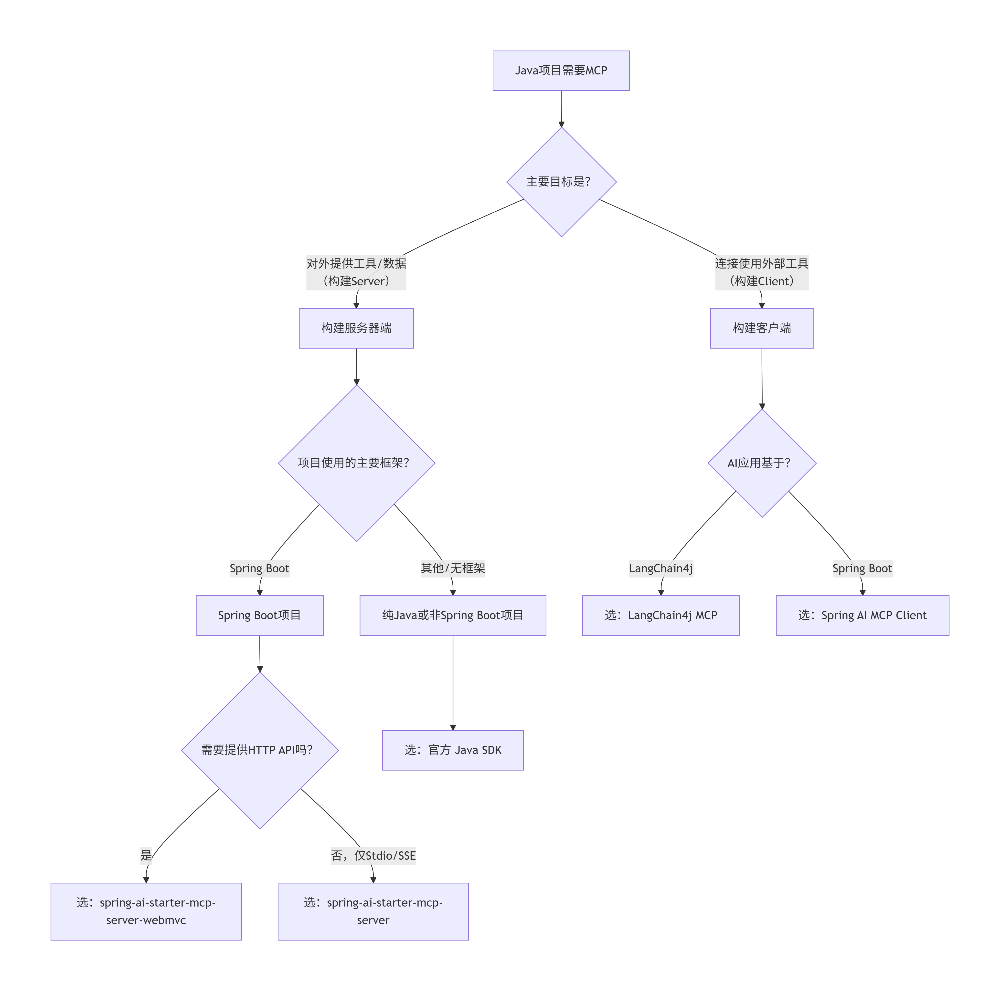
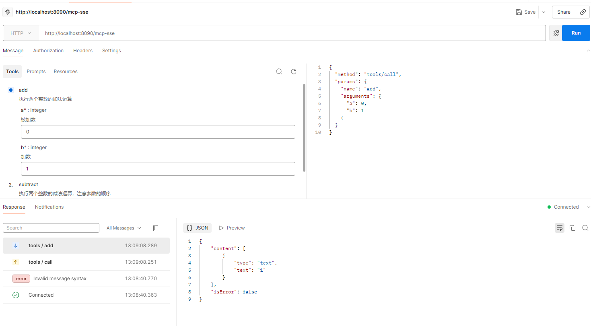
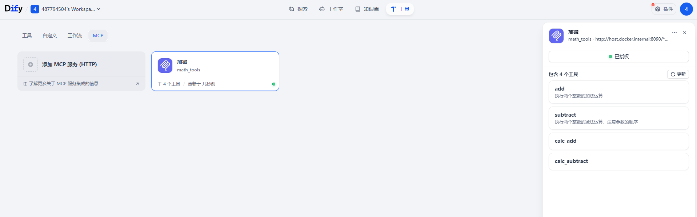

#### MCP介绍：JAVA开发MCP

* 什么是MCP：
  * MCP（模型上下文协议）是一种用于将 AI 应用程序连接到外部系统的开源标准。使用 MCP，Claude 或 ChatGPT 等 AI 应用程序可以连接到数据源（例如本地文件、数据库）、工具（例如搜索引擎、计算器）和工作流程（例如专门的提示），从而使它们能够访问关键信息并执行任务。可以将MCP视为人工智能应用的USB-C接口。正如USB-C提供了一种连接电子设备的标准化方式一样，MCP也提供了一种将人工智能应用连接到外部系统的标准化方式。

* MCP官网SDK

  * 网址: https://mcpcn.com/docs/sdk/java/mcp-overview/

  * MCP的Java版本：https://modelcontextprotocol.io/docs/getting-started/intro

  * 还有spring ai ，spring ai alibaba 都支持了MCP

  * langchain4j在集成
  * JAVA开发MCP有多种方式：自己实现都行

* 📊 Java MCP 生态方案汇总

  | 分类         | 方案名称                                   | 提供方           | 核心定位                        | 主要依赖/Starter                                             | 关键传输方式           | 核心特点与场景                                               |
  | :----------- | :----------------------------------------- | :--------------- | :------------------------------ | :----------------------------------------------------------- | :--------------------- | :----------------------------------------------------------- |
  | **服务器端** | **官方 Java SDK** (含 `mcp-spring-webmvc`) | MCP 官方         | **构建MCP服务器的底层库**       | `io.modelcontextprotocol.sdk:mcp`                            | STDIO, SSE             | 功能完整、控制精细，适用于**任何Java项目**，是非Spring或需深度定制场景的首选。 |
  | **服务器端** | **spring-ai-starter-mcp-server**           | Spring AI 项目   | **快速集成MCP核心**             | `org.springframework.ai:spring-ai-starter-mcp-server`        | STDIO, SSE             | Spring Boot **自动配置**，最快捷地为核心逻辑添加MCP能力（非HTTP）。 |
  | **服务器端** | **spring-ai-starter-mcp-server-webmvc**    | Spring AI 项目   | **构建HTTP MCP服务器**          | `org.springframework.ai:spring-ai-starter-mcp-server-webmvc` | **HTTP (WebMVC)**      | 在上一方案基础上，**自动提供HTTP API端点**，用于构建Web服务。 |
  | **客户端**   | **LangChain4j MCP**                        | LangChain4j 社区 | **连接并使用MCP服务器的客户端** | `dev.langchain4j:langchain4j-mcp`                            | HTTP, Stdio, WebSocket | 在**LangChain4j AI应用**（如智能体）中动态接入外部工具，是使用MCP服务的核心库。 |
  | **客户端**   | **Spring AI MCP Client**                   | Spring AI 项目   | **Spring生态的MCP客户端**       | `org.springframework.ai:spring-ai-mcp-client`                | HTTP, SSE, Stdio       | 为**Spring Boot应用**提供便捷的MCP客户端集成，与Spring容器无缝结合。 |

  ### 💡 如何选择：一张图看懂关系

  

* POM依赖

  ```xml
  核心 MCP 功能：
  
  <dependency>
      <groupId>io.modelcontextprotocol.sdk</groupId>
      <artifactId>mcp</artifactId>
  </dependency>
  
  对于 HTTP SSE 传输实现，添加以下依赖之一：
  
  <!-- 基于 Spring WebFlux 的 SSE 客户端和服务器传输 -->
  <dependency>
      <groupId>io.modelcontextprotocol.sdk</groupId>
      <artifactId>mcp-spring-webflux</artifactId>
  </dependency>
  
  <!-- 基于 Spring WebMVC 的 SSE 服务器传输 -->
  <dependency>
      <groupId>io.modelcontextprotocol.sdk</groupId>
      <artifactId>mcp-spring-webmvc</artifactId>
  </dependency>
  ```

  

* Spring AI本身也集成了这个

  ```xml
  		<dependency>
  			<groupId>org.springframework.ai</groupId>
  			<artifactId>spring-ai-starter-mcp-server</artifactId>
  		</dependency>
  		
  		<dependency>
  			<groupId>org.springframework.ai</groupId>
  			<artifactId>spring-ai-starter-mcp-server-webmvc</artifactId>
  		</dependency>
  ```

* 对比

  | 特性            | mcp-spring-webmvc | spring-ai-starter-mcp-server | spring-ai-starter-mcp-server-webmvc |
  | :-------------- | :---------------- | :--------------------------- | :---------------------------------- |
  | **提供方**      | MCP 官方          | Spring AI 项目               | Spring AI 项目                      |
  | **类型**        | 库                | Spring Boot Starter          | Spring Boot Starter                 |
  | **自动配置**    | ❌ 需要手动配置    | ✅ 自动配置                   | ✅ 自动配置                          |
  | **WebMVC 集成** | ✅ 基础集成        | ❌ 不包含 WebMVC              | ✅ 完整 WebMVC 集成                  |
  | **依赖管理**    | 需要手动管理依赖  | 自动管理版本                 | 自动管理版本                        |
  | **配置方式**    | 编程式配置        | 属性文件配置                 | 属性文件配置                        |
  | **端点注册**    | 手动注册          | 自动注册                     | 自动注册                            |
  | **使用场景**    | 需要更细粒度控制  | 快速集成 MCP 核心功能        | 完整的 WebMVC MCP 服务器            |


#### JAVA实现MCP

* 导入依赖

  ```xml
  	<dependencies>
  		<dependency>
  			<groupId>org.springframework.ai</groupId>
  			<artifactId>spring-ai-starter-mcp-server-webmvc</artifactId>
  		</dependency>
  
  		<dependency>
  			<groupId>org.springframework.boot</groupId>
  			<artifactId>spring-boot-starter-test</artifactId>
  			<scope>test</scope>
  		</dependency>
  	</dependencies>
  ```

* 创建工具类

  ```java
  package com.example.demo.util;
  
  import org.springframework.ai.tool.annotation.Tool;
  import org.springframework.ai.tool.annotation.ToolParam;
  import org.springframework.stereotype.Component;
  
  @Component
  public class TestUtils {
  
      /**
       * 加法运算
       * @param a 被加数
       * @param b 加数
       * @return 两数之和
       */
      @Tool(description = "执行两个整数的加法运算")
      public Integer add(@ToolParam(description = "被加数") Integer a, @ToolParam(description = "加数") Integer b) {
          return a + b;
      }
  
      /**
       * 减法运算
       * @param a 被减数
       * @param b 减数
       * @return 两数之差
       */
      @Tool(description = "执行两个整数的减法运算，注意参数的顺序")
      public Integer subtract(
              @ToolParam(description = "被减数", required = true) Integer a,
              @ToolParam(description = "减数", required = true) Integer b
      ) {
          return a - b;
      }
  
      /**
       * 乘法运算
       * @param a 被乘数
       * @param b 乘数
       * @return 两数之积
       */
      @Tool(description = "执行两个整数的乘法运算")
      public Integer multiply(
              @ToolParam(description = "被乘数") Integer a,
              @ToolParam(description = "乘数") Integer b
      ) {
          return a * b;
      }
  
      /**
       * 整数除法
       * @param a 被除数
       * @param b 除数（不能为0）
       * @return 两数的整数商
       */
      @Tool(description = "执行两个整数的整数除法，返回整数结果，除零会抛出异常")
      public Integer divide(
              @ToolParam(description = "被除数") Integer a,
              @ToolParam(description = "除数", required = true) Integer b
      ) {
          if (b == 0) {
              throw new ArithmeticException("除数不能为零");
          }
          return a / b;
      }
  
      /**
       * 精确除法（带小数位）
       * @param a 被除数
       * @param b 除数
       * @param scale 小数位数
       * @return 精确到指定小数位的结果
       */
      @Tool(description = "执行精确除法，可以指定结果的小数位数")
      public Double divideWithPrecision(
              @ToolParam(description = "被除数") Integer a,
              @ToolParam(description = "除数", required = true) Integer b,
              @ToolParam(description = "小数位数", required = true) Integer scale
      ) {
          if (b == 0) {
              throw new ArithmeticException("除数不能为零");
          }
          double result = (double) a / b;
          double factor = Math.pow(10, scale);
          return Math.round(result * factor) / factor;
      }
  
      /**
       * 取余运算
       * @param a 被除数
       * @param b 除数
       * @return 余数
       */
      @Tool(description = "计算两个整数相除的余数")
      public Integer remainder(
              @ToolParam(description = "被除数") Integer a,
              @ToolParam(description = "除数", required = true) Integer b
      ) {
          if (b == 0) {
              throw new ArithmeticException("除数不能为零");
          }
          return a % b;
      }
  
      /**
       * 求两数中的最大值
       * @param a 第一个数
       * @param b 第二个数
       * @return 较大的数
       */
      @Tool(description = "返回两个整数中较大的一个")
      public Integer max(
              @ToolParam(description = "第一个数") Integer a,
              @ToolParam(description = "第二个数") Integer b
      ) {
          return Math.max(a, b);
      }
  
      /**
       * 求两数中的最小值
       * @param a 第一个数
       * @param b 第二个数
       * @return 较小的数
       */
      @Tool(description = "返回两个整数中较小的一个")
      public Integer min(
              @ToolParam(description = "第一个数") Integer a,
              @ToolParam(description = "第二个数") Integer b
      ) {
          return Math.min(a, b);
      }
  
      /**
       * 求绝对值
       * @param a 输入数值
       * @return 绝对值
       */
      @Tool(description = "计算整数的绝对值")
      public Integer absolute(@ToolParam(description = "输入数值") Integer a) {
          return Math.abs(a);
      }
  
      /**
       * 计算平方根
       * @param a 非负整数
       * @return 平方根值
       */
      @Tool(description = "计算非负整数的平方根，返回浮点数结果")
      public Double squareRoot(@ToolParam(description = "非负整数", required = true) Integer a) {
          if (a < 0) {
              throw new ArithmeticException("不能对负数开平方根");
          }
          return Math.sqrt(a);
      }
  
      /**
       * 幂运算
       * @param base 底数
       * @param exponent 指数
       * @return 幂运算结果
       */
      @Tool(description = "计算整数的幂运算")
      public Double power(
              @ToolParam(description = "底数") Integer base,
              @ToolParam(description = "指数") Integer exponent
      ) {
          return Math.pow(base, exponent);
      }
  
      /**
       * 计算平均数
       * @param numbers 整数数组
       * @return 平均值
       */
      @Tool(description = "计算多个整数的平均值")
      public Double average(@ToolParam(description = "整数数组") Integer... numbers) {
          if (numbers == null || numbers.length == 0) {
              return 0.0;
          }
          int sum = 0;
          for (int num : numbers) {
              sum += num;
          }
          return (double) sum / numbers.length;
      }
  }
  ```

* 创建配置类

  ```java
  @Configuration
  public class MCPConfig {
      @Autowired
      private TestUtils testUtils;
      @Bean
      public ToolCallbackProvider getTool(){
          return MethodToolCallbackProvider.builder().toolObjects(testUtils).build();
      }
  }
  ```

* 增加配置

  ```yaml
  spring:
    ai:
      mcp:
        server:
          annotation-scanner:
            enabled: true
          enabled: true
          version: 1.0.0
          sse-endpoint: mcp-sse
          sse-message-endpoint: mcp-sse-message
    application:
      name: my_mcp
  
  ```

* Postman测试



* Dify连接MCP服务

  

* MCP的SSE本质

  * 在 **MCP (Model Context Protocol)** 的 HTTP/SSE 实现规范中，是通过一系列标准的 HTTP 交互来模拟全双工通信的。

    * 建立 SSE 管道 (GET 请求)：这是客户端发起的第一个请求，用于打开从服务器到客户端的单向消息流。

      * **请求**：`GET /mcp-sse`

      - **响应**：服务器返回 `Content-Type: text/event-stream`。

      - **关键动作**：服务器会立即发送一个 `endpoint` 事件，告诉客户端后续发送消息（JSON-RPC）应该往哪个 URL 发送。

    *  客户端初始化与工具列出 (POST 请求)：一旦 SSE 管道建立，客户端会向服务器发送第一个具体的指令（通常是 `initialize` 或 `tools/list`）。

      - **请求**：`POST /mcp-sse-message?sessionId=xxx`

      - **内容**：包含 JSON-RPC 格式的数据包。

      - **作用**：服务器收到后，会通过**第一步建立的 SSE 管道**异步推回结果（例如你看到的工具列表）。

    *  工具调用请求 (POST 请求)：当你真正点击 Dify 里的“运行”或 LLM 决定调用工具时，会发起第三次实质性的交互。

      - **请求**：`POST /mcp-sse-message?sessionId=xxx`

      - **内容**：`{"method": "tools/call", "params": {"name": "add", "arguments": {"a": 1, "b": 2}}}`。

      - **响应**：服务器执行 Java 代码逻辑，并再次通过 **SSE 管道** 返回结果 `3`。

#### 注解对比

`@Tool` 是 Spring AI 生态中**通用的工具注解**，`@McpTool` 是专门适配 MCP 协议的**工具注解**—— 前者定义 “这是一个可调用的工具”，后者则是让这个工具能通过 MCP 协议被外部客户端调用。下面我从多个维度拆解清楚：

|     对比维度      |             `@Tool` (Spring AI 核心注解)             |             `@McpTool` (MCP 服务端注解)              |
| :---------------: | :--------------------------------------------------: | :--------------------------------------------------: |
| **归属 / 包路径** |          `org.springframework.ai.core.tool`          |    `org.springframework.ai.mcp.server.annotation`    |
|   **核心定位**    |       标记方法为 Spring AI 可调用的 “工具函数”       |     标记方法为**可通过 MCP 协议暴露**的工具函数      |
|   **作用范围**    |     仅在 Spring AI 内部生效（如 AI 智能体调用）      |        对外暴露（MCP 客户端可通过 HTTP 调用）        |
|   **依赖关系**    |                  无依赖，可单独使用                  |            依赖 `@Tool`（通常需搭配使用）            |
|   **核心能力**    |             定义工具的描述、参数等元信息             |    将 `@Tool` 标记的方法注册为 MCP 协议的工具接口    |
|   **触发方式**    | Spring AI 内部调用（如 `FunctionCallingChatClient`） | MCP 客户端通过 HTTP 接口调用（如 `/mcp/tools/call`） |


