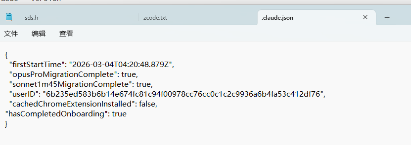
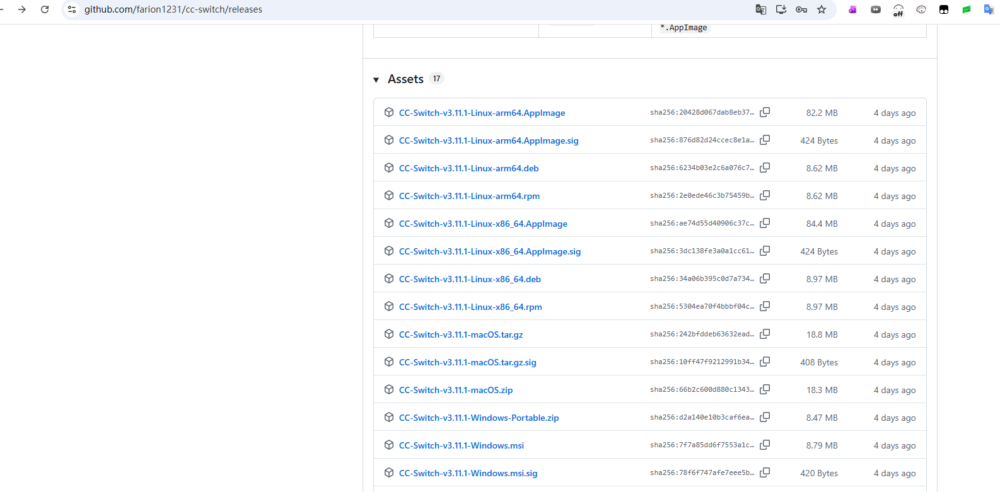
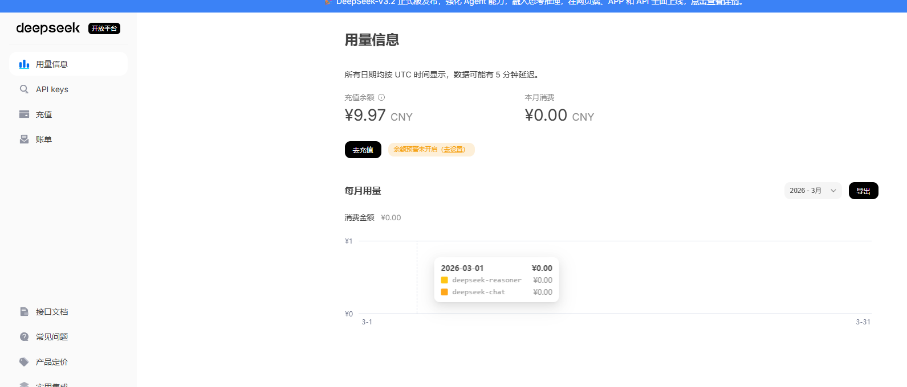
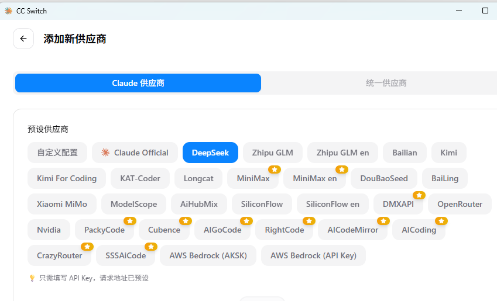
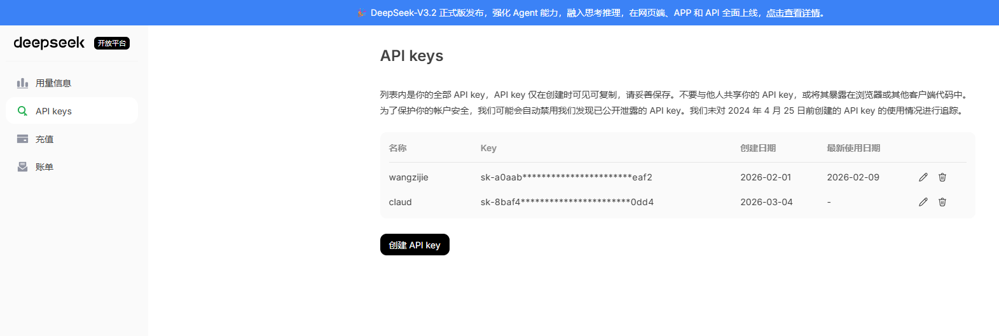
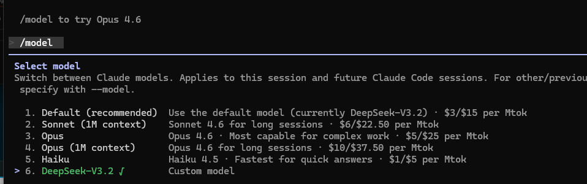
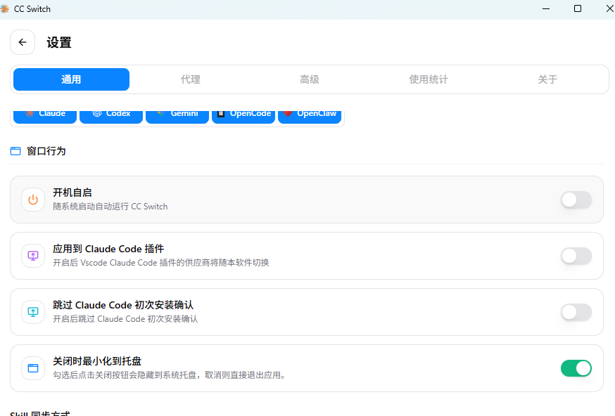

#### Claud安装

##### 方法一：使用NPM安装

* **安装前提环境**：需要准备一个 Unix-like 环境来运行 Claude Code，因为它主要设计用于此类环境。Windows 用户有两个选择：

  - **安装 WSL (Windows Subsystem for Linux)**：这是官方推荐的最佳体验方式。你可以从微软应用商店安装 Ubuntu 等 Linux 发行版。
  - **安装 Git for Windows**：如果你不想用 WSL，安装 Git for Windows 后，可以使用其附带的 **Git Bash** 终端来执行命令。

* 没有Git需要安装Git，没有claud会报错

* 安装Node.js:Claude Code 需要 **Node.js 18.0 或更高版本**。可以访问 [Node.js 官网](https://nodejs.org/) 下载 LTS 版本安装。安装完成后，在终端（WSL 或 Git Bash）中运行以下命令验证：

  ```txt
  node --version
  npm --version
  ```

  * 建议从镜像下载
    * **访问国内镜像站**：打开淘宝 NPM 镜像站（`npmmirror.com`）的 Node.js 发行版页面 https://npmmirror.com/mirrors/node/ 。
    * 下载完成后，双击 `.msi` 文件，按照向导的提示完成安装即可。

* **全局安装 Claude Code**：打开 WSL 终端或 Git Bash，执行以下 npm 命令进行全局安装

  ```txt
  npm install -g @anthropic-ai/claude-code
  ```

  * node慢可以换源：将 npm 默认源设置为淘宝镜像  ：  npm config set registry https://registry.npmmirror.com
  * 查看是否配置成功  npm config get registry

* **验证安装**：安装完成后，运行以下命令查看版本号，如果显示版本信息，则表示安装成功

  ```txt
  claude --version
  ```

  

#####方法贰：使用原生安装脚本（无需 Node.js）

* 如果你不想安装 Node.js，可以使用官方提供的 PowerShell 安装脚本，这种方法更为轻量。

  1. **以管理员身份打开 PowerShell**
     在 Windows 搜索框中输入 "PowerShell"，右键点击并选择 **"以管理员身份运行"**。

  2. **执行安装命令**
     在 PowerShell 中粘贴并运行以下命令：

     powershell

     ```
     irm https://claude.ai/install.ps1 | iex
     ```

     

     这个命令会自动下载并安装 Claude Code 到你的用户目录下的 `.local\bin` 文件夹中。

  3. **将 Claude 添加到系统 PATH**
     安装脚本有时可能不会自动更新 PATH 环境变量，导致你在新终端中无法直接使用 `claude` 命令。运行以下命令来手动修复：

     powershell

     ```
     # 添加 Claude 安装位置到用户 PATH
     $claudePath = "$env:USERPROFILE\.local\bin"
     [Environment]::SetEnvironmentVariable("Path", [Environment]::GetEnvironmentVariable("Path", "User") + ";$claudePath", "User")
     ```

     

     **重要**：运行此命令后，请**完全关闭并重新打开** PowerShell 窗口，使 PATH 更改生效。

  4. **验证安装**
     在新打开的 PowerShell 窗口中，运行验证命令：

     powershell

     ```
     claude --version
     ```

     

#### 二、首次启动与认证

* 无论你用哪种方法安装，首次启动都需要进行认证。建议先创建一个专门的项目文件夹，并在此目录下启动 Claude Code，以避免它扫描整个用户目录中的敏感文件。

  ```txt
  # 例如，在 C 盘创建一个项目文件夹
  New-Item -ItemType Directory -Path C:\MyProject -Force
  cd C:\MyProject
  # 启动 Claude Code
  claude
  ```

* **完成 OAuth 认证**

  * 首次启动时，终端会显示一个链接，并自动打开你的默认浏览器。在浏览器中登录你的 Claude 账号（需要 Pro、Max 或 Teams 订阅）并授权。授权成功后，终端会显示欢迎信息，你就可以开始使用了。

  * **国内会出问题：**会报

    ```txt
    Unable to connect to Anthropic services
    
     Failed to connect to api.anthropic.com: ERR_BAD_REQUEST
    ```

    * 解决方案

      * 步骤一：在 Windows 系统中，配置文件通常位于 `C:\Users\<你的用户名>\.claude.json`添加"hasCompletedOnboarding": true，目的：**跳过新手引导**：当你设置它为 `true` 后，Claude Code 启动时就不会再显示初次使用的欢迎界面、条款确认或强制要求你登录官方账号进行 OAuth 认证

        

      * 步骤二：配置第三方 API 端点（比如 DeepSeek），在启动 `claude` 命令前，设置两个环境变量：

        ```txt
        $env:ANTHROPIC_BASE_URL = "https://api.deepseek.com"
        $env:ANTHROPIC_AUTH_TOKEN = "你的-DeepSeek-API-密钥"
        ```

* API管理工具：**Claude Code Router**    **可省略**

  * 作用：如果你以后还想在 Claude、DeepSeek、智谱等不同模型间灵活切换，或者想根据不同任务（如代码补全、复杂推理）自动选择最优模型，那么 **Claude Code Router** 是更专业的解决方案 

  * 安装

    ```txt
    # 确保你已经全局安装了 @anthropic-ai/claude-code
    npm install -g @musistudio/claude-code-router
    ```

  * 创建配置文件 `~/.claude-code-router/config.json`（Windows 路径为 `C:\Users\<你的用户名>\.claude-code-router\config.json`）

    ```txt
    {
      "Providers": [
        {
          "name": "deepseek",
          "api_base_url": "https://api.deepseek.com/v1/chat/completions",
          "api_key": "your-deepseek-api-key-here",
          "models": [
            "deepseek-chat",
            "deepseek-coder"
          ]
        }
      ],
      "Router": {
        "default": "deepseek,deepseek-chat",
        "background": "deepseek,deepseek-coder",
        "think": "deepseek,deepseek-chat"
        // 你可以根据需要配置更多场景
      }
    }
    ```

  * 使用

    ```txt
    # 用 Router 启动 Claude Code
    ccr code
    
    # 在 Claude Code 会话中，随时可以动态切换模型
    /model deepseek,deepseek-coder
    ```

    

  

#### 三、可视化工具

* CC-Switch：**可视化配置管理中心**

  * **多供应商管理**：通过界面添加、编辑、一键切换不同 API 供应商的配置 。

  * **统一管理**：同时管理 Claude Code、Codex、Gemini CLI 等多个工具的配置 。

  * **MCP/Skills 管理**：可视化添加 MCP 服务器，自动发现和安装 Skills 。

  * **内置本地代理**：提供请求日志、用量统计、故障自动转移等高级功能 

  * 下载链接：https://github.com/farion1231/cc-switch/releases

    

  * 购买大模型接口，如DeepSeek：https://platform.deepseek.com/usage

    

  * 选择DeepSeek

    

  * 复制密钥添加后就可以使用claud了

    

  * 成功后会显示

    

  * 这里也能解决上述的报错

    

* 和Claude Code Router对比：**Claude Code Router (CCR)** 和 **CC-Switch** 是两款功能定位完全不同的工具，但它们在 Claude Code 的生态中可以协同工作。简单来说：**CCR 负责“智能路由和协议转换”，CC-Switch 负责“可视化配置管理”** 。

  | 对比维度     | Claude Code Router (CCR)                                     | CC-Switch                                                    |
  | :----------- | :----------------------------------------------------------- | :----------------------------------------------------------- |
  | **核心定位** | **智能路由代理 + 协议转换器**                                | **可视化配置管理中心**                                       |
  | **主要功能** | 1. **协议转换**：将 Claude Code 的请求格式转换为其他模型（如 DeepSeek、Gemini、Ollama）能识别的格式 。 2. **智能路由**：根据任务类型（如常规、推理、长文本）自动将请求分发到最合适的模型 。 3. **动态切换**：在对话中通过 `/model` 命令实时切换模型 。 | 1. **多供应商管理**：通过界面添加、编辑、一键切换不同 API 供应商的配置 。 2. **统一管理**：同时管理 Claude Code、Codex、Gemini CLI 等多个工具的配置 。 3. **MCP/Skills 管理**：可视化添加 MCP 服务器，自动发现和安装 Skills 。 4. **内置本地代理**：提供请求日志、用量统计、故障自动转移等高级功能 。 |
  | **工作方式** | 作为一个**本地服务**运行（默认端口 `3456`），Claude Code 将请求发送给它，它再转发给目标模型 。 | 一个**桌面应用**，通过修改各个 AI 工具（如 `~/.claude/settings.json`）的配置文件来生效 。 |
  | **使用方式** | 命令行工具，通过 `ccr code` 启动，配置文件为 JSON 。         | 图形界面应用，点击操作，支持系统托盘快速切换 。              |
  | **适用人群** | 需要高级路由策略（如不同任务用不同模型）、自动化部署、CI/CD 集成的开发者 。 | 需要本地开发、希望可视化操作、需要频繁切换配置或管理 MCP/Skills 的用户 。 |

* CCR 和 CC-Switch 不是二选一的关系，而是可以**强强联合**，组成一个完整的私有模型解决方案 。架构通常是这样的：

  1. **Claude Code** 作为核心执行层，负责理解代码和完成任务。
  2. **CC-Switch** 作为配置管理层，你可以在它的界面中，将 `ANTHROPIC_BASE_URL` 这个环境变量指向 CCR 的地址（比如 `http://127.0.0.1:3456`）。这样，Claude Code 的所有请求就被“骗”到了 CCR。
  3. **CCR** 作为协议转换和智能路由层，收到请求后，根据你配置的规则，转换成 DeepSeek、Qwen 等任意模型的格式并转发，再把结果返回给 Claude Code 。

  * 通过这种组合，既能在 CC-Switch 的可视化界面里轻松切换不同的 CCR 配置预设，又能享受 CCR 带来的智能路由和模型多样性。


#### 三、Claude的使用

* 官方文档：https://code.claude.com/docs/zh-CN/overview